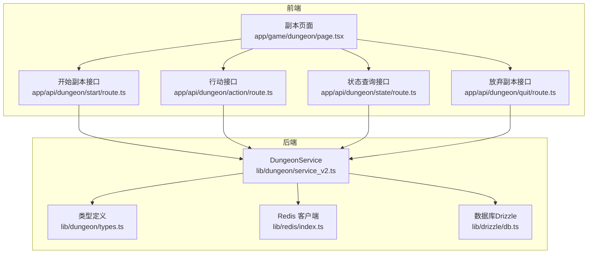
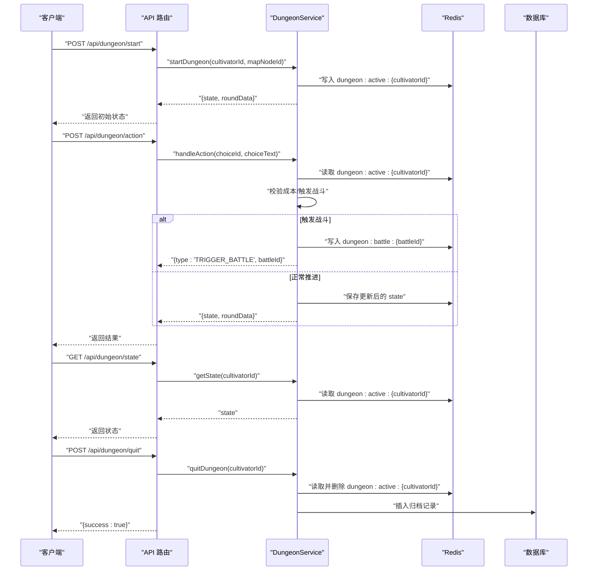
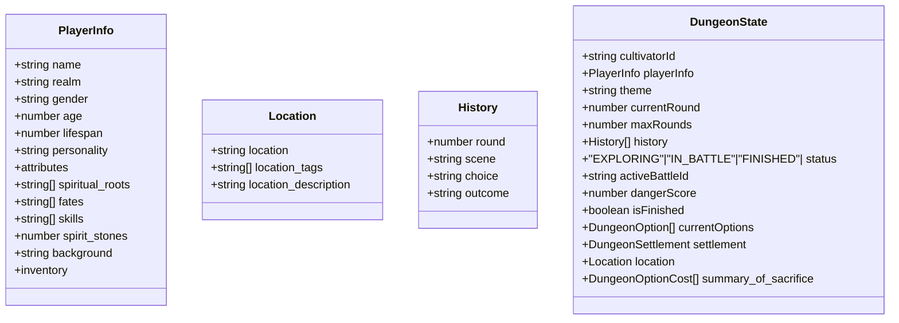
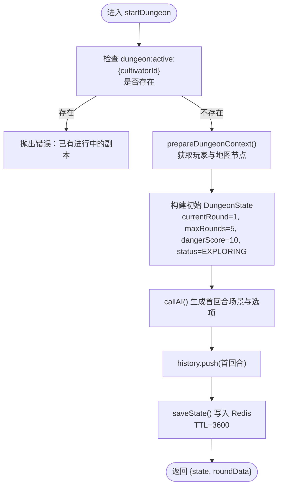
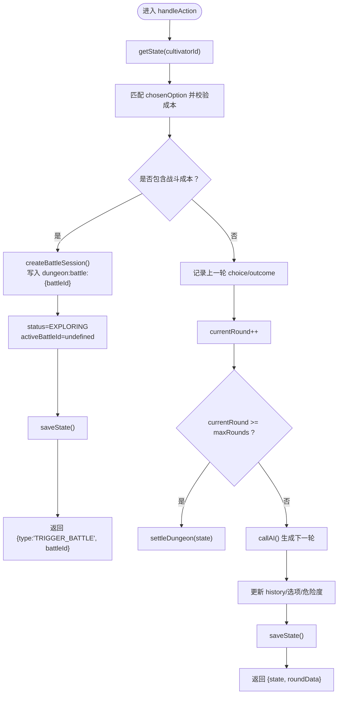
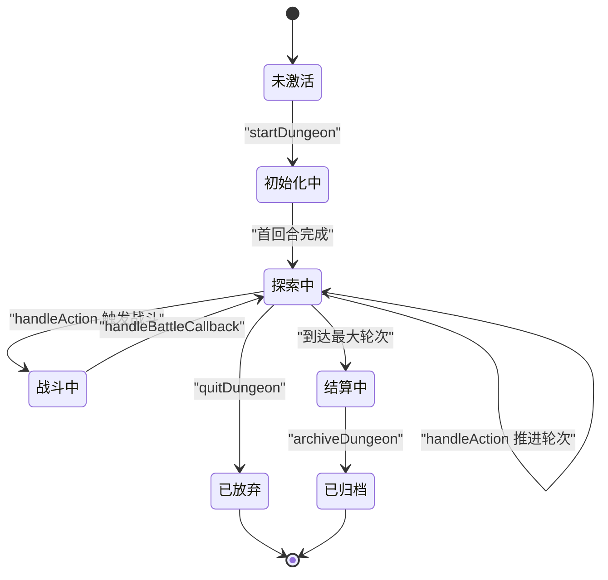
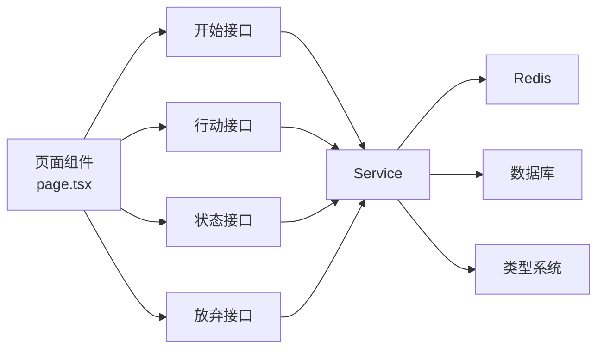

# 状态管理

<cite>
**本文引用的文件**
- [service_v2.ts](file://lib/dungeon/service_v2.ts)
- [types.ts](file://lib/dungeon/types.ts)
- [route.ts（开始副本）](file://app/api/dungeon/start/route.ts)
- [route.ts（行动）](file://app/api/dungeon/action/route.ts)
- [route.ts（状态查询）](file://app/api/dungeon/state/route.ts)
- [route.ts（放弃副本）](file://app/api/dungeon/quit/route.ts)
- [page.tsx（副本页面）](file://app/game/dungeon/page.tsx)
- [index.ts（Redis 客户端）](file://lib/redis/index.ts)
</cite>

## 目录
1. [引言](#引言)
2. [项目结构](#项目结构)
3. [核心组件](#核心组件)
4. [架构总览](#架构总览)
5. [详细组件分析](#详细组件分析)
6. [依赖关系分析](#依赖关系分析)
7. [性能考量](#性能考量)
8. [故障排查指南](#故障排查指南)
9. [结论](#结论)

## 引言
本文围绕副本系统的状态机实现进行深入解析，重点基于 DungeonService 类，系统性阐述 DungeonState 对象的完整结构、Redis 持久化策略、初始化流程、行动推进与历史维护、战斗回调与危险度更新、放弃副本时的状态清理与数据库归档，以及 Redis 键设计与 TTL 设置。同时提供状态生命周期图，说明从创建、推进、战斗中断到最终结算或放弃的完整流转，并给出并发控制建议。

## 项目结构
副本状态机位于 lib/dungeon 下，前端通过 API 路由与页面组件与服务交互，Redis 提供临时会话存储，Drizzle 数据库用于归档历史与结算结果。

图表来源
- [service_v2.ts](file://lib/dungeon/service_v2.ts#L1-L545)
- [types.ts](file://lib/dungeon/types.ts#L1-L201)
- [route.ts（开始副本）](file://app/api/dungeon/start/route.ts#L1-L46)
- [route.ts（行动）](file://app/api/dungeon/action/route.ts#L1-L52)
- [route.ts（状态查询）](file://app/api/dungeon/state/route.ts#L1-L38)
- [route.ts（放弃副本）](file://app/api/dungeon/quit/route.ts#L1-L40)
- [index.ts（Redis 客户端）](file://lib/redis/index.ts#L1-L6)

章节来源
- [service_v2.ts](file://lib/dungeon/service_v2.ts#L1-L545)
- [types.ts](file://lib/dungeon/types.ts#L1-L201)
- [route.ts（开始副本）](file://app/api/dungeon/start/route.ts#L1-L46)
- [route.ts（行动）](file://app/api/dungeon/action/route.ts#L1-L52)
- [route.ts（状态查询）](file://app/api/dungeon/state/route.ts#L1-L38)
- [route.ts（放弃副本）](file://app/api/dungeon/quit/route.ts#L1-L40)
- [index.ts（Redis 客户端）](file://lib/redis/index.ts#L1-L6)

## 核心组件
- DungeonService：副本状态机的核心，负责初始化、推进、战斗集成、结算与归档、Redis/TTL 策略、并发控制（键存在性检查）。
- DungeonState：副本运行时状态，包含玩家信息、主题、轮次、历史、危险度、选项、位置、结算、状态标记等。
- 类型系统：通过 Zod Schema 定义 Round、Option、Settlement、PlayerInfo 等结构，确保前后端一致性。
- API 路由：封装用户鉴权、活动角色校验、调用 DungeonService 并返回结果。
- 页面组件：拉取初始状态、渲染回合数据、处理战斗触发与完成后的结算。

章节来源
- [service_v2.ts](file://lib/dungeon/service_v2.ts#L100-L204)
- [types.ts](file://lib/dungeon/types.ts#L148-L200)
- [route.ts（开始副本）](file://app/api/dungeon/start/route.ts#L1-L46)
- [route.ts（行动）](file://app/api/dungeon/action/route.ts#L1-L52)
- [route.ts（状态查询）](file://app/api/dungeon/state/route.ts#L1-L38)
- [route.ts（放弃副本）](file://app/api/dungeon/quit/route.ts#L1-L40)
- [page.tsx（副本页面）](file://app/game/dungeon/page.tsx#L56-L190)

## 架构总览
DungeonService 将副本流程抽象为“轮次推进 + AI 生成 + 成本校验 + 可能的战斗触发 + 回合历史维护 + 危险度更新 + 结算归档”。状态通过 Redis 持久化，键名采用 dungeon:active:{cultivatorId}，TTL 为 3600 秒；战斗会话独立键 dungeon:battle:{battleId}，同样带 TTL。

图表来源
- [service_v2.ts](file://lib/dungeon/service_v2.ts#L100-L204)
- [service_v2.ts](file://lib/dungeon/service_v2.ts#L278-L324)
- [service_v2.ts](file://lib/dungeon/service_v2.ts#L415-L425)
- [service_v2.ts](file://lib/dungeon/service_v2.ts#L499-L512)
- [service_v2.ts](file://lib/dungeon/service_v2.ts#L517-L541)
- [route.ts（开始副本）](file://app/api/dungeon/start/route.ts#L1-L46)
- [route.ts（行动）](file://app/api/dungeon/action/route.ts#L1-L52)
- [route.ts（状态查询）](file://app/api/dungeon/state/route.ts#L1-L38)
- [route.ts（放弃副本）](file://app/api/dungeon/quit/route.ts#L1-L40)

## 详细组件分析

### DungeonState 结构与职责
- 字段概览
  - 基础信息：cultivatorId、playerInfo、theme、location/location_tags/location_description
  - 进程控制：currentRound、maxRounds、status（EXPLORING/IN_BATTLE/FINISHED）、isFinished
  - 历史与选项：history（含 round、scene、choice、outcome）、currentOptions
  - 成本与危险：summary_of_sacrifice（累计消耗）、dangerScore（内部危险度）
  - 结算：settlement（最终结算）
- 设计要点
  - history 记录每轮场景、选择与结果，便于 UI 展示与归档
  - dangerScore 由 AI 返回，反映本轮风险，驱动后续选项与叙事
  - status 字段用于区分探索态与战斗态，避免并发冲突
  - currentOptions 存储当前可用选项，用于校验与成本处理

图表来源
- [types.ts](file://lib/dungeon/types.ts#L148-L200)

章节来源
- [types.ts](file://lib/dungeon/types.ts#L148-L200)

### Redis 持久化策略与键设计
- 主键
  - dungeon:active:{cultivatorId}：存放当前活跃副本状态，TTL=3600 秒
  - 作用：保证会话短期有效，超时自动过期，避免脏数据堆积
- 战斗会话键
  - dungeon:battle:{battleId}：存放战斗会话与敌人对象，TTL=3600 秒
  - 作用：在战斗触发时临时存储，便于战斗引擎读取上下文
- 并发控制
  - startDungeon 在初始化前检查主键是否存在，若存在则拒绝重复会话，防止同一角色并发副本
- 归档与清理
  - settleDungeon 与 quitDungeon 均会删除主键，确保会话结束即清理

章节来源
- [service_v2.ts](file://lib/dungeon/service_v2.ts#L27-L32)
- [service_v2.ts](file://lib/dungeon/service_v2.ts#L100-L134)
- [service_v2.ts](file://lib/dungeon/service_v2.ts#L210-L276)
- [service_v2.ts](file://lib/dungeon/service_v2.ts#L415-L425)
- [service_v2.ts](file://lib/dungeon/service_v2.ts#L499-L512)
- [service_v2.ts](file://lib/dungeon/service_v2.ts#L517-L541)

### 初始化流程：startDungeon
- 流程步骤
  1) 并发检查：若 dungeon:active:{cultivatorId} 已存在，抛出错误
  2) 上下文准备：通过 prepareDungeonContext 获取玩家与地图节点信息
  3) 初始状态构建：设置 currentRound=1、maxRounds=5、dangerScore=10、status=EXPLORING、isFinished=false
  4) 首轮 AI：调用 callAI 生成首回合场景与选项
  5) 历史与保存：将首回合加入 history，保存 state 至 Redis
- 关键点
  - 通过 getPlayer/getMapNode 组装 PlayerInfo 与 location
  - 使用 getSystemPrompt 作为 AI prompt，确保轮次相位与规则一致
  - 仅在首轮生成场景，后续轮次由 handleAction 触发

图表来源
- [service_v2.ts](file://lib/dungeon/service_v2.ts#L100-L134)
- [service_v2.ts](file://lib/dungeon/service_v2.ts#L415-L425)
- [service_v2.ts](file://lib/dungeon/service_v2.ts#L391-L413)
- [service_v2.ts](file://lib/dungeon/service_v2.ts#L427-L438)

章节来源
- [service_v2.ts](file://lib/dungeon/service_v2.ts#L100-L134)
- [service_v2.ts](file://lib/dungeon/service_v2.ts#L415-L425)
- [service_v2.ts](file://lib/dungeon/service_v2.ts#L427-L438)

### 行动处理：handleAction
- 流程步骤
  1) 读取当前状态：getState(cultivatorId)
  2) 校验选择：匹配 currentOptions，若有成本则执行 processResources('cost')
  3) 战斗拦截：若 chosenOption.costs 含 battle，则将状态置为 IN_BATTLE，创建 BattleSession 并写入 dungeon:battle:{battleId}，返回 TRIGGER_BATTLE
  4) 正常推进：记录 choice/outcome，推进 currentRound，调用 callAI 生成下一轮，更新 history、currentOptions、dangerScore，保存 state
  5) 到达上限：currentRound >= maxRounds 时，进入 settleDungeon
- 历史维护
  - 每轮结束将上一轮的 choice 与 outcome 写入 history，再 push 新一轮的 scene
- 危险度更新
  - 由下一轮 roundData.status_update.internal_danger_score 提供

图表来源
- [service_v2.ts](file://lib/dungeon/service_v2.ts#L139-L204)
- [service_v2.ts](file://lib/dungeon/service_v2.ts#L210-L276)
- [service_v2.ts](file://lib/dungeon/service_v2.ts#L278-L324)
- [service_v2.ts](file://lib/dungeon/service_v2.ts#L391-L413)

章节来源
- [service_v2.ts](file://lib/dungeon/service_v2.ts#L139-L204)
- [service_v2.ts](file://lib/dungeon/service_v2.ts#L210-L276)
- [service_v2.ts](file://lib/dungeon/service_v2.ts#L278-L324)
- [service_v2.ts](file://lib/dungeon/service_v2.ts#L391-L413)

### 战斗回调：handleBattleCallback
- 流程步骤
  1) 读取状态，断言存在
  2) 将状态 status 改为 EXPLORING，清除 activeBattleId
  3) 构造战斗结果叙述（胜负、回合数、敌人名）
  4) 记录上一轮 outcome
  5) currentRound++，若超过上限则 settleDungeon
  6) 否则继续 callAI 生成下一轮，更新 history、currentOptions、dangerScore，保存 state
- 作用
  - 在战斗结束后恢复探索态，推进副本进程

章节来源
- [service_v2.ts](file://lib/dungeon/service_v2.ts#L278-L324)

### 结算与归档：settleDungeon 与 archiveDungeon
- settleDungeon
  - 生成结算提示词，综合 history、dangerScore、summary_of_sacrifice、location、playerInfo
  - 调用 AI 产出 DungeonSettlement（含奖励等级、潜在物品、标签）
  - 后端根据 reward_tier 生成真实奖励（占位），执行 processResources('gain')
  - 调用 archiveDungeon
- archiveDungeon
  - 插入数据库表 dungeon_histories，字段包含 cultivatorId、theme、result（JSONB）、log（历史摘要）
  - 删除 Redis 中 dungeon:active:{cultivatorId}
- 作用
  - 将副本结果固化到数据库，清理临时会话

章节来源
- [service_v2.ts](file://lib/dungeon/service_v2.ts#L326-L386)
- [service_v2.ts](file://lib/dungeon/service_v2.ts#L499-L512)

### 放弃副本：quitDungeon
- 流程步骤
  - 读取当前状态（若存在），向数据库插入归档记录（reward_tier='放弃'）
  - 删除 Redis 中 dungeon:active:{cultivatorId}
  - 返回 {success:true}
- 作用
  - 允许玩家中途退出，保留探索轨迹并清理会话

章节来源
- [service_v2.ts](file://lib/dungeon/service_v2.ts#L517-L541)

### 状态生命周期图

图表来源
- [service_v2.ts](file://lib/dungeon/service_v2.ts#L100-L134)
- [service_v2.ts](file://lib/dungeon/service_v2.ts#L139-L204)
- [service_v2.ts](file://lib/dungeon/service_v2.ts#L278-L324)
- [service_v2.ts](file://lib/dungeon/service_v2.ts#L326-L386)
- [service_v2.ts](file://lib/dungeon/service_v2.ts#L499-L512)
- [service_v2.ts](file://lib/dungeon/service_v2.ts#L517-L541)

## 依赖关系分析
- 组件耦合
  - DungeonService 依赖 Redis 与数据库，依赖类型系统（Zod Schema）保证输入输出结构
  - 前端通过 API 路由与服务交互，页面组件负责状态渲染与用户交互
- 外部依赖
  - Redis：短期会话与战斗会话存储
  - Drizzle：副本历史与结算结果归档
  - Supabase：用户鉴权与活动角色校验
- 潜在循环依赖
  - 无直接循环依赖，模块边界清晰

图表来源
- [page.tsx（副本页面）](file://app/game/dungeon/page.tsx#L56-L190)
- [route.ts（开始副本）](file://app/api/dungeon/start/route.ts#L1-L46)
- [route.ts（行动）](file://app/api/dungeon/action/route.ts#L1-L52)
- [route.ts（状态查询）](file://app/api/dungeon/state/route.ts#L1-L38)
- [route.ts（放弃副本）](file://app/api/dungeon/quit/route.ts#L1-L40)
- [service_v2.ts](file://lib/dungeon/service_v2.ts#L1-L545)
- [types.ts](file://lib/dungeon/types.ts#L1-L201)
- [index.ts（Redis 客户端）](file://lib/redis/index.ts#L1-L6)

章节来源
- [page.tsx（副本页面）](file://app/game/dungeon/page.tsx#L56-L190)
- [route.ts（开始副本）](file://app/api/dungeon/start/route.ts#L1-L46)
- [route.ts（行动）](file://app/api/dungeon/action/route.ts#L1-L52)
- [route.ts（状态查询）](file://app/api/dungeon/state/route.ts#L1-L38)
- [route.ts（放弃副本）](file://app/api/dungeon/quit/route.ts#L1-L40)
- [service_v2.ts](file://lib/dungeon/service_v2.ts#L1-L545)
- [types.ts](file://lib/dungeon/types.ts#L1-L201)
- [index.ts（Redis 客户端）](file://lib/redis/index.ts#L1-L6)

## 性能考量
- Redis TTL 与过期策略
  - 主键与战斗键均设置 TTL=3600 秒，避免长期占用内存
- 历史压缩
  - callAI 中对 history 进行摘要化处理，减少 Token 消耗与响应时间
- 并发控制
  - startDungeon 前检查键是否存在，避免重复会话导致的竞态
- 数据库归档
  - 结算完成后立即删除 Redis 键，降低热数据压力

章节来源
- [service_v2.ts](file://lib/dungeon/service_v2.ts#L27-L32)
- [service_v2.ts](file://lib/dungeon/service_v2.ts#L391-L413)
- [service_v2.ts](file://lib/dungeon/service_v2.ts#L100-L134)
- [service_v2.ts](file://lib/dungeon/service_v2.ts#L499-L512)

## 故障排查指南
- “已有进行中的副本”
  - 现象：startDungeon 抛出错误
  - 原因：Redis 中 dungeon:active:{cultivatorId} 已存在
  - 处理：等待会话过期或调用 quitDungeon 清理
- “副本已失效”
  - 现象：handleAction 报错
  - 原因：Redis 中状态丢失或被清理
  - 处理：重新 startDungeon
- “未找到活动角色”
  - 现象：API 路由返回 404
  - 原因：Supabase 用户未绑定活动角色
  - 处理：确认用户登录与角色状态
- “战斗会话缺失”
  - 现象：触发战斗后无法读取 dungeon:battle:{battleId}
  - 原因：TTL 过期或键名不匹配
  - 处理：重新触发行动生成新会话键

章节来源
- [service_v2.ts](file://lib/dungeon/service_v2.ts#L100-L134)
- [service_v2.ts](file://lib/dungeon/service_v2.ts#L210-L276)
- [route.ts（开始副本）](file://app/api/dungeon/start/route.ts#L1-L46)
- [route.ts（状态查询）](file://app/api/dungeon/state/route.ts#L1-L38)

## 结论
DungeonService 通过清晰的状态机模型与严格的 Redis/TTL 策略，实现了副本的可追踪、可恢复、可归档的生命周期管理。DungeonState 作为核心载体，承载了玩家上下文、轮次推进、历史记录与危险度等关键信息。handleAction 与 handleBattleCallback 将探索与战斗无缝衔接，settleDungeon 与 archiveDungeon 确保最终结算与数据沉淀。配合 startDungeon 的并发控制与 API 路由的鉴权校验，整体方案具备良好的扩展性与可维护性。