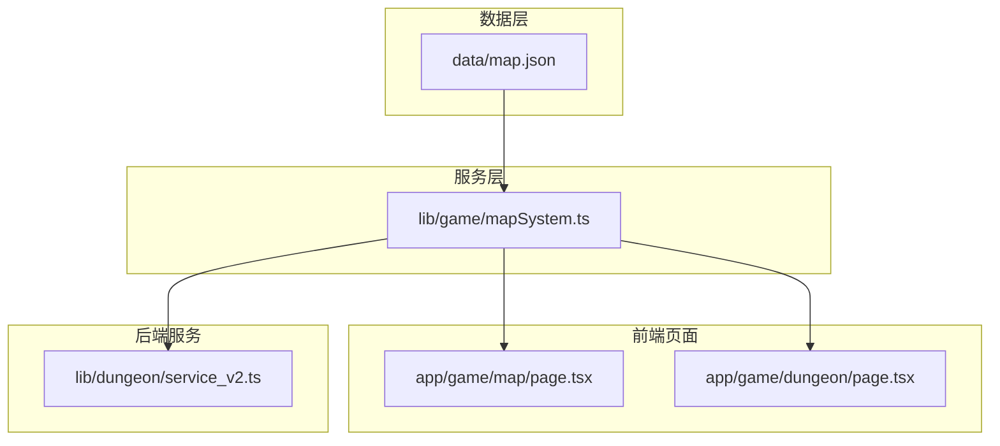
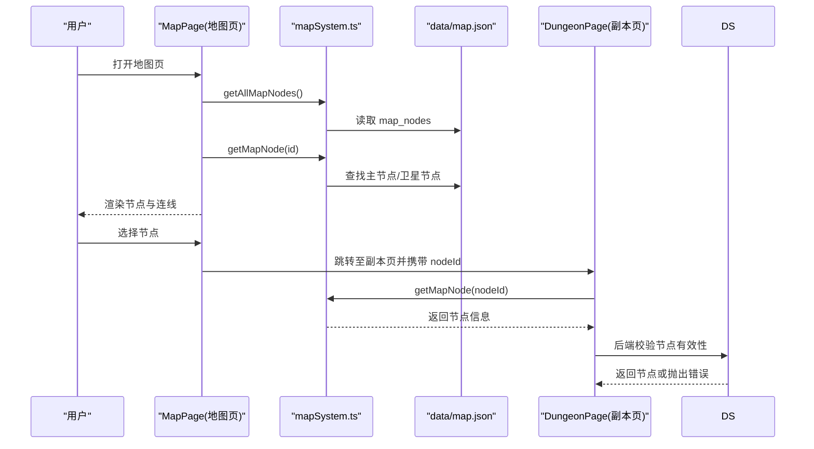
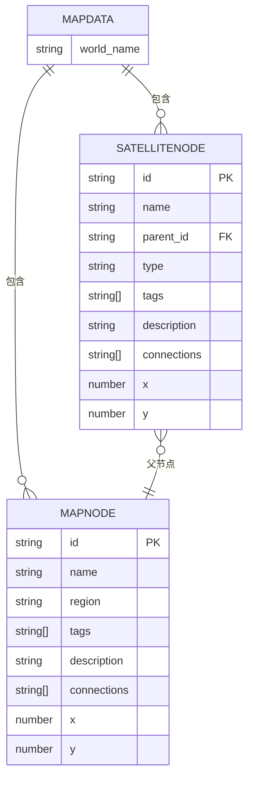
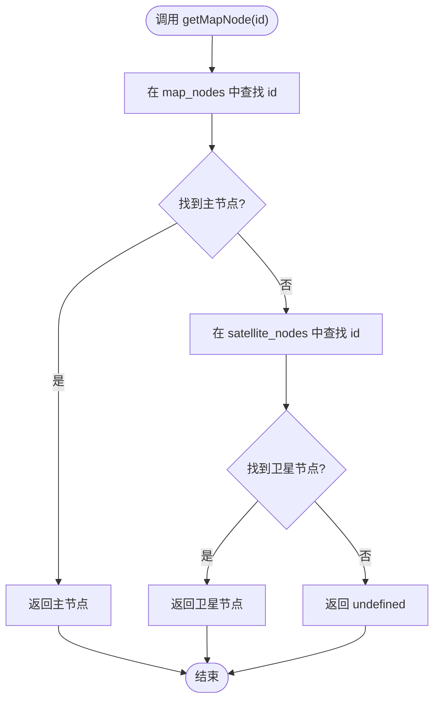
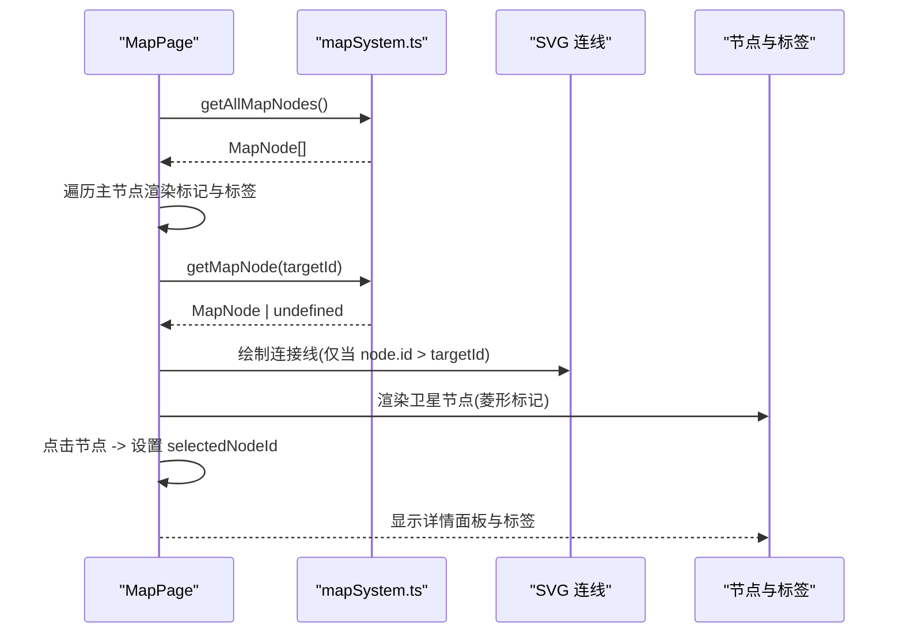
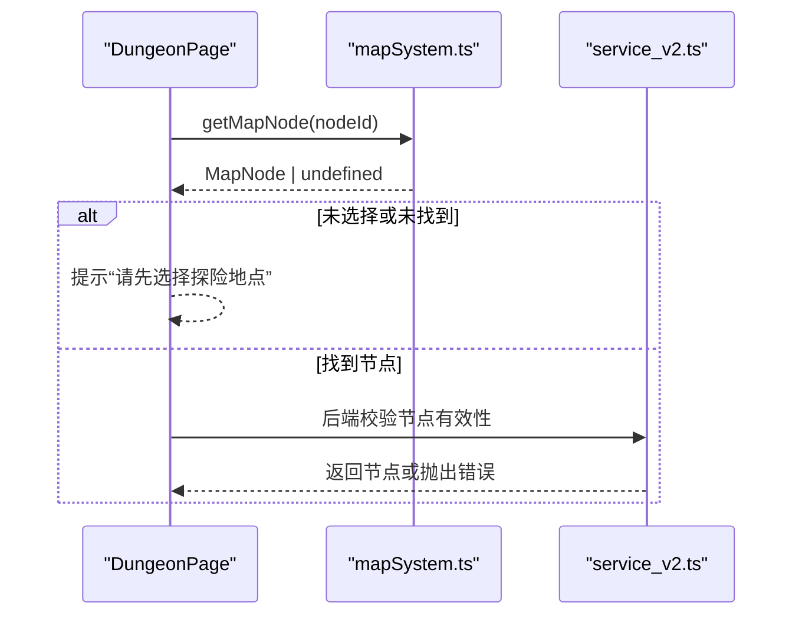
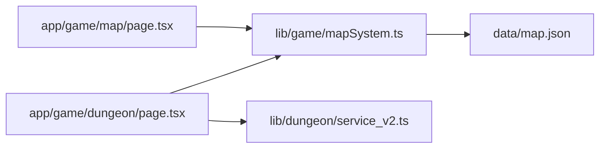

# 地图系统

<cite>
**本文引用的文件**
- [data/map.json](file://data/map.json)
- [lib/game/mapSystem.ts](file://lib/game/mapSystem.ts)
- [app/game/map/page.tsx](file://app/game/map/page.tsx)
- [app/game/dungeon/page.tsx](file://app/game/dungeon/page.tsx)
- [lib/dungeon/service_v2.ts](file://lib/dungeon/service_v2.ts)
- [map.md](file://map.md)
</cite>

## 目录
1. [简介](#简介)
2. [项目结构](#项目结构)
3. [核心组件](#核心组件)
4. [架构总览](#架构总览)
5. [详细组件分析](#详细组件分析)
6. [依赖分析](#依赖分析)
7. [性能考量](#性能考量)
8. [故障排查指南](#故障排查指南)
9. [结论](#结论)
10. [附录](#附录)

## 简介
本文件面向“地图系统”的数据结构与导航功能进行系统性解析，重点围绕以下目标展开：
- 基于 map.json 的数据模型，说明 MapNode 与 SatelliteNode 的设计意图与属性（id、name、region、tags、connections 等）。
- 解释 mapSystem.ts 中核心函数的实现逻辑与使用场景：getMapNode、getAllMapNodes、getSatellitesForNode 等。
- 阐述地图数据如何驱动前端 MapPage 的渲染：节点坐标(x,y)的定位、区域(region)的划分、连接线(connections)的绘制。
- 说明 tags 标签系统在副本筛选与事件触发中的作用。
- 提供地图数据结构示意图，并列举从主城节点查询周边卫星节点的代码示例路径，以及处理无效节点ID的错误边界。

## 项目结构
地图系统由“数据层 + 服务层 + 前端页面层”构成：
- 数据层：data/map.json 定义世界名称、主节点列表、卫星节点列表及连接关系。
- 服务层：lib/game/mapSystem.ts 提供类型定义与查询接口，封装对 map.json 的访问。
- 前端层：app/game/map/page.tsx 使用服务层接口渲染地图画布、连线与节点；app/game/dungeon/page.tsx 通过服务层选择节点并进入副本流程；lib/dungeon/service_v2.ts 在后端服务中校验节点有效性。
- 设计文档：map.md 提供地图系统设计思路与标签驱动的动态探索理念。

图表来源
- [data/map.json](file://data/map.json#L1-L246)
- [lib/game/mapSystem.ts](file://lib/game/mapSystem.ts#L1-L58)
- [app/game/map/page.tsx](file://app/game/map/page.tsx#L1-L250)
- [app/game/dungeon/page.tsx](file://app/game/dungeon/page.tsx#L1-L629)
- [lib/dungeon/service_v2.ts](file://lib/dungeon/service_v2.ts#L470-L490)

章节来源
- [data/map.json](file://data/map.json#L1-L246)
- [lib/game/mapSystem.ts](file://lib/game/mapSystem.ts#L1-L58)
- [app/game/map/page.tsx](file://app/game/map/page.tsx#L1-L250)
- [app/game/dungeon/page.tsx](file://app/game/dungeon/page.tsx#L1-L629)
- [lib/dungeon/service_v2.ts](file://lib/dungeon/service_v2.ts#L470-L490)

## 核心组件
- 数据模型
  - MapNode：主节点，包含 id、name、region、tags、description、connections、x、y。
  - SatelliteNode：卫星节点，包含 id、name、parent_id、type、tags、description、connections、x、y。
  - MapData：整体数据结构，包含 world_name、map_nodes、satellite_nodes。
- 查询接口
  - getAllMapNodes：返回所有主节点。
  - getAllSatelliteNodes：返回所有卫星节点。
  - getMapNode(id)：按 id 查找主节点或卫星节点，找不到则返回 undefined。
  - getNodesByRegion(region)：按区域过滤主节点。
  - getSatellitesForNode(parentId)：按父节点 id 过滤卫星节点集合。

章节来源
- [lib/game/mapSystem.ts](file://lib/game/mapSystem.ts#L1-L58)
- [data/map.json](file://data/map.json#L1-L246)

## 架构总览
地图系统以静态数据为骨架，结合标签系统与前端渲染形成“静态骨架 + 动态血肉”的架构：
- 静态骨架：map.json 定义节点拓扑、坐标与区域划分。
- 动态血肉：tags 作为环境标签，驱动副本生成与事件选择；前端渲染连接线与节点标签，支持用户交互与导航。

图表来源
- [app/game/map/page.tsx](file://app/game/map/page.tsx#L1-L250)
- [lib/game/mapSystem.ts](file://lib/game/mapSystem.ts#L1-L58)
- [data/map.json](file://data/map.json#L1-L246)
- [app/game/dungeon/page.tsx](file://app/game/dungeon/page.tsx#L1-L629)
- [lib/dungeon/service_v2.ts](file://lib/dungeon/service_v2.ts#L470-L490)

## 详细组件分析

### 数据模型与属性说明
- MapNode
  - id：主节点唯一标识，用于连接与导航。
  - name：节点名称，用于 UI 展示。
  - region：所属区域，用于区域划分与筛选。
  - tags：标签数组，用于副本筛选、事件触发与动态生成。
  - description：节点描述，用于详情面板展示。
  - connections：连接到的节点 id 列表，用于绘制连线。
  - x/y：节点在画布上的百分比坐标，用于定位。
- SatelliteNode
  - id：卫星节点唯一标识。
  - name：卫星节点名称。
  - parent_id：父主节点 id，用于父子关系管理。
  - type：卫星节点类型（如“遗迹”“荒野”等），用于样式与语义区分。
  - tags：标签数组，用于细化事件与挑战类型。
  - description：描述。
  - connections：连接到的节点 id 列表。
  - x/y：坐标。
- MapData
  - world_name：世界名称。
  - map_nodes：主节点数组。
  - satellite_nodes：卫星节点数组。

图表来源
- [lib/game/mapSystem.ts](file://lib/game/mapSystem.ts#L1-L58)
- [data/map.json](file://data/map.json#L1-L246)

章节来源
- [lib/game/mapSystem.ts](file://lib/game/mapSystem.ts#L1-L58)
- [data/map.json](file://data/map.json#L1-L246)

### mapSystem.ts 核心函数实现与使用场景
- getAllMapNodes()
  - 用途：获取全部主节点，供地图页渲染主节点列表。
  - 复杂度：O(n)，n 为主节点数量。
- getAllSatelliteNodes()
  - 用途：获取全部卫星节点，供地图页渲染卫星节点列表。
  - 复杂度：O(m)，m 为卫星节点数量。
- getMapNode(id)
  - 用途：按 id 查找节点，优先匹配主节点，再匹配卫星节点；找不到返回 undefined。
  - 复杂度：O(n+m)，最坏情况下需遍历全部节点。
  - 使用场景：地图页点击节点获取详情；副本页根据 nodeId 获取节点信息。
- getNodesByRegion(region)
  - 用途：按区域筛选主节点，用于区域导航或筛选。
  - 复杂度：O(n)。
- getSatellitesForNode(parentId)
  - 用途：按父节点 id 过滤卫星节点集合，用于“主城周边卫星节点”查询。
  - 复杂度：O(m)。

图表来源
- [lib/game/mapSystem.ts](file://lib/game/mapSystem.ts#L44-L49)

章节来源
- [lib/game/mapSystem.ts](file://lib/game/mapSystem.ts#L36-L58)

### 前端 MapPage 渲染逻辑
- 主节点渲染
  - 通过 getAllMapNodes() 获取主节点集合，遍历渲染圆形标记与标签。
  - 坐标定位：使用节点 x/y 百分比定位，配合 CSS transform 实现居中。
  - 连接线绘制：遍历每个节点的 connections，连线到目标节点；为避免重复，仅在 node.id > targetId 时绘制。
- 卫星节点渲染
  - 通过 getAllSatelliteNodes() 获取卫星节点集合，渲染菱形标记与悬停标签。
- 选中节点
  - 点击节点设置 selectedNodeId，显示详情面板，包含名称、描述与 tags 标签组。
- 导航跳转
  - 点击“选择此地”按钮，携带 nodeId 跳转至副本页。

图表来源
- [app/game/map/page.tsx](file://app/game/map/page.tsx#L110-L134)
- [app/game/map/page.tsx](file://app/game/map/page.tsx#L136-L200)
- [lib/game/mapSystem.ts](file://lib/game/mapSystem.ts#L36-L49)

章节来源
- [app/game/map/page.tsx](file://app/game/map/page.tsx#L1-L250)
- [lib/game/mapSystem.ts](file://lib/game/mapSystem.ts#L36-L49)

### 副本筛选与事件触发中的 tags 作用
- tags 作为环境标签，驱动动态探索与事件生成：
  - 副本页根据所选节点的 tags 生成探索主题与选项。
  - 前端副本页在开始探索时，会将 selectedMapNode 的 tags 作为上下文的一部分参与后续流程。
- 设计文档中提出“将节点标签喂给 LLM 生成动态事件”的思路，tags 是关键输入。

章节来源
- [app/game/dungeon/page.tsx](file://app/game/dungeon/page.tsx#L1-L629)
- [map.md](file://map.md#L1-L98)

### 从主城节点查询周边卫星节点的代码示例路径
- 获取主节点集合：参考路径 [lib/game/mapSystem.ts](file://lib/game/mapSystem.ts#L36-L38)
- 获取卫星节点集合：参考路径 [lib/game/mapSystem.ts](file://lib/game/mapSystem.ts#L41-L43)
- 按父节点过滤卫星节点：参考路径 [lib/game/mapSystem.ts](file://lib/game/mapSystem.ts#L54-L56)
- 示例调用链（伪代码路径）：
  - 先获取所有卫星节点：[lib/game/mapSystem.ts](file://lib/game/mapSystem.ts#L41-L43)
  - 再按 parent_id 过滤：[lib/game/mapSystem.ts](file://lib/game/mapSystem.ts#L54-L56)

章节来源
- [lib/game/mapSystem.ts](file://lib/game/mapSystem.ts#L36-L58)

### 无效节点ID的错误边界
- 前端副本页：当未选择节点或节点不存在时，会提示“请先选择探险地点”或类似提示。
- 后端服务：在服务层中，若传入无效节点ID，会抛出“无效的地图节点”错误，副本页捕获并提示。

图表来源
- [app/game/dungeon/page.tsx](file://app/game/dungeon/page.tsx#L100-L120)
- [lib/dungeon/service_v2.ts](file://lib/dungeon/service_v2.ts#L479-L483)

章节来源
- [app/game/dungeon/page.tsx](file://app/game/dungeon/page.tsx#L100-L120)
- [lib/dungeon/service_v2.ts](file://lib/dungeon/service_v2.ts#L479-L483)

## 依赖分析
- 组件耦合
  - MapPage 依赖 mapSystem.ts 的查询接口，渲染主节点与卫星节点。
  - DungeonPage 依赖 mapSystem.ts 获取所选节点信息，并在后端服务中再次校验。
  - mapSystem.ts 依赖 data/map.json 作为数据源。
- 外部依赖
  - 前端使用 react-zoom-pan-pinch 实现画布缩放与平移。
  - 副本页使用 Next.js 导航与 Suspense 加载。
- 潜在循环依赖
  - 当前模块间为单向依赖（页面 -> 服务层 -> 数据层），无明显循环。

图表来源
- [app/game/map/page.tsx](file://app/game/map/page.tsx#L1-L250)
- [app/game/dungeon/page.tsx](file://app/game/dungeon/page.tsx#L1-L629)
- [lib/game/mapSystem.ts](file://lib/game/mapSystem.ts#L1-L58)
- [data/map.json](file://data/map.json#L1-L246)
- [lib/dungeon/service_v2.ts](file://lib/dungeon/service_v2.ts#L470-L490)

章节来源
- [app/game/map/page.tsx](file://app/game/map/page.tsx#L1-L250)
- [app/game/dungeon/page.tsx](file://app/game/dungeon/page.tsx#L1-L629)
- [lib/game/mapSystem.ts](file://lib/game/mapSystem.ts#L1-L58)
- [data/map.json](file://data/map.json#L1-L246)
- [lib/dungeon/service_v2.ts](file://lib/dungeon/service_v2.ts#L470-L490)

## 性能考量
- 查询复杂度
  - getMapNode 为 O(n+m)，在节点规模较大时可考虑构建 id->节点索引以降低查询成本。
- 渲染优化
  - 连线绘制仅在 node.id > targetId 时绘制，避免重复连线。
  - 节点标签与图标使用 CSS 过渡与 hover 缩放，保证交互流畅。
- 数据体积
  - map.json 为静态资源，建议保持精简；如需扩展，可拆分区域或按需懒加载。

## 故障排查指南
- 无效节点ID
  - 现象：选择节点后无法进入副本或报错。
  - 排查：确认 nodeId 是否存在于 map.json；检查 getMapNode 返回值；后端服务是否抛出“无效的地图节点”错误。
- 连线缺失
  - 现象：地图上缺少连接线。
  - 排查：检查 connections 数组是否包含有效 id；确认 node.id > targetId 条件是否导致跳过绘制。
- 坐标异常
  - 现象：节点位置不在预期区域。
  - 排查：确认 x/y 为百分比坐标；检查容器尺寸与 transform 居中逻辑。

章节来源
- [lib/game/mapSystem.ts](file://lib/game/mapSystem.ts#L44-L49)
- [app/game/map/page.tsx](file://app/game/map/page.tsx#L110-L134)
- [lib/dungeon/service_v2.ts](file://lib/dungeon/service_v2.ts#L479-L483)

## 结论
地图系统以 map.json 为数据骨架，通过 mapSystem.ts 的查询接口与前端 MapPage 的渲染逻辑，实现了区域划分、节点定位与连接线绘制。tags 标签系统为副本筛选与事件生成提供了基础，结合设计文档中的“静态骨架 + 动态血肉”理念，可进一步拓展为标签驱动的动态探索体验。对于大规模数据，建议引入索引与按需加载策略以提升性能与可维护性。

## 附录
- 设计文档要点：地图系统应以“静态骨架 + 动态血肉”为核心思想，标签作为环境权重驱动 LLM 生成独特剧情与事件。
- 建议扩展：引入区域动态演化、时空变量与探索度系统，增强地图的沉浸感与可玩性。

章节来源
- [map.md](file://map.md#L1-L98)