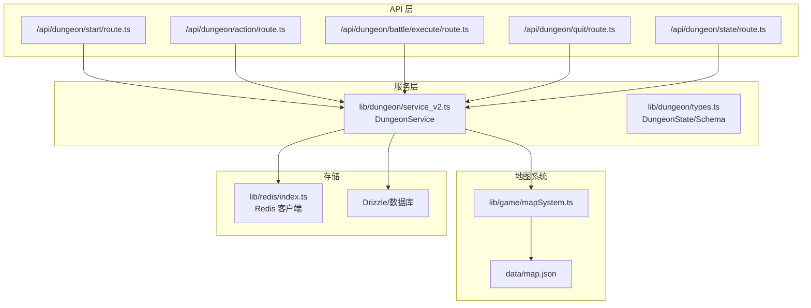
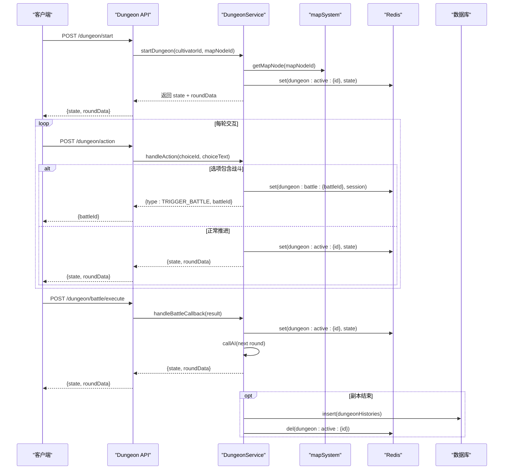
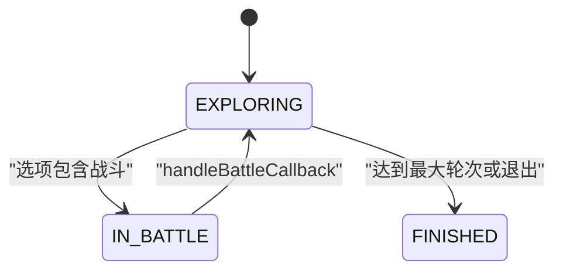
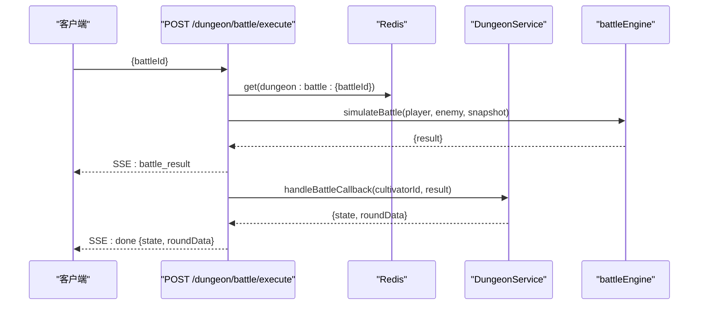
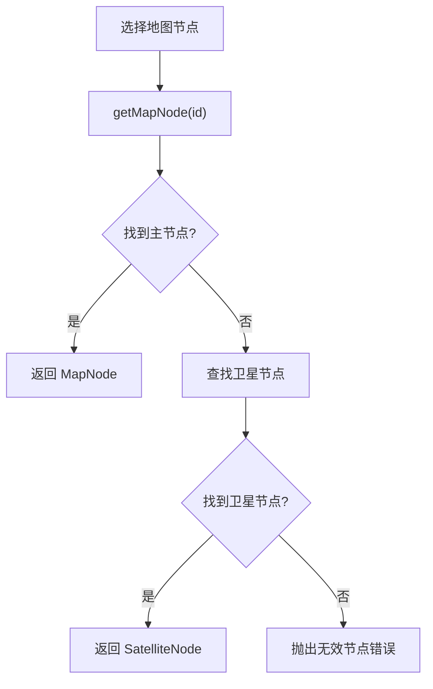
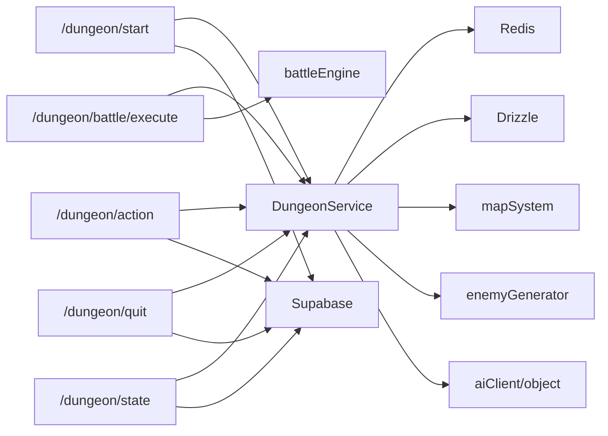

# 探索系统

<cite>
**本文引用的文件**
- [service_v2.ts](file://lib/dungeon/service_v2.ts)
- [types.ts](file://lib/dungeon/types.ts)
- [mapSystem.ts](file://lib/game/mapSystem.ts)
- [map.json](file://data/map.json)
- [route.ts（开始）](file://app/api/dungeon/start/route.ts)
- [route.ts（行动）](file://app/api/dungeon/action/route.ts)
- [route.ts（执行战斗）](file://app/api/dungeon/battle/execute/route.ts)
- [route.ts（退出）](file://app/api/dungeon/quit/route.ts)
- [route.ts（状态）](file://app/api/dungeon/state/route.ts)
- [index.ts（Redis）](file://lib/redis/index.ts)
- [fuben.md](file://fuben.md)
- [map.md](file://map.md)
</cite>

## 目录
1. [引言](#引言)
2. [项目结构](#项目结构)
3. [核心组件](#核心组件)
4. [架构总览](#架构总览)
5. [详细组件分析](#详细组件分析)
6. [依赖关系分析](#依赖关系分析)
7. [性能考量](#性能考量)
8. [故障排查指南](#故障排查指南)
9. [结论](#结论)
10. [附录](#附录)

## 引言
本文件面向“地牢副本探索系统”的完整文档，聚焦于服务层的状态机设计、Redis 持久化策略、API 路由处理逻辑、地图导航与事件触发、战斗系统集成，以及状态流转图与典型数据流示例。目标读者既包括开发者，也包括希望理解探索流程与状态管理的运营与策划人员。

## 项目结构
- 服务层位于 lib/dungeon，核心为 DungeonService，负责副本状态机、AI 轮次生成、战斗拦截与回调、结算与归档。
- API 路由位于 app/api/dungeon，分别提供开始、行动、执行战斗、退出、查询状态等接口。
- 地图系统位于 lib/game，mapSystem.ts 解析 data/map.json，提供节点查询与卫星节点支持。
- Redis 客户端位于 lib/redis，统一提供 redis.get/redis.set 等能力。

图表来源
- [service_v2.ts](file://lib/dungeon/service_v2.ts#L1-L120)
- [types.ts](file://lib/dungeon/types.ts#L1-L120)
- [mapSystem.ts](file://lib/game/mapSystem.ts#L1-L58)
- [map.json](file://data/map.json#L1-L246)
- [route.ts（开始）](file://app/api/dungeon/start/route.ts#L1-L46)
- [route.ts（行动）](file://app/api/dungeon/action/route.ts#L1-L52)
- [route.ts（执行战斗）](file://app/api/dungeon/battle/execute/route.ts#L1-L181)
- [route.ts（退出）](file://app/api/dungeon/quit/route.ts#L1-L40)
- [route.ts（状态）](file://app/api/dungeon/state/route.ts#L1-L39)
- [index.ts（Redis）](file://lib/redis/index.ts#L1-L6)

章节来源
- [service_v2.ts](file://lib/dungeon/service_v2.ts#L1-L120)
- [mapSystem.ts](file://lib/game/mapSystem.ts#L1-L58)
- [map.json](file://data/map.json#L1-L246)
- [route.ts（开始）](file://app/api/dungeon/start/route.ts#L1-L46)
- [route.ts（行动）](file://app/api/dungeon/action/route.ts#L1-L52)
- [route.ts（执行战斗）](file://app/api/dungeon/battle/execute/route.ts#L1-L181)
- [route.ts（退出）](file://app/api/dungeon/quit/route.ts#L1-L40)
- [route.ts（状态）](file://app/api/dungeon/state/route.ts#L1-L39)
- [index.ts（Redis）](file://lib/redis/index.ts#L1-L6)

## 核心组件
- 副本状态机与持久化
  - 状态机包含 EXPLORING、IN_BATTLE、FINISHED 三种状态，配合 currentRound/maxRounds 控制轮次推进。
  - 使用 Redis 键 dungeon:active:{cultivatorId} 存储当前状态，TTL 为 1 小时，避免僵尸会话。
- AI 驱动的轮次生成
  - 每轮通过 callAI 生成场景描述、交互选项与危险分，历史仅压缩摘要传入以控制 Token。
- 战斗拦截与回调
  - handleAction 检测选项中的 battle 成本，创建 BattleSession 并保存至 dungeon:battle:{battleId}，随后返回 TRIGGER_BATTLE，前端拉取战斗执行接口。
  - handleBattleCallback 在战斗结束后恢复 EXPLORING 状态，推进轮次并再次调用 AI 生成下一轮。
- 结算与归档
  - settleDungeon 通过 AI 生成结算等级与叙述，后端按等级匹配真实奖励并发放，随后归档到数据库并清理 Redis。
- 地图导航与事件触发
  - mapSystem.ts 提供 getMapNode/getAllMapNodes 等方法，解析 data/map.json，支持主节点与卫星节点，供 startDungeon 选择地图节点。

章节来源
- [service_v2.ts](file://lib/dungeon/service_v2.ts#L1-L120)
- [types.ts](file://lib/dungeon/types.ts#L150-L201)
- [mapSystem.ts](file://lib/game/mapSystem.ts#L1-L58)
- [map.json](file://data/map.json#L1-L246)

## 架构总览
探索系统围绕“服务层状态机 + API 路由 + 地图系统 + Redis 持久化 + 数据库归档”展开，形成闭环：开始副本 -> 逐轮交互 -> 战斗拦截 -> 回调推进 -> 结算归档。

图表来源
- [service_v2.ts](file://lib/dungeon/service_v2.ts#L100-L210)
- [route.ts（开始）](file://app/api/dungeon/start/route.ts#L1-L46)
- [route.ts（行动）](file://app/api/dungeon/action/route.ts#L1-L52)
- [route.ts（执行战斗）](file://app/api/dungeon/battle/execute/route.ts#L1-L181)
- [mapSystem.ts](file://lib/game/mapSystem.ts#L1-L58)
- [index.ts（Redis）](file://lib/redis/index.ts#L1-L6)

## 详细组件分析

### 副本状态机与持久化策略
- 状态字段
  - status: EXPLORING | IN_BATTLE | FINISHED
  - currentRound/maxRounds: 控制轮次推进
  - history: 记录每轮场景、选择、结果
  - dangerScore: 危险分，用于后续结算
  - summary_of_sacrifice: 累计消耗，用于结算补偿
- Redis 键规范
  - dungeon:active:{cultivatorId}: 存储当前 DungeonState
  - dungeon:battle:{battleId}: 存储 BattleSession 与敌人对象
- TTL 与清理
  - active 状态默认 1 小时过期，避免长时间挂起
  - 结算完成后删除 active 键，归档到数据库

图表来源
- [types.ts](file://lib/dungeon/types.ts#L180-L201)
- [service_v2.ts](file://lib/dungeon/service_v2.ts#L139-L204)

章节来源
- [types.ts](file://lib/dungeon/types.ts#L180-L201)
- [service_v2.ts](file://lib/dungeon/service_v2.ts#L1-L120)

### 开始副本：/api/dungeon/start
- 流程要点
  - 校验用户与活跃角色
  - 调用 DungeonService.startDungeon，准备上下文（玩家、地图节点）
  - 首轮 AI 生成场景与选项，写入 Redis
- 典型返回
  - state: 当前副本状态
  - roundData: 本回合场景与选项

章节来源
- [route.ts（开始）](file://app/api/dungeon/start/route.ts#L1-L46)
- [service_v2.ts](file://lib/dungeon/service_v2.ts#L100-L134)

### 行动处理：/api/dungeon/action
- 流程要点
  - 读取当前状态
  - 校验选项成本（如灵石、气血、法宝等）
  - 若包含战斗成本，创建 BattleSession 并返回 TRIGGER_BATTLE
  - 否则推进轮次，调用 AI 生成下一轮，写入 Redis
- 异常处理
  - 未找到状态或会话冲突时抛出错误

章节来源
- [route.ts（行动）](file://app/api/dungeon/action/route.ts#L1-L52)
- [service_v2.ts](file://lib/dungeon/service_v2.ts#L139-L204)

### 战斗执行：/api/dungeon/battle/execute
- 流程要点
  - 读取 BattleSession，模拟战斗，返回 SSE 流
  - 先推送战斗结果，再并发流式生成战斗报告
  - 并发调用 dungeonService.handleBattleCallback，完成后推送 done（携带新 state/roundData 或 settlement）
- 集成说明
  - 与主战斗系统（battleEngine）集成，使用 playerSnapshot 的 HP/MP 参数
  - 战后状态恢复为 EXPLORING，推进轮次并继续 AI

图表来源
- [route.ts（执行战斗）](file://app/api/dungeon/battle/execute/route.ts#L1-L181)
- [service_v2.ts](file://lib/dungeon/service_v2.ts#L278-L324)

章节来源
- [route.ts（执行战斗）](file://app/api/dungeon/battle/execute/route.ts#L1-L181)
- [service_v2.ts](file://lib/dungeon/service_v2.ts#L206-L324)

### 查询状态：/api/dungeon/state
- 流程要点
  - 读取 Redis 中 dungeon:active:{cultivatorId}，返回当前 state
- 用途
  - 断线重连或刷新页面时恢复状态

章节来源
- [route.ts（状态）](file://app/api/dungeon/state/route.ts#L1-L39)
- [service_v2.ts](file://lib/dungeon/service_v2.ts#L415-L425)

### 退出副本：/api/dungeon/quit
- 流程要点
  - 归档一次“放弃”结果到数据库
  - 删除 Redis 中的 active 键
- 适用场景
  - 用户中途放弃探索

章节来源
- [route.ts（退出）](file://app/api/dungeon/quit/route.ts#L1-L40)
- [service_v2.ts](file://lib/dungeon/service_v2.ts#L514-L541)

### 地图导航与事件触发：mapSystem.ts 与 map.json
- 数据结构
  - MapNode/SatelliteNode：包含 id/name/region/tags/description/connections/x/y
  - MapData：world_name + map_nodes + satellite_nodes
- 查询接口
  - getMapNode(id)：优先主节点，否则卫星节点
  - getAllMapNodes/getAllSatelliteNodes/getNodesByRegion/getSatellitesForNode
- 使用方式
  - startDungeon 通过 getMapNode(mapNodeId) 获取节点信息，作为 location 上下文传入 AI

图表来源
- [mapSystem.ts](file://lib/game/mapSystem.ts#L1-L58)
- [map.json](file://data/map.json#L1-L246)

章节来源
- [mapSystem.ts](file://lib/game/mapSystem.ts#L1-L58)
- [map.json](file://data/map.json#L1-L246)

### 副本状态机设计与轮次推进
- 轮次相位
  - Phase 1: 潜入期（Round 1）：环境描写，探测尝试
  - Phase 2: 变局期（Round 2-3）：转折与消耗
  - Phase 3: 夺宝/死战期（Round 4）：核心守护者或最强禁制
  - Phase 4: 结尾期（Round 5）：禁制崩塌或逃亡
- 推进逻辑
  - 每轮调用 callAI 生成场景与选项，更新 dangerScore
  - 达到 maxRounds 后进入 settleDungeon

章节来源
- [service_v2.ts](file://lib/dungeon/service_v2.ts#L34-L44)
- [service_v2.ts](file://lib/dungeon/service_v2.ts#L388-L414)

### 结算与奖励发放
- 结算 Prompt
  - 基于 summary_of_sacrifice 与 dangerScore，给出 S/A/B/C/D 等级
- 奖励发放
  - 后端按等级匹配真实奖励池，避免 AI 随意发放极品
  - processResources 作为占位，未来实现资源增减
- 归档
  - archiveDungeon 将历史与结算写入数据库，删除 Redis active 键

章节来源
- [service_v2.ts](file://lib/dungeon/service_v2.ts#L326-L387)
- [service_v2.ts](file://lib/dungeon/service_v2.ts#L486-L513)

### 异常处理与状态恢复
- 会话冲突
  - startDungeon 若检测到已有 dungeon:active:{id}，拒绝重复开始
- 战斗会话过期
  - /dungeon/battle/execute 读取 dungeon:battle:{battleId} 失败时返回 404
- 断线重连
  - /dungeon/state 返回当前 state，前端据此恢复 UI 与选项
- 放弃副本
  - /dungeon/quit 归档“放弃”记录并清理 Redis

章节来源
- [service_v2.ts](file://lib/dungeon/service_v2.ts#L100-L134)
- [route.ts（执行战斗）](file://app/api/dungeon/battle/execute/route.ts#L44-L70)
- [route.ts（状态）](file://app/api/dungeon/state/route.ts#L1-L39)
- [route.ts（退出）](file://app/api/dungeon/quit/route.ts#L1-L40)

## 依赖关系分析
- 服务层依赖
  - Redis：状态与战斗会话持久化
  - Drizzle：副本历史归档
  - mapSystem：地图节点解析
  - enemyGenerator：战斗敌人生成
  - aiClient/object：结构化输出与提示词工程
- API 路由依赖
  - Supabase：鉴权与用户校验
  - Drizzle：查询活跃角色
- 外部依赖
  - battleEngine：战斗模拟
  - @upstash/redis：Redis 客户端

图表来源
- [service_v2.ts](file://lib/dungeon/service_v2.ts#L1-L120)
- [route.ts（开始）](file://app/api/dungeon/start/route.ts#L1-L46)
- [route.ts（行动）](file://app/api/dungeon/action/route.ts#L1-L52)
- [route.ts（执行战斗）](file://app/api/dungeon/battle/execute/route.ts#L1-L181)
- [route.ts（退出）](file://app/api/dungeon/quit/route.ts#L1-L40)
- [route.ts（状态）](file://app/api/dungeon/state/route.ts#L1-L39)

章节来源
- [service_v2.ts](file://lib/dungeon/service_v2.ts#L1-L120)
- [route.ts（开始）](file://app/api/dungeon/start/route.ts#L1-L46)
- [route.ts（行动）](file://app/api/dungeon/action/route.ts#L1-L52)
- [route.ts（执行战斗）](file://app/api/dungeon/battle/execute/route.ts#L1-L181)
- [route.ts（退出）](file://app/api/dungeon/quit/route.ts#L1-L40)
- [route.ts（状态）](file://app/api/dungeon/state/route.ts#L1-L39)

## 性能考量
- Token 控制
  - callAI 对历史进行摘要压缩，减少上下文长度，提高稳定性
- 并发优化
  - 战斗执行接口在流式生成报告的同时并发触发 handleBattleCallback，缩短等待时间
- 存储策略
  - Redis TTL 限制活动会话生命周期，避免内存膨胀
  - 结算后立即归档并清理，降低热键压力

[本节为通用指导，无需列出章节来源]

## 故障排查指南
- 开始副本报错“已有进行中副本”
  - 检查 Redis 中是否存在 dungeon:active:{id}，确认会话未过期或未清理
- 行动时报“副本已失效”
  - 确认 Redis 中 active 键存在且未过期
- 执行战斗返回 404
  - 检查 dungeon:battle:{battleId} 是否存在，确认 battleId 有效
- 断线后无法恢复
  - 调用 /dungeon/state 获取最新 state，重建 UI
- 放弃副本后仍有历史残留
  - 确认 quit 接口已执行并删除 active 键

章节来源
- [service_v2.ts](file://lib/dungeon/service_v2.ts#L100-L134)
- [route.ts（执行战斗）](file://app/api/dungeon/battle/execute/route.ts#L44-L70)
- [route.ts（状态）](file://app/api/dungeon/state/route.ts#L1-L39)
- [route.ts（退出）](file://app/api/dungeon/quit/route.ts#L1-L40)

## 结论
探索系统通过结构化提示词工程与状态机驱动，实现了可控的轮次叙事与战斗集成。Redis 持久化保障了会话的可靠性与可恢复性，数据库归档提供了完整的审计与复盘能力。地图系统与 AI 的结合，使得每次探索都具备独特的事件与挑战，满足“凡人流”的沉浸体验。

[本节为总结性内容，无需列出章节来源]

## 附录

### 典型探索路径的数据流示例
- 路径 A：稳健推进
  - startDungeon -> 生成首轮场景与选项 -> 选择稳健选项 -> 推进轮次 -> 继续 AI
- 路径 B：触发战斗
  - 选择高风险选项 -> 创建 BattleSession -> 返回 TRIGGER_BATTLE -> 执行战斗 -> handleBattleCallback -> 推进轮次 -> 继续 AI
- 路径 C：中途放弃
  - quitDungeon -> 归档放弃记录 -> 清理 Redis

章节来源
- [service_v2.ts](file://lib/dungeon/service_v2.ts#L139-L204)
- [service_v2.ts](file://lib/dungeon/service_v2.ts#L278-L324)
- [service_v2.ts](file://lib/dungeon/service_v2.ts#L514-L541)

### 设计文档参考
- 副本设计思路与流程参考：fuben.md
- 地图系统与动态探索参考：map.md

章节来源
- [fuben.md](file://fuben.md#L1-L469)
- [map.md](file://map.md#L1-L98)