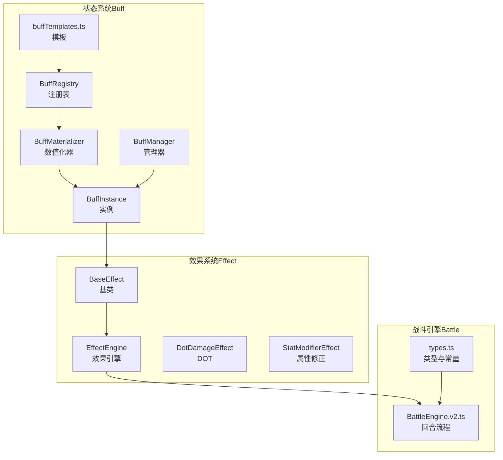
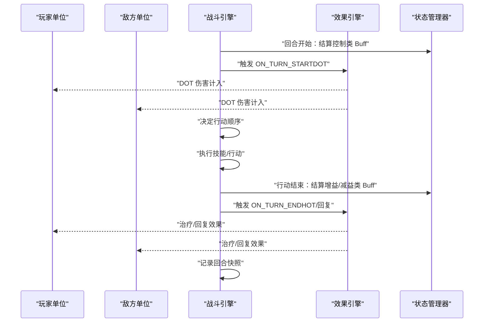
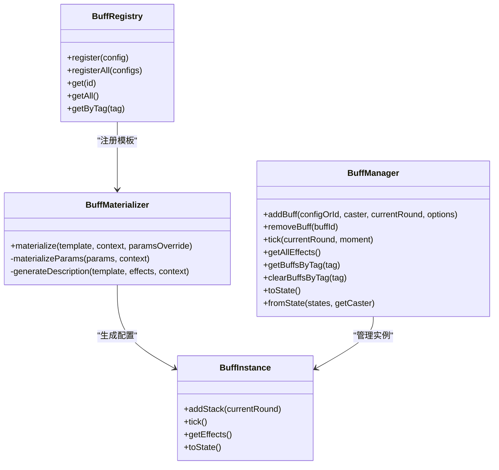
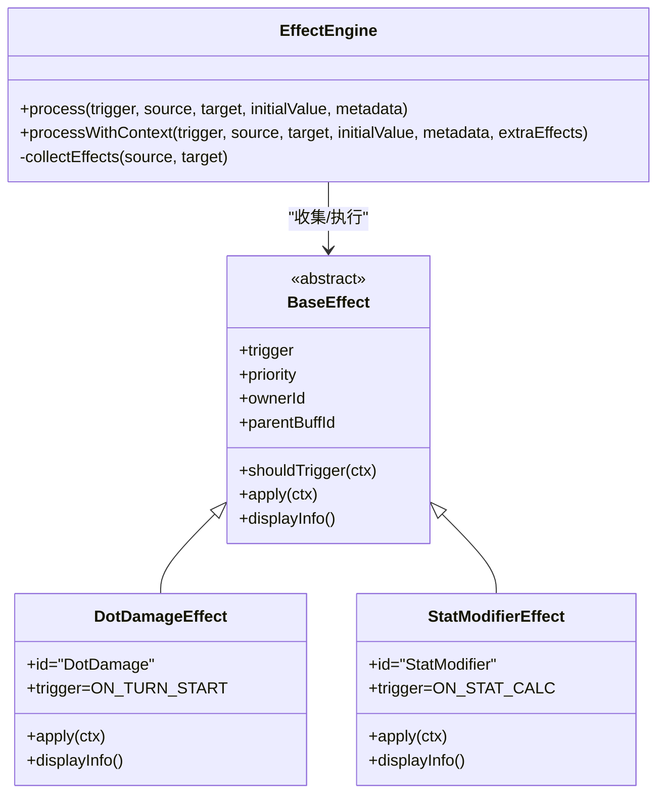
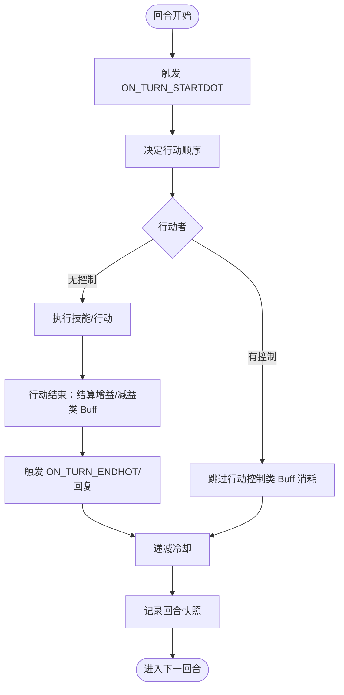
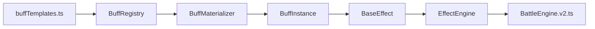

# 效果系统增强

<cite>
**本文引用的文件**
- [README.md](file://README.md)
- [package.json](file://package.json)
- [engine/buff/index.ts](file://engine/buff/index.ts)
- [engine/buff/BuffInstance.ts](file://engine/buff/BuffInstance.ts)
- [engine/buff/BuffManager.ts](file://engine/buff/BuffManager.ts)
- [engine/buff/BuffRegistry.ts](file://engine/buff/BuffRegistry.ts)
- [engine/buff/BuffMaterializer.ts](file://engine/buff/BuffMaterializer.ts)
- [config/buffTemplates.ts](file://config/buffTemplates.ts)
- [engine/effect/index.ts](file://engine/effect/index.ts)
- [engine/effect/BaseEffect.ts](file://engine/effect/BaseEffect.ts)
- [engine/effect/EffectEngine.ts](file://engine/effect/EffectEngine.ts)
- [engine/effect/effects/DotDamageEffect.ts](file://engine/effect/effects/DotDamageEffect.ts)
- [engine/effect/effects/StatModifierEffect.ts](file://engine/effect/effects/StatModifierEffect.ts)
- [engine/battle/BattleEngine.v2.ts](file://engine/battle/BattleEngine.v2.ts)
- [engine/battle/types.ts](file://engine/battle/types.ts)
</cite>

## 目录
1. [简介](#简介)
2. [项目结构](#项目结构)
3. [核心组件](#核心组件)
4. [架构总览](#架构总览)
5. [详细组件分析](#详细组件分析)
6. [依赖分析](#依赖分析)
7. [性能考量](#性能考量)
8. [故障排查指南](#故障排查指南)
9. [结论](#结论)
10. [附录](#附录)

## 简介
本文件聚焦于“效果系统增强”的主题，系统梳理并解释当前代码库中“效果（Effect）—状态（Buff）—战斗（Battle）”三层体系的设计与实现，重点阐述以下方面：
- 效果系统如何通过统一的执行引擎（EffectEngine）串联各类效果（如属性修正、持续伤害、治疗、减伤等）。
- 状态系统如何通过 Buff 模板、数值化器（BuffMaterializer）、注册表（BuffRegistry）与运行时管理器（BuffManager）协同工作。
- 战斗引擎（BattleEngine.v2）如何在回合流程中调用效果与状态，完成控制、增益/减益、DOT/HOT 等机制的闭环。

同时，结合 README 与 package.json 的信息，明确项目定位为“AIGC 驱动、高自由度文字体验、修仙世界观”的游戏骨架，效果系统作为战斗与角色成长的核心支撑，具备良好的扩展性与可组合性。

章节来源
- file://README.md#L1-L120
- file://package.json#L1-L55

## 项目结构
围绕效果系统增强，本次分析涉及的关键目录与文件如下：
- engine/buff：状态系统（配置、实例、管理、注册、数值化）
- engine/effect：效果系统（基类、工厂、引擎、具体效果）
- config/buffTemplates.ts：状态模板与描述生成
- engine/battle/BattleEngine.v2.ts：战斗引擎，贯穿回合结算与效果触发
- engine/battle/types.ts：战斗相关类型与常量

图表来源
- [engine/buff/BuffRegistry.ts](file://engine/buff/BuffRegistry.ts#L1-L72)
- [engine/buff/BuffManager.ts](file://engine/buff/BuffManager.ts#L1-L336)
- [engine/buff/BuffInstance.ts](file://engine/buff/BuffInstance.ts#L1-L140)
- [engine/buff/BuffMaterializer.ts](file://engine/buff/BuffMaterializer.ts#L1-L347)
- [config/buffTemplates.ts](file://config/buffTemplates.ts#L1-L787)
- [engine/effect/EffectEngine.ts](file://engine/effect/EffectEngine.ts#L1-L138)
- [engine/effect/BaseEffect.ts](file://engine/effect/BaseEffect.ts#L1-L83)
- [engine/effect/effects/DotDamageEffect.ts](file://engine/effect/effects/DotDamageEffect.ts#L1-L82)
- [engine/effect/effects/StatModifierEffect.ts](file://engine/effect/effects/StatModifierEffect.ts#L1-L110)
- [engine/battle/BattleEngine.v2.ts](file://engine/battle/BattleEngine.v2.ts#L1-L580)
- [engine/battle/types.ts](file://engine/battle/types.ts#L1-L147)

章节来源
- file://engine/buff/index.ts#L1-L16
- file://engine/effect/index.ts#L1-L15
- file://engine/battle/BattleEngine.v2.ts#L1-L120

## 核心组件
- 效果引擎（EffectEngine）：统一收集、筛选与执行效果，支持带日志的上下文返回，便于 UI 展示与调试。
- 效果基类（BaseEffect）：定义触发时机、优先级、持有者与父 Buff 关联，以及抽象 apply/display 方法。
- 具体效果（如 DotDamageEffect、StatModifierEffect）：按触发时机与类型实现具体逻辑。
- 状态系统（Buff）：模板驱动的配置化系统，通过 BuffMaterializer 将可缩放参数转换为具体数值，再由 BuffManager 管理生命周期与冲突。
- 战斗引擎（BattleEngine.v2）：在回合开始/结束、行动开始/结束等关键节点，调用 EffectEngine 与 BuffManager，形成完整的战斗结算闭环。

章节来源
- file://engine/effect/EffectEngine.ts#L1-L138
- file://engine/effect/BaseEffect.ts#L1-L83
- file://engine/effect/effects/DotDamageEffect.ts#L1-L82
- file://engine/effect/effects/StatModifierEffect.ts#L1-L110
- file://engine/buff/BuffMaterializer.ts#L1-L347
- file://engine/buff/BuffManager.ts#L1-L336
- file://engine/battle/BattleEngine.v2.ts#L120-L265

## 架构总览
效果系统增强的整体架构如下：

图表来源
- [engine/battle/BattleEngine.v2.ts](file://engine/battle/BattleEngine.v2.ts#L150-L265)
- [engine/effect/EffectEngine.ts](file://engine/effect/EffectEngine.ts#L1-L138)

章节来源
- file://engine/battle/BattleEngine.v2.ts#L150-L265
- file://engine/effect/EffectEngine.ts#L1-L138

## 详细组件分析

### 状态系统（Buff）增强
- 模板与描述生成：通过 buffTemplates.ts 定义各类 Buff 的模板，支持基于施法者属性、品质、层数等的可缩放参数，并由 BuffMaterializer 生成最终描述文本。
- 运行时实例：BuffInstance 负责维护层数、持续时间、施法者快照等，支持叠加（STACK）与刷新（REFRESH）策略。
- 生命周期管理：BuffManager 负责冲突处理、按标签过滤、按时机 tick、事件日志与序列化/反序列化。
- 注册与初始化：BuffRegistry 聚合所有 Buff 配置，初始化时注册模板。

图表来源
- [engine/buff/BuffRegistry.ts](file://engine/buff/BuffRegistry.ts#L1-L72)
- [engine/buff/BuffMaterializer.ts](file://engine/buff/BuffMaterializer.ts#L1-L347)
- [engine/buff/BuffManager.ts](file://engine/buff/BuffManager.ts#L1-L336)
- [engine/buff/BuffInstance.ts](file://engine/buff/BuffInstance.ts#L1-L140)

章节来源
- file://config/buffTemplates.ts#L1-L787
- file://engine/buff/BuffRegistry.ts#L1-L72
- file://engine/buff/BuffMaterializer.ts#L1-L347
- file://engine/buff/BuffManager.ts#L1-L336
- file://engine/buff/BuffInstance.ts#L1-L140

### 效果系统（Effect）增强
- 基类与触发：BaseEffect 定义触发时机（EffectTrigger）与优先级，支持设置持有者与父 Buff，displayInfo 用于 UI 展示。
- 效果引擎：EffectEngine 收集来源与目标实体的所有效果，按触发时机与优先级排序执行，支持返回上下文与日志。
- 具体效果：
  - DotDamageEffect：回合开始触发，支持基于施法者属性与元素亲和的缩放，叠加 Buff 层数。
  - StatModifierEffect：在属性计算阶段触发，支持固定值、百分比等修正类型，按优先级累乘/累加。

图表来源
- [engine/effect/BaseEffect.ts](file://engine/effect/BaseEffect.ts#L1-L83)
- [engine/effect/EffectEngine.ts](file://engine/effect/EffectEngine.ts#L1-L138)
- [engine/effect/effects/DotDamageEffect.ts](file://engine/effect/effects/DotDamageEffect.ts#L1-L82)
- [engine/effect/effects/StatModifierEffect.ts](file://engine/effect/effects/StatModifierEffect.ts#L1-L110)

章节来源
- file://engine/effect/BaseEffect.ts#L1-L83
- file://engine/effect/EffectEngine.ts#L1-L138
- file://engine/effect/effects/DotDamageEffect.ts#L1-L82
- file://engine/effect/effects/StatModifierEffect.ts#L1-L110

### 战斗引擎（BattleEngine.v2）与效果/状态集成
- 回合流程：回合开始（DOT 伤害）、行动顺序、行动执行、行动结束（增益/减益结算）、回合结束（HOT/回复）、冷却递减、快照记录。
- 控制与冲突：在行动开始时结算控制类 Buff（生效即消耗），并在行动结束时对增益/减益类 Buff 进行 tick。
- 伤势处理：根据残血比例动态升级持久状态（轻伤→重伤→濒死）。

图表来源
- [engine/battle/BattleEngine.v2.ts](file://engine/battle/BattleEngine.v2.ts#L150-L265)

章节来源
- file://engine/battle/BattleEngine.v2.ts#L150-L265
- file://engine/battle/types.ts#L1-L147

## 依赖分析
- 模块耦合与内聚：
  - Buff 系统与 Effect 系统通过 BuffInstance.getEffects() 与 EffectFactory 解耦，效果实例由 Buff 配置生成并注入持有者与父 Buff 信息。
  - BattleEngine.v2 仅依赖 EffectEngine 与 BuffManager 的公开接口，不直接操作具体效果实现，保持高内聚低耦合。
- 外部依赖：
  - 项目使用 Next.js 与 Drizzle ORM 等依赖，效果系统本身为纯业务逻辑，不直接依赖外部持久化。
- 循环依赖：
  - 通过导出聚合文件（engine/buff/index.ts、engine/effect/index.ts）避免直接相互导入，降低循环风险。

图表来源
- [config/buffTemplates.ts](file://config/buffTemplates.ts#L1-L787)
- [engine/buff/BuffRegistry.ts](file://engine/buff/BuffRegistry.ts#L1-L72)
- [engine/buff/BuffMaterializer.ts](file://engine/buff/BuffMaterializer.ts#L1-L347)
- [engine/buff/BuffInstance.ts](file://engine/buff/BuffInstance.ts#L1-L140)
- [engine/effect/BaseEffect.ts](file://engine/effect/BaseEffect.ts#L1-L83)
- [engine/effect/EffectEngine.ts](file://engine/effect/EffectEngine.ts#L1-L138)
- [engine/battle/BattleEngine.v2.ts](file://engine/battle/BattleEngine.v2.ts#L1-L120)

章节来源
- file://engine/buff/index.ts#L1-L16
- file://engine/effect/index.ts#L1-L15
- file://engine/battle/BattleEngine.v2.ts#L1-L120

## 性能考量
- 效果执行排序：EffectEngine 对效果按优先级排序，避免重复计算与无效遍历，建议新增效果时合理设置 priority。
- Buff tick 时机：按控制类与非控制类区分结算时机，避免同一回合内重复消耗，减少无效执行。
- DOT 层数叠加：DotDamageEffect 基于 buffStacks 叠加伤害，建议在模板中合理设置 maxStacks 与 duration，避免过度放大。
- 描述生成：BuffMaterializer 在生成描述时会遍历效果参数，建议模板参数命名规范（如 percentValue）以减少字符串替换开销。

## 故障排查指南
- 未找到 Buff 配置：BuffManager.addBuff 返回 RESISTED 事件，检查 BuffRegistry 是否正确注册模板或传入的 ID 是否正确。
- 效果未触发：确认 BaseEffect.shouldTrigger 与 EffectTrigger 是否匹配，以及 EffectEngine.processWithContext 的 trigger 与上下文是否一致。
- DOT 伤害异常：检查 DotDamageEffect 的 usesCasterStats 与 casterSnapshot 是否正确传递，以及 buffStacks 是否按预期写入 ctx.metadata。
- 持久状态未生效：确认 BuffTemplate 的 tags 与 BuffManager.getByTag 的筛选逻辑，以及 BuffManager.clearBuffsByTag 的清理范围。

章节来源
- file://engine/buff/BuffManager.ts#L28-L109
- file://engine/effect/BaseEffect.ts#L45-L83
- file://engine/effect/EffectEngine.ts#L20-L138
- file://engine/effect/effects/DotDamageEffect.ts#L1-L82

## 结论
效果系统增强通过“模板驱动的 Buff + 统一的 EffectEngine + 战斗引擎集成”的方式，实现了高扩展、可组合、可追踪的战斗与状态机制。借助可缩放参数与描述生成，系统既能满足 AIGC 驱动的内容生成，又能保证数值稳定性与表现一致性。未来可进一步：
- 扩展更多效果类型（如反射伤害、驱散、净化等）并纳入 EffectFactory 管理。
- 优化 Buff 冲突与叠加策略，引入更细粒度的标签与优先级。
- 在 UI 层完善效果与状态的可视化反馈，结合 EffectEngine 的日志能力提升可观测性。

## 附录
- Buff 模板与描述生成：参考 buffTemplates.ts 中的模板定义与 BuffMaterializer 的描述生成逻辑。
- 效果类型与触发：参考 EffectTrigger 与具体效果实现，确保触发时机与参数命名规范。
- 战斗常量与类型：参考 battle/types.ts 中的常量与类型定义，确保战斗流程与数值边界一致。

章节来源
- file://config/buffTemplates.ts#L1-L787
- file://engine/buff/BuffMaterializer.ts#L260-L347
- file://engine/battle/types.ts#L1-L147