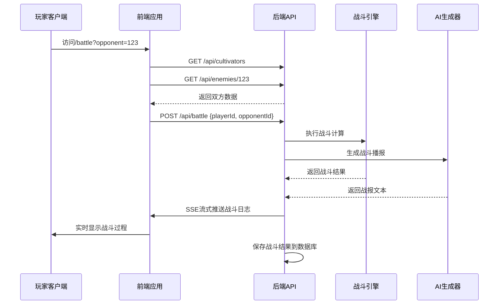
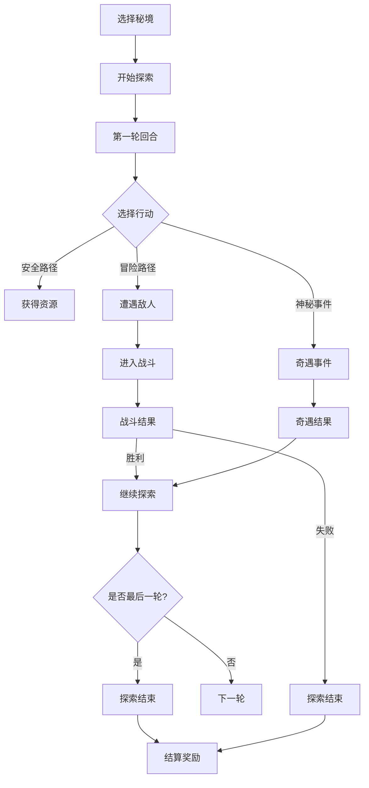
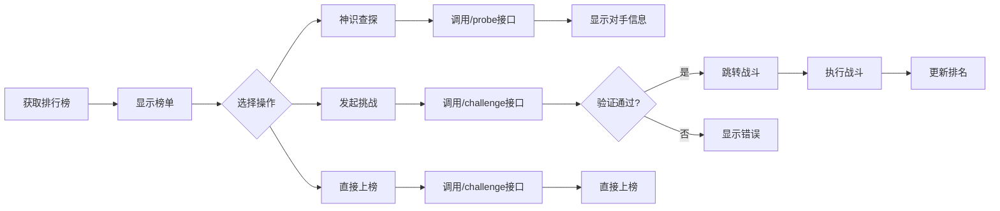
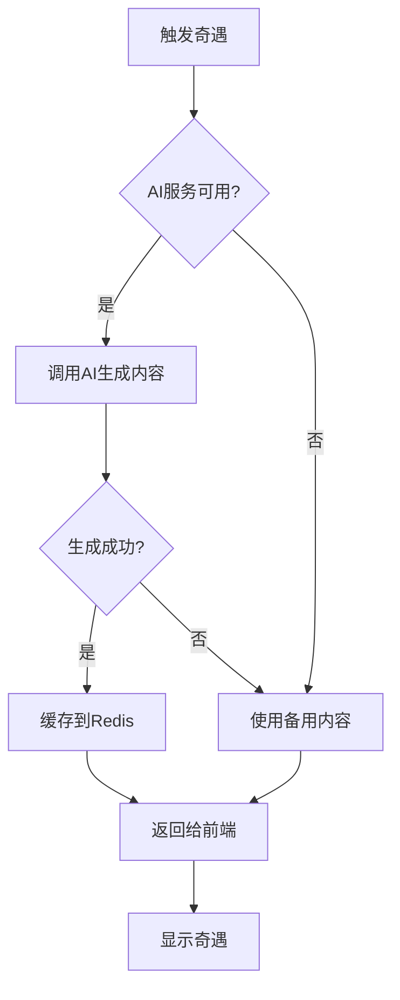

# 核心功能模块

<cite>
**本文档引用文件**   
- [app/page.tsx](file://app/page.tsx)
- [app/cultivator/page.tsx](file://app/cultivator/page.tsx)
- [app/battle/page.tsx](file://app/battle/page.tsx)
- [app/craft/page.tsx](file://app/craft/page.tsx)
- [app/game/map/page.tsx](file://app/game/map/page.tsx)
- [app/mail/page.tsx](file://app/mail/page.tsx)
- [app/rankings/page.tsx](file://app/rankings/page.tsx)
- [app/market/page.tsx](file://app/market/page.tsx)
- [app/retreat/page.tsx](file://app/retreat/page.tsx)
- [app/enlightenment/page.tsx](file://app/enlightenment/page.tsx)
- [app/inventory/page.tsx](file://app/inventory/page.tsx)
- [app/api/generate-fates/route.ts](file://app/api/generate-fates/route.ts)
- [app/api/divine-fortune/route.ts](file://app/api/divine-fortune/route.ts)
- [app/api/save-character/route.ts](file://app/api/save-character/route.ts)
- [app/api/battle/route.ts](file://app/api/battle/route.ts)
- [app/api/cultivators/route.ts](file://app/api/cultivators/route.ts)
- [app/api/mail/route.ts](file://app/api/mail/route.ts)
- [app/api/rankings/route.ts](file://app/api/rankings/route.ts)
- [app/api/market/route.ts](file://app/api/market/route.ts)
- [app/api/cultivator/retreat/route.ts](file://app/api/cultivator/retreat/route.ts)
- [app/api/craft/route.ts](file://app/api/craft/route.ts)
- [app/api/dungeon/start/route.ts](file://app/api/dungeon/start/route.ts)
- [app/api/dungeon/action/route.ts](file://app/api/dungeon/action/route.ts)
- [app/api/dungeon/battle/execute/route.ts](file://app/api/dungeon/battle/execute/route.ts)
- [app/api/enemies/[id]/route.ts](file://app/api/enemies/[id]/route.ts)
- [app/api/cultivators/[id]/equip/route.ts](file://app/api/cultivators/[id]/equip/route.ts)
- [app/api/cultivators/[id]/consume/route.ts](file://app/api/cultivators/[id]/consume/route.ts)
- [app/api/cultivators/[id]/inventory/discard/route.ts](file://app/api/cultivators/[id]/inventory/discard/route.ts)
- [app/api/cultivators/title/route.ts](file://app/api/cultivators/title/route.ts)
- [app/api/cultivators/active-reincarnate/route.ts](file://app/api/cultivators/active-reincarnate/route.ts)
- [app/api/mail/[id]/claim/route.ts](file://app/api/mail/[id]/claim/route.ts)
- [app/api/mail/[id]/read/route.ts](file://app/api/mail/[id]/read/route.ts)
- [app/api/rankings/challenge/route.ts](file://app/api/rankings/challenge/route.ts)
- [app/api/rankings/probe/route.ts](file://app/api/rankings/probe/route.ts)
- [app/api/market/buy/route.ts](file://app/api/market/buy/route.ts)
- [app/api/cultivators/yield/route.ts](file://app/api/cultivators/yield/route.ts)
- [app/api/cultivators/history/route.ts](file://app/api/cultivators/history/route.ts)
- [app/api/cultivators/skills/forget/route.ts](file://app/api/cultivators/skills/forget/route.ts)
- [app/api/cultivators/reincarnate-context/route.ts](file://app/api/cultivators/reincarnate-context/route.ts)
- [app/api/cultivators/[id]/route.ts](file://app/api/cultivators/[id]/route.ts)
- [app/api/battles/[id]/route.ts](file://app/api/battles/[id]/route.ts)
- [app/api/battles/route.ts](file://app/api/battles/route.ts)
- [app/api/rankings/items/route.ts](file://app/api/rankings/items/route.ts)
- [app/api/rankings/my-rank/route.ts](file://app/api/rankings/my-rank/route.ts)
- [app/api/rankings/challenge-battle/route.ts](file://app/api/rankings/challenge-battle/route.ts)
- [app/api/dungeon/state/route.ts](file://app/api/dungeon/state/route.ts)
- [app/api/dungeon/quit/route.ts](file://app/api/dungeon/quit/route.ts)
- [app/api/mail/unread-count/route.ts](file://app/api/mail/unread-count/route.ts)
- [app/api/rankings/probe/route.ts](file://app/api/rankings/probe/route.ts)
- [app/api/cultivators/[id]/yield/route.ts](file://app/api/cultivators/[id]/yield/route.ts)
- [app/api/cultivators/[id]/history/route.ts](file://app/api/cultivators/[id]/history/route.ts)
- [app/api/cultivators/[id]/skills/forget/route.ts](file://app/api/cultivators/[id]/skills/forget/route.ts)
- [app/api/cultivators/[id]/reincarnate-context/route.ts](file://app/api/cultivators/[id]/reincarnate-context/route.ts)
</cite>

## 目录
1. [角色系统](#角色系统)
2. [战斗系统](#战斗系统)
3. [炼器系统](#炼器系统)
4. [探索系统](#探索系统)
5. [邮件系统](#邮件系统)
6. [排行榜系统](#排行榜系统)
7. [坊市系统](#坊市系统)
8. [闭关系统](#闭关系统)
9. [顿悟系统](#顿悟系统)
10. [奇遇系统](#奇遇系统)

## 角色系统

角色系统是游戏的核心基础，管理玩家的修仙道身及其所有属性、状态和成长路径。该系统贯穿游戏始终，为所有其他功能提供数据支持。

### 功能概述
角色系统负责管理玩家的修仙道身，包括姓名、境界、属性、灵根、命格、法宝、神通等核心信息。它是玩家在修仙世界中的身份象征，所有成长和交互都围绕此展开。

### 用户交互流程
1. **角色创建**：玩家通过`/create`页面创建角色，系统调用`/api/generate-character`生成初始数据。
2. **角色查看**：在主界面点击"道我真形"进入`/cultivator`页面，展示角色详细信息。
3. **称号修改**：在主界面或角色页面点击"修改"，通过`/api/cultivators/title`接口更新称号。
4. **转世重修**：在角色页面点击"转世重修"，通过`/api/cultivators/active-reincarnate`接口触发兵解，进入轮回。

### 后端处理逻辑
- **数据获取**：`/api/cultivators`接口从数据库获取角色数据，结合Redis缓存计算最终属性。
- **称号更新**：`/api/cultivators/title`接口验证输入后更新数据库中的称号字段。
- **转世处理**：`/api/cultivators/active-reincarnate`接口将角色状态标记为"已陨落"，并触发转世流程。

### 底层架构利用
- **属性计算**：使用`calculateFinalAttributes`函数综合计算基础属性、功法加成、装备加成等。
- **数据缓存**：通过`redisCultivatorRepository`对角色数据进行缓存，提高读取效率。
- **状态管理**：使用`useCultivatorBundle`自定义Hook统一管理角色数据的获取和刷新。

**Section sources**
- [app/page.tsx](file://app/page.tsx#L27-L38)
- [app/cultivator/page.tsx](file://app/cultivator/page.tsx#L31-L330)
- [app/api/cultivators/route.ts](file://app/api/cultivators/route.ts)
- [app/api/cultivators/title/route.ts](file://app/api/cultivators/title/route.ts)
- [app/api/cultivators/active-reincarnate/route.ts](file://app/api/cultivators/active-reincarnate/route.ts)
- [lib/hooks/useCultivatorBundle.ts](file://lib/hooks/useCultivatorBundle.ts)
- [utils/cultivatorUtils.ts](file://utils/cultivatorUtils.ts)
- [lib/repositories/redisCultivatorRepository.ts](file://lib/repositories/redisCultivatorRepository.ts)

## 战斗系统

战斗系统是游戏的核心玩法之一，提供实时的战斗体验和战报生成，让玩家感受修仙世界的激烈对抗。

### 功能概述
战斗系统允许玩家与敌人进行对战，通过策略性的技能释放和属性对抗来决定胜负。系统提供详细的战报和数值回放，增强战斗的沉浸感和爽感。

### 用户交互流程
1. **发起战斗**：在主界面或排行榜选择对手，跳转至`/battle`页面，携带对手ID参数。
2. **战斗播报**：页面自动加载双方数据并开始战斗，实时显示战斗过程和战报。
3. **结果查看**：战斗结束后，展示战斗结果、数值回放和奖励信息。
4. **再战一次**：可点击"再战"按钮重新挑战同一对手。

### 后端处理逻辑
- **数据准备**：`/battle`页面并行调用`/api/cultivators`和`/api/enemies/[id]`获取双方数据。
- **战斗执行**：调用`/api/battle`接口，该接口整合了战斗计算和战报生成逻辑。
- **流式响应**：使用Server-Sent Events (SSE)技术，实时推送战斗日志和结果。
- **结果存储**：战斗结束后，结果被保存到数据库，并更新相关统计数据。

### 底层架构利用
- **战斗引擎**：`battleEngine.ts`实现核心战斗算法，包括回合制逻辑、技能效果计算等。
- **流式传输**：利用SSE实现战斗过程的实时推送，提升用户体验。
- **AI生成**：战报内容由AI模型生成，确保每次战斗都有独特的叙事体验。

**Diagram sources **
- [app/battle/page.tsx](file://app/battle/page.tsx#L28-L313)
- [app/api/battle/route.ts](file://app/api/battle/route.ts)
- [engine/battleEngine.ts](file://engine/battleEngine.ts)
- [utils/storyService.ts](file://utils/storyService.ts)

**Section sources**
- [app/battle/page.tsx](file://app/battle/page.tsx#L1-L313)
- [app/api/battle/route.ts](file://app/api/battle/route.ts)
- [app/api/cultivators/route.ts](file://app/api/cultivators/route.ts)
- [app/api/enemies/[id]/route.ts](file://app/api/enemies/[id]/route.ts)
- [engine/battleEngine.ts](file://engine/battleEngine.ts)

## 炼器系统

炼器系统允许玩家通过消耗材料和神念来创造法宝，是提升战力的重要途径。

### 功能概述
炼器系统分为炼器和炼丹两个分支，玩家可以选择不同的造物之道来创造法宝或丹药。该系统强调创造性和策略性，玩家的输入（提示词）直接影响成品品质。

### 用户交互流程
1. **选择造物**：进入`/craft`页面，选择"炼器之道"或"炼丹之道"。
2. **输入神念**：在炼器/炼丹页面输入创造所需的提示词（神念）。
3. **选择材料**：从储物袋中选择合适的灵材作为原料。
4. **开始炼造**：确认后调用`/api/craft`接口开始炼造过程。
5. **获取成品**：炼造成功后，成品自动加入储物袋。

### 后端处理逻辑
- **材料验证**：检查玩家是否拥有足够的指定材料。
- **AI生成**：根据玩家输入的提示词和材料属性，调用AI模型生成法宝/丹药的属性和描述。
- **结果计算**：综合材料品阶、五行属性和提示词质量，计算成品的最终品质。
- **库存更新**：成功后从玩家材料库存中扣除消耗的材料，并添加新创造的物品。

### 底层架构利用
- **AI创造**：使用`CreationEngine`和`CreationStrategy`模式，结合AI模型实现物品的动态生成。
- **策略模式**：`RefiningStrategy`和`AlchemyStrategy`分别处理炼器和炼丹的特定逻辑。
- **属性系统**：生成的物品属性与游戏核心属性系统无缝集成，确保平衡性。

**Section sources**
- [app/craft/page.tsx](file://app/craft/page.tsx#L1-L78)
- [app/api/craft/route.ts](file://app/api/craft/route.ts)
- [engine/creation/CreationEngine.ts](file://engine/creation/CreationEngine.ts)
- [engine/creation/strategies/RefiningStrategy.ts](file://engine/creation/strategies/RefiningStrategy.ts)
- [engine/creation/strategies/AlchemyStrategy.ts](file://engine/creation/strategies/AlchemyStrategy.ts)

## 探索系统

探索系统提供单人副本式的冒险体验，玩家可以在不同的秘境中进行探索，遭遇随机事件和战斗。

### 功能概述
探索系统是一个回合制的冒险玩法，玩家在选定的秘境中进行多轮探索，每轮面临不同的选择和挑战。系统结合了叙事、策略和随机性，提供丰富的游戏体验。

### 用户交互流程
1. **选择秘境**：通过`/game/map`页面选择探索地点，然后进入`/game/dungeon`页面。
2. **开始探索**：点击"开启探险"，调用`/api/dungeon/start`初始化副本状态。
3. **进行抉择**：每轮系统提供多个选项，玩家选择后调用`/api/dungeon/action`执行。
4. **遭遇战斗**：当选择触发战斗时，进入战斗页面进行对战。
5. **结束探索**：达到最大轮数或主动放弃，获得最终奖励。

### 后端处理逻辑
- **状态管理**：使用`DungeonState`对象在Redis中持久化副本的完整状态。
- **剧情生成**：每轮的场景描述和选项由AI模型根据当前状态动态生成。
- **战斗集成**：当需要战斗时，调用`/api/dungeon/battle/execute`接口执行战斗。
- **结果结算**：探索结束后，根据危险评分和轮数计算最终奖励。

### 底层架构利用
- **状态持久化**：利用Redis存储复杂的副本状态，确保玩家可以随时中断和继续。
- **AI叙事**：AI模型根据玩家选择和游戏状态生成连贯的剧情发展。
- **地图系统**：`mapSystem.ts`管理所有探索节点的位置、描述和连接关系。

**Diagram sources **
- [app/game/dungeon/page.tsx](file://app/game/dungeon/page.tsx#L1-L629)
- [app/api/dungeon/start/route.ts](file://app/api/dungeon/start/route.ts)
- [app/api/dungeon/action/route.ts](file://app/api/dungeon/action/route.ts)
- [app/api/dungeon/battle/execute/route.ts](file://app/api/dungeon/battle/execute/route.ts)
- [lib/dungeon/service_v2.ts](file://lib/dungeon/service_v2.ts)

**Section sources**
- [app/game/dungeon/page.tsx](file://app/game/dungeon/page.tsx#L1-L629)
- [app/game/map/page.tsx](file://app/game/map/page.tsx#L1-L250)
- [app/api/dungeon/start/route.ts](file://app/api/dungeon/start/route.ts)
- [app/api/dungeon/action/route.ts](file://app/api/dungeon/action/route.ts)
- [app/api/dungeon/battle/execute/route.ts](file://app/api/dungeon/battle/execute/route.ts)
- [app/api/dungeon/state/route.ts](file://app/api/dungeon/state/route.ts)
- [app/api/dungeon/quit/route.ts](file://app/api/dungeon/quit/route.ts)
- [lib/dungeon/service_v2.ts](file://lib/dungeon/service_v2.ts)
- [lib/game/mapSystem.ts](file://lib/game/mapSystem.ts)

## 邮件系统

邮件系统是游戏内的信息传递和奖励发放机制，用于通知玩家重要事件和发放奖励。

### 功能概述
邮件系统模拟修仙世界的传音玉简，用于向玩家发送系统通知、活动信息和奖励。玩家可以查看、阅读和领取邮件中的奖励。

### 用户交互流程
1. **查看邮件**：进入`/mail`页面，系统自动调用`/api/mail`获取邮件列表。
2. **阅读邮件**：点击邮件条目，弹出详情模态框，同时调用`/api/mail/[id]/read`标记为已读。
3. **领取奖励**：在邮件详情中点击"领取奖励"，调用`/api/mail/[id]/claim`接口。
4. **刷新状态**：领取后自动刷新邮件列表和未读计数。

### 后端处理逻辑
- **邮件获取**：`/api/mail`接口查询数据库中属于该玩家的所有邮件。
- **标记已读**：`/api/mail/[id]/read`接口更新邮件的`isRead`状态。
- **领取奖励**：`/api/mail/[id]/claim`接口验证后发放邮件中的物品或资源，并更新状态。
- **未读计数**：`/api/mail/unread-count`接口快速返回未读邮件数量，用于主界面显示。

### 底层架构利用
- **服务封装**：`MailService`类封装了邮件的创建、发送和处理逻辑，确保代码复用。
- **数据一致性**：使用数据库事务确保奖励发放和状态更新的原子性。
- **性能优化**：未读计数使用独立接口，避免在获取完整邮件列表时进行复杂计算。

**Section sources**
- [app/mail/page.tsx](file://app/mail/page.tsx#L1-L82)
- [app/api/mail/route.ts](file://app/api/mail/route.ts)
- [app/api/mail/[id]/read/route.ts](file://app/api/mail/[id]/read/route.ts)
- [app/api/mail/[id]/claim/route.ts](file://app/api/mail/[id]/claim/route.ts)
- [app/api/mail/unread-count/route.ts](file://app/api/mail/unread-count/route.ts)
- [lib/services/MailService.ts](file://lib/services/MailService.ts)

## 排行榜系统

排行榜系统是游戏的核心PVP玩法，玩家可以通过挑战他人来提升自己的排名，获得丰厚奖励。

### 功能概述
排行榜系统包含天骄榜、法宝榜、神通榜和丹药榜四个榜单，玩家可以查看排名、神识查探对手、发起挑战。系统每日结算，根据排名发放灵石奖励。

### 用户交互流程
1. **查看榜单**：进入`/rankings`页面，选择不同榜单查看排名。
2. **神识查探**：点击对手的"查探"按钮，调用`/api/rankings/probe`获取对手信息。
3. **发起挑战**：点击"挑战"按钮，调用`/api/rankings/challenge`验证条件。
4. **挑战战斗**：验证通过后跳转至挑战战斗页面，进行实时对战。
5. **直接上榜**：若榜单为空，可直接点击"直接上榜"占据第一名。

### 后端处理逻辑
- **榜单获取**：`/api/rankings`接口从Redis有序集合中获取排名数据。
- **查探信息**：`/api/rankings/probe`接口返回对手的公开属性和装备信息。
- **挑战验证**：`/api/rankings/challenge`接口检查挑战次数、境界差距等条件。
- **排名更新**：挑战成功后，根据战斗结果更新双方排名和积分。

### 底层架构利用
- **Redis缓存**：使用Redis的有序集合（ZSET）存储排名数据，确保高性能的读写操作。
- **排名计算**：`rankingUtils.ts`实现复杂的排名算法和积分计算逻辑。
- **定时任务**：`/api/cron/rank-rewards/route.ts`每日凌晨自动执行，结算奖励。

**Diagram sources **
- [app/rankings/page.tsx](file://app/rankings/page.tsx#L1-L404)
- [app/api/rankings/route.ts](file://app/api/rankings/route.ts)
- [app/api/rankings/probe/route.ts](file://app/rankings/probe/route.ts)
- [app/api/rankings/challenge/route.ts](file://app/api/rankings/challenge/route.ts)
- [app/api/rankings/challenge-battle/route.ts](file://app/api/rankings/challenge-battle/route.ts)
- [lib/redis/rankings.ts](file://lib/redis/rankings.ts)

**Section sources**
- [app/rankings/page.tsx](file://app/rankings/page.tsx#L1-L404)
- [app/api/rankings/route.ts](file://app/api/rankings/route.ts)
- [app/api/rankings/probe/route.ts](file://app/api/rankings/probe/route.ts)
- [app/api/rankings/challenge/route.ts](file://app/api/rankings/challenge/route.ts)
- [app/api/rankings/challenge-battle/route.ts](file://app/api/rankings/challenge-battle/route.ts)
- [app/api/rankings/items/route.ts](file://app/api/rankings/items/route.ts)
- [app/api/rankings/my-rank/route.ts](file://app/api/rankings/my-rank/route.ts)
- [lib/redis/rankings.ts](file://lib/redis/rankings.ts)

## 坊市系统

坊市系统是游戏内的交易市场，玩家可以在这里购买修炼材料和资源。

### 功能概述
坊市系统模拟修仙世界的交易市场，定期刷新出售各种修炼材料。玩家可以使用灵石购买材料，用于炼器、炼丹等玩法。

### 用户交互流程
1. **查看商品**：进入`/market`页面，系统自动调用`/api/market`获取当前商品列表。
2. **购买商品**：点击商品的"购买"按钮，调用`/api/market/buy`接口。
3. **库存更新**：购买成功后，商品库存减少，玩家材料增加。
4. **倒计时刷新**：页面显示下批货物的刷新倒计时，到期后自动刷新商品。

### 后端处理逻辑
- **商品生成**：`/api/market`接口随机生成一批商品，包括材料类型、数量、价格等。
- **购买验证**：`/api/market/buy`接口检查玩家灵石是否足够，并验证商品库存。
- **交易执行**：扣除玩家灵石，增加对应材料，并更新商品库存。
- **定时刷新**：系统定期（或在商品售罄后）生成新的商品列表。

### 底层架构利用
- **库存管理**：商品数据在内存中维护，确保高并发下的读写性能。
- **价格平衡**：根据材料稀有度和市场需求动态调整价格。
- **缓存策略**：商品列表使用短时缓存，确保数据一致性的同时提高性能。

**Section sources**
- [app/market/page.tsx](file://app/market/page.tsx#L1-L186)
- [app/api/market/route.ts](file://app/api/market/route.ts)
- [app/api/market/buy/route.ts](file://app/api/market/buy/route.ts)

## 闭关系统

闭关系统是角色成长的核心机制，玩家通过闭关修炼来提升属性和境界。

### 功能概述
闭关系统允许玩家投入时间进行修炼，有概率突破到更高境界，同时获得属性成长。闭关时间越长，突破概率越高，但也会消耗寿元。

### 用户交互流程
1. **设置年限**：在`/retreat`页面输入闭关年限（1-300年）。
2. **预览概率**：系统实时计算并显示突破成功率。
3. **开始闭关**：点击"闭关冲关"，调用`/api/cultivator/retreat`接口。
4. **查看结果**：闭关结束后，显示属性成长、境界变化和生成的故事。

### 后端处理逻辑
- **概率计算**：`calculateBreakthroughChance`函数根据角色属性、境界、闭关年限等计算突破概率。
- **结果生成**：`breakthroughEngine.ts`执行突破逻辑，决定是否成功，并计算属性增长。
- **故事生成**：AI模型根据闭关结果生成一段修仙故事，增强沉浸感。
- **状态更新**：更新角色的年龄、寿元、境界和属性等数据。

### 底层架构利用
- **突破算法**：复杂的突破概率算法考虑了多种因素，包括灵根、功法、法宝等。
- **AI叙事**：AI模型生成个性化的闭关故事，使每次闭关都有独特体验。
- **状态持久化**：闭关结果直接更新到角色数据中，确保与其他系统的一致性。

**Section sources**
- [app/retreat/page.tsx](file://app/retreat/page.tsx#L1-L218)
- [app/api/cultivator/retreat/route.ts](file://app/api/cultivator/retreat/route.ts)
- [utils/breakthroughEngine.ts](file://utils/breakthroughEngine.ts)

## 顿悟系统

顿悟系统是技能创造的核心玩法，玩家可以在这里推演和创造独特的神通技能。

### 功能概述
顿悟系统允许玩家基于自身灵根、悟性和法宝，创造独特的主动技能（神通）。该系统强调创造性和个性化，每个玩家的技能都可能独一无二。

### 用户交互流程
1. **进入藏经阁**：通过`/enlightenment`页面进入顿悟系统。
2. **选择推演**：点击"开始推演"进入神通推演页面。
3. **输入神念**：输入创造技能所需的提示词（神念）。
4. **开始推演**：确认后调用`/api/enlightenment/skill`接口开始推演。
5. **获取技能**：推演成功后，新技能自动加入技能列表。

### 后端处理逻辑
- **输入验证**：检查玩家是否满足推演条件（如悟性、灵感等）。
- **AI生成**：根据玩家输入的提示词和角色特征，调用AI模型生成技能属性和描述。
- **技能平衡**：确保生成的技能在游戏平衡范围内，避免过于强大。
- **数据存储**：将新技能添加到玩家的技能列表中，并更新数据库。

### 底层架构利用
- **AI创造**：与炼器系统类似，使用AI模型动态生成技能数据。
- **属性关联**：技能属性与玩家的灵根、属性等深度关联，确保个性化。
- **创造策略**：`SkillCreationStrategy`实现技能创造的特定逻辑和规则。

**Section sources**
- [app/enlightenment/page.tsx](file://app/enlightenment/page.tsx#L1-L76)
- [app/api/enlightenment/route.ts](file://app/api/enlightenment/route.ts)
- [engine/creation/strategies/SkillCreationStrategy.ts](file://engine/creation/strategies/SkillCreationStrategy.ts)

## 奇遇系统

奇遇系统是游戏的随机事件机制，通过AI生成独特的修仙故事和机遇，增加游戏的趣味性和不可预测性。

### 功能概述
奇遇系统在游戏的多个环节触发，如每日天机、闭关故事、探索事件等。它利用AI生成富有修仙韵味的随机事件，为玩家带来惊喜和额外奖励。

### 用户交互流程
1. **触发奇遇**：在主界面、闭关、探索等环节随机触发奇遇。
2. **查看内容**：系统弹出奇遇详情，展示生成的故事和可能的奖励。
3. **做出选择**：部分奇遇提供选择，玩家的选择影响结果。
4. **获得结果**：根据奇遇类型和玩家选择，获得属性成长、物品奖励等。

### 后端处理逻辑
- **内容生成**：`divineFortune.ts`调用AI模型生成天机格言和奇遇故事。
- **缓存机制**：生成的天机格言缓存在Redis中，有效期30分钟，避免重复生成。
- **降级策略**：当AI服务不可用时，返回预设的备用格言，确保功能可用性。
- **随机触发**：在特定游戏事件（如闭关、探索）中按概率触发奇遇。

### 底层架构利用
- **AI生成**：核心依赖AI模型生成高质量、符合修仙主题的文本内容。
- **Redis缓存**：使用Redis缓存生成的奇遇内容，提高响应速度和降低AI调用成本。
- **降级容错**：完善的降级策略确保在AI服务故障时，游戏体验不受影响。

**Diagram sources **
- [app/api/divine-fortune/route.ts](file://app/api/divine-fortune/route.ts)
- [utils/divineFortune.ts](file://utils/divineFortune.ts)
- [lib/redis/index.ts](file://lib/redis/index.ts)

**Section sources**
- [app/page.tsx](file://app/page.tsx#L1-L317)
- [app/api/divine-fortune/route.ts](file://app/api/divine-fortune/route.ts)
- [app/api/cultivator/retreat/route.ts](file://app/api/cultivator/retreat/route.ts)
- [app/api/dungeon/action/route.ts](file://app/api/dungeon/action/route.ts)
- [utils/divineFortune.ts](file://utils/divineFortune.ts)
- [utils/fateGenerator.ts](file://utils/fateGenerator.ts)
- [lib/redis/index.ts](file://lib/redis/index.ts)