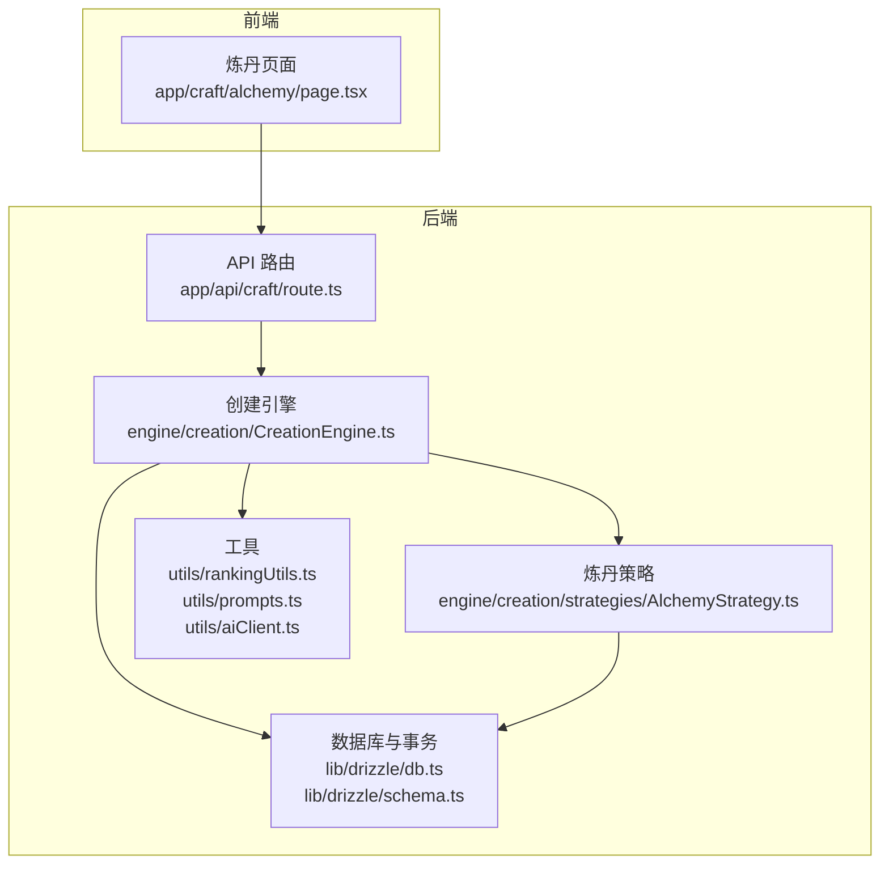
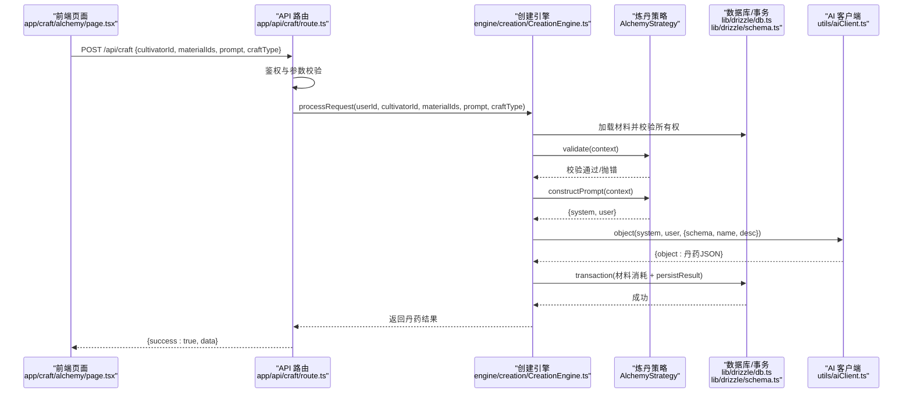
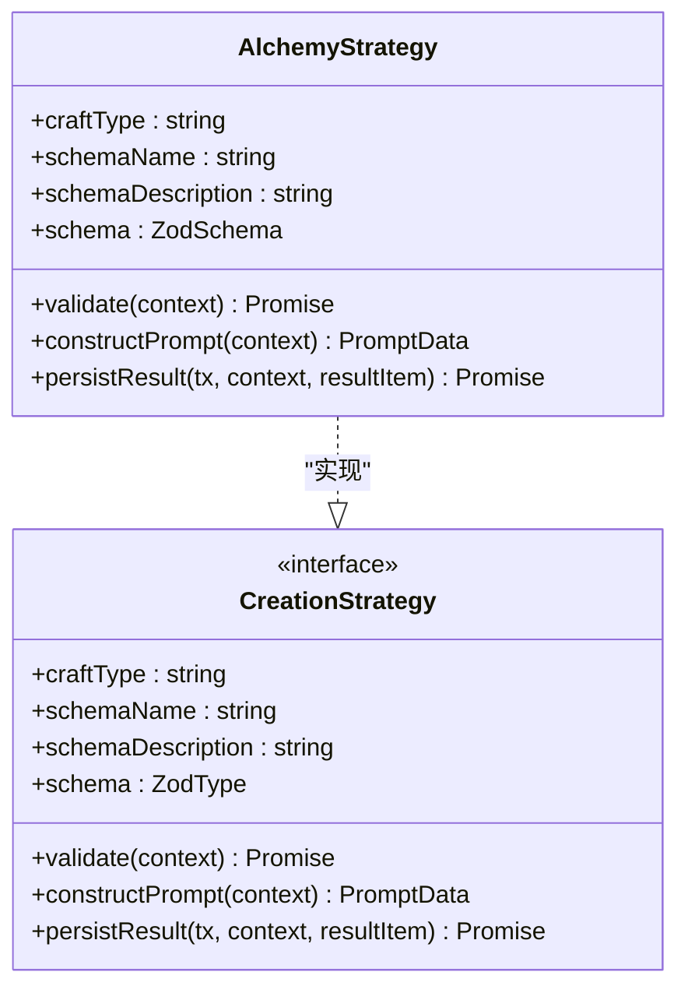
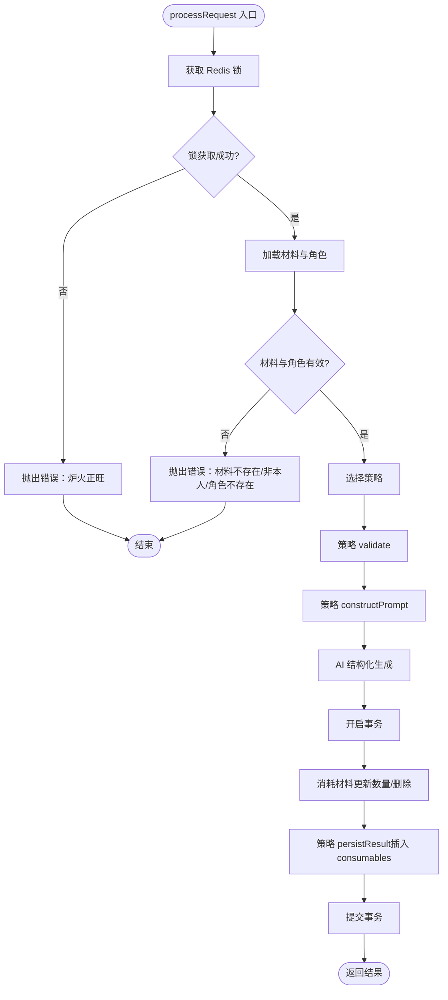
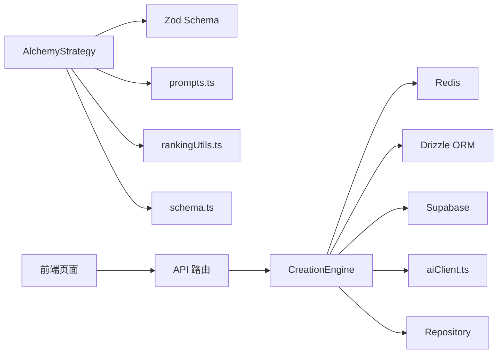

# 炼丹系统

<cite>
**本文引用的文件**
- [AlchemyStrategy.ts](file://engine/creation/strategies/AlchemyStrategy.ts)
- [CreationEngine.ts](file://engine/creation/CreationEngine.ts)
- [route.ts](file://app/api/craft/route.ts)
- [page.tsx](file://app/craft/alchemy/page.tsx)
- [CreationStrategy.ts](file://engine/creation/CreationStrategy.ts)
- [schema.ts](file://lib/drizzle/schema.ts)
- [db.ts](file://lib/drizzle/db.ts)
- [rankingUtils.ts](file://utils/rankingUtils.ts)
- [prompts.ts](file://utils/prompts.ts)
- [aiClient.ts](file://utils/aiClient.ts)
- [constants.ts](file://types/constants.ts)
- [cultivator.ts](file://types/cultivator.ts)
</cite>

## 目录
1. [简介](#简介)
2. [项目结构](#项目结构)
3. [核心组件](#核心组件)
4. [架构总览](#架构总览)
5. [详细组件分析](#详细组件分析)
6. [依赖关系分析](#依赖关系分析)
7. [性能考量](#性能考量)
8. [故障排查指南](#故障排查指南)
9. [结论](#结论)
10. [附录](#附录)

## 简介
本文件系统性阐述炼丹系统的实现机制，围绕 AlchemyStrategy 类展开，说明其 validate 方法如何校验药材合法性（禁止矿石类材料、限制药材数量），constructPrompt 如何构建符合修仙世界观的系统提示词并结合修士境界、材料属性与用户神念生成结构化输入，persistResult 如何将 AI 生成的丹药结果持久化至 consumables 表并计算评分。同时结合 CreationEngine 的事务处理流程，解释材料消耗与丹药生成的原子性操作，并提供从前端页面提交请求、API 路由验证参数、调用炼丹策略、返回结果的完整链路示例，涵盖材料不足、材料类型不符、炼丹过程中炸炉等异常场景的应对方案。

## 项目结构
炼丹系统位于 engine/creation 子模块，采用“策略模式 + 引擎”的分层设计：
- 策略层：AlchemyStrategy 实现炼丹规则与提示词构造
- 引擎层：CreationEngine 负责参数校验、锁竞争、材料加载与所有权校验、策略选择、AI 调用、事务持久化
- API 层：/app/api/craft/route.ts 提供 HTTP 接口，接收前端请求并委派给引擎
- 前端层：/app/craft/alchemy/page.tsx 提供炼丹界面与交互
- 数据层：lib/drizzle/schema.ts 定义数据库表结构，lib/drizzle/db.ts 提供事务类型与连接
- 工具层：utils/rankingUtils.ts 计算评分，utils/prompts.ts 提供提示词净化，utils/aiClient.ts 封装结构化生成

图表来源
- [page.tsx](file://app/craft/alchemy/page.tsx#L1-L286)
- [route.ts](file://app/api/craft/route.ts#L1-L62)
- [CreationEngine.ts](file://engine/creation/CreationEngine.ts#L1-L134)
- [AlchemyStrategy.ts](file://engine/creation/strategies/AlchemyStrategy.ts#L1-L185)
- [db.ts](file://lib/drizzle/db.ts#L1-L13)
- [schema.ts](file://lib/drizzle/schema.ts#L120-L174)
- [rankingUtils.ts](file://utils/rankingUtils.ts#L67-L81)
- [prompts.ts](file://utils/prompts.ts#L262-L356)
- [aiClient.ts](file://utils/aiClient.ts#L92-L124)

章节来源
- [page.tsx](file://app/craft/alchemy/page.tsx#L1-L286)
- [route.ts](file://app/api/craft/route.ts#L1-L62)
- [CreationEngine.ts](file://engine/creation/CreationEngine.ts#L1-L134)
- [AlchemyStrategy.ts](file://engine/creation/strategies/AlchemyStrategy.ts#L1-L185)
- [schema.ts](file://lib/drizzle/schema.ts#L120-L174)
- [db.ts](file://lib/drizzle/db.ts#L1-L13)
- [rankingUtils.ts](file://utils/rankingUtils.ts#L67-L81)
- [prompts.ts](file://utils/prompts.ts#L262-L356)
- [aiClient.ts](file://utils/aiClient.ts#L92-L124)

## 核心组件
- AlchemyStrategy：实现炼丹规则校验、系统提示词构造、结果持久化
- CreationEngine：统一入口，负责参数校验、锁竞争、材料与角色加载、策略选择、AI 调用、事务持久化
- API 路由：校验用户身份、参数完整性、调用引擎并返回结果
- 前端页面：选择材料、注入神念、提交请求、展示结果与错误
- 数据库与事务：materials 表消耗、consumables 表持久化、评分计算
- 工具函数：提示词净化、结构化生成、评分计算

章节来源
- [AlchemyStrategy.ts](file://engine/creation/strategies/AlchemyStrategy.ts#L1-L185)
- [CreationEngine.ts](file://engine/creation/CreationEngine.ts#L1-L134)
- [route.ts](file://app/api/craft/route.ts#L1-L62)
- [page.tsx](file://app/craft/alchemy/page.tsx#L1-L286)
- [schema.ts](file://lib/drizzle/schema.ts#L120-L174)
- [db.ts](file://lib/drizzle/db.ts#L1-L13)
- [rankingUtils.ts](file://utils/rankingUtils.ts#L67-L81)
- [prompts.ts](file://utils/prompts.ts#L262-L356)
- [aiClient.ts](file://utils/aiClient.ts#L92-L124)

## 架构总览
炼丹系统遵循“策略 + 引擎 + API + 前端”的分层架构，核心流程如下：
- 前端页面收集材料与神念，发起 POST 请求到 /api/craft
- API 路由进行鉴权与参数校验，调用 CreationEngine.processRequest
- 引擎执行锁竞争、材料与角色加载、策略选择、validate、constructPrompt、AI 结构化生成、事务持久化
- AlchemyStrategy 在事务内完成材料消耗与 consumables 持久化，并计算评分

图表来源
- [page.tsx](file://app/craft/alchemy/page.tsx#L50-L107)
- [route.ts](file://app/api/craft/route.ts#L1-L62)
- [CreationEngine.ts](file://engine/creation/CreationEngine.ts#L35-L133)
- [AlchemyStrategy.ts](file://engine/creation/strategies/AlchemyStrategy.ts#L44-L184)
- [aiClient.ts](file://utils/aiClient.ts#L92-L124)
- [db.ts](file://lib/drizzle/db.ts#L1-L13)
- [schema.ts](file://lib/drizzle/schema.ts#L120-L174)

## 详细组件分析

### AlchemyStrategy：炼丹策略
- 规则校验（validate）
  - 至少一种、最多五种药材
  - 禁止使用矿石类材料（ore）
- 提示词构造（constructPrompt）
  - 构建系统提示词，包含背景、角色、目标、炼丹法则、执行步骤、输入输出格式
  - 将修士境界、材料列表、用户神念整合为 XML 结构化输入
- 结果持久化（persistResult）
  - 计算评分并插入 consumables 表，包含名称、类型、品质、效果、描述、数量、评分等字段

图表来源
- [AlchemyStrategy.ts](file://engine/creation/strategies/AlchemyStrategy.ts#L1-L185)
- [CreationStrategy.ts](file://engine/creation/CreationStrategy.ts#L1-L51)

章节来源
- [AlchemyStrategy.ts](file://engine/creation/strategies/AlchemyStrategy.ts#L44-L184)
- [CreationStrategy.ts](file://engine/creation/CreationStrategy.ts#L1-L51)

### CreationEngine：创建引擎
- 参数与锁
  - 使用 Redis 锁避免并发炼丹导致资源冲突
- 数据加载与校验
  - 读取材料并校验是否存在、是否属于当前角色
  - 加载角色并校验存在性
- 策略选择与调用
  - 根据 craftType 选择策略，执行 validate、constructPrompt、AI 结构化生成
- 事务持久化
  - 材料消耗：数量>1 则更新数量，否则删除
  - 结果持久化：委托策略的 persistResult

图表来源
- [CreationEngine.ts](file://engine/creation/CreationEngine.ts#L35-L133)

章节来源
- [CreationEngine.ts](file://engine/creation/CreationEngine.ts#L35-L133)

### API 路由：/api/craft
- 鉴权：通过 Supabase 获取当前用户
- 参数校验：craftType=create_skill 时校验 prompt 长度；炼丹时校验 cultivatorId、materialIds、craftType
- 调用引擎：processRequest 并返回结果
- 错误处理：捕获异常并返回友好提示

章节来源
- [route.ts](file://app/api/craft/route.ts#L1-L62)

### 前端页面：炼丹房
- 材料选择：最多 5 种，过滤掉矿石类材料
- 神念输入：描述期望的丹药效果
- 提交流程：fetch /api/craft，处理响应与错误，刷新库存

章节来源
- [page.tsx](file://app/craft/alchemy/page.tsx#L1-L286)

### 数据模型与事务
- materials 表：存储材料，支持数量与类型
- consumables 表：存储炼成的丹药，包含评分字段
- 事务：保证材料消耗与结果持久化的原子性

章节来源
- [schema.ts](file://lib/drizzle/schema.ts#L120-L174)
- [db.ts](file://lib/drizzle/db.ts#L1-L13)

### 提示词与评分
- 提示词净化：sanitizePrompt 移除标签、数字、危险符号与作弊关键词
- 结构化生成：aiClient.object 使用 Zod Schema 约束输出
- 评分计算：calculateSingleElixirScore 基于品质与效果总和

章节来源
- [prompts.ts](file://utils/prompts.ts#L262-L356)
- [aiClient.ts](file://utils/aiClient.ts#L92-L124)
- [rankingUtils.ts](file://utils/rankingUtils.ts#L67-L81)
- [constants.ts](file://types/constants.ts#L115-L165)
- [cultivator.ts](file://types/cultivator.ts#L172-L191)

## 依赖关系分析
- AlchemyStrategy 依赖：
  - Zod Schema（约束输出结构）
  - 提示词净化工具
  - 评分计算工具
  - 数据库 schema（consumables）
- CreationEngine 依赖：
  - Redis 锁
  - Drizzle ORM（查询与事务）
  - Supabase 客户端（鉴权）
  - AI 客户端（结构化生成）
  - Repository（角色加载）
- 前端依赖：
  - 前端 Hook（useCultivatorBundle）
  - UI 组件库

图表来源
- [AlchemyStrategy.ts](file://engine/creation/strategies/AlchemyStrategy.ts#L1-L185)
- [CreationEngine.ts](file://engine/creation/CreationEngine.ts#L1-L134)
- [route.ts](file://app/api/craft/route.ts#L1-L62)
- [page.tsx](file://app/craft/alchemy/page.tsx#L1-L286)
- [prompts.ts](file://utils/prompts.ts#L262-L356)
- [rankingUtils.ts](file://utils/rankingUtils.ts#L67-L81)
- [schema.ts](file://lib/drizzle/schema.ts#L120-L174)
- [db.ts](file://lib/drizzle/db.ts#L1-L13)
- [aiClient.ts](file://utils/aiClient.ts#L92-L124)

## 性能考量
- 锁竞争：Redis 锁避免并发炼丹导致的资源竞争，提高吞吐
- 事务原子性：材料消耗与结果持久化在单事务内完成，减少回滚成本
- 结构化生成：AI 客户端启用 maxRetries 与 schema 约束，降低无效输出
- 数据访问：批量 inArray 查询材料，减少多次往返

[本节为通用建议，无需列出章节来源]

## 故障排查指南
- 材料不足或不存在
  - 现象：抛出“部分材料已耗尽或不存在”
  - 排查：确认 materialIds 是否正确、材料是否被他人使用
  - 处理：前端刷新库存后重新选择
- 非本人材料
  - 现象：抛出“非本人材料，不可动用”
  - 排查：检查材料归属 cultivatorId
  - 处理：仅选择当前角色的材料
- 材料类型不符（矿石类）
  - 现象：validate 抛出“不适合炼丹”
  - 排查：确认材料类型不是 ore
  - 处理：移除矿石类材料
- 材料数量超出限制
  - 现象：validate 抛出“最多五种药材”
  - 处理：减少材料种类
- 炼丹过程中炸炉
  - 现象：API 返回“炼制失败，炸炉了！”
  - 排查：检查 Redis 锁是否被占用、AI 生成是否失败、数据库事务是否异常
  - 处理：等待锁释放、重试请求、查看服务日志

章节来源
- [CreationEngine.ts](file://engine/creation/CreationEngine.ts#L42-L133)
- [route.ts](file://app/api/craft/route.ts#L45-L61)
- [AlchemyStrategy.ts](file://engine/creation/strategies/AlchemyStrategy.ts#L44-L55)

## 结论
炼丹系统通过策略模式将规则与提示词封装在 AlchemyStrategy 中，借助 CreationEngine 实现严格的参数校验、并发锁控制、材料与角色加载、AI 结构化生成与事务持久化，最终将结果存入 consumables 表并计算评分。前端页面提供直观的交互体验，API 路由保障鉴权与参数校验，整体流程清晰、可维护性强，具备良好的扩展性与鲁棒性。

[本节为总结，无需列出章节来源]

## 附录

### 典型炼丹流程代码追踪示例
- 前端页面提交请求
  - 路径：app/craft/alchemy/page.tsx
  - 关键点：fetch /api/craft，校验参数，处理响应
- API 路由验证参数并调用引擎
  - 路径：app/api/craft/route.ts
  - 关键点：鉴权、参数校验、processRequest
- 引擎执行策略与事务
  - 路径：engine/creation/CreationEngine.ts
  - 关键点：锁获取、材料加载与校验、策略选择、validate、constructPrompt、AI 结构化生成、事务持久化
- 策略校验与提示词构造
  - 路径：engine/creation/strategies/AlchemyStrategy.ts
  - 关键点：validate、constructPrompt、persistResult
- 数据库与事务
  - 路径：lib/drizzle/schema.ts、lib/drizzle/db.ts
  - 关键点：consumables 表结构、事务类型

章节来源
- [page.tsx](file://app/craft/alchemy/page.tsx#L50-L107)
- [route.ts](file://app/api/craft/route.ts#L1-L62)
- [CreationEngine.ts](file://engine/creation/CreationEngine.ts#L35-L133)
- [AlchemyStrategy.ts](file://engine/creation/strategies/AlchemyStrategy.ts#L44-L184)
- [schema.ts](file://lib/drizzle/schema.ts#L120-L174)
- [db.ts](file://lib/drizzle/db.ts#L1-L13)