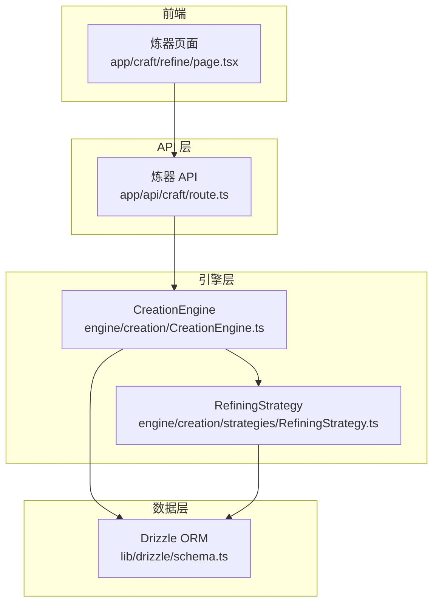
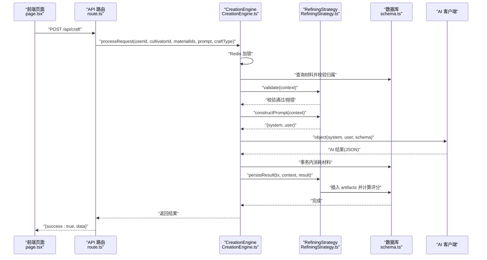
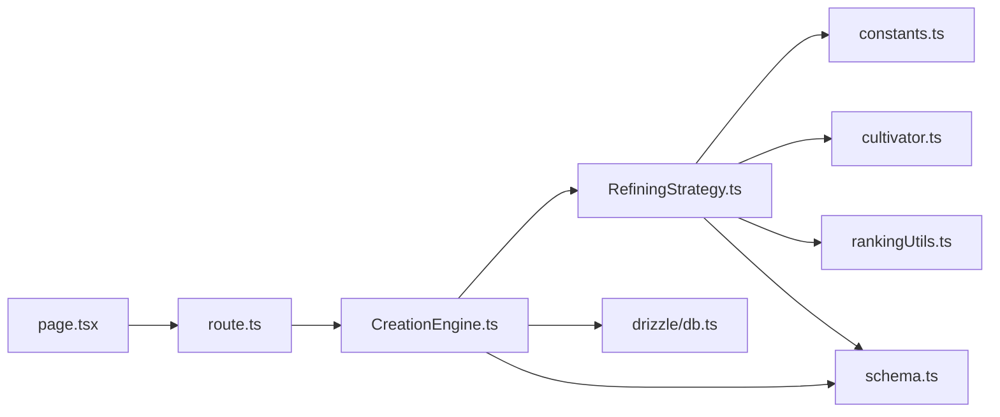

# 炼器系统

<cite>
**本文引用的文件**
- [RefiningStrategy.ts](file://engine/creation/strategies/RefiningStrategy.ts)
- [CreationStrategy.ts](file://engine/creation/CreationStrategy.ts)
- [CreationEngine.ts](file://engine/creation/CreationEngine.ts)
- [route.ts](file://app/api/craft/route.ts)
- [constants.ts](file://types/constants.ts)
- [cultivator.ts](file://types/cultivator.ts)
- [schema.ts](file://lib/drizzle/schema.ts)
- [rankingUtils.ts](file://utils/rankingUtils.ts)
- [page.tsx](file://app/craft/refine/page.tsx)
- [RefiningStrategy.test.ts](file://engine/creation/strategies/RefiningStrategy.test.ts)
</cite>

## 目录
1. [简介](#简介)
2. [项目结构](#项目结构)
3. [核心组件](#核心组件)
4. [架构总览](#架构总览)
5. [详细组件分析](#详细组件分析)
6. [依赖分析](#依赖分析)
7. [性能考量](#性能考量)
8. [故障排查指南](#故障排查指南)
9. [结论](#结论)
10. [附录](#附录)

## 简介
本文件深入解析炼器系统的实现逻辑，围绕 RefiningStrategy 类展开，重点说明：
- validate 方法如何校验炼器材料的合法性，确保不使用草药类材料并限制材料数量；
- constructPrompt 方法构建的炼器规则体系，包括法宝品质上限、属性加成范围与修士境界的对应关系、装备部位的属性限制、材料五行相克引发的诅咒机制、高品材料必带特效等核心规则；
- AI 提示词如何引导模型生成符合修仙设定的法宝名称与描述，同时保证属性数值的合理性；
- persistResult 方法如何将生成的法宝数据写入 artifacts 表，并计算其评分；
- CreationEngine 的锁机制与数据库事务，如何保障材料消耗与法宝生成的一致性；
- 从用户选择材料到获得法宝的完整流程示例，包括前端交互、API 调用、策略执行与结果返回；
- 常见问题如材料冲突导致诅咒、属性加成条数限制、境界不符无法炼制等场景的处理方式。

## 项目结构
炼器系统位于引擎层的 creation 子模块，采用“策略模式 + 引擎调度”的架构：
- 引擎层负责统一调度与事务控制；
- 策略层针对不同造物类型（炼器、炼丹、技能）提供各自的验证、提示词构造与持久化逻辑；
- API 层接收前端请求，调用引擎处理；
- 数据层通过 Drizzle ORM 访问数据库；
- 类型与常量定义贯穿全局，确保规则一致性。

图表来源
- [page.tsx](file://app/craft/refine/page.tsx#L1-L285)
- [route.ts](file://app/api/craft/route.ts#L1-L62)
- [CreationEngine.ts](file://engine/creation/CreationEngine.ts#L1-L134)
- [RefiningStrategy.ts](file://engine/creation/strategies/RefiningStrategy.ts#L1-L177)
- [schema.ts](file://lib/drizzle/schema.ts#L120-L170)

章节来源
- [CreationEngine.ts](file://engine/creation/CreationEngine.ts#L1-L134)
- [RefiningStrategy.ts](file://engine/creation/strategies/RefiningStrategy.ts#L1-L177)
- [route.ts](file://app/api/craft/route.ts#L1-L62)
- [schema.ts](file://lib/drizzle/schema.ts#L120-L170)

## 核心组件
- RefiningStrategy：炼器策略，负责材料校验、提示词构造、结果持久化与评分计算。
- CreationStrategy：策略接口，定义 craftType、schema、validate、constructPrompt、persistResult 等契约。
- CreationEngine：统一引擎，负责加锁、材料加载与所有权校验、策略选择、AI 调用、事务内材料消耗与结果落库。
- API 路由：接收前端请求，进行参数校验与错误处理，调用引擎。
- 类型与常量：统一约束枚举值（元素、品质、部位、状态效果、境界等），支撑规则实现。
- 数据库 schema：materials、artifacts 等表结构，支撑材料消耗与法宝落库。

章节来源
- [CreationStrategy.ts](file://engine/creation/CreationStrategy.ts#L1-L51)
- [RefiningStrategy.ts](file://engine/creation/strategies/RefiningStrategy.ts#L1-L177)
- [CreationEngine.ts](file://engine/creation/CreationEngine.ts#L1-L134)
- [constants.ts](file://types/constants.ts#L1-L191)
- [schema.ts](file://lib/drizzle/schema.ts#L120-L170)

## 架构总览
炼器流程的关键路径如下：
- 前端选择材料与输入提示，提交到 /api/craft；
- API 校验参数，交由 CreationEngine 处理；
- 引擎获取 Redis 锁，校验材料归属与存在性；
- 选择 RefiningStrategy，执行 validate；
- 构造系统提示词与用户提示词，调用 AI 生成 JSON；
- 在事务内消耗材料并持久化法宝；
- 返回成功结果给前端。

图表来源
- [page.tsx](file://app/craft/refine/page.tsx#L50-L107)
- [route.ts](file://app/api/craft/route.ts#L1-L62)
- [CreationEngine.ts](file://engine/creation/CreationEngine.ts#L35-L132)
- [RefiningStrategy.ts](file://engine/creation/strategies/RefiningStrategy.ts#L62-L176)
- [schema.ts](file://lib/drizzle/schema.ts#L120-L170)

## 详细组件分析

### RefiningStrategy 校验与提示词
- validate 校验要点
  - 至少一种材料，至多五种；
  - 禁止使用草药类材料（herb）。
- constructPrompt 规则要点
  - 输出格式与枚举约束：严格要求只输出符合 JSON Schema 的对象；
  - 品质上限：法宝品质不超过投入材料中的最高 rank；
  - 属性加成范围：按修士境界给出上下限，与材料品质正相关；
  - 装备部位限制：weapon 仅允许 vitality、spirit、speed；armor 仅允许 vitality、spirit、willpower；accessory 仅允许 spirit、wisdom、willpower；
  - 材料影响：五行相克必须生成 curses；含高品材料（地品及以上）必带 special_effects；
  - 特效数值合理：damage_bonus 的 bonus、on_hit_add_effect 的 chance/power、on_use_cost_hp 的 amount；
  - 命名与描述：名称 2–6 字、描述 100–120 字，风格符合修仙设定；
  - 境界限制：required_realm 必须与修士境界相匹配；
  - 属性加成条数限制：凡/灵/玄品最多 1 条，真/地/天品最多 2 条，仙/神品最多 3 条；
  - 禁止行为：不得输出非 JSON、不得使用未列出的枚举值、不得受用户意图影响数值。

章节来源
- [RefiningStrategy.ts](file://engine/creation/strategies/RefiningStrategy.ts#L62-L176)
- [constants.ts](file://types/constants.ts#L1-L191)
- [cultivator.ts](file://types/cultivator.ts#L104-L171)

### RefiningStrategy 持久化与评分
- persistResult 将 AI 生成的法宝数据写入 artifacts 表，字段包括：cultivatorId、prompt、name、slot、quality、required_realm、element、bonus、special_effects、curses、description、score；
- 评分通过 calculateSingleArtifactScore 计算：基础分来自品质映射，基础属性求和，每条 special_effects 增加 20% 的倍率。

章节来源
- [RefiningStrategy.ts](file://engine/creation/strategies/RefiningStrategy.ts#L155-L176)
- [rankingUtils.ts](file://utils/rankingUtils.ts#L1-L81)
- [schema.ts](file://lib/drizzle/schema.ts#L136-L156)

### CreationEngine 锁机制与事务一致性
- 锁机制：使用 Redis SET key nx ex 设置 30 秒锁，避免并发炼器；
- 材料加载与校验：读取材料并校验是否存在、是否属于当前修炼者；
- 事务内操作：
  - 材料消耗：quantity > 1 则减 1，否则删除该材料；
  - 结果落库：委托策略执行 persistResult；
- 最终释放锁，保证材料消耗与法宝生成的原子性。

章节来源
- [CreationEngine.ts](file://engine/creation/CreationEngine.ts#L42-L132)
- [schema.ts](file://lib/drizzle/schema.ts#L120-L135)

### API 路由与前端交互
- API 路由：
  - 校验用户登录、参数完整性；
  - 对 craftType='create_skill' 做特殊校验；
  - 调用 CreationEngine.processRequest 并返回结果或错误；
- 前端页面：
  - 选择材料（最多 5 种，禁用 herb）；
  - 输入提示词（描述法宝类型、属性偏向或名称风格）；
  - 发起 POST /api/craft，展示成功/失败状态与提示。

章节来源
- [route.ts](file://app/api/craft/route.ts#L1-L62)
- [page.tsx](file://app/craft/refine/page.tsx#L1-L285)

### 测试与意图净化
- RefiningStrategy.test.ts 展示了 validate、constructPrompt、AI 生成与打印结果的流程；
- keywords 过滤工具用于净化炼器意图，避免将用户输入中的数值意图直接传递给模型。

章节来源
- [RefiningStrategy.test.ts](file://engine/creation/strategies/RefiningStrategy.test.ts#L1-L90)

## 依赖分析
- RefiningStrategy 依赖：
  - 类型与常量：ELEMENT_VALUES、EQUIPMENT_SLOT_VALUES、QUALITY_VALUES、REALM_VALUES、STATUS_EFFECT_VALUES、EFFECT_TYPE_VALUES；
  - 数据模型：Artifact、Material；
  - 评分工具：calculateSingleArtifactScore；
  - 数据库 schema：artifacts；
- CreationEngine 依赖：
  - Redis 锁；
  - Drizzle ORM 查询与事务；
  - 策略注册与调度；
  - AI 客户端 object 调用；
- API 路由依赖：
  - Supabase 用户鉴权；
  - CreationEngine 实例。

图表来源
- [RefiningStrategy.ts](file://engine/creation/strategies/RefiningStrategy.ts#L1-L177)
- [CreationEngine.ts](file://engine/creation/CreationEngine.ts#L1-L134)
- [route.ts](file://app/api/craft/route.ts#L1-L62)
- [constants.ts](file://types/constants.ts#L1-L191)
- [cultivator.ts](file://types/cultivator.ts#L104-L171)
- [rankingUtils.ts](file://utils/rankingUtils.ts#L1-L81)
- [schema.ts](file://lib/drizzle/schema.ts#L120-L170)

## 性能考量
- Redis 锁超时（30 秒）避免死锁，但需注意长时间 AI 生成可能触发超时，建议在策略层尽量缩短提示词长度与复杂度；
- 事务内仅执行必要的材料更新/删除与插入，避免长事务；
- 材料数量限制（最多 5）降低 AI 生成复杂度与数据库压力；
- 评分计算简单线性，性能开销可忽略。

## 故障排查指南
- 材料冲突导致诅咒
  - 现象：五行相克材料组合生成 curses；
  - 处理：调整材料组合，避免相克元素同时出现。
- 属性加成条数限制
  - 现象：低品质法宝最多 1 条 bonus，高品质最多 2/3 条；
  - 处理：减少 bonus 数量或提升材料品质。
- 境界不符无法炼制
  - 现象：required_realm 与修士境界不匹配；
  - 处理：提升自身境界或选择更低品质材料。
- 草药类材料被拒绝
  - 现象：validate 抛错提示不适合炼器；
  - 处理：移除 herb 类型材料。
- 材料数量超出上限
  - 现象：validate 抛错提示至多五种；
  - 处理：减少材料种类。
- 并发炼器失败
  - 现象：Redis 锁已被占用；
  - 处理：等待锁释放或稍后重试。
- 材料不存在或非本人
  - 现象：引擎抛错；
  - 处理：检查材料归属与库存。

章节来源
- [RefiningStrategy.ts](file://engine/creation/strategies/RefiningStrategy.ts#L62-L176)
- [CreationEngine.ts](file://engine/creation/CreationEngine.ts#L42-L132)
- [route.ts](file://app/api/craft/route.ts#L1-L62)

## 结论
炼器系统通过策略模式将规则与实现解耦，借助严格的提示词约束与数据库事务，确保炼器过程的合法性、一致性与可预测性。validate 与 constructPrompt 两道关卡分别从“材料与数量”和“生成规范”两个维度保障质量；CreationEngine 的锁与事务机制进一步保证材料消耗与产物落库的原子性。整体设计兼顾可维护性与可扩展性，便于未来新增炼器规则或接入更复杂的 AI 生成流程。

## 附录

### 从用户到法宝的完整流程示例
- 前端交互
  - 用户在炼器页面选择最多 5 种非草药材料，输入提示词；
  - 点击“开炉炼器”，发起 POST /api/craft；
- API 调用
  - 校验用户登录与参数，调用 CreationEngine.processRequest；
- 策略执行
  - validate 校验材料数量与类型；
  - constructPrompt 生成系统与用户提示词；
  - AI 生成符合规则的法宝 JSON；
- 结果返回
  - 事务内消耗材料并持久化法宝；
  - 返回成功与生成的法宝数据。

章节来源
- [page.tsx](file://app/craft/refine/page.tsx#L50-L107)
- [route.ts](file://app/api/craft/route.ts#L1-L62)
- [CreationEngine.ts](file://engine/creation/CreationEngine.ts#L35-L132)
- [RefiningStrategy.ts](file://engine/creation/strategies/RefiningStrategy.ts#L62-L176)