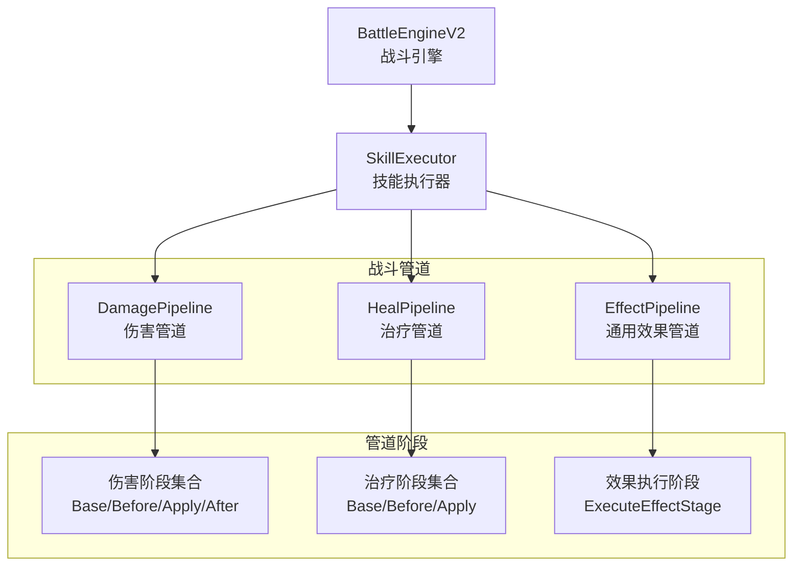
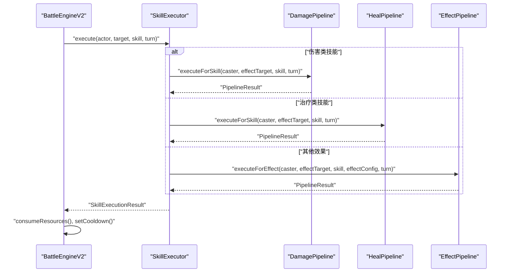
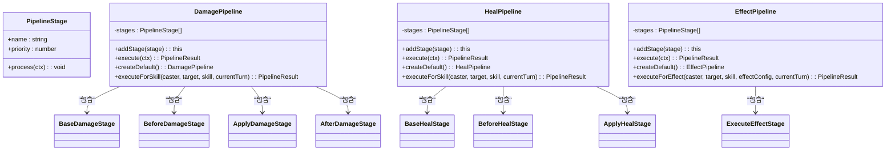
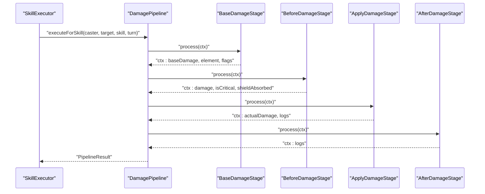
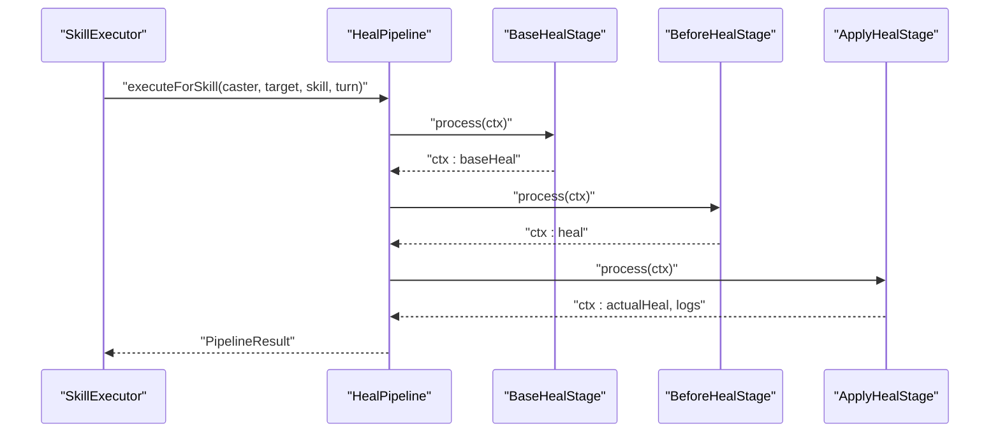
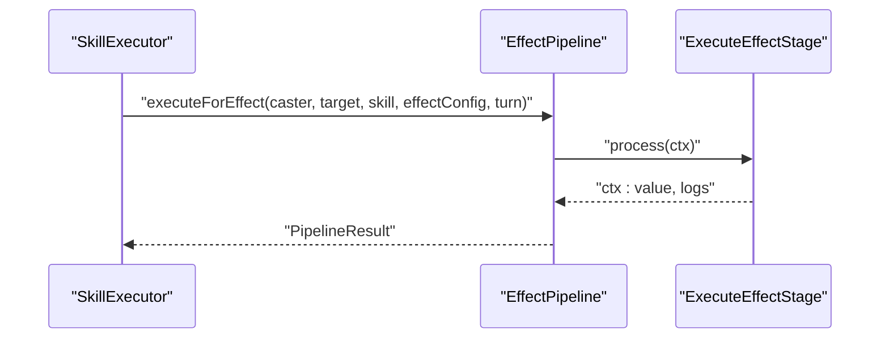
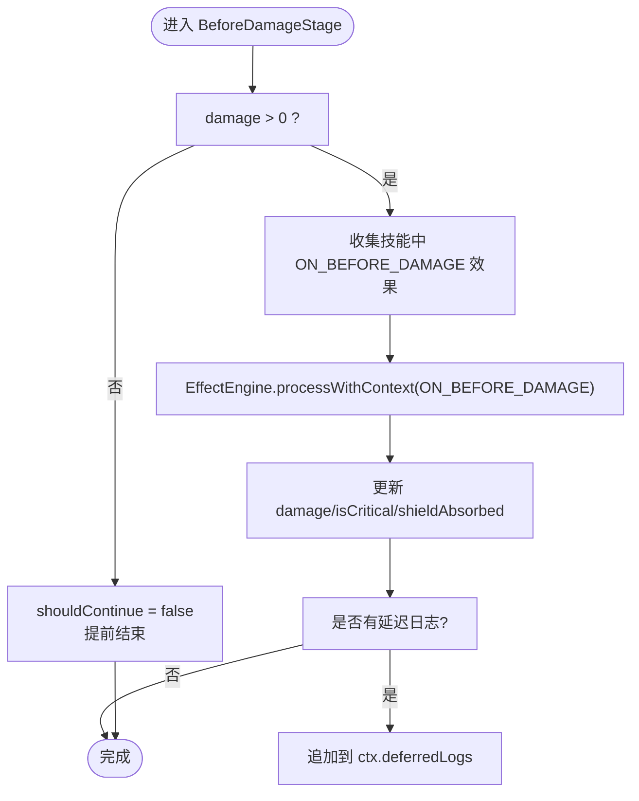
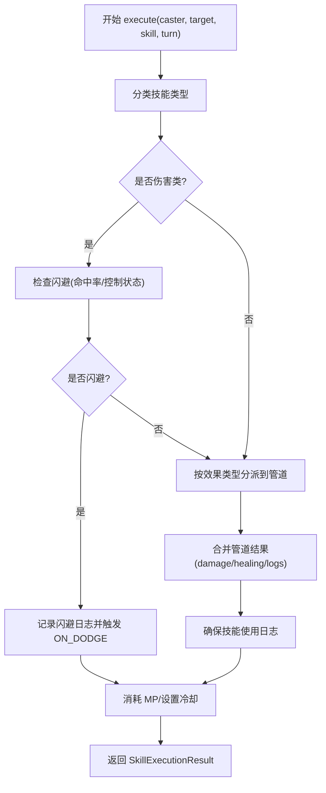
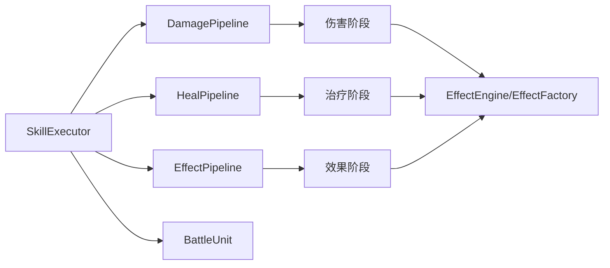

# 管道架构设计

<cite>
**本文引用的文件**
- [engine/battle/pipeline/DamagePipeline.ts](file://engine/battle/pipeline/DamagePipeline.ts)
- [engine/battle/pipeline/HealPipeline.ts](file://engine/battle/pipeline/HealPipeline.ts)
- [engine/battle/pipeline/EffectPipeline.ts](file://engine/battle/pipeline/EffectPipeline.ts)
- [engine/battle/pipeline/types.ts](file://engine/battle/pipeline/types.ts)
- [engine/battle/pipeline/stages/damage/BaseDamageStage.ts](file://engine/battle/pipeline/stages/damage/BaseDamageStage.ts)
- [engine/battle/pipeline/stages/damage/BeforeDamageStage.ts](file://engine/battle/pipeline/stages/damage/BeforeDamageStage.ts)
- [engine/battle/pipeline/stages/damage/ApplyDamageStage.ts](file://engine/battle/pipeline/stages/damage/ApplyDamageStage.ts)
- [engine/battle/pipeline/stages/damage/AfterDamageStage.ts](file://engine/battle/pipeline/stages/damage/AfterDamageStage.ts)
- [engine/battle/pipeline/stages/effect/ExecuteEffectStage.ts](file://engine/battle/pipeline/stages/effect/ExecuteEffectStage.ts)
- [engine/battle/pipeline/stages/heal/BaseHealStage.ts](file://engine/battle/pipeline/stages/heal/BaseHealStage.ts)
- [engine/battle/pipeline/stages/heal/BeforeHealStage.ts](file://engine/battle/pipeline/stages/heal/BeforeHealStage.ts)
- [engine/battle/pipeline/stages/heal/ApplyHealStage.ts](file://engine/battle/pipeline/stages/heal/ApplyHealStage.ts)
- [engine/battle/SkillExecutor.ts](file://engine/battle/SkillExecutor.ts)
- [engine/battle/BattleEngine.v2.ts](file://engine/battle/BattleEngine.v2.ts)
- [engine/battle/types.ts](file://engine/battle/types.ts)
</cite>

## 目录
1. [引言](#引言)
2. [项目结构](#项目结构)
3. [核心组件](#核心组件)
4. [架构总览](#架构总览)
5. [详细组件分析](#详细组件分析)
6. [依赖分析](#依赖分析)
7. [性能考量](#性能考量)
8. [故障排查指南](#故障排查指南)
9. [结论](#结论)
10. [附录](#附录)

## 引言
本文件系统性阐述“战斗管道架构”的设计与实现，聚焦于伤害、治疗与通用效果三类管道如何协同工作，以及技能执行器如何将技能效果分派至相应管道，从而实现高内聚、可扩展、可维护的战斗计算体系。该架构通过“纯编排器 + 管道阶段”的模式，将复杂战斗逻辑拆分为可测试、可组合的步骤，便于未来新增阶段或调整顺序。

## 项目结构
围绕战斗系统的管道架构主要位于 engine/battle/pipeline 目录，包含三类管道与统一的类型定义；技能执行器负责根据技能效果类型进行分派；战斗引擎负责回合调度与全局状态管理。

图表来源
- [engine/battle/pipeline/DamagePipeline.ts](file://engine/battle/pipeline/DamagePipeline.ts#L1-L81)
- [engine/battle/pipeline/HealPipeline.ts](file://engine/battle/pipeline/HealPipeline.ts#L1-L69)
- [engine/battle/pipeline/EffectPipeline.ts](file://engine/battle/pipeline/EffectPipeline.ts#L1-L70)
- [engine/battle/SkillExecutor.ts](file://engine/battle/SkillExecutor.ts#L1-L320)
- [engine/battle/BattleEngine.v2.ts](file://engine/battle/BattleEngine.v2.ts#L1-L580)

章节来源
- [engine/battle/pipeline/DamagePipeline.ts](file://engine/battle/pipeline/DamagePipeline.ts#L1-L81)
- [engine/battle/pipeline/HealPipeline.ts](file://engine/battle/pipeline/HealPipeline.ts#L1-L69)
- [engine/battle/pipeline/EffectPipeline.ts](file://engine/battle/pipeline/EffectPipeline.ts#L1-L70)
- [engine/battle/SkillExecutor.ts](file://engine/battle/SkillExecutor.ts#L1-L320)
- [engine/battle/BattleEngine.v2.ts](file://engine/battle/BattleEngine.v2.ts#L1-L580)

## 核心组件
- 管道与阶段
  - 伤害管道 DamagePipeline：按顺序执行基础伤害、伤害前处理、应用伤害、伤害后处理四个阶段。
  - 治疗管道 HealPipeline：按顺序执行基础治疗、治疗前处理、应用治疗三个阶段。
  - 通用效果管道 EffectPipeline：执行非伤害/治疗类效果（如增益、法力吸取、驱散等）。
  - 统一类型与上下文：DamagePipelineContext、HealPipelineContext、EffectPipelineContext，以及 PipelineStage 接口与 PipelineResult 结构。
- 技能执行器 SkillExecutor：根据技能效果类型将效果分派到对应管道，聚合结果并处理闪避、资源消耗与日志。
- 战斗引擎 BattleEngineV2：驱动回合制战斗，决定行动顺序、处理控制与 Buff、触发回合开始/结束效果、记录时间线与结果。

章节来源
- [engine/battle/pipeline/types.ts](file://engine/battle/pipeline/types.ts#L1-L225)
- [engine/battle/pipeline/DamagePipeline.ts](file://engine/battle/pipeline/DamagePipeline.ts#L1-L81)
- [engine/battle/pipeline/HealPipeline.ts](file://engine/battle/pipeline/HealPipeline.ts#L1-L69)
- [engine/battle/pipeline/EffectPipeline.ts](file://engine/battle/pipeline/EffectPipeline.ts#L1-L70)
- [engine/battle/SkillExecutor.ts](file://engine/battle/SkillExecutor.ts#L1-L320)
- [engine/battle/BattleEngine.v2.ts](file://engine/battle/BattleEngine.v2.ts#L1-L580)

## 架构总览
下图展示从战斗引擎到技能执行器再到各类管道的整体调用链路与职责边界。

图表来源
- [engine/battle/BattleEngine.v2.ts](file://engine/battle/BattleEngine.v2.ts#L1-L580)
- [engine/battle/SkillExecutor.ts](file://engine/battle/SkillExecutor.ts#L1-L320)
- [engine/battle/pipeline/DamagePipeline.ts](file://engine/battle/pipeline/DamagePipeline.ts#L1-L81)
- [engine/battle/pipeline/HealPipeline.ts](file://engine/battle/pipeline/HealPipeline.ts#L1-L69)
- [engine/battle/pipeline/EffectPipeline.ts](file://engine/battle/pipeline/EffectPipeline.ts#L1-L70)

## 详细组件分析

### 管道与阶段类图

图表来源
- [engine/battle/pipeline/DamagePipeline.ts](file://engine/battle/pipeline/DamagePipeline.ts#L1-L81)
- [engine/battle/pipeline/HealPipeline.ts](file://engine/battle/pipeline/HealPipeline.ts#L1-L69)
- [engine/battle/pipeline/EffectPipeline.ts](file://engine/battle/pipeline/EffectPipeline.ts#L1-L70)
- [engine/battle/pipeline/stages/damage/BaseDamageStage.ts](file://engine/battle/pipeline/stages/damage/BaseDamageStage.ts#L1-L75)
- [engine/battle/pipeline/stages/damage/BeforeDamageStage.ts](file://engine/battle/pipeline/stages/damage/BeforeDamageStage.ts#L1-L72)
- [engine/battle/pipeline/stages/damage/ApplyDamageStage.ts](file://engine/battle/pipeline/stages/damage/ApplyDamageStage.ts#L1-L90)
- [engine/battle/pipeline/stages/damage/AfterDamageStage.ts](file://engine/battle/pipeline/stages/damage/AfterDamageStage.ts#L1-L72)
- [engine/battle/pipeline/stages/effect/ExecuteEffectStage.ts](file://engine/battle/pipeline/stages/effect/ExecuteEffectStage.ts#L1-L43)
- [engine/battle/pipeline/stages/heal/BaseHealStage.ts](file://engine/battle/pipeline/stages/heal/BaseHealStage.ts)
- [engine/battle/pipeline/stages/heal/BeforeHealStage.ts](file://engine/battle/pipeline/stages/heal/BeforeHealStage.ts)
- [engine/battle/pipeline/stages/heal/ApplyHealStage.ts](file://engine/battle/pipeline/stages/heal/ApplyHealStage.ts)

章节来源
- [engine/battle/pipeline/types.ts](file://engine/battle/pipeline/types.ts#L1-L225)
- [engine/battle/pipeline/DamagePipeline.ts](file://engine/battle/pipeline/DamagePipeline.ts#L1-L81)
- [engine/battle/pipeline/HealPipeline.ts](file://engine/battle/pipeline/HealPipeline.ts#L1-L69)
- [engine/battle/pipeline/EffectPipeline.ts](file://engine/battle/pipeline/EffectPipeline.ts#L1-L70)

### 伤害管道执行序列

图表来源
- [engine/battle/SkillExecutor.ts](file://engine/battle/SkillExecutor.ts#L1-L320)
- [engine/battle/pipeline/DamagePipeline.ts](file://engine/battle/pipeline/DamagePipeline.ts#L1-L81)
- [engine/battle/pipeline/stages/damage/BaseDamageStage.ts](file://engine/battle/pipeline/stages/damage/BaseDamageStage.ts#L1-L75)
- [engine/battle/pipeline/stages/damage/BeforeDamageStage.ts](file://engine/battle/pipeline/stages/damage/BeforeDamageStage.ts#L1-L72)
- [engine/battle/pipeline/stages/damage/ApplyDamageStage.ts](file://engine/battle/pipeline/stages/damage/ApplyDamageStage.ts#L1-L90)
- [engine/battle/pipeline/stages/damage/AfterDamageStage.ts](file://engine/battle/pipeline/stages/damage/AfterDamageStage.ts#L1-L72)

### 治疗管道执行序列

图表来源
- [engine/battle/SkillExecutor.ts](file://engine/battle/SkillExecutor.ts#L1-L320)
- [engine/battle/pipeline/HealPipeline.ts](file://engine/battle/pipeline/HealPipeline.ts#L1-L69)
- [engine/battle/pipeline/stages/heal/BaseHealStage.ts](file://engine/battle/pipeline/stages/heal/BaseHealStage.ts)
- [engine/battle/pipeline/stages/heal/BeforeHealStage.ts](file://engine/battle/pipeline/stages/heal/BeforeHealStage.ts)
- [engine/battle/pipeline/stages/heal/ApplyHealStage.ts](file://engine/battle/pipeline/stages/heal/ApplyHealStage.ts)

### 通用效果管道执行序列

图表来源
- [engine/battle/SkillExecutor.ts](file://engine/battle/SkillExecutor.ts#L1-L320)
- [engine/battle/pipeline/EffectPipeline.ts](file://engine/battle/pipeline/EffectPipeline.ts#L1-L70)
- [engine/battle/pipeline/stages/effect/ExecuteEffectStage.ts](file://engine/battle/pipeline/stages/effect/ExecuteEffectStage.ts#L1-L43)

### 伤害阶段算法流程（BeforeDamageStage）

图表来源
- [engine/battle/pipeline/stages/damage/BeforeDamageStage.ts](file://engine/battle/pipeline/stages/damage/BeforeDamageStage.ts#L1-L72)

### 技能执行器分派与闪避流程

图表来源
- [engine/battle/SkillExecutor.ts](file://engine/battle/SkillExecutor.ts#L1-L320)

## 依赖分析
- 组件耦合
  - SkillExecutor 依赖三类管道与 EffectEngine（用于闪避命中率、前后置效果触发），但不直接包含具体效果逻辑，符合“纯编排器”原则。
  - 各管道内部通过 StagePriority 控制阶段顺序，Stage 间通过上下文共享数据，降低耦合度。
- 外部依赖
  - EffectEngine 与 EffectFactory 在阶段中被调用，用于创建与执行具体效果。
  - BattleUnit 提供战斗单位能力（如 applyDamage、setCooldown 等），被管道与执行器共同使用。
- 循环依赖
  - 管道与阶段之间为单向依赖，未见循环导入迹象。
- 接口契约
  - PipelineStage/process(ctx) 为统一接口，PipelineResult 为标准化输出，便于扩展与测试。

图表来源
- [engine/battle/SkillExecutor.ts](file://engine/battle/SkillExecutor.ts#L1-L320)
- [engine/battle/pipeline/DamagePipeline.ts](file://engine/battle/pipeline/DamagePipeline.ts#L1-L81)
- [engine/battle/pipeline/HealPipeline.ts](file://engine/battle/pipeline/HealPipeline.ts#L1-L69)
- [engine/battle/pipeline/EffectPipeline.ts](file://engine/battle/pipeline/EffectPipeline.ts#L1-L70)

章节来源
- [engine/battle/SkillExecutor.ts](file://engine/battle/SkillExecutor.ts#L1-L320)
- [engine/battle/pipeline/types.ts](file://engine/battle/pipeline/types.ts#L1-L225)

## 性能考量
- 阶段排序与短路
  - 管道在 addStage 时按优先级排序，确保关键阶段（如 Before/After）在正确时机执行；当 damage<=0 或 shouldContinue=false 时提前终止，减少无效计算。
- 日志与延迟日志
  - 延迟日志（deferredLogs）在 ApplyDamageStage 后统一追加，避免阶段内频繁 I/O，提升吞吐。
- 随机性与命中率
  - 闪避判定与技能选择包含随机因素，建议在需要稳定性的场景（如回放/测试）注入种子或屏蔽随机性。
- 可扩展性
  - 新增阶段只需实现 PipelineStage 接口并设定合理优先级，不影响既有阶段；通过 EffectEngine 扩展效果类型，无需修改管道结构。

## 故障排查指南
- 管道执行异常
  - DamagePipeline/HealPipeline/EffectPipeline 在执行阶段时捕获异常并记录日志，同时将阶段名称写入日志以便定位问题。
- 伤害为 0 或被闪避
  - 若 damage<=0，BeforeDamageStage 会短路；若目标处于眩晕/根系状态，闪避判定不会生效，需检查控制 Buff 与命中率计算。
- 日志缺失
  - 确认 EffectFactory 创建的效果是否正确设置 EffectLogCollector 并在阶段中读取日志；对于非伤害/治疗效果，确保 EffectPipeline 正常执行。
- 结果不一致
  - 检查 SkillExecutor 的效果分派逻辑与 trigger 条件（仅处理 ON_SKILL_HIT）；确认 Buff/装备效果是否正确参与 ON_BEFORE_DAMAGE/ON_AFTER_DAMAGE/ON_BEING_HIT 触发。

章节来源
- [engine/battle/pipeline/DamagePipeline.ts](file://engine/battle/pipeline/DamagePipeline.ts#L1-L81)
- [engine/battle/pipeline/HealPipeline.ts](file://engine/battle/pipeline/HealPipeline.ts#L1-L69)
- [engine/battle/pipeline/EffectPipeline.ts](file://engine/battle/pipeline/EffectPipeline.ts#L1-L70)
- [engine/battle/SkillExecutor.ts](file://engine/battle/SkillExecutor.ts#L1-L320)

## 结论
该管道架构通过“纯编排器 + 管道阶段”的方式，将复杂的战斗计算拆解为清晰、可测试、可扩展的步骤。Damage/Heal/Effect 三类管道分别覆盖核心战斗要素，SkillExecutor 负责分派与聚合，BattleEngineV2 负责回合与全局状态管理。整体设计具备良好的内聚性与较低耦合，便于持续演进与维护。

## 附录
- 关键类型与常量
  - StagePriority：定义各阶段优先级，数字越小越先执行。
  - PipelineStage/PipelineResult：统一阶段接口与结果结构。
  - DamagePipelineContext/HealPipelineContext/EffectPipelineContext：三类管道的上下文，承载计算中间态与日志。
  - 元素相克、暴击倍率、最大闪避率、最大减伤率等常量定义于战斗类型文件。

章节来源
- [engine/battle/pipeline/types.ts](file://engine/battle/pipeline/types.ts#L1-L225)
- [engine/battle/types.ts](file://engine/battle/types.ts#L1-L147)