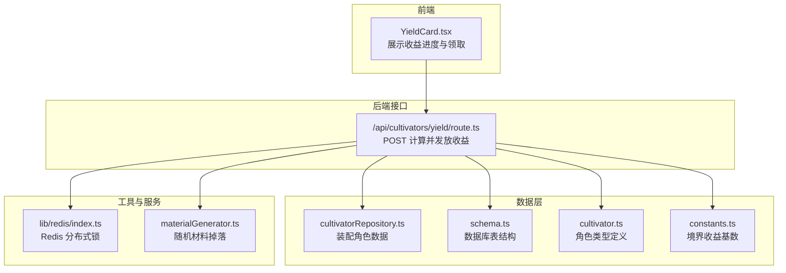
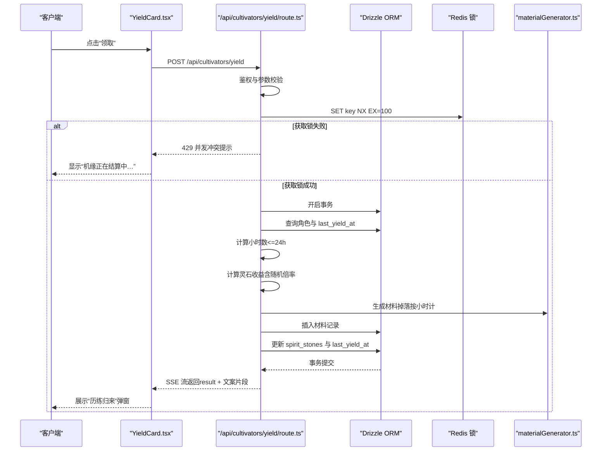
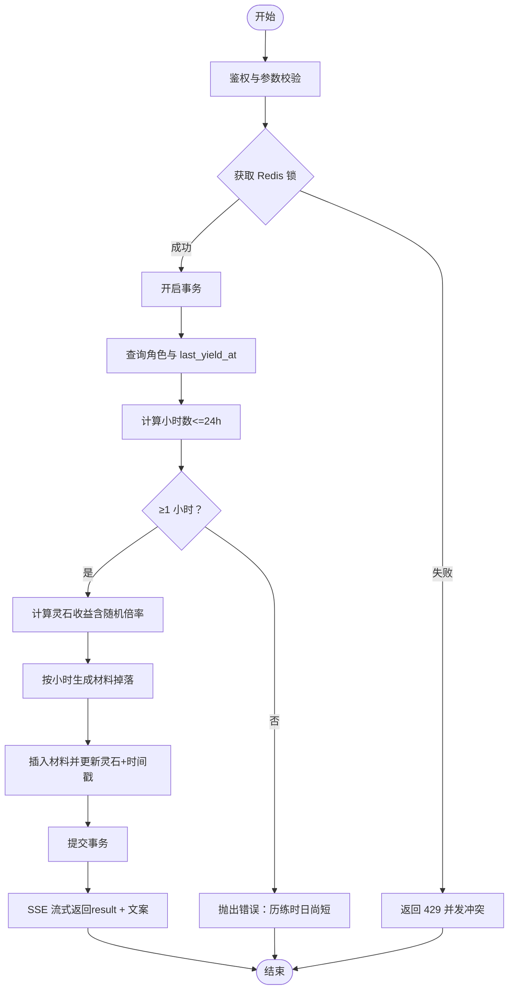
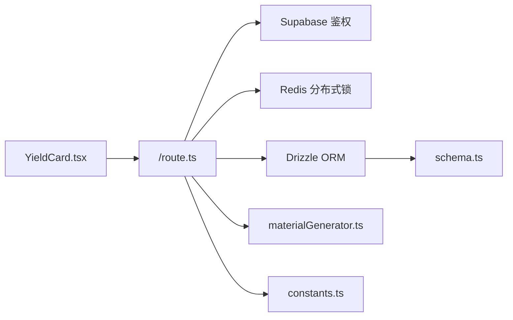

# 产出收益

<cite>
**本文引用的文件列表**
- [app/api/cultivators/yield/route.ts](file://app/api/cultivators/yield/route.ts)
- [lib/repositories/cultivatorRepository.ts](file://lib/repositories/cultivatorRepository.ts)
- [types/cultivator.ts](file://types/cultivator.ts)
- [lib/drizzle/schema.ts](file://lib/drizzle/schema.ts)
- [types/constants.ts](file://types/constants.ts)
- [utils/materialGenerator.ts](file://utils/materialGenerator.ts)
- [lib/redis/index.ts](file://lib/redis/index.ts)
- [components/YieldCard.tsx](file://components/YieldCard.tsx)
</cite>

## 目录
1. [简介](#简介)
2. [项目结构](#项目结构)
3. [核心组件](#核心组件)
4. [架构总览](#架构总览)
5. [详细组件分析](#详细组件分析)
6. [依赖关系分析](#依赖关系分析)
7. [性能考量](#性能考量)
8. [故障排查指南](#故障排查指南)
9. [结论](#结论)

## 简介
本文件围绕“产出收益”功能，详细说明角色如何通过接口 /api/cultivators/yield 实现灵石等资源的产出与领取。文档重点覆盖以下方面：
- 通过 last_yield_at 时间戳计算收益周期，实现冷却与防刷策略
- 收益与角色状态、在线时长的关联逻辑
- 前端界面如何展示收益进度与领取流程
- 异常情况（收益未到账、重复领取、并发冲突等）的处理方案

## 项目结构
与“产出收益”直接相关的模块包括：
- 后端接口层：/app/api/cultivators/yield/route.ts
- 数据访问层：lib/repositories/cultivatorRepository.ts、lib/drizzle/schema.ts
- 类型与常量：types/cultivator.ts、types/constants.ts
- 工具与AI：utils/materialGenerator.ts、lib/redis/index.ts
- 前端展示：components/YieldCard.tsx

图表来源
- [app/api/cultivators/yield/route.ts](file://app/api/cultivators/yield/route.ts#L1-L207)
- [lib/repositories/cultivatorRepository.ts](file://lib/repositories/cultivatorRepository.ts#L1-L177)
- [lib/drizzle/schema.ts](file://lib/drizzle/schema.ts#L16-L54)
- [types/cultivator.ts](file://types/cultivator.ts#L218-L252)
- [types/constants.ts](file://types/constants.ts#L166-L191)
- [utils/materialGenerator.ts](file://utils/materialGenerator.ts#L1-L193)
- [lib/redis/index.ts](file://lib/redis/index.ts#L1-L6)

章节来源
- [app/api/cultivators/yield/route.ts](file://app/api/cultivators/yield/route.ts#L1-L207)
- [lib/repositories/cultivatorRepository.ts](file://lib/repositories/cultivatorRepository.ts#L1-L177)
- [lib/drizzle/schema.ts](file://lib/drizzle/schema.ts#L16-L54)
- [types/cultivator.ts](file://types/cultivator.ts#L218-L252)
- [types/constants.ts](file://types/constants.ts#L166-L191)
- [utils/materialGenerator.ts](file://utils/materialGenerator.ts#L1-L193)
- [lib/redis/index.ts](file://lib/redis/index.ts#L1-L6)

## 核心组件
- 后端接口：负责鉴权、并发控制、收益计算、材料掉落、数据库更新与流式返回
- 数据模型：角色实体包含 spirit_stones、last_yield_at 等关键字段
- 常量配置：REALM_YIELD_RATES 定义不同境界的收益基数
- 材料生成：基于概率分布的结构化材料生成器
- 前端卡片：展示收益进度、触发领取、接收流式结果

章节来源
- [app/api/cultivators/yield/route.ts](file://app/api/cultivators/yield/route.ts#L1-L207)
- [types/cultivator.ts](file://types/cultivator.ts#L218-L252)
- [types/constants.ts](file://types/constants.ts#L166-L191)
- [utils/materialGenerator.ts](file://utils/materialGenerator.ts#L1-L193)
- [components/YieldCard.tsx](file://components/YieldCard.tsx#L1-L202)

## 架构总览
后端接口采用事务保证原子性，使用 Redis 分布式锁防止并发重复领取；收益计算以 last_yield_at 为基准，按小时累计并限制最大 24 小时；材料掉落通过结构化 AI 生成并入库；最终通过 Server-Sent Events 流式返回结果与故事片段。

图表来源
- [app/api/cultivators/yield/route.ts](file://app/api/cultivators/yield/route.ts#L15-L207)
- [lib/redis/index.ts](file://lib/redis/index.ts#L1-L6)
- [utils/materialGenerator.ts](file://utils/materialGenerator.ts#L85-L193)
- [lib/drizzle/schema.ts](file://lib/drizzle/schema.ts#L16-L54)

## 详细组件分析

### 后端接口：/api/cultivators/yield/route.ts
- 鉴权与参数校验
  - 通过 Supabase 获取当前用户，未登录返回 401
  - 校验请求体包含 cultivatorId，缺失返回 400
- 并发控制与防刷
  - 使用 Redis SET key NX EX=100 获取分布式锁，避免同一角色并发领取导致重复计数
  - 获取失败返回 429，并提示“机缘正在结算中…”
- 收益计算与发放
  - 读取角色 last_yield_at，若为空则回退到 createdAt
  - 计算小时差，上限 24 小时；不足 1 小时抛错，防止频繁领取
  - 基于 REALM_YIELD_RATES 与随机倍率计算灵石收益
  - 按每 3 小时 1 份材料的频率生成掉落，结构化 AI 输出并入库
  - 事务内原子更新 spirit_stones 与 last_yield_at
- 流式响应
  - 先发送 result（包含 amount、hours、materials 等），再持续推送 AI 生成的故事片段
  - 发生错误时发送 type='error'，最后关闭流并释放锁

图表来源
- [app/api/cultivators/yield/route.ts](file://app/api/cultivators/yield/route.ts#L15-L207)
- [types/constants.ts](file://types/constants.ts#L166-L191)
- [utils/materialGenerator.ts](file://utils/materialGenerator.ts#L85-L193)
- [lib/drizzle/schema.ts](file://lib/drizzle/schema.ts#L16-L54)

章节来源
- [app/api/cultivators/yield/route.ts](file://app/api/cultivators/yield/route.ts#L15-L207)

### 数据模型与数据库映射：types/cultivator.ts 与 lib/drizzle/schema.ts
- 角色类型
  - 包含 spirit_stones、last_yield_at 等字段，用于收益计算与展示
- 数据库表
  - wanjiedaoyou_cultivators 表包含 spirit_stones、last_yield_at、createdAt 等列
  - materials 表存储掉落材料，与角色一对一关联

章节来源
- [types/cultivator.ts](file://types/cultivator.ts#L218-L252)
- [lib/drizzle/schema.ts](file://lib/drizzle/schema.ts#L16-L54)
- [lib/drizzle/schema.ts](file://lib/drizzle/schema.ts#L121-L134)

### 收益计算与掉落：types/constants.ts 与 utils/materialGenerator.ts
- 收益基数
  - REALM_YIELD_RATES 为各境界每小时的收益基数，用于计算总收益
- 材料掉落
  - 按小时数除以 3 得到掉落次数，使用结构化 AI 生成材料，严格遵循品质分布概率
  - 生成的材料写入 materials 表，供后续查看

章节来源
- [types/constants.ts](file://types/constants.ts#L166-L191)
- [utils/materialGenerator.ts](file://utils/materialGenerator.ts#L1-L193)

### 前端展示：components/YieldCard.tsx
- 进度展示
  - 基于 last_yield_at 计算已历练小时数，上限 24 小时，超过显示“已满”
- 领取流程
  - 点击“领取”调用 /api/cultivators/yield，使用 SSE 逐步接收 result 与故事片段
  - 成功后弹出“历练归来”弹窗，展示灵石与材料掉落
- 并发保护
  - 在领取过程中禁用按钮，避免重复点击

章节来源
- [components/YieldCard.tsx](file://components/YieldCard.tsx#L1-L202)

## 依赖关系分析
- 接口层依赖
  - 鉴权：Supabase
  - 缓存：Redis（分布式锁）
  - 数据库：Drizzle ORM + schema.ts
  - AI：materialGenerator.ts（结构化输出）
- 类型与常量
  - REALM_YIELD_RATES 与 RealmType 定义收益基数
- 前端依赖
  - YieldCard.tsx 依赖接口返回的 SSE 结果，渲染 UI

图表来源
- [app/api/cultivators/yield/route.ts](file://app/api/cultivators/yield/route.ts#L1-L207)
- [lib/redis/index.ts](file://lib/redis/index.ts#L1-L6)
- [lib/drizzle/schema.ts](file://lib/drizzle/schema.ts#L16-L54)
- [types/constants.ts](file://types/constants.ts#L166-L191)
- [utils/materialGenerator.ts](file://utils/materialGenerator.ts#L1-L193)
- [components/YieldCard.tsx](file://components/YieldCard.tsx#L1-L202)

章节来源
- [app/api/cultivators/yield/route.ts](file://app/api/cultivators/yield/route.ts#L1-L207)
- [lib/redis/index.ts](file://lib/redis/index.ts#L1-L6)
- [lib/drizzle/schema.ts](file://lib/drizzle/schema.ts#L16-L54)
- [types/constants.ts](file://types/constants.ts#L166-L191)
- [utils/materialGenerator.ts](file://utils/materialGenerator.ts#L1-L193)
- [components/YieldCard.tsx](file://components/YieldCard.tsx#L1-L202)

## 性能考量
- 事务原子性：收益计算与更新在单事务内完成，避免中间态
- Redis 锁：100 秒过期，兼顾并发控制与吞吐
- 材料生成：结构化 AI 输出，按需生成，避免无谓计算
- 前端流式渲染：SSE 分块传输，降低首屏等待

[本节为通用建议，无需特定文件引用]

## 故障排查指南
- 领取返回 401 未登录
  - 确认已登录并通过 Supabase 鉴权
  - 参考路径：[鉴权与参数校验](file://app/api/cultivators/yield/route.ts#L15-L36)
- 领取返回 400 参数缺失
  - 请求体需包含 cultivatorId
  - 参考路径：[参数校验](file://app/api/cultivators/yield/route.ts#L29-L36)
- 领取返回 429 并发冲突
  - 可能存在其他进程正在结算，稍后再试
  - 参考路径：[Redis 分布式锁](file://app/api/cultivators/yield/route.ts#L38-L47)
- 领取返回“历练时日尚短（不足一小时）”
  - 至少需要 1 小时才能领取
  - 参考路径：[收益时间阈值](file://app/api/cultivators/yield/route.ts#L75-L77)
- 领取后灵石未到账
  - 检查 last_yield_at 是否更新，确认事务是否提交
  - 参考路径：[更新逻辑](file://app/api/cultivators/yield/route.ts#L109-L117)
- 材料未到账
  - 检查材料掉落是否按小时计算（每 3 小时 1 份）
  - 参考路径：[掉落生成](file://app/api/cultivators/yield/route.ts#L86-L108)
- 前端未显示故事片段
  - 确认 SSE 流是否正常接收，检查浏览器网络面板
  - 参考路径：[SSE 流式返回](file://app/api/cultivators/yield/route.ts#L129-L190)
- 前端“历练归来”弹窗未出现
  - 检查前端是否正确解析 result 与 chunk
  - 参考路径：[前端解析逻辑](file://components/YieldCard.tsx#L46-L95)

章节来源
- [app/api/cultivators/yield/route.ts](file://app/api/cultivators/yield/route.ts#L15-L207)
- [components/YieldCard.tsx](file://components/YieldCard.tsx#L1-L202)

## 结论
“产出收益”功能通过 last_yield_at 时间戳与 Redis 分布式锁实现了可靠的收益冷却与防刷机制；结合 REALM_YIELD_RATES 与随机倍率，确保收益随境界与时间线性增长；材料掉落通过结构化 AI 生成，既保证了多样性又满足概率约束。前端以 SSE 流式渲染带来沉浸体验，整体具备良好的一致性与可维护性。