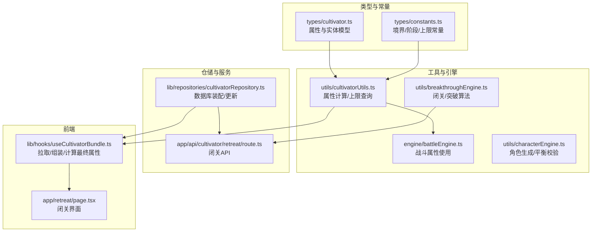
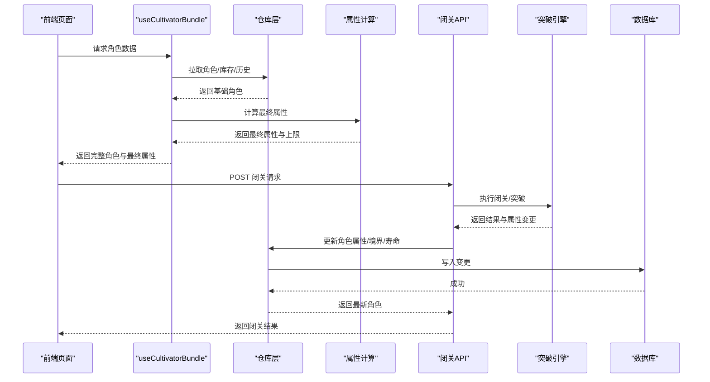
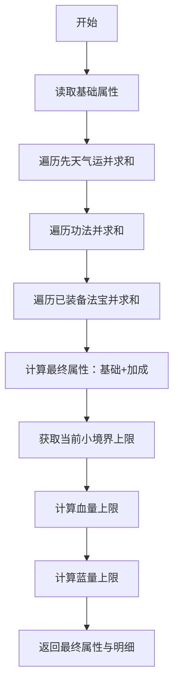
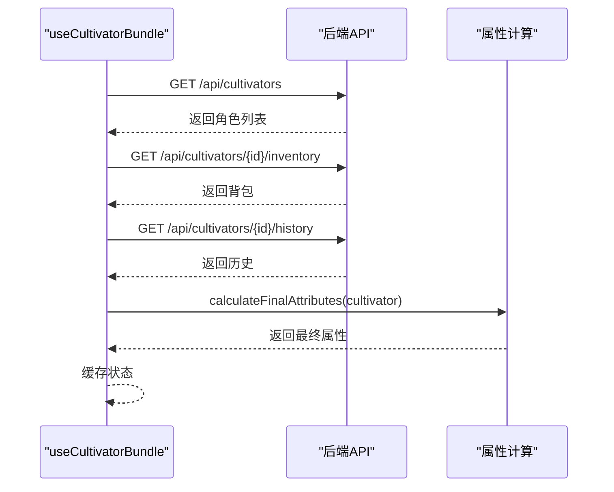
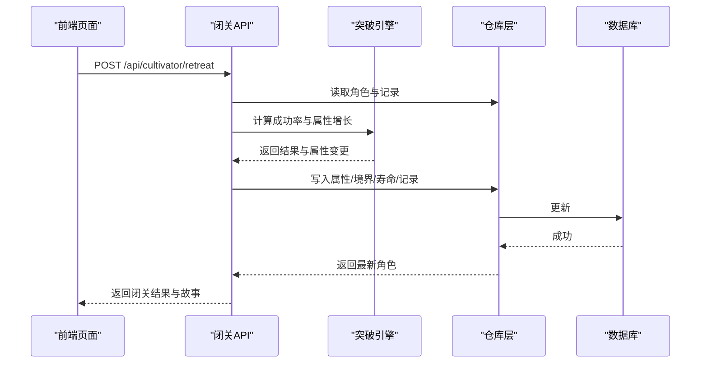
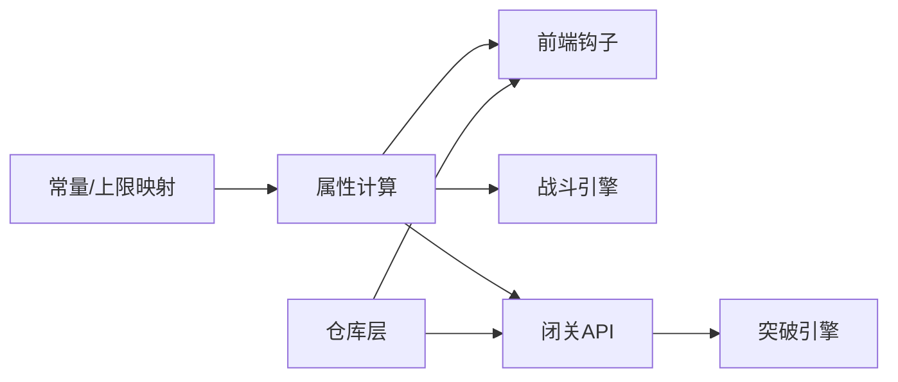

# 属性管理

<cite>
**本文引用的文件列表**
- [types/cultivator.ts](file://types/cultivator.ts)
- [types/constants.ts](file://types/constants.ts)
- [lib/repositories/cultivatorRepository.ts](file://lib/repositories/cultivatorRepository.ts)
- [lib/hooks/useCultivatorBundle.ts](file://lib/hooks/useCultivatorBundle.ts)
- [utils/cultivatorUtils.ts](file://utils/cultivatorUtils.ts)
- [utils/breakthroughEngine.ts](file://utils/breakthroughEngine.ts)
- [app/api/cultivator/retreat/route.ts](file://app/api/cultivator/retreat/route.ts)
- [engine/battleEngine.ts](file://engine/battleEngine.ts)
- [utils/characterEngine.ts](file://utils/characterEngine.ts)
- [app/retreat/page.tsx](file://app/retreat/page.tsx)
</cite>

## 目录
1. [简介](#简介)
2. [项目结构与定位](#项目结构与定位)
3. [核心组件](#核心组件)
4. [架构概览](#架构概览)
5. [详细组件分析](#详细组件分析)
6. [依赖关系分析](#依赖关系分析)
7. [性能考量](#性能考量)
8. [故障排查指南](#故障排查指南)
9. [结论](#结论)

## 简介
本章节系统化阐述修仙游戏中“属性管理”的完整闭环：从角色基础属性（体魄、灵力、悟性、速度、神识）的定义与计算，到持久化与读取，再到战斗与突破等系统中的使用方式。重点覆盖以下内容：
- 属性定义与数据模型
- 属性计算链路（基础属性、先天气运、功法、装备）
- 持久化与读取（数据库到前端的组装）
- 战斗系统中的属性使用
- 突破与闭关的属性变更与上限控制
- 常见问题与调试方法

## 项目结构与定位
属性管理贯穿多个层次：
- 类型与常量层：定义属性字段、境界阶段上限、枚举类型
- 工具与引擎层：属性计算、突破算法、战斗引擎
- 仓储与服务层：数据库读写、装配完整角色对象
- 前端钩子与页面：拉取数据、计算最终属性、展示结果

图表来源
- [types/cultivator.ts](file://types/cultivator.ts#L20-L120)
- [types/constants.ts](file://types/constants.ts#L54-L83)
- [utils/cultivatorUtils.ts](file://utils/cultivatorUtils.ts#L12-L32)
- [utils/breakthroughEngine.ts](file://utils/breakthroughEngine.ts#L1-L40)
- [engine/battleEngine.ts](file://engine/battleEngine.ts#L1-L40)
- [lib/repositories/cultivatorRepository.ts](file://lib/repositories/cultivatorRepository.ts#L22-L177)
- [lib/hooks/useCultivatorBundle.ts](file://lib/hooks/useCultivatorBundle.ts#L175-L291)
- [app/api/cultivator/retreat/route.ts](file://app/api/cultivator/retreat/route.ts#L1-L60)
- [app/retreat/page.tsx](file://app/retreat/page.tsx#L41-L89)

章节来源
- [types/cultivator.ts](file://types/cultivator.ts#L20-L120)
- [types/constants.ts](file://types/constants.ts#L54-L83)
- [lib/repositories/cultivatorRepository.ts](file://lib/repositories/cultivatorRepository.ts#L22-L177)
- [lib/hooks/useCultivatorBundle.ts](file://lib/hooks/useCultivatorBundle.ts#L175-L291)
- [utils/cultivatorUtils.ts](file://utils/cultivatorUtils.ts#L12-L32)
- [utils/breakthroughEngine.ts](file://utils/breakthroughEngine.ts#L1-L40)
- [engine/battleEngine.ts](file://engine/battleEngine.ts#L1-L40)
- [app/api/cultivator/retreat/route.ts](file://app/api/cultivator/retreat/route.ts#L1-L60)
- [app/retreat/page.tsx](file://app/retreat/page.tsx#L41-L89)

## 核心组件
- 属性接口与实体模型：定义基础属性、功法、装备、先天气运等字段与关系
- 常量与上限：按境界与阶段定义属性上限映射
- 属性计算：汇总基础属性、先天气运、功法、装备加成，输出最终属性与上限
- 数据持久化：从数据库读取并组装完整角色对象，支持更新
- 前端钩子：拉取角色、库存、历史，计算最终属性并缓存
- 战斗引擎：在战斗中使用最终属性计算伤害、减伤、暴击等
- 突破引擎：闭关/突破算法，按悟性、闭关年限、失败连败修正等综合计算成功率，更新属性与寿命

章节来源
- [types/cultivator.ts](file://types/cultivator.ts#L20-L120)
- [types/constants.ts](file://types/constants.ts#L54-L83)
- [utils/cultivatorUtils.ts](file://utils/cultivatorUtils.ts#L34-L198)
- [lib/repositories/cultivatorRepository.ts](file://lib/repositories/cultivatorRepository.ts#L22-L177)
- [lib/hooks/useCultivatorBundle.ts](file://lib/hooks/useCultivatorBundle.ts#L175-L291)
- [engine/battleEngine.ts](file://engine/battleEngine.ts#L124-L205)
- [utils/breakthroughEngine.ts](file://utils/breakthroughEngine.ts#L82-L233)

## 架构概览
属性管理的调用链路如下：
- 前端通过钩子拉取角色与数据，调用属性计算函数得到最终属性
- 战斗引擎在回合内使用最终属性进行伤害、减伤、暴击等计算
- 闭关API触发突破引擎，按悟性、闭关年限、失败连败等修正计算成功率，更新属性与寿命
- 仓储层负责数据库读取与更新，装配完整角色对象

图表来源
- [lib/hooks/useCultivatorBundle.ts](file://lib/hooks/useCultivatorBundle.ts#L175-L291)
- [utils/cultivatorUtils.ts](file://utils/cultivatorUtils.ts#L34-L198)
- [app/api/cultivator/retreat/route.ts](file://app/api/cultivator/retreat/route.ts#L1-L179)
- [utils/breakthroughEngine.ts](file://utils/breakthroughEngine.ts#L119-L233)
- [lib/repositories/cultivatorRepository.ts](file://lib/repositories/cultivatorRepository.ts#L583-L652)

## 详细组件分析

### 属性定义与数据模型
- 基础属性：体魄、灵力、悟性、速度、神识
- 先天气运：对各属性提供加成或减成
- 功法：被动加成，要求境界
- 装备：按槽位提供属性加成与特殊效果
- 角色实体：包含属性、灵根、功法、技能、库存、已装备等

章节来源
- [types/cultivator.ts](file://types/cultivator.ts#L20-L120)
- [types/cultivator.ts](file://types/cultivator.ts#L172-L210)

### 属性上限与平衡
- 常量层定义各境界阶段的属性上限映射
- 属性计算时使用当前小境界上限，不在战斗过程中暴力裁剪
- 角色生成/平衡阶段使用上限进行约束与调整

章节来源
- [types/constants.ts](file://types/constants.ts#L54-L83)
- [utils/cultivatorUtils.ts](file://utils/cultivatorUtils.ts#L12-L32)
- [utils/characterEngine.ts](file://utils/characterEngine.ts#L272-L313)

### 属性计算链路（最终属性）
- 基础属性：来自角色基础属性
- 先天气运：对各属性求和
- 功法：对各属性求和（满足境界要求）
- 装备：按已装备的法宝对各属性求和
- 最终属性：基础 + 先天气运 + 功法 + 装备
- 上限：取当前小境界上限
- 血量/蓝量：基于最终属性推导

图表来源
- [utils/cultivatorUtils.ts](file://utils/cultivatorUtils.ts#L34-L198)

章节来源
- [utils/cultivatorUtils.ts](file://utils/cultivatorUtils.ts#L34-L198)

### 数据库读取与组装（持久化）
- 仓库层将主表与多张关联表并行读取，组装为完整角色对象
- 主表包含基础属性字段，关联表包含灵根、功法、技能、装备状态等
- 更新时将最终属性写回主表对应字段

章节来源
- [lib/repositories/cultivatorRepository.ts](file://lib/repositories/cultivatorRepository.ts#L22-L177)
- [lib/repositories/cultivatorRepository.ts](file://lib/repositories/cultivatorRepository.ts#L583-L652)

### 前端调用链与最终属性计算
- 钩子在加载角色后，调用属性计算函数，得到最终属性与上限
- 并行拉取背包与历史，再合并到完整角色对象
- 缓存策略：模块级缓存，用户切换时保持数据

图表来源
- [lib/hooks/useCultivatorBundle.ts](file://lib/hooks/useCultivatorBundle.ts#L175-L291)
- [utils/cultivatorUtils.ts](file://utils/cultivatorUtils.ts#L34-L198)

章节来源
- [lib/hooks/useCultivatorBundle.ts](file://lib/hooks/useCultivatorBundle.ts#L175-L291)

### 战斗系统中的属性使用
- 减伤：基于最终体魄计算
- 暴击率：基于最终悟性计算
- 法术伤害：基于最终灵力与法术基础威力
- 法宝伤害加成：按元素与特效计算
- DOT伤害：基于目标最终体魄与施法者灵力

章节来源
- [engine/battleEngine.ts](file://engine/battleEngine.ts#L124-L205)
- [engine/battleEngine.ts](file://engine/battleEngine.ts#L365-L392)

### 闭关与突破（属性变更）
- 闭关API：校验用户、角色、寿元、冷却时间，执行闭关/突破
- 成功率：基础概率 ×（1 + 悟性修正 + 闭关年限修正 + 失败连败修正 + 难度修正）
- 成功后：按上限裁剪与随机区间增长属性，更新境界、寿命、记录
- 失败：消耗年限，若寿元耗尽则角色死亡

图表来源
- [app/api/cultivator/retreat/route.ts](file://app/api/cultivator/retreat/route.ts#L1-L179)
- [utils/breakthroughEngine.ts](file://utils/breakthroughEngine.ts#L119-L233)
- [lib/repositories/cultivatorRepository.ts](file://lib/repositories/cultivatorRepository.ts#L583-L652)

章节来源
- [app/api/cultivator/retreat/route.ts](file://app/api/cultivator/retreat/route.ts#L1-L179)
- [utils/breakthroughEngine.ts](file://utils/breakthroughEngine.ts#L82-L233)

### 属性上限与境界的关系
- 每个小境界（初期/中期/后期/圆满）有独立上限
- 突破前的“圆满”阶段与“后期”共享上限，用于瓶颈
- 属性计算时以当前小境界上限为准，避免战斗过程中的暴力裁剪

章节来源
- [types/constants.ts](file://types/constants.ts#L54-L83)
- [utils/cultivatorUtils.ts](file://utils/cultivatorUtils.ts#L12-L32)

## 依赖关系分析
- 属性计算依赖常量层的上限映射
- 前端钩子依赖属性计算函数
- 战斗引擎依赖属性计算函数
- 闭关API依赖突破引擎与仓库层
- 仓库层依赖数据库schema与常量层

图表来源
- [types/constants.ts](file://types/constants.ts#L54-L83)
- [utils/cultivatorUtils.ts](file://utils/cultivatorUtils.ts#L34-L198)
- [lib/hooks/useCultivatorBundle.ts](file://lib/hooks/useCultivatorBundle.ts#L175-L291)
- [engine/battleEngine.ts](file://engine/battleEngine.ts#L1-L40)
- [app/api/cultivator/retreat/route.ts](file://app/api/cultivator/retreat/route.ts#L1-L60)
- [utils/breakthroughEngine.ts](file://utils/breakthroughEngine.ts#L119-L233)
- [lib/repositories/cultivatorRepository.ts](file://lib/repositories/cultivatorRepository.ts#L22-L177)

章节来源
- [types/constants.ts](file://types/constants.ts#L54-L83)
- [utils/cultivatorUtils.ts](file://utils/cultivatorUtils.ts#L34-L198)
- [lib/hooks/useCultivatorBundle.ts](file://lib/hooks/useCultivatorBundle.ts#L175-L291)
- [engine/battleEngine.ts](file://engine/battleEngine.ts#L1-L40)
- [app/api/cultivator/retreat/route.ts](file://app/api/cultivator/retreat/route.ts#L1-L60)
- [utils/breakthroughEngine.ts](file://utils/breakthroughEngine.ts#L119-L233)
- [lib/repositories/cultivatorRepository.ts](file://lib/repositories/cultivatorRepository.ts#L22-L177)

## 性能考量
- 并行读取：仓库层对关联表采用并行查询，减少RTT
- 前端缓存：模块级缓存避免重复拉取，提升交互流畅度
- 计算复杂度：属性计算为O(N)（N为功法/装备数量），开销可控
- 战斗计算：使用最终属性，避免重复计算

[本节为通用指导，无需列出章节来源]

## 故障排查指南
- 属性不同步
  - 检查仓库层更新是否写入主表对应字段
  - 确认前端钩子是否在更新后重新计算最终属性
  - 参考路径：[lib/repositories/cultivatorRepository.ts](file://lib/repositories/cultivatorRepository.ts#L583-L652)，[lib/hooks/useCultivatorBundle.ts](file://lib/hooks/useCultivatorBundle.ts#L175-L291)
- 计算错误
  - 确认当前小境界上限是否正确
  - 检查功法/先天气运/装备加成是否正确累加
  - 参考路径：[utils/cultivatorUtils.ts](file://utils/cultivatorUtils.ts#L34-L198)，[types/constants.ts](file://types/constants.ts#L54-L83)
- 战斗异常
  - 检查最终属性是否传入战斗引擎
  - 核对减伤、暴击、DOT等公式使用的属性字段
  - 参考路径：[engine/battleEngine.ts](file://engine/battleEngine.ts#L124-L205)，[engine/battleEngine.ts](file://engine/battleEngine.ts#L365-L392)
- 闭关/突破失败
  - 校验寿元、冷却时间、参数范围
  - 查看闭关API返回的错误信息与故事生成日志
  - 参考路径：[app/api/cultivator/retreat/route.ts](file://app/api/cultivator/retreat/route.ts#L1-L179)，[utils/breakthroughEngine.ts](file://utils/breakthroughEngine.ts#L119-L233)

章节来源
- [lib/repositories/cultivatorRepository.ts](file://lib/repositories/cultivatorRepository.ts#L583-L652)
- [lib/hooks/useCultivatorBundle.ts](file://lib/hooks/useCultivatorBundle.ts#L175-L291)
- [utils/cultivatorUtils.ts](file://utils/cultivatorUtils.ts#L34-L198)
- [engine/battleEngine.ts](file://engine/battleEngine.ts#L124-L205)
- [app/api/cultivator/retreat/route.ts](file://app/api/cultivator/retreat/route.ts#L1-L179)
- [utils/breakthroughEngine.ts](file://utils/breakthroughEngine.ts#L119-L233)

## 结论
属性管理在本项目中形成了清晰的分层与闭环：类型与常量定义边界，工具层统一计算，仓储层负责持久化，前端钩子负责装配与展示，战斗与突破引擎消费最终属性。通过小境界上限与平衡校验，既保证了成长曲线的合理性，也避免了战斗过程中的过度裁剪。建议在后续迭代中：
- 明确“悟性”在突破中的作用与表现
- 完善属性上限与成长的可视化提示
- 加强闭关/突破故事生成的稳定性与可配置性

[本节为总结性内容，无需列出章节来源]