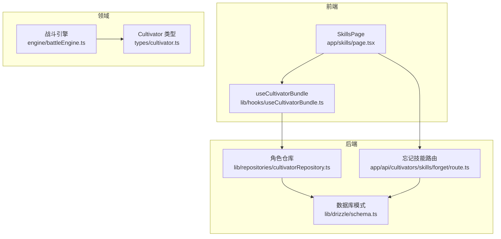
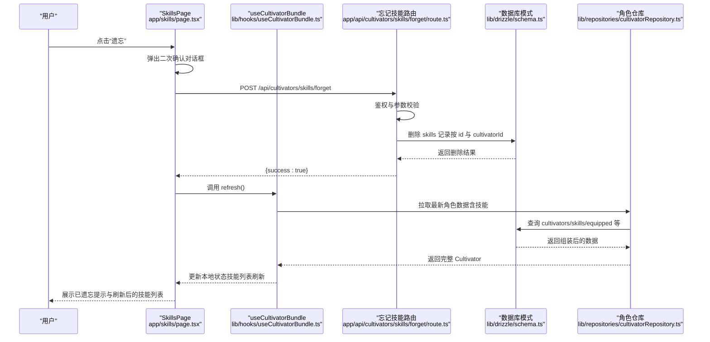
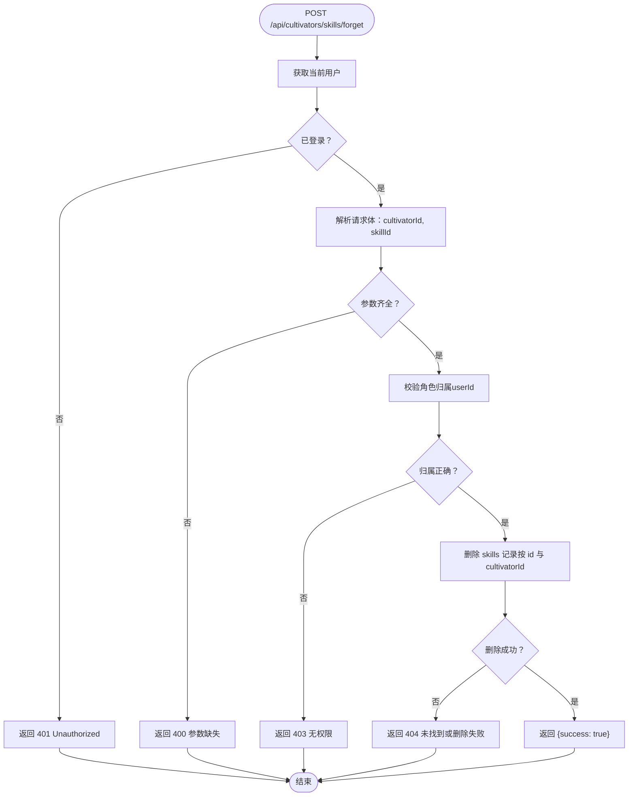
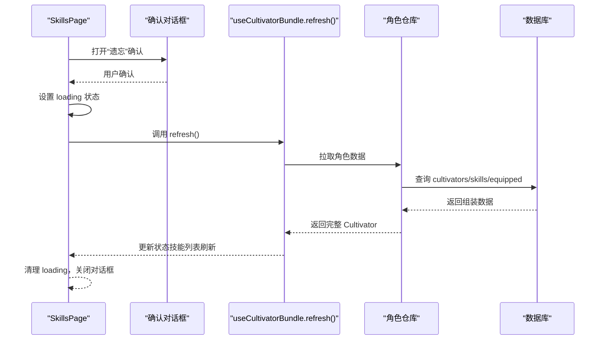
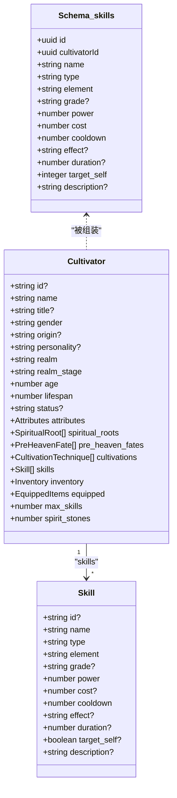
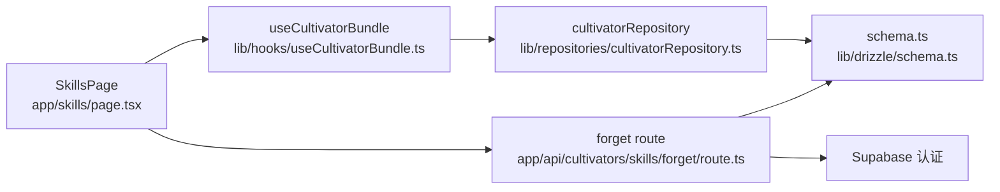

# 技能遗忘

<cite>
**本文引用的文件**
- [app/api/cultivators/skills/forget/route.ts](file://app/api/cultivators/skills/forget/route.ts)
- [app/skills/page.tsx](file://app/skills/page.tsx)
- [lib/repositories/cultivatorRepository.ts](file://lib/repositories/cultivatorRepository.ts)
- [lib/hooks/useCultivatorBundle.ts](file://lib/hooks/useCultivatorBundle.ts)
- [lib/drizzle/schema.ts](file://lib/drizzle/schema.ts)
- [types/cultivator.ts](file://types/cultivator.ts)
- [utils/cultivatorUtils.ts](file://utils/cultivatorUtils.ts)
- [engine/battleEngine.ts](file://engine/battleEngine.ts)
</cite>

## 目录
1. [简介](#简介)
2. [项目结构](#项目结构)
3. [核心组件](#核心组件)
4. [架构总览](#架构总览)
5. [详细组件分析](#详细组件分析)
6. [依赖关系分析](#依赖关系分析)
7. [性能考量](#性能考量)
8. [故障排查指南](#故障排查指南)
9. [结论](#结论)

## 简介
本篇文档围绕“技能遗忘”能力，详细说明如何通过后端路由移除角色已掌握的技能，并解释该操作对角色战力的影响、前端确认交互设计，以及数据库同步逻辑与刷新机制。读者将了解：
- 如何调用 /api/cultivators/skills/forget 路由完成技能删除
- 技能列表在前端如何刷新与展示
- 技能删除后对战斗引擎计算战力的影响
- 常见问题的调试方法与最佳实践

## 项目结构
与“技能遗忘”相关的前后端关键文件分布如下：
- 前端页面与交互：app/skills/page.tsx
- 前端数据钩子：lib/hooks/useCultivatorBundle.ts
- 后端路由：app/api/cultivators/skills/forget/route.ts
- 数据模型与仓库：types/cultivator.ts、lib/repositories/cultivatorRepository.ts
- 数据库模式：lib/drizzle/schema.ts
- 战斗引擎：engine/battleEngine.ts

图表来源
- [app/skills/page.tsx](file://app/skills/page.tsx#L1-L120)
- [lib/hooks/useCultivatorBundle.ts](file://lib/hooks/useCultivatorBundle.ts#L1-L120)
- [app/api/cultivators/skills/forget/route.ts](file://app/api/cultivators/skills/forget/route.ts#L1-L63)
- [lib/drizzle/schema.ts](file://lib/drizzle/schema.ts#L98-L118)
- [lib/repositories/cultivatorRepository.ts](file://lib/repositories/cultivatorRepository.ts#L22-L110)
- [types/cultivator.ts](file://types/cultivator.ts#L88-L102)
- [engine/battleEngine.ts](file://engine/battleEngine.ts#L518-L803)

章节来源
- [app/skills/page.tsx](file://app/skills/page.tsx#L1-L120)
- [lib/hooks/useCultivatorBundle.ts](file://lib/hooks/useCultivatorBundle.ts#L1-L120)
- [app/api/cultivators/skills/forget/route.ts](file://app/api/cultivators/skills/forget/route.ts#L1-L63)
- [lib/drizzle/schema.ts](file://lib/drizzle/schema.ts#L98-L118)
- [lib/repositories/cultivatorRepository.ts](file://lib/repositories/cultivatorRepository.ts#L22-L110)
- [types/cultivator.ts](file://types/cultivator.ts#L88-L102)
- [engine/battleEngine.ts](file://engine/battleEngine.ts#L518-L803)

## 核心组件
- 忘记技能路由：负责鉴权、参数校验、所有权校验与删除操作，返回成功或错误响应。
- 技能页面：提供“遗忘”按钮与二次确认对话框，调用后端路由并刷新技能列表。
- 数据仓库：组装角色完整数据，包括技能列表；前端通过钩子拉取最新数据。
- 数据库模式：定义 skills 表结构与外键约束，确保删除级联行为。
- 类型定义：Skill 接口描述技能字段，用于前端渲染与后端校验。
- 战斗引擎：在战斗中根据角色最终属性计算战力，技能删除会影响最终属性。

章节来源
- [app/api/cultivators/skills/forget/route.ts](file://app/api/cultivators/skills/forget/route.ts#L1-L63)
- [app/skills/page.tsx](file://app/skills/page.tsx#L1-L120)
- [lib/repositories/cultivatorRepository.ts](file://lib/repositories/cultivatorRepository.ts#L22-L110)
- [lib/drizzle/schema.ts](file://lib/drizzle/schema.ts#L98-L118)
- [types/cultivator.ts](file://types/cultivator.ts#L88-L102)
- [engine/battleEngine.ts](file://engine/battleEngine.ts#L518-L803)

## 架构总览
下面以序列图展示“技能遗忘”的端到端流程。

图表来源
- [app/skills/page.tsx](file://app/skills/page.tsx#L31-L104)
- [app/api/cultivators/skills/forget/route.ts](file://app/api/cultivators/skills/forget/route.ts#L7-L63)
- [lib/repositories/cultivatorRepository.ts](file://lib/repositories/cultivatorRepository.ts#L22-L110)
- [lib/drizzle/schema.ts](file://lib/drizzle/schema.ts#L98-L118)

## 详细组件分析

### 后端路由：技能删除
- 鉴权：通过 Supabase 获取当前用户，未登录返回 401。
- 参数校验：要求提供 cultivatorId 与 skillId，缺失则返回 400。
- 所有权校验：查询角色表，确保该角色属于当前用户，否则返回 403。
- 删除执行：按 id 与 cultivatorId 删除 skills 表记录，返回 404 若未找到。
- 错误处理：捕获异常并返回 500。

图表来源
- [app/api/cultivators/skills/forget/route.ts](file://app/api/cultivators/skills/forget/route.ts#L7-L63)

章节来源
- [app/api/cultivators/skills/forget/route.ts](file://app/api/cultivators/skills/forget/route.ts#L7-L63)

### 前端交互：确认与刷新
- 确认弹窗：SkillsPage 在用户点击“遗忘”后弹出二次确认对话框，防止误操作。
- 发起请求：向 /api/cultivators/skills/forget 发送 POST，携带 cultivatorId 与 skillId。
- 成功反馈：显示 Toast 提示“已将某神通遗忘”。
- 刷新数据：调用 refresh() 重新拉取角色数据，使技能列表即时更新。

图表来源
- [app/skills/page.tsx](file://app/skills/page.tsx#L31-L104)
- [lib/hooks/useCultivatorBundle.ts](file://lib/hooks/useCultivatorBundle.ts#L175-L291)
- [lib/repositories/cultivatorRepository.ts](file://lib/repositories/cultivatorRepository.ts#L22-L110)

章节来源
- [app/skills/page.tsx](file://app/skills/page.tsx#L31-L104)
- [lib/hooks/useCultivatorBundle.ts](file://lib/hooks/useCultivatorBundle.ts#L175-L291)

### 数据模型与数据库同步
- Skill 类型：定义技能字段（名称、类型、元素、等级、威力、冷却、消耗、效果等）。
- 数据库模式：skills 表包含 id、cultivatorId、name、type、element、power、cooldown、effect、target_self、description 等字段；外键指向 cultivators 表。
- 仓库组装：assembleCultivator 并行查询 skills 等关联表，组装为完整的 Cultivator 对象，其中 skills 字段即为技能列表。
- 删除同步：后端删除 skills 记录后，前端 refresh() 重新拉取，仓库再次查询 skills，从而实现 UI 与数据库的一致。

图表来源
- [types/cultivator.ts](file://types/cultivator.ts#L88-L102)
- [lib/drizzle/schema.ts](file://lib/drizzle/schema.ts#L98-L118)
- [lib/repositories/cultivatorRepository.ts](file://lib/repositories/cultivatorRepository.ts#L22-L110)

章节来源
- [types/cultivator.ts](file://types/cultivator.ts#L88-L102)
- [lib/drizzle/schema.ts](file://lib/drizzle/schema.ts#L98-L118)
- [lib/repositories/cultivatorRepository.ts](file://lib/repositories/cultivatorRepository.ts#L22-L110)

### 对战力的影响
- 最终属性计算：utils/cultivatorUtils 中的 calculateFinalAttributes 将基础属性、命格加成、功法加成与装备加成相加，并考虑境界上限。
- 技能影响：技能本身不直接写入 attributes，但会间接影响战斗表现（例如控制、增益/减益、伤害加成等）。删除技能后，战斗中不再使用该技能，可能改变战斗节奏与策略。
- 战斗引擎：engine/battleEngine 在执行技能时会基于角色最终属性计算闪避、命中与伤害等，技能删除不会直接影响最终属性数值，但会减少可用技能数量与战术选择。

章节来源
- [utils/cultivatorUtils.ts](file://utils/cultivatorUtils.ts#L51-L194)
- [engine/battleEngine.ts](file://engine/battleEngine.ts#L518-L803)

## 依赖关系分析
- 前端依赖后端路由：SkillsPage 通过 fetch 调用 /api/cultivators/skills/forget。
- 前端依赖仓库：useCultivatorBundle 通过仓库拉取最新数据，refresh() 会触发重新查询。
- 仓库依赖数据库：assembleCultivator 并行查询多个表，最终组装 skills 列表。
- 路由依赖 Supabase 与 Drizzle：鉴权与删除操作均通过 Supabase 与 Drizzle ORM 完成。

图表来源
- [app/skills/page.tsx](file://app/skills/page.tsx#L1-L120)
- [lib/hooks/useCultivatorBundle.ts](file://lib/hooks/useCultivatorBundle.ts#L175-L291)
- [lib/repositories/cultivatorRepository.ts](file://lib/repositories/cultivatorRepository.ts#L22-L110)
- [lib/drizzle/schema.ts](file://lib/drizzle/schema.ts#L98-L118)
- [app/api/cultivators/skills/forget/route.ts](file://app/api/cultivators/skills/forget/route.ts#L1-L63)

章节来源
- [app/skills/page.tsx](file://app/skills/page.tsx#L1-L120)
- [lib/hooks/useCultivatorBundle.ts](file://lib/hooks/useCultivatorBundle.ts#L175-L291)
- [lib/repositories/cultivatorRepository.ts](file://lib/repositories/cultivatorRepository.ts#L22-L110)
- [lib/drizzle/schema.ts](file://lib/drizzle/schema.ts#L98-L118)
- [app/api/cultivators/skills/forget/route.ts](file://app/api/cultivators/skills/forget/route.ts#L1-L63)

## 性能考量
- 并行查询：仓库在组装角色时对多个关联表采用 Promise.all 并行查询，减少等待时间。
- 事务与级联：skills 表外键设置 onDelete: 'cascade'，删除主记录可自动清理关联数据；此处直接删除单条技能记录，避免不必要的事务开销。
- 前端刷新：refresh() 会重新拉取核心数据与库存、历史等，建议在批量操作后统一刷新一次，避免重复请求。

章节来源
- [lib/repositories/cultivatorRepository.ts](file://lib/repositories/cultivatorRepository.ts#L22-L110)
- [lib/drizzle/schema.ts](file://lib/drizzle/schema.ts#L98-L118)

## 故障排查指南
- 401 未授权
  - 现象：返回 Unauthorized。
  - 排查：确认用户已登录；检查 Supabase 会话是否有效。
  - 参考路径：[app/api/cultivators/skills/forget/route.ts](file://app/api/cultivators/skills/forget/route.ts#L14-L16)

- 400 参数缺失
  - 现象：返回 Parameters missing。
  - 排查：确保请求体包含 cultivatorId 与 skillId。
  - 参考路径：[app/api/cultivators/skills/forget/route.ts](file://app/api/cultivators/skills/forget/route.ts#L20-L25)

- 403 无权限
  - 现象：返回 Unauthorized: Cultivator does not belong to user。
  - 排查：确认当前用户与角色归属一致；检查角色 id 是否正确。
  - 参考路径：[app/api/cultivators/skills/forget/route.ts](file://app/api/cultivators/skills/forget/route.ts#L36-L41)

- 404 未找到或删除失败
  - 现象：返回 Skill not found or could not be deleted。
  - 排查：确认 skillId 与 cultivatorId 组合存在；检查数据库中是否存在对应记录。
  - 参考路径：[app/api/cultivators/skills/forget/route.ts](file://app/api/cultivators/skills/forget/route.ts#L48-L53)

- 500 服务器内部错误
  - 现象：返回 Internal Server Error。
  - 排查：查看后端日志；检查 Supabase 与数据库连接；确认 Drizzle 查询条件正确。
  - 参考路径：[app/api/cultivators/skills/forget/route.ts](file://app/api/cultivators/skills/forget/route.ts#L57-L62)

- 技能列表未刷新
  - 现象：删除后界面仍显示旧列表。
  - 排查：确认前端调用了 refresh()；检查 useCultivatorBundle 的刷新逻辑；确认仓库查询返回了新的 skills 列表。
  - 参考路径：
    - [app/skills/page.tsx](file://app/skills/page.tsx#L56-L58)
    - [lib/hooks/useCultivatorBundle.ts](file://lib/hooks/useCultivatorBundle.ts#L175-L291)
    - [lib/repositories/cultivatorRepository.ts](file://lib/repositories/cultivatorRepository.ts#L22-L110)

- 战斗表现异常
  - 现象：删除技能后战斗表现与预期不符。
  - 排查：确认最终属性计算未受影响；检查是否还有其他因素（如装备、功法、命格）导致属性变化。
  - 参考路径：
    - [utils/cultivatorUtils.ts](file://utils/cultivatorUtils.ts#L51-L194)
    - [engine/battleEngine.ts](file://engine/battleEngine.ts#L518-L803)

## 结论
“技能遗忘”功能通过后端路由完成安全删除，并由前端在二次确认后触发刷新，确保 UI 与数据库一致。删除技能不会直接影响角色的基础属性上限，但会减少可用战术选择，从而间接影响战斗表现。若遇到删除失败或列表未刷新的问题，应优先检查鉴权、参数与数据库一致性，并确认前端刷新链路正常工作。