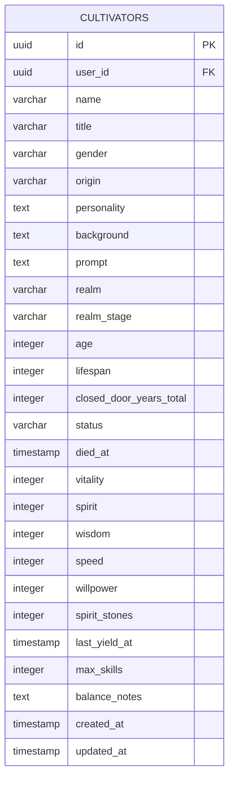
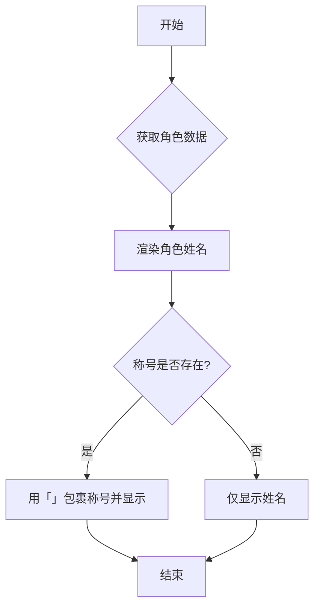

# 称号修改

<cite>
**本文档引用的文件**   
- [route.ts](file://app/api/cultivators/title/route.ts)
- [cultivatorRepository.ts](file://lib/repositories/cultivatorRepository.ts)
- [schema.ts](file://lib/drizzle/schema.ts)
- [cultivator.ts](file://types/cultivator.ts)
- [page.tsx](file://app/cultivator/page.tsx)
- [dictionaries.ts](file://types/dictionaries.ts)
</cite>

## 目录
1. [简介](#简介)
2. [核心功能实现](#核心功能实现)
3. [数据模型与持久化](#数据模型与持久化)
4. [前端展示逻辑](#前端展示逻辑)
5. [扩展建议](#扩展建议)
6. [结论](#结论)

## 简介
本文档详细阐述了修仙游戏中玩家自定义称号功能的实现机制。该功能允许玩家为其角色设置个性化称号，这些称号将作为角色身份的重要标识，在多个游戏界面中展示。文档将深入分析从API接口到数据库持久化的完整流程，解释`title`字段在`Cultivator`模型中的设计，并提供关于长度限制、敏感词过滤等扩展功能的建议。

## 核心功能实现

称号修改功能的核心实现在于`/api/cultivators/title/route.ts`文件中定义的API路由。该路由处理一个POST请求，接收玩家提交的新称号，并将其安全地更新到数据库中。

整个流程始于身份验证。API首先通过Supabase客户端获取当前登录用户的信息，确保只有经过认证的用户才能执行修改操作。如果用户未登录，系统将返回401未授权错误。

在通过身份验证后，API会解析请求体中的`cultivatorId`和`title`参数。`cultivatorId`是必须的，用于指定要修改的角色，如果缺失则返回400错误。随后，系统会对新称号的长度进行严格校验，要求其必须在2到8个汉字之间。这是为了保证称号的简洁性和美观性，避免过长的称号破坏UI布局。

最关键的一步是所有权验证。系统会查询数据库，确认请求中的`cultivatorId`确实属于当前登录的用户。这通过在`cultivators`表中同时匹配`id`和`userId`来实现。如果验证失败，说明用户试图修改不属于自己的角色，系统将返回403禁止访问错误。

一旦所有验证通过，系统便会调用`updateCultivator`方法，将新的称号写入数据库。该操作使用Drizzle ORM的`update`语句，精确地更新指定角色的`title`字段。更新成功后，API会返回包含更新后角色数据的成功响应。

**Section sources**
- [route.ts](file://app/api/cultivators/title/route.ts#L7-L58)

## 数据模型与持久化

称号功能的持久化依赖于精心设计的数据模型。在数据库层面，`title`字段被定义为`cultivators`表中的一个可选（nullable）的`varchar(50)`类型字段。这意味着一个角色可以拥有一个称号，也可以没有称号（即字段值为`null`）。

**Diagram sources**
- [schema.ts](file://lib/drizzle/schema.ts#L17-L54)

在应用的类型定义中，`title`字段在`Cultivator`接口中被声明为可选的字符串或`null`值（`title?: string | null`）。这种设计与数据库的可空性保持一致，确保了类型安全。当从数据库读取数据时，如果`title`字段为空，组装函数`assembleCultivator`会将其转换为`undefined`，这符合TypeScript的最佳实践。

对`title`字段的更新是通过`cultivatorRepository.ts`中的`updateCultivator`方法完成的。该方法接收一个包含`title`字段的更新对象，并将其映射到数据库的`cultivators`表。更新操作在一个事务中进行，确保了数据的一致性。值得注意的是，该方法允许通过发送空字符串或`null`来清除已有的称号，这为玩家提供了更大的灵活性。

**Section sources**
- [schema.ts](file://lib/drizzle/schema.ts#L21)
- [cultivator.ts](file://types/cultivator.ts#L221)
- [cultivatorRepository.ts](file://lib/repositories/cultivatorRepository.ts#L583-L652)

## 前端展示逻辑

前端对称号的展示逻辑主要体现在`app/cultivator/page.tsx`和`components/RankingListItem.tsx`等组件中。在角色详情页，称号并非作为一个独立的顶级信息展示，而是与角色姓名紧密结合。

在`InkListItem`组件中，角色的姓名和称号被组合在一个`title`属性中。其逻辑是：首先显示角色姓名，然后检查`item.title`是否存在。如果存在，则用中文引号`「`和`」`将称号包裹起来并显示。这种设计使得称号成为角色姓名的自然延伸，增强了角色的个性化表达。

**Diagram sources**
- [page.tsx](file://app/cultivator/page.tsx#L160-L166)
- [dictionaries.ts](file://types/dictionaries.ts#L387-L402)

在排行榜等社交性更强的界面中，称号的展示更为突出。`RankingListItem`组件会检查当前展示的是否为角色（`!isItem`），如果是，则同样会渲染`item.title`。这种一致性确保了玩家的称号在游戏的各个角落都能被识别，极大地提升了玩家的归属感和成就感。

前端通过`useCultivatorBundle`这个自定义Hook来高效地获取和管理角色数据。该Hook不仅负责从API获取数据，还实现了本地缓存，避免了不必要的重复请求，从而优化了用户体验。

**Section sources**
- [page.tsx](file://app/cultivator/page.tsx#L159-L166)
- [RankingListItem.tsx](file://components/RankingListItem.tsx#L56)
- [useCultivatorBundle.ts](file://lib/hooks/useCultivatorBundle.ts#L40)

## 扩展建议

为了进一步提升称号系统的质量和安全性，可以考虑以下扩展功能：

1.  **敏感词过滤**：在API接收到新称号后，应立即进行敏感词过滤。可以建立一个包含违禁词汇的黑名单，并在更新前检查新称号是否包含这些词汇。如果发现违禁内容，应拒绝更新并返回相应的错误信息。这有助于维护游戏社区的健康环境。

2.  **称号唯一性校验**：可以引入称号唯一性校验，防止多个玩家使用完全相同的称号。这能增加称号的稀有性和价值感。校验可以在数据库层面通过添加唯一索引实现，或在应用逻辑中查询现有称号列表。

3.  **称号格式化与美化**：可以允许玩家使用简单的格式化代码，如颜色代码或特殊符号，来进一步美化他们的称号。但这需要严格的解析和转义，以防止XSS等安全漏洞。

4.  **称号成就系统**：可以将称号与游戏内的成就系统挂钩。例如，完成特定挑战的玩家可以获得特殊的限定称号。这能有效激励玩家参与游戏内容。

5.  **称号历史记录**：为每个角色维护一个称号变更历史，记录玩家曾经使用过的所有称号。这不仅能增加游戏的深度，还能让玩家回顾自己的成长历程。

**Section sources**
- [route.ts](file://app/api/cultivators/title/route.ts#L28-L32)

## 结论
称号修改功能是一个看似简单但涉及前后端多个环节的综合性功能。从API的严格验证，到数据库的可选字段设计，再到前端的灵活展示，每一个环节都体现了良好的工程实践。该功能不仅满足了玩家的个性化需求，也增强了游戏的社交属性。通过实施上述扩展建议，可以进一步提升系统的安全性和趣味性，为玩家提供更丰富的游戏体验。