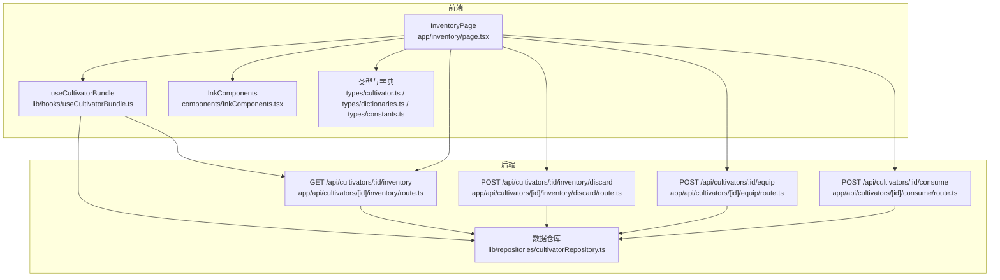
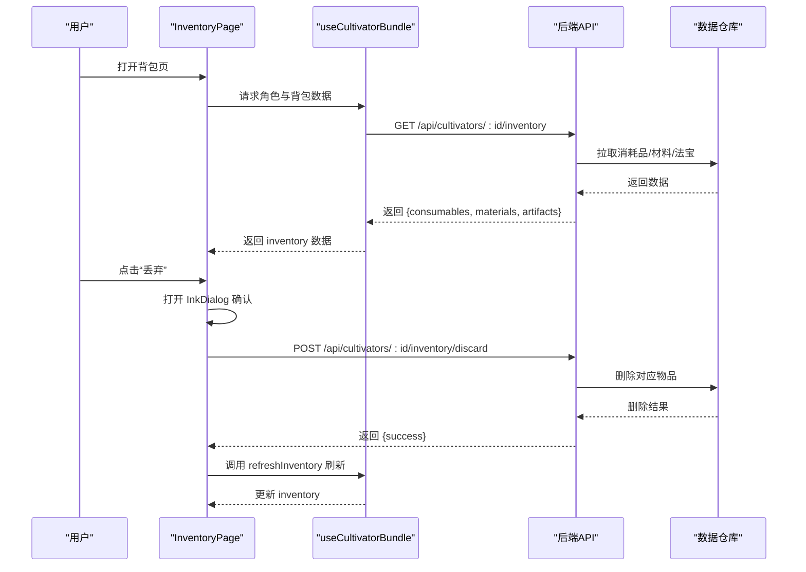
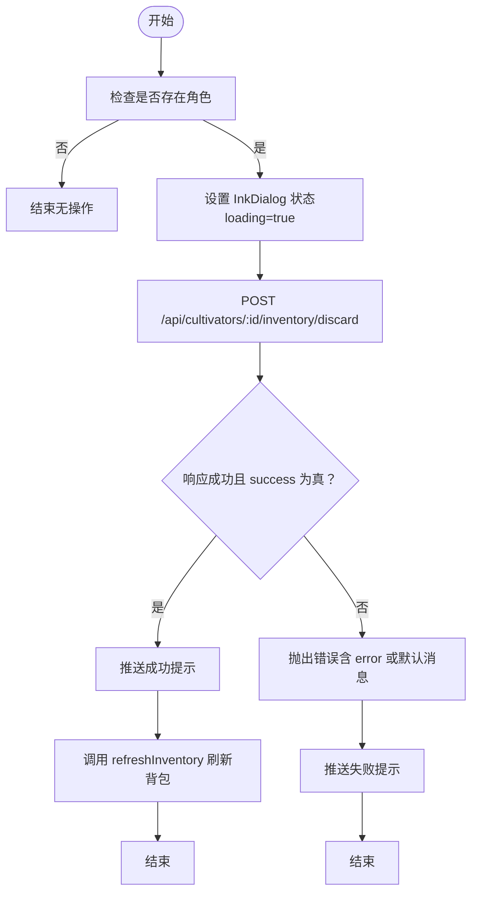
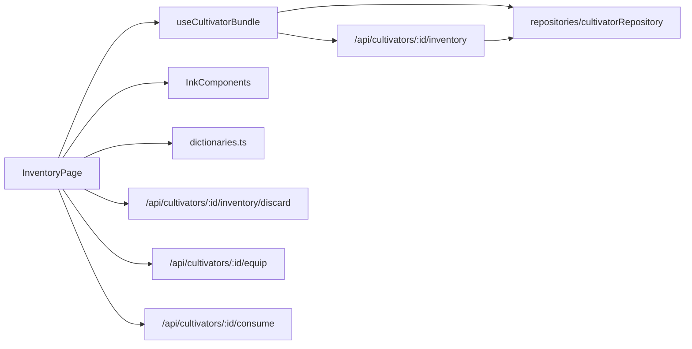

# 背包管理

<cite>
**本文引用的文件**
- [app/inventory/page.tsx](file://app/inventory/page.tsx)
- [lib/hooks/useCultivatorBundle.ts](file://lib/hooks/useCultivatorBundle.ts)
- [components/InkComponents.tsx](file://components/InkComponents.tsx)
- [types/cultivator.ts](file://types/cultivator.ts)
- [types/constants.ts](file://types/constants.ts)
- [types/dictionaries.ts](file://types/dictionaries.ts)
- [app/api/cultivators/[id]/inventory/route.ts](file://app/api/cultivators/[id]/inventory/route.ts)
- [app/api/cultivators/[id]/inventory/discard/route.ts](file://app/api/cultivators/[id]/inventory/discard/route.ts)
- [app/api/cultivators/[id]/equip/route.ts](file://app/api/cultivators/[id]/equip/route.ts)
- [app/api/cultivators/[id]/consume/route.ts](file://app/api/cultivators/[id]/consume/route.ts)
- [lib/repositories/cultivatorRepository.ts](file://lib/repositories/cultivatorRepository.ts)
</cite>

## 目录
1. [简介](#简介)
2. [项目结构](#项目结构)
3. [核心组件](#核心组件)
4. [架构总览](#架构总览)
5. [详细组件分析](#详细组件分析)
6. [依赖关系分析](#依赖关系分析)
7. [性能考量](#性能考量)
8. [故障排查指南](#故障排查指南)
9. [结论](#结论)

## 简介
本文件面向“背包管理”功能，围绕 InventoryPage 页面展开，说明如何通过 useCultivatorBundle 钩子获取 inventory 数据，利用 InkTabs 实现法宝、材料、丹药三类物品的分类切换；描述每类物品的渲染逻辑（属性展示、图标使用与品质标识）、丢弃流程（handleDiscard 与确认对话框）、物品详情模态框的动态渲染机制，以及与后端 API 的交互路径。同时，文档梳理 Artifact、Consumable、Material 等类型定义的关键字段与其在 UI 中的映射关系。

## 项目结构
- 前端页面层：app/inventory/page.tsx 为核心页面，负责渲染背包列表、详情模态框、确认对话框与操作按钮。
- 钩子层：lib/hooks/useCultivatorBundle.ts 提供角色与背包数据的统一拉取与缓存，支持刷新背包与历史记录。
- UI 组件层：components/InkComponents.tsx 提供 InkTabs、InkList、InkListItem、InkBadge、InkDialog、InkModal 等通用 UI 组件。
- 类型与字典：types/cultivator.ts 定义 Artifact、Consumable、Material、Inventory 等类型；types/dictionaries.ts 提供图标、标签、品质映射与格式化工具；types/constants.ts 定义枚举与常量。
- 后端 API：app/api/cultivators/[id]/inventory/* 提供背包数据查询、丢弃、装备、服用等接口；lib/repositories/cultivatorRepository.ts 提供数据仓库方法（如按用户与角色拉取消耗品、材料、法宝）。

图表来源
- [app/inventory/page.tsx](file://app/inventory/page.tsx#L1-L638)
- [lib/hooks/useCultivatorBundle.ts](file://lib/hooks/useCultivatorBundle.ts#L1-L351)
- [components/InkComponents.tsx](file://components/InkComponents.tsx#L1-L665)
- [types/cultivator.ts](file://types/cultivator.ts#L1-L253)
- [types/dictionaries.ts](file://types/dictionaries.ts#L1-L403)
- [types/constants.ts](file://types/constants.ts#L1-L212)
- [app/api/cultivators/[id]/inventory/route.ts](file://app/api/cultivators/[id]/inventory/route.ts#L1-L45)
- [app/api/cultivators/[id]/inventory/discard/route.ts](file://app/api/cultivators/[id]/inventory/discard/route.ts#L1-L115)
- [app/api/cultivators/[id]/equip/route.ts](file://app/api/cultivators/[id]/equip/route.ts#L1-L153)
- [app/api/cultivators/[id]/consume/route.ts](file://app/api/cultivators/[id]/consume/route.ts#L1-L48)
- [lib/repositories/cultivatorRepository.ts](file://lib/repositories/cultivatorRepository.ts#L1-L800)

章节来源
- [app/inventory/page.tsx](file://app/inventory/page.tsx#L1-L638)
- [lib/hooks/useCultivatorBundle.ts](file://lib/hooks/useCultivatorBundle.ts#L1-L351)

## 核心组件
- InventoryPage：负责渲染三类物品列表、详情模态框、确认对话框、操作按钮（装备/卸下、服用、丢弃），并使用 useCultivatorBundle 获取 inventory 数据。
- useCultivatorBundle：统一拉取角色、背包、历史、未读邮件等数据，提供 refresh、refreshInventory、refreshHistory 方法；内部维护模块级缓存，避免重复请求。
- InkTabs：三类物品切换（法宝、材料、丹药）。
- InkList/InkListItem：列表容器与列表项，承载物品标题、副标题、描述与动作区。
- InkBadge：品质/等级徽记，用于显示品质、槽位、材料类型等。
- InkDialog：确认对话框，用于丢弃确认。
- InkModal：详情模态框，按物品类型动态渲染。

章节来源
- [app/inventory/page.tsx](file://app/inventory/page.tsx#L1-L638)
- [lib/hooks/useCultivatorBundle.ts](file://lib/hooks/useCultivatorBundle.ts#L1-L351)
- [components/InkComponents.tsx](file://components/InkComponents.tsx#L1-L665)

## 架构总览
InventoryPage 通过 useCultivatorBundle 获取 inventory 数据，再根据 activeTab 渲染三类物品列表。每类物品渲染时使用字典工具进行图标与标签映射，并在动作区提供“详情”、“装备/卸下”、“丢弃”等操作。丢弃操作通过 InkDialog 弹出确认，确认后调用 /api/cultivators/:id/inventory/discard 接口；装备/卸下通过 /api/cultivators/:id/equip；服用丹药通过 /api/cultivators/:id/consume。数据仓库层负责从数据库拉取消耗品、材料、法宝三类数据。

图表来源
- [app/inventory/page.tsx](file://app/inventory/page.tsx#L1-L638)
- [lib/hooks/useCultivatorBundle.ts](file://lib/hooks/useCultivatorBundle.ts#L1-L351)
- [app/api/cultivators/[id]/inventory/route.ts](file://app/api/cultivators/[id]/inventory/route.ts#L1-L45)
- [app/api/cultivators/[id]/inventory/discard/route.ts](file://app/api/cultivators/[id]/inventory/discard/route.ts#L1-L115)
- [lib/repositories/cultivatorRepository.ts](file://lib/repositories/cultivatorRepository.ts#L748-L800)

## 详细组件分析

### InventoryPage 组件
- 数据来源：通过 useCultivatorBundle 获取 inventory（artifacts、consumables、materials），并提供 refresh、refreshInventory、refreshHistory。
- 分类切换：使用 InkTabs 切换 activeTab，分别渲染 renderArtifacts/renderMaterials/renderConsumables。
- 丢弃流程：openDiscardConfirm 构建 InkDialog，handleDiscard 发起 POST /api/cultivators/:id/inventory/discard，成功后调用 refreshInventory，失败则弹出 toast。
- 装备/卸下：handleEquipToggle 调用 /api/cultivators/:id/equip，成功后调用 refresh。
- 服用丹药：handleConsume 调用 /api/cultivators/:id/consume，成功后调用 refresh。
- 详情模态框：handleShowDetails 打开 InkModal，renderModalContent 根据物品类型动态渲染（法宝、丹药、材料）。

章节来源
- [app/inventory/page.tsx](file://app/inventory/page.tsx#L1-L638)

#### 丢弃流程（handleDiscard 与确认对话框）

图表来源
- [app/inventory/page.tsx](file://app/inventory/page.tsx#L54-L98)
- [app/api/cultivators/[id]/inventory/discard/route.ts](file://app/api/cultivators/[id]/inventory/discard/route.ts#L1-L115)

#### 物品详情模态框（动态渲染）
- 判断逻辑：依据是否存在 slot 字段判断是否为法宝；否则依据是否存在 effect 数组判断是否为丹药；否则视为材料。
- 法宝详情：展示槽位图标与标签、元素、品质、基础属性、特殊效果、诅咒效果、描述等。
- 丹药详情：展示名称、品质、数量、描述、药效列表。
- 材料详情：展示类型图标与标签、元素、品质、数量、描述。

章节来源
- [app/inventory/page.tsx](file://app/inventory/page.tsx#L409-L578)
- [types/dictionaries.ts](file://types/dictionaries.ts#L257-L384)

### useCultivatorBundle 钩子
- 负责：拉取角色、背包、历史、未读邮件等数据；提供 refresh、refreshInventory、refreshHistory；模块级缓存避免重复请求。
- 数据来源：先获取角色，再并行拉取背包、历史与未读邮件计数；随后合并基础数据与后端返回数据，计算最终属性。
- 刷新策略：refreshInventory 仅更新 inventory 字段，避免整页重载；refresh 会重新拉取全部数据。

章节来源
- [lib/hooks/useCultivatorBundle.ts](file://lib/hooks/useCultivatorBundle.ts#L1-L351)

### UI 组件与字典映射
- InkTabs：三类标签（法宝、材料、丹药），绑定 activeValue 与 onChange。
- InkList/InkListItem：列表项布局为列式（col），包含 title、meta、description、actions。
- InkBadge：tier 映射到品质/等级/境界等；用于显示品质、槽位、材料类型等。
- 字典映射：
  - 装备槽位：getEquipmentSlotInfo 返回图标与标签。
  - 材料类型：getMaterialTypeInfo 返回图标与标签。
  - 属性格式化：formatAttributeBonusMap 将属性加成映射为文本。
  - 特效描述：getEffectText 将 ArtifactEffect 转为可读文本。

章节来源
- [components/InkComponents.tsx](file://components/InkComponents.tsx#L1-L665)
- [types/dictionaries.ts](file://types/dictionaries.ts#L1-L403)
- [types/constants.ts](file://types/constants.ts#L1-L212)

### 类型定义与 UI 映射
- Artifact（法宝）
  - 关键字段：id、name、slot、element、quality、required_realm、bonus、special_effects、curses、description。
  - UI 映射：槽位图标与标签来自 getEquipmentSlotInfo；品质 tier 显示；基础属性通过 formatAttributeBonusMap；特殊/诅咒效果通过 getEffectText。
- Consumable（丹药）
  - 关键字段：id、name、type、quality、effect、quantity、description。
  - UI 映射：品质 tier 显示；effect 数组转为“效果类型 + 值”的描述；数量显示。
- Material（材料）
  - 关键字段：id、name、type、rank、price、element、description、details、quantity。
  - UI 映射：类型图标与标签来自 getMaterialTypeInfo；品质 tier 显示；数量显示。
- Inventory（背包）
  - 关键字段：artifacts、consumables、materials。
  - UI 映射：三类列表分别渲染。

章节来源
- [types/cultivator.ts](file://types/cultivator.ts#L104-L209)
- [types/dictionaries.ts](file://types/dictionaries.ts#L257-L384)

### API 交互流程
- 获取背包：GET /api/cultivators/:id/inventory → 返回 { consumables, materials, artifacts }。
- 丢弃物品：POST /api/cultivators/:id/inventory/discard → 参数 { itemId, itemType }。
- 装备/卸下：POST /api/cultivators/:id/equip → 参数 { artifactId }。
- 服用丹药：POST /api/cultivators/:id/consume → 参数 { consumableId }。
- 数据仓库：getCultivatorConsumables、getCultivatorMaterials、getCultivatorArtifacts 按用户与角色 ID 查询对应物品。

章节来源
- [app/api/cultivators/[id]/inventory/route.ts](file://app/api/cultivators/[id]/inventory/route.ts#L1-L45)
- [app/api/cultivators/[id]/inventory/discard/route.ts](file://app/api/cultivators/[id]/inventory/discard/route.ts#L1-L115)
- [app/api/cultivators/[id]/equip/route.ts](file://app/api/cultivators/[id]/equip/route.ts#L1-L153)
- [app/api/cultivators/[id]/consume/route.ts](file://app/api/cultivators/[id]/consume/route.ts#L1-L48)
- [lib/repositories/cultivatorRepository.ts](file://lib/repositories/cultivatorRepository.ts#L748-L800)

## 依赖关系分析
- InventoryPage 依赖 useCultivatorBundle 获取 inventory；依赖 InkComponents 渲染 UI；依赖字典工具进行图标与文本映射。
- useCultivatorBundle 依赖后端 /api/cultivators/:id/inventory 与数据仓库方法。
- 后端 API 依赖 Supabase 认证与 Drizzle ORM；数据仓库依赖 schema 定义与数据库查询。

图表来源
- [app/inventory/page.tsx](file://app/inventory/page.tsx#L1-L638)
- [lib/hooks/useCultivatorBundle.ts](file://lib/hooks/useCultivatorBundle.ts#L1-L351)
- [components/InkComponents.tsx](file://components/InkComponents.tsx#L1-L665)
- [types/dictionaries.ts](file://types/dictionaries.ts#L1-L403)
- [app/api/cultivators/[id]/inventory/route.ts](file://app/api/cultivators/[id]/inventory/route.ts#L1-L45)
- [app/api/cultivators/[id]/inventory/discard/route.ts](file://app/api/cultivators/[id]/inventory/discard/route.ts#L1-L115)
- [app/api/cultivators/[id]/equip/route.ts](file://app/api/cultivators/[id]/equip/route.ts#L1-L153)
- [app/api/cultivators/[id]/consume/route.ts](file://app/api/cultivators/[id]/consume/route.ts#L1-L48)
- [lib/repositories/cultivatorRepository.ts](file://lib/repositories/cultivatorRepository.ts#L748-L800)

## 性能考量
- 模块级缓存：useCultivatorBundle 在模块级别维护缓存，避免重复请求；仅当用户变更或未初始化时重新加载。
- 并行拉取：useCultivatorBundle 在加载时并行获取背包、历史与未读邮件计数，减少首屏等待。
- 列表渲染：三类物品列表采用列式布局，减少 DOM 层级；属性文本通过 formatAttributeBonusMap 一次性拼接，避免多次遍历。
- 操作防抖：丢弃与服用按钮在 pendingId 期间禁用，避免重复提交。

章节来源
- [lib/hooks/useCultivatorBundle.ts](file://lib/hooks/useCultivatorBundle.ts#L1-L351)
- [app/inventory/page.tsx](file://app/inventory/page.tsx#L1-L638)

## 故障排查指南
- 未登录或会话失效：后端 API 在认证失败时返回 401；前端应引导用户登录或刷新页面。
- 丢弃失败：handleDiscard 捕获异常并推送失败提示；检查后端返回的 error 字段与状态码。
- 装备/卸下失败：检查 artifactId 是否存在；后端会验证角色归属与有效性。
- 服用丹药失败：检查 consumableId 是否存在；后端会验证角色归属与有效性。
- 数据未刷新：确认调用了 refreshInventory 或 refresh；确保 pendingId 状态在 finally 中复位。

章节来源
- [app/api/cultivators/[id]/inventory/discard/route.ts](file://app/api/cultivators/[id]/inventory/discard/route.ts#L1-L115)
- [app/api/cultivators/[id]/equip/route.ts](file://app/api/cultivators/[id]/equip/route.ts#L1-L153)
- [app/api/cultivators/[id]/consume/route.ts](file://app/api/cultivators/[id]/consume/route.ts#L1-L48)
- [app/inventory/page.tsx](file://app/inventory/page.tsx#L120-L193)

## 结论
InventoryPage 通过 useCultivatorBundle 与 InkComponents 实现了三类物品的高效展示与管理。借助字典映射与品质徽记，UI 能清晰表达物品属性、品质与类型；通过 InkDialog 与后端 API 的配合，实现了安全可靠的丢弃流程；详情模态框按类型动态渲染，满足不同物品的信息呈现需求。整体架构清晰、职责分离明确，具备良好的扩展性与可维护性。