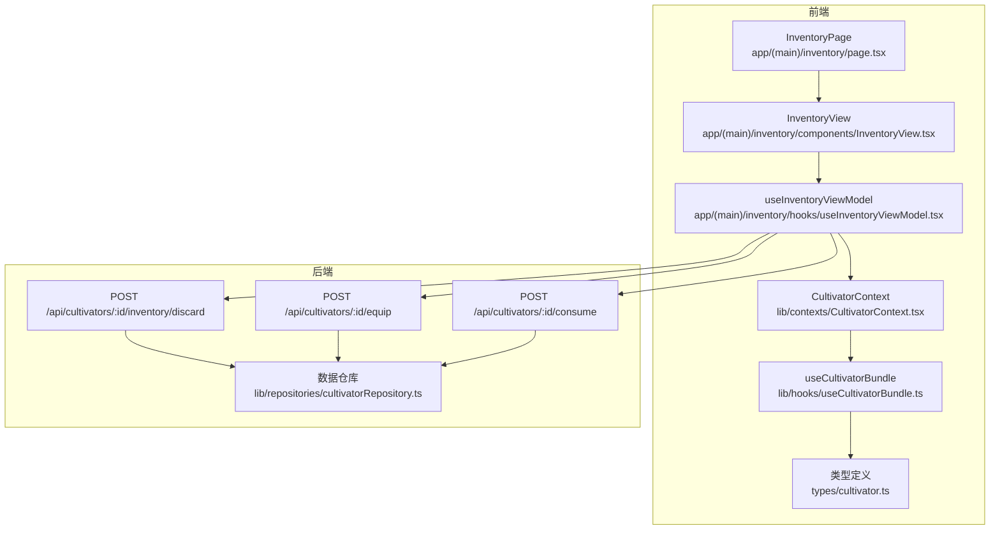
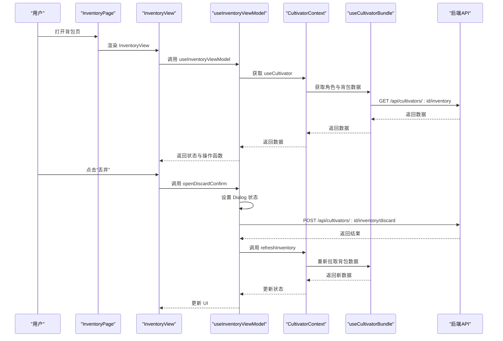
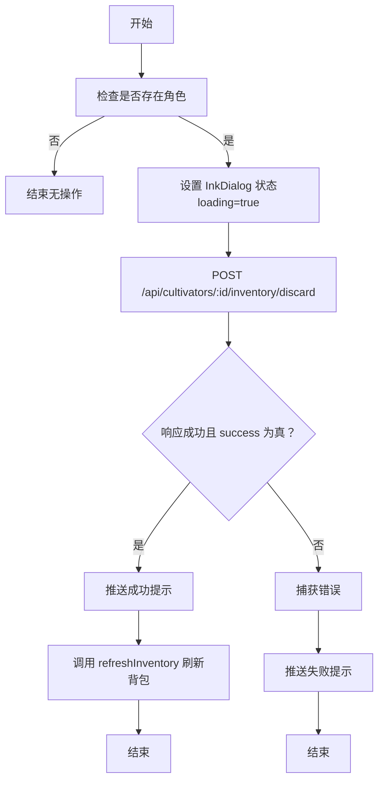
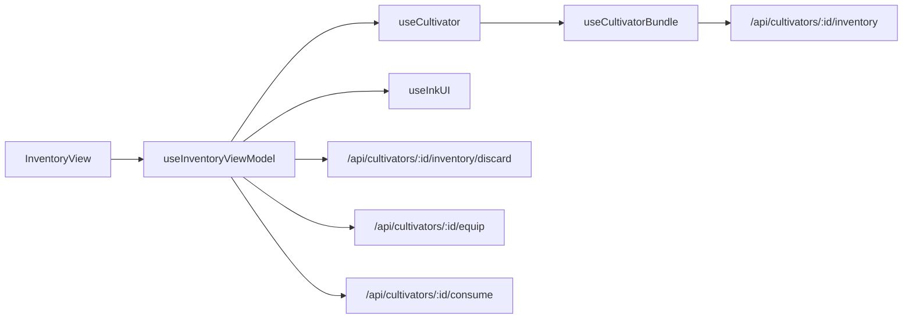

# 背包管理

<cite>
**本文引用的文件**
- [app/(main)/inventory/page.tsx](file://app/(main)/inventory/page.tsx)
- [app/(main)/inventory/components/InventoryView.tsx](file://app/(main)/inventory/components/InventoryView.tsx)
- [app/(main)/inventory/hooks/useInventoryViewModel.tsx](file://app/(main)/inventory/hooks/useInventoryViewModel.tsx)
- [lib/contexts/CultivatorContext.tsx](file://lib/contexts/CultivatorContext.tsx)
- [lib/hooks/useCultivatorBundle.ts](file://lib/hooks/useCultivatorBundle.ts)
- [types/cultivator.ts](file://types/cultivator.ts)
- [app/api/cultivators/[id]/inventory/discard/route.ts](file://app/api/cultivators/[id]/inventory/discard/route.ts)
- [app/api/cultivators/[id]/equip/route.ts](file://app/api/cultivators/[id]/equip/route.ts)
- [app/api/cultivators/[id]/consume/route.ts](file://app/api/cultivators/[id]/consume/route.ts)
</cite>

## 更新摘要
**变更内容**
- 重构背包管理功能，引入 `useInventoryViewModel` 钩子封装业务逻辑，实现 UI 与状态的分离
- `InventoryPage` 组件简化为路由壳子，仅负责渲染 `InventoryView`
- 原有业务逻辑（如丢弃、装备、服用、状态管理）已迁移至 `useInventoryViewModel`
- 物品详情模态框的类型判断逻辑保持不变，但数据流通过新的 ViewModel 传递

## 目录
1. [简介](#简介)
2. [项目结构](#项目结构)
3. [核心组件](#核心组件)
4. [架构总览](#架构总览)
5. [详细组件分析](#详细组件分析)
6. [依赖关系分析](#依赖关系分析)
7. [性能考量](#性能考量)
8. [故障排查指南](#故障排查指南)
9. [结论](#结论)

## 简介
本文档面向“背包管理”功能，围绕 `InventoryPage` 页面展开，说明如何通过 `useCultivator` 上下文获取角色与背包数据，并利用 `useInventoryViewModel` 钩子封装业务逻辑。文档涵盖法宝、材料、丹药三类物品的分类切换（通过 `InkTabs`）、渲染逻辑（属性展示、图标使用与品质标识）、丢弃流程（`handleDiscard` 与确认对话框）、物品详情模态框的动态渲染机制，以及与后端 API 的交互路径。同时，梳理 `Artifact`、`Consumable`、`Material` 等类型定义的关键字段与其在 UI 中的映射关系。

## 项目结构
- 前端页面层：`app/(main)/inventory/page.tsx` 为核心路由页面，仅作为壳子渲染 `InventoryView`。
- 视图组件层：`app/(main)/inventory/components/InventoryView.tsx` 为 UI 主组件，负责布局与事件绑定。
- 业务逻辑层：`app/(main)/inventory/hooks/useInventoryViewModel.tsx` 封装所有状态管理与业务逻辑（Tab 切换、Modal/Dialog 状态、丢弃、装备、服用等）。
- 数据上下文：`lib/contexts/CultivatorContext.tsx` 提供全局角色数据上下文，`useCultivator` 基于 `useCultivatorBundle` 构建。
- 钩子层：`lib/hooks/useCultivatorBundle.ts` 提供角色与背包数据的统一拉取与缓存。
- 类型定义：`types/cultivator.ts` 定义 `Artifact`、`Consumable`、`Material`、`Inventory` 等类型。
- 后端 API：`app/api/cultivators/[id]/inventory/discard`、`/equip`、`/consume` 等接口处理物品操作。



**图表来源**
- [app/(main)/inventory/page.tsx](file://app/(main)/inventory/page.tsx#L1-L24)
- [app/(main)/inventory/components/InventoryView.tsx](file://app/(main)/inventory/components/InventoryView.tsx#L1-L121)
- [app/(main)/inventory/hooks/useInventoryViewModel.tsx](file://app/(main)/inventory/hooks/useInventoryViewModel.tsx#L1-L280)
- [lib/contexts/CultivatorContext.tsx](file://lib/contexts/CultivatorContext.tsx#L1-L38)
- [lib/hooks/useCultivatorBundle.ts](file://lib/hooks/useCultivatorBundle.ts#L1-L362)
- [types/cultivator.ts](file://types/cultivator.ts#L1-L283)
- [app/api/cultivators/[id]/inventory/discard/route.ts](file://app/api/cultivators/[id]/inventory/discard/route.ts#L1-L115)
- [app/api/cultivators/[id]/equip/route.ts](file://app/api/cultivators/[id]/equip/route.ts#L1-L153)
- [app/api/cultivators/[id]/consume/route.ts](file://app/api/cultivators/[id]/consume/route.ts#L1-L48)
- [lib/repositories/cultivatorRepository.ts](file://lib/repositories/cultivatorRepository.ts#L748-L800)

## 核心组件
- `InventoryPage`：路由页面，仅作为壳子使用 `Suspense` 包裹 `InventoryView`。
- `InventoryView`：主视图组件，负责 UI 布局，通过 `useInventoryViewModel` 获取所有状态与操作函数。
- `useInventoryViewModel`：核心业务逻辑钩子，封装 Tab 状态、Modal/Dialog 状态、丢弃、装备、服用等所有交互逻辑。
- `CultivatorContext`：提供全局角色数据上下文，`useCultivator` 是其便捷 Hook。
- `useCultivatorBundle`：底层数据获取钩子，负责拉取角色、背包、历史等数据并提供缓存。
- `InkTabs`：实现法宝、材料、丹药三类物品的分类切换。
- `InkList`/`InkListItem`：列表容器与列表项，承载物品信息与操作按钮。
- `InkBadge`：用于显示品质、槽位、材料类型等徽记。
- `InkDialog`：丢弃操作的确认对话框。
- `InkModal`：物品详情的模态框。

**章节来源**
- [app/(main)/inventory/page.tsx](file://app/(main)/inventory/page.tsx#L1-L24)
- [app/(main)/inventory/components/InventoryView.tsx](file://app/(main)/inventory/components/InventoryView.tsx#L1-L121)
- [app/(main)/inventory/hooks/useInventoryViewModel.tsx](file://app/(main)/inventory/hooks/useInventoryViewModel.tsx#L1-L280)
- [lib/contexts/CultivatorContext.tsx](file://lib/contexts/CultivatorContext.tsx#L1-L38)

## 架构总览
`InventoryPage` 作为路由入口，渲染 `InventoryView`。`InventoryView` 通过 `useInventoryViewModel` 获取所有状态与操作函数。`useInventoryViewModel` 内部使用 `useCultivator` 从上下文中获取角色与背包数据，并封装了 Tab 切换、Modal/Dialog 状态管理、以及丢弃、装备、服用等业务操作。所有操作最终通过 `fetch` 调用后端 API，并在成功后调用 `refresh` 或 `refreshInventory` 更新数据。数据流清晰，UI 与逻辑完全分离。



**图表来源**
- [app/(main)/inventory/page.tsx](file://app/(main)/inventory/page.tsx#L1-L24)
- [app/(main)/inventory/components/InventoryView.tsx](file://app/(main)/inventory/components/InventoryView.tsx#L1-L121)
- [app/(main)/inventory/hooks/useInventoryViewModel.tsx](file://app/(main)/inventory/hooks/useInventoryViewModel.tsx#L1-L280)
- [lib/contexts/CultivatorContext.tsx](file://lib/contexts/CultivatorContext.tsx#L1-L38)
- [lib/hooks/useCultivatorBundle.ts](file://lib/hooks/useCultivatorBundle.ts#L1-L362)
- [app/api/cultivators/[id]/inventory/discard/route.ts](file://app/api/cultivators/[id]/inventory/discard/route.ts#L1-L115)

## 详细组件分析

### InventoryPage 组件
- **职责**：作为路由页面，仅负责渲染 `InventoryView`，并包裹 `Suspense` 处理加载状态。
- **变更**：已从一个包含大量业务逻辑的组件重构为一个极简的壳子组件，体现了关注点分离原则。
- **代码示例**：
  ```tsx
  export default function InventoryPage() {
    return (
      <Suspense fallback={<InkPageShell title="加载中...">...</InkPageShell>}>
        <InventoryView />
      </Suspense>
    );
  }
  ```

**章节来源**
- [app/(main)/inventory/page.tsx](file://app/(main)/inventory/page.tsx#L1-L24)

### InventoryView 组件
- **职责**：主视图组件，负责 UI 布局，包括 `InkPageShell`、`InkTabs`、各 Tab 内容、`ItemDetailModal` 和 `InkDialog`。
- **数据来源**：通过 `useInventoryViewModel` 获取所有状态（`activeTab`, `selectedItem`, `dialog`, `pendingId`）和操作函数（`setActiveTab`, `openItemDetail`, `closeDialog`, `handleEquipToggle`, `handleConsume`, `openDiscardConfirm`）。
- **渲染逻辑**：根据 `activeTab` 的值，条件渲染 `ArtifactsTab`、`MaterialsTab` 或 `ConsumablesTab`，并将相应的 `onDiscard` 回调包装后传递。

**章节来源**
- [app/(main)/inventory/components/InventoryView.tsx](file://app/(main)/inventory/components/InventoryView.tsx#L1-L121)

### useInventoryViewModel 钩子
- **职责**：封装背包页面的所有业务逻辑和状态管理，是本次重构的核心。
- **状态管理**：
  - `activeTab`：管理当前激活的 Tab（'artifacts' | 'materials' | 'consumables'）。
  - `selectedItem` 和 `isModalOpen`：管理物品详情模态框的显示与内容。
  - `dialog`：管理确认对话框（如丢弃确认）的状态。
  - `pendingId`：管理正在进行的操作（如装备、服用），用于禁用按钮。
- **业务操作**：
  - `handleDiscard`：调用 `/api/cultivators/[id]/inventory/discard` API 丢弃物品，成功后刷新背包并显示成功提示，失败则显示错误提示。
  - `openDiscardConfirm`：构建丢弃确认对话框，其 `onConfirm` 回调指向 `handleDiscard`。
  - `handleEquipToggle`：调用 `/api/cultivators/[id]/equip` API 进行装备/卸下操作，成功后刷新角色数据。
  - `handleConsume`：调用 `/api/cultivators/[id]/consume` API 服用丹药，成功后刷新角色数据。
- **优势**：将复杂的业务逻辑从 UI 组件中抽离，使 `InventoryView` 更加简洁，提升了代码的可维护性和可测试性。

**章节来源**
- [app/(main)/inventory/hooks/useInventoryViewModel.tsx](file://app/(main)/inventory/hooks/useInventoryViewModel.tsx#L1-L280)

### useCultivator 与 useCultivatorBundle
- `useCultivator` 是一个便捷 Hook，用于在组件中访问全局的修仙者数据上下文（`CultivatorContext`）。
- `CultivatorContext` 的值由 `CultivatorProvider` 提供，其内部使用 `useCultivatorBundle` 来获取数据。
- `useCultivatorBundle` 负责实际的数据拉取，包括角色、背包、历史记录等，并实现了模块级缓存以避免重复请求。
- `useInventoryViewModel` 通过 `useCultivator` 获取数据，实现了与底层数据获取逻辑的解耦。

**章节来源**
- [lib/contexts/CultivatorContext.tsx](file://lib/contexts/CultivatorContext.tsx#L1-L38)
- [lib/hooks/useCultivatorBundle.ts](file://lib/hooks/useCultivatorBundle.ts#L1-L362)

### 丢弃流程（handleDiscard 与确认对话框）


**图表来源**
- [app/(main)/inventory/hooks/useInventoryViewModel.tsx](file://app/(main)/inventory/hooks/useInventoryViewModel.tsx#L93-L136)
- [app/api/cultivators/[id]/inventory/discard/route.ts](file://app/api/cultivators/[id]/inventory/discard/route.ts#L1-L115)

### 物品详情模态框（动态渲染）
- **判断逻辑**：在 `ItemDetailModal` 组件中，通过 `in` 操作符检查对象属性来判断物品类型。
  - 若存在 `slot` 属性，则为 `Artifact`（法宝）。
  - 若存在 `effect` 属性且无 `slot`，则为 `Consumable`（丹药）。
  - 否则视为 `Material`（材料）。
- **渲染内容**：
  - **法宝**：展示槽位图标与标签、元素、品质、基础属性、特殊效果、诅咒效果、描述等。
  - **丹药**：展示名称、品质、数量、描述、药效列表。
  - **材料**：展示类型图标与标签、元素、品质、数量、描述。

**章节来源**
- [app/(main)/inventory/components/ItemDetailModal.tsx](file://app/(main)/inventory/components/ItemDetailModal.tsx#L1-L218)
- [types/dictionaries.ts](file://types/dictionaries.ts#L257-L384)

### 类型定义与 UI 映射
- **Artifact（法宝）**
  - 关键字段：`id`、`name`、`slot`、`element`、`quality`、`required_realm`、`bonus`、`special_effects`、`curses`、`description`。
  - UI 映射：槽位图标与标签来自 `getEquipmentSlotInfo`；品质通过 `InkBadge` 的 `tier` 属性显示；基础属性通过 `formatAttributeBonusMap` 格式化；特殊/诅咒效果通过 `getEffectText` 转换。
- **Consumable（丹药）**
  - 关键字段：`id`、`name`、`type`、`quality`、`effect`、`quantity`、`description`。
  - UI 映射：品质通过 `InkBadge` 显示；`effect` 数组中的 `effect_type` 和 `bonus` 字段用于生成药效描述；`quantity` 显示持有数量。
- **Material（材料）**
  - 关键字段：`id`、`name`、`type`、`rank`、`price`、`element`、`description`、`details`、`quantity`。
  - UI 映射：类型图标与标签来自 `getMaterialTypeInfo`；品质（`rank`）通过 `InkBadge` 显示；`quantity` 显示持有数量。

**章节来源**
- [types/cultivator.ts](file://types/cultivator.ts#L116-L214)
- [app/(main)/inventory/components/ArtifactsTab.tsx](file://app/(main)/inventory/components/ArtifactsTab.tsx#L1-L125)
- [app/(main)/inventory/components/ConsumablesTab.tsx](file://app/(main)/inventory/components/ConsumablesTab.tsx#L1-L91)
- [app/(main)/inventory/components/MaterialsTab.tsx](file://app/(main)/inventory/components/MaterialsTab.tsx#L1-L71)

### API 交互流程
- **获取背包**：`GET /api/cultivators/:id/inventory` → 返回 `{ consumables, materials, artifacts }`。
- **丢弃物品**：`POST /api/cultivators/:id/inventory/discard` → 请求体 `{ itemId, itemType }`。
- **装备/卸下**：`POST /api/cultivators/:id/equip` → 请求体 `{ artifactId }`。
- **服用丹药**：`POST /api/cultivators/:id/consume` → 请求体 `{ consumableId }`。
- **数据仓库**：`getCultivatorConsumables`、`getCultivatorMaterials`、`getCultivatorArtifacts` 方法负责从数据库查询对应物品。

**章节来源**
- [app/api/cultivators/[id]/inventory/route.ts](file://app/api/cultivators/[id]/inventory/route.ts#L1-L45)
- [app/api/cultivators/[id]/inventory/discard/route.ts](file://app/api/cultivators/[id]/inventory/discard/route.ts#L1-L115)
- [app/api/cultivators/[id]/equip/route.ts](file://app/api/cultivators/[id]/equip/route.ts#L1-L153)
- [app/api/cultivators/[id]/consume/route.ts](file://app/api/cultivators/[id]/consume/route.ts#L1-L48)
- [lib/repositories/cultivatorRepository.ts](file://lib/repositories/cultivatorRepository.ts#L748-L800)

## 依赖关系分析
- `InventoryView` 依赖 `useInventoryViewModel` 获取所有状态与操作。
- `useInventoryViewModel` 依赖 `useCultivator` 获取角色与背包数据，并依赖 `useInkUI` 发送 `toast` 消息。
- `useCultivator` 依赖 `CultivatorContext`，其值由 `useCultivatorBundle` 提供。
- `useCultivatorBundle` 依赖后端 `/api/cultivators/:id/inventory` 等 API 与数据仓库方法。
- `InventoryView` 及其子组件依赖 `InkComponents` 进行 UI 渲染。



**图表来源**
- [app/(main)/inventory/components/InventoryView.tsx](file://app/(main)/inventory/components/InventoryView.tsx#L1-L121)
- [app/(main)/inventory/hooks/useInventoryViewModel.tsx](file://app/(main)/inventory/hooks/useInventoryViewModel.tsx#L1-L280)
- [lib/contexts/CultivatorContext.tsx](file://lib/contexts/CultivatorContext.tsx#L1-L38)
- [lib/hooks/useCultivatorBundle.ts](file://lib/hooks/useCultivatorBundle.ts#L1-L362)
- [app/api/cultivators/[id]/inventory/discard/route.ts](file://app/api/cultivators/[id]/inventory/discard/route.ts#L1-L115)
- [app/api/cultivators/[id]/equip/route.ts](file://app/api/cultivators/[id]/equip/route.ts#L1-L153)
- [app/api/cultivators/[id]/consume/route.ts](file://app/api/cultivators/[id]/consume/route.ts#L1-L48)

## 性能考量
- **模块级缓存**：`useCultivatorBundle` 在模块级别维护缓存，避免用户未变更时的重复请求。
- **并行拉取**：`useCultivatorBundle` 在加载时并行获取背包、历史与未读邮件计数，减少首屏等待时间。
- **细粒度刷新**：`useInventoryViewModel` 中的 `refreshInventory` 仅刷新背包数据，避免不必要的全局刷新。
- **操作防抖**：通过 `pendingId` 状态，在装备、服用等操作进行中时禁用相关按钮，防止重复提交。

**章节来源**
- [lib/hooks/useCultivatorBundle.ts](file://lib/hooks/useCultivatorBundle.ts#L1-L362)
- [app/(main)/inventory/hooks/useInventoryViewModel.tsx](file://app/(main)/inventory/hooks/useInventoryViewModel.tsx#L1-L280)

## 故障排查指南
- **未登录或会话失效**：后端 API 在认证失败时返回 401；前端应引导用户登录或刷新页面。
- **丢弃失败**：`handleDiscard` 捕获异常并推送失败提示；检查后端返回的 `error` 字段与状态码。
- **装备/卸下失败**：检查 `artifactId` 是否存在；后端会验证角色归属与有效性。
- **服用丹药失败**：检查 `consumableId` 是否存在；后端会验证角色归属与有效性。
- **数据未刷新**：确认 `useInventoryViewModel` 中的 `refresh` 或 `refreshInventory` 已被正确调用；确保 `pendingId` 状态在 `finally` 块中被复位。

**章节来源**
- [app/api/cultivators/[id]/inventory/discard/route.ts](file://app/api/cultivators/[id]/inventory/discard/route.ts#L1-L115)
- [app/api/cultivators/[id]/equip/route.ts](file://app/api/cultivators/[id]/equip/route.ts#L1-L153)
- [app/api/cultivators/[id]/consume/route.ts](file://app/api/cultivators/[id]/consume/route.ts#L1-L48)
- [app/(main)/inventory/hooks/useInventoryViewModel.tsx](file://app/(main)/inventory/hooks/useInventoryViewModel.tsx#L93-L136)

## 结论
本次重构通过引入 `useInventoryViewModel` 钩子，成功将背包管理功能的业务逻辑从 `InventoryView` 组件中抽离，实现了 UI 与状态的清晰分离。`InventoryPage` 简化为纯粹的路由壳子，`InventoryView` 专注于 UI 布局，而 `useInventoryViewModel` 则集中管理所有状态与交互逻辑。这一架构提升了代码的可维护性、可测试性和可读性。结合 `CultivatorContext` 提供的全局数据源，整体数据流清晰高效。原有的功能（如分类展示、详情模态框、丢弃确认）均得到保留并运行良好，为未来的功能扩展奠定了坚实的基础。