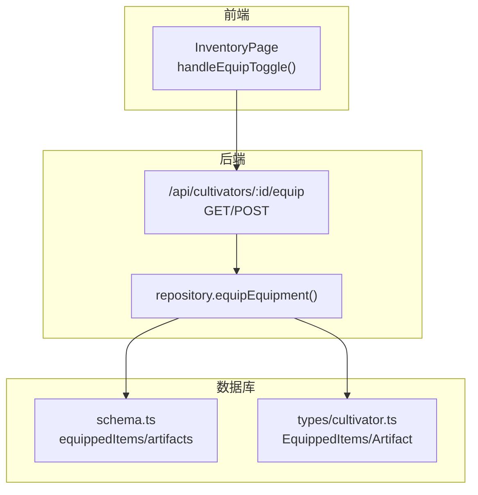
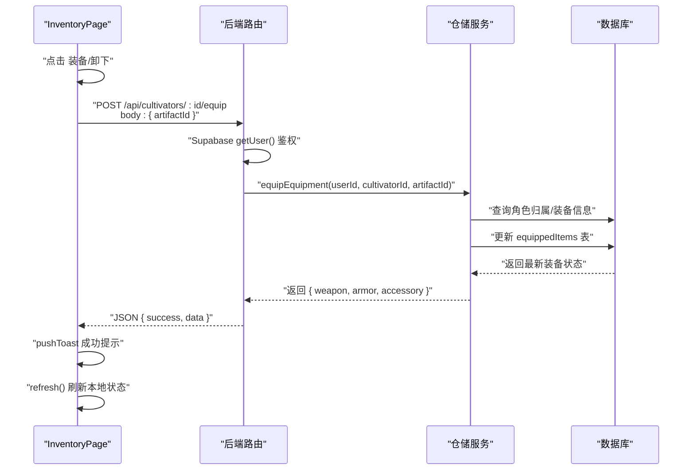
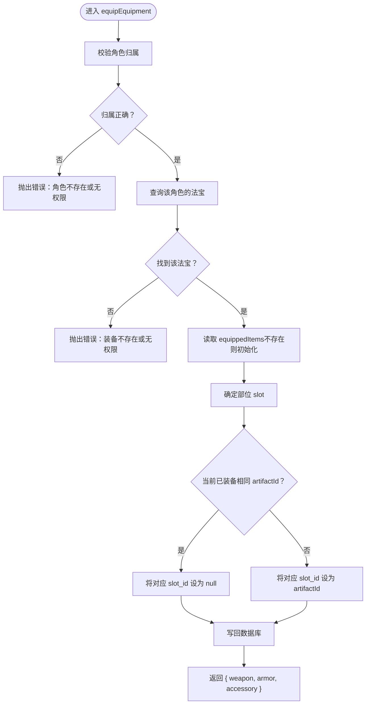
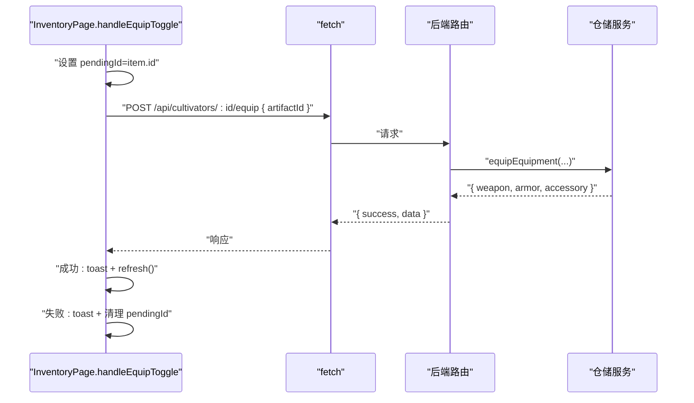
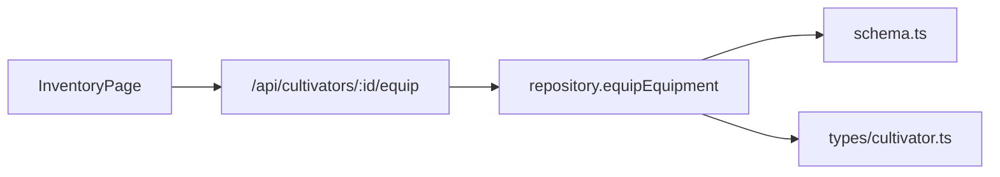

# 装备操作

<cite>
**本文引用的文件**
- [app/api/cultivators/[id]/equip/route.ts](file://app/api/cultivators/[id]/equip/route.ts)
- [lib/repositories/cultivatorRepository.ts](file://lib/repositories/cultivatorRepository.ts)
- [app/inventory/page.tsx](file://app/inventory/page.tsx)
- [lib/drizzle/schema.ts](file://lib/drizzle/schema.ts)
- [types/cultivator.ts](file://types/cultivator.ts)
- [utils/cultivatorUtils.ts](file://utils/cultivatorUtils.ts)
</cite>

## 目录
1. [简介](#简介)
2. [项目结构](#项目结构)
3. [核心组件](#核心组件)
4. [架构总览](#架构总览)
5. [详细组件分析](#详细组件分析)
6. [依赖关系分析](#依赖关系分析)
7. [性能考量](#性能考量)
8. [故障排查指南](#故障排查指南)
9. [结论](#结论)

## 简介
本文件围绕“装备与卸下”功能进行深入文档化，重点覆盖以下内容：
- 后端 API 如何通过 Supabase 验证用户身份与角色归属，确保操作安全
- POST 请求中 artifactId 参数的处理流程，以及如何调用服务层完成数据库事务
- 前端 InventoryPage 组件中的 handleEquipToggle 如何发起请求、处理加载状态与用户反馈
- 装备冲突检测（如境界不足）与唯一性校验等业务规则的实现位置与处理机制
- 当装备状态未同步或属性未更新时的调试路径，包括检查 API 响应、数据库 equippedItems 表状态及前端 refresh 调用

## 项目结构
与“装备/卸下”相关的代码分布在以下模块：
- 路由层：app/api/cultivators/[id]/equip/route.ts
- 仓储层：lib/repositories/cultivatorRepository.ts
- 前端页面：app/inventory/page.tsx
- 数据模型与数据库结构：types/cultivator.ts、lib/drizzle/schema.ts
- 属性计算与境界上限：utils/cultivatorUtils.ts

图表来源
- [app/api/cultivators/[id]/equip/route.ts](file://app/api/cultivators/[id]/equip/route.ts#L1-L153)
- [lib/repositories/cultivatorRepository.ts](file://lib/repositories/cultivatorRepository.ts#L1061-L1150)
- [lib/drizzle/schema.ts](file://lib/drizzle/schema.ts#L136-L228)
- [types/cultivator.ts](file://types/cultivator.ts#L104-L171)

章节来源
- [app/api/cultivators/[id]/equip/route.ts](file://app/api/cultivators/[id]/equip/route.ts#L1-L153)
- [lib/repositories/cultivatorRepository.ts](file://lib/repositories/cultivatorRepository.ts#L1061-L1150)
- [app/inventory/page.tsx](file://app/inventory/page.tsx#L120-L154)
- [lib/drizzle/schema.ts](file://lib/drizzle/schema.ts#L136-L228)
- [types/cultivator.ts](file://types/cultivator.ts#L104-L171)

## 核心组件
- 后端路由：负责鉴权、输入校验、调用服务层并返回统一格式响应
- 仓储服务：封装 equipEquipment 事务，执行装备/卸下逻辑
- 前端页面：InventoryPage 提供 handleEquipToggle 发起请求、展示加载态与反馈，并在成功后刷新数据
- 数据模型：EquippedItems 与 Artifact 描述装备状态与物品属性
- 数据库模式：equippedItems 与 artifacts 的表结构定义

章节来源
- [app/api/cultivators/[id]/equip/route.ts](file://app/api/cultivators/[id]/equip/route.ts#L89-L152)
- [lib/repositories/cultivatorRepository.ts](file://lib/repositories/cultivatorRepository.ts#L1061-L1150)
- [app/inventory/page.tsx](file://app/inventory/page.tsx#L120-L154)
- [types/cultivator.ts](file://types/cultivator.ts#L104-L171)
- [lib/drizzle/schema.ts](file://lib/drizzle/schema.ts#L136-L228)

## 架构总览
后端采用“路由 -> 仓储服务 -> 数据库”的分层设计；前端通过 fetch 发起请求，成功后调用 refresh 刷新本地状态。

图表来源
- [app/inventory/page.tsx](file://app/inventory/page.tsx#L120-L154)
- [app/api/cultivators/[id]/equip/route.ts](file://app/api/cultivators/[id]/equip/route.ts#L89-L152)
- [lib/repositories/cultivatorRepository.ts](file://lib/repositories/cultivatorRepository.ts#L1061-L1150)
- [lib/drizzle/schema.ts](file://lib/drizzle/schema.ts#L208-L228)

## 详细组件分析

### 后端路由：鉴权、输入校验与调用服务
- 鉴权：使用 Supabase 客户端获取当前用户，若无用户或错误则返回未授权
- 输入校验：校验路径参数 id 与请求体 artifactId 的存在与类型
- 业务调用：调用 repository.equipEquipment(userId, cultivatorId, artifactId)
- 响应：统一返回 { success, data }，错误时返回安全的错误消息

章节来源
- [app/api/cultivators/[id]/equip/route.ts](file://app/api/cultivators/[id]/equip/route.ts#L89-L152)

### 仓储服务：equipEquipment 的事务与规则
- 权限校验：确认角色属于当前用户
- 装备存在性校验：确认该角色拥有指定 artifactId 的法宝
- 状态读取：读取或初始化 equippedItems 记录
- 替换逻辑：同一部位只允许一个装备，若当前已装备相同 artifactId 则卸下，否则替换为新装备
- 返回值：返回最新的 weapon/armor/accessory 组合

图表来源
- [lib/repositories/cultivatorRepository.ts](file://lib/repositories/cultivatorRepository.ts#L1061-L1150)

章节来源
- [lib/repositories/cultivatorRepository.ts](file://lib/repositories/cultivatorRepository.ts#L1061-L1150)

### 前端 InventoryPage：handleEquipToggle 的请求与反馈
- 发起请求：POST /api/cultivators/:id/equip，携带 artifactId
- 加载态：设置 pendingId，按钮显示“操作中…”
- 成功：toast 提示“法宝灵性已调顺”，调用 refresh() 刷新本地状态
- 失败：toast 提示错误，保持 pendingId 清理
- 与后端配合：后端返回 { success, data }，前端据此判断

图表来源
- [app/inventory/page.tsx](file://app/inventory/page.tsx#L120-L154)
- [app/api/cultivators/[id]/equip/route.ts](file://app/api/cultivators/[id]/equip/route.ts#L89-L152)
- [lib/repositories/cultivatorRepository.ts](file://lib/repositories/cultivatorRepository.ts#L1061-L1150)

章节来源
- [app/inventory/page.tsx](file://app/inventory/page.tsx#L120-L154)

### 数据模型与数据库结构
- EquippedItems：描述 weapon/armor/accessory 的 UUID 引用
- Artifact：包含 slot、required_realm、bonus、special_effects 等字段
- equippedItems 表：一对一关联到角色，三列分别指向 artifacts 表的 weapon_id/armor_id/accessory_id

章节来源
- [types/cultivator.ts](file://types/cultivator.ts#L104-L171)
- [lib/drizzle/schema.ts](file://lib/drizzle/schema.ts#L136-L228)

### 业务规则与冲突检测
- 唯一性校验：同一部位只能装备一个物品，仓储层通过替换逻辑保证唯一性
- 境界要求：Artifact.required_realm 字段存在于数据库 schema 中，但当前 equipEquipment 未显式校验该字段。若需启用“境界不足”拦截，可在仓储层增加校验逻辑，比较角色 realm/realm_stage 与 artifact.required_realm 的匹配关系
- 属性上限：属性计算与上限由 utils/cultivatorUtils 提供，用于界面展示与平衡校验，但不直接参与装备切换逻辑

章节来源
- [lib/drizzle/schema.ts](file://lib/drizzle/schema.ts#L136-L156)
- [lib/repositories/cultivatorRepository.ts](file://lib/repositories/cultivatorRepository.ts#L1061-L1150)
- [utils/cultivatorUtils.ts](file://utils/cultivatorUtils.ts#L1-L32)

## 依赖关系分析
- 路由依赖 Supabase 鉴权与 repository.equipEquipment
- 仓储服务依赖 drizzle ORM 与 schema 定义
- 前端依赖 useCultivatorBundle 的 refresh 方法以刷新本地状态
- 数据模型与数据库结构相互映射，确保前后端一致

图表来源
- [app/inventory/page.tsx](file://app/inventory/page.tsx#L120-L154)
- [app/api/cultivators/[id]/equip/route.ts](file://app/api/cultivators/[id]/equip/route.ts#L89-L152)
- [lib/repositories/cultivatorRepository.ts](file://lib/repositories/cultivatorRepository.ts#L1061-L1150)
- [lib/drizzle/schema.ts](file://lib/drizzle/schema.ts#L136-L228)
- [types/cultivator.ts](file://types/cultivator.ts#L104-L171)

章节来源
- [app/inventory/page.tsx](file://app/inventory/page.tsx#L120-L154)
- [app/api/cultivators/[id]/equip/route.ts](file://app/api/cultivators/[id]/equip/route.ts#L89-L152)
- [lib/repositories/cultivatorRepository.ts](file://lib/repositories/cultivatorRepository.ts#L1061-L1150)
- [lib/drizzle/schema.ts](file://lib/drizzle/schema.ts#L136-L228)
- [types/cultivator.ts](file://types/cultivator.ts#L104-L171)

## 性能考量
- 并发与事务：仓储层使用单事务更新 equippedItems，避免中间态
- 查询优化：路由与仓储均采用精确条件查询，减少扫描范围
- 前端渲染：InventoryPage 使用 pendingId 控制按钮禁用，避免重复提交

[本节为通用建议，无需列出具体文件来源]

## 故障排查指南
- 现象：前端点击“装备/卸下”无响应或按钮一直显示“操作中…”
  - 排查：检查 handleEquipToggle 是否设置/清理 pendingId；确认 fetch 请求是否成功返回 { success, data }
  - 参考：[app/inventory/page.tsx](file://app/inventory/page.tsx#L120-L154)
- 现象：后端返回“未授权访问”
  - 排查：确认 Supabase 用户会话有效；检查路由 getUser() 是否返回错误
  - 参考：[app/api/cultivators/[id]/equip/route.ts](file://app/api/cultivators/[id]/equip/route.ts#L89-L110)
- 现象：后端返回“角色不存在或无权限操作”
  - 排查：确认路径参数 id 与请求体 artifactId 类型与非空；检查仓储层权限校验
  - 参考：[app/api/cultivators/[id]/equip/route.ts](file://app/api/cultivators/[id]/equip/route.ts#L115-L126), [lib/repositories/cultivatorRepository.ts](file://lib/repositories/cultivatorRepository.ts#L1061-L1083)
- 现象：装备状态未同步或属性未更新
  - 排查：确认后端返回的 { weapon, armor, accessory } 是否与期望一致；检查数据库 equippedItems 表字段是否更新；前端是否调用 refresh() 刷新
  - 参考：[lib/repositories/cultivatorRepository.ts](file://lib/repositories/cultivatorRepository.ts#L1139-L1149), [app/inventory/page.tsx](file://app/inventory/page.tsx#L140-L143), [lib/drizzle/schema.ts](file://lib/drizzle/schema.ts#L208-L228)
- 现象：希望启用“境界不足”拦截
  - 实施：在仓储层 equipEquipment 中增加角色 realm/realm_stage 与 artifact.required_realm 的对比逻辑，若不满足则抛错
  - 参考：[lib/drizzle/schema.ts](file://lib/drizzle/schema.ts#L136-L156), [utils/cultivatorUtils.ts](file://utils/cultivatorUtils.ts#L1-L32)

章节来源
- [app/inventory/page.tsx](file://app/inventory/page.tsx#L120-L154)
- [app/api/cultivators/[id]/equip/route.ts](file://app/api/cultivators/[id]/equip/route.ts#L89-L152)
- [lib/repositories/cultivatorRepository.ts](file://lib/repositories/cultivatorRepository.ts#L1061-L1150)
- [lib/drizzle/schema.ts](file://lib/drizzle/schema.ts#L136-L228)
- [utils/cultivatorUtils.ts](file://utils/cultivatorUtils.ts#L1-L32)

## 结论
- “装备/卸下”流程清晰：前端发起请求，后端鉴权与校验后通过仓储层事务更新数据库，最后前端刷新状态
- 唯一性规则已在仓储层得到保障；若需启用“境界不足”拦截，可在仓储层补充相应校验
- 若出现状态不同步问题，优先检查 API 响应、数据库 equippedItems 表与前端 refresh 调用