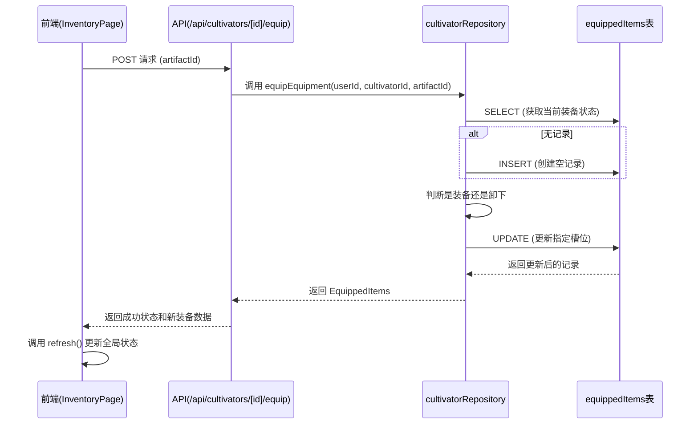

# 装备系统

<cite>
**本文档引用文件**   
- [route.ts](file://app/api/cultivators/[id]/equip/route.ts)
- [schema.ts](file://lib/drizzle/schema.ts)
- [cultivatorRepository.ts](file://lib/repositories/cultivatorRepository.ts)
- [page.tsx](file://app/inventory/page.tsx)
- [cultivator.ts](file://types/cultivator.ts)
- [useCultivatorBundle.ts](file://lib/hooks/useCultivatorBundle.ts)
- [cultivatorUtils.ts](file://utils/cultivatorUtils.ts)
- [constants.ts](file://types/constants.ts)
</cite>

## 目录
1. [系统概述](#系统概述)
2. [核心数据结构](#核心数据结构)
3. [装备操作事务处理](#装备操作事务处理)
4. [数据库存储与关联](#数据库存储与关联)
5. [前端状态同步与属性重算](#前端状态同步与属性重算)
6. [校验机制](#校验机制)
7. [问题排查路径](#问题排查路径)

## 系统概述

本系统负责管理修仙角色的法宝（武器、防具、饰品）的装备、卸下与状态管理。通过API接口实现安全的装备操作，确保数据一致性，并在前端提供直观的交互界面。

**Section sources**
- [route.ts](file://app/api/cultivators/[id]/equip/route.ts#L1-L153)

## 核心数据结构

### EquippedItems 接口
`EquippedItems` 接口定义了角色当前装备的三类法宝ID，所有字段均可为空，表示未装备。

```typescript
interface EquippedItems {
  weapon: string | null;
  armor: string | null;
  accessory: string | null;
}
```

### Artifact 接口
`Artifact` 接口定义了法宝的核心属性，包括其所属槽位（slot）、境界要求（required_realm）等。

```typescript
interface Artifact {
  id?: string;
  name: string;
  slot: EquipmentSlot; // 'weapon' | 'armor' | 'accessory'
  element: ElementType;
  quality?: Quality;
  required_realm?: RealmType;
  bonus: ArtifactBonus;
  // ... 其他属性
}
```

### EquipmentSlot 类型
`EquipmentSlot` 是一个字符串字面量联合类型，定义了所有可能的装备槽位。

```typescript
type EquipmentSlot = 'weapon' | 'armor' | 'accessory';
```

**Section sources**
- [cultivator.ts](file://types/cultivator.ts#L211-L215)
- [cultivator.ts](file://types/cultivator.ts#L159-L170)
- [constants.ts](file://types/constants.ts#L43-L44)

## 装备操作事务处理

### API 路由实现
`/api/cultivators/[id]/equip/route.ts` 文件实现了两个核心API：
- `GET` 请求：获取指定角色的当前装备状态。
- `POST` 请求：执行装备或卸下操作。

`POST` 操作通过调用 `equipEquipment` 函数来完成，该函数封装了完整的业务逻辑。

### 核心业务逻辑
`equipEquipment` 函数位于 `cultivatorRepository.ts` 中，其逻辑流程如下：

1.  **权限验证**：检查用户ID与角色ID的归属关系。
2.  **法宝验证**：确认要操作的法宝（`artifactId`）确实属于该角色。
3.  **获取当前状态**：查询 `equippedItems` 表以获取当前的装备状态。如果该角色尚无装备记录，则会自动创建一条初始为空的记录。
4.  **执行操作**：
    -   通过 `artifactItem.slot` 动态确定操作的槽位（如 `weapon_id`）。
    -   检查当前槽位的ID是否与要操作的 `artifactId` 相同。
    -   若相同，则为**卸下**操作，将该槽位更新为 `null`。
    -   若不同，则为**装备**操作，将该槽位更新为新的 `artifactId`，并自动替换掉旧的装备。
5.  **返回结果**：返回更新后的 `EquippedItems` 对象。

此过程在一个单一的数据库 `UPDATE` 语句中完成，保证了操作的原子性，从而保障了数据一致性。



**Diagram sources **
- [route.ts](file://app/api/cultivators/[id]/equip/route.ts#L93-L152)
- [cultivatorRepository.ts](file://lib/repositories/cultivatorRepository.ts#L1064-L1150)

**Section sources**
- [route.ts](file://app/api/cultivators/[id]/equip/route.ts#L93-L152)
- [cultivatorRepository.ts](file://lib/repositories/cultivatorRepository.ts#L1064-L1150)

## 数据库存储与关联

### equippedItems 表结构
`equippedItems` 表（数据库中为 `wanjiedaoyou_equipped_items`）是一个1对1的关联表，与 `cultivators` 表通过 `cultivatorId` 字段关联。

| 字段名 | 类型 | 说明 |
| :--- | :--- | :--- |
| `id` | UUID | 主键 |
| `cultivatorId` | UUID | 外键，关联角色，`ON DELETE CASCADE` |
| `weapon_id` | UUID | 外键，关联 `artifacts` 表，`ON DELETE SET NULL` |
| `armor_id` | UUID | 外键，关联 `artifacts` 表，`ON DELETE SET NULL` |
| `accessory_id` | UUID | 外键，关联 `artifacts` 表，`ON DELETE SET NULL` |

### 关联关系
- **与 `cultivators` 表**：`cultivatorId` 是外键，当角色被删除时，其装备记录也会被级联删除。
- **与 `artifacts` 表**：`weapon_id`, `armor_id`, `accessory_id` 均为外键。当一件法宝被删除时，其在装备槽中的引用会被置为 `NULL`，但不会影响其他装备。

```mermaid
erDiagram
cultivators ||--o{ equippedItems : "1对1"
artifacts }o--|| equippedItems : "多对1"
cultivators {
uuid id PK
string name
// ... 其他字段
}
equippedItems {
uuid id PK
uuid cultivatorId FK
uuid weapon_id FK
uuid armor_id FK
uuid accessory_id FK
}
artifacts {
uuid id PK
string name
string slot
// ... 其他字段
}
```

**Diagram sources **
- [schema.ts](file://lib/drizzle/schema.ts#L208-L228)

**Section sources**
- [schema.ts](file://lib/drizzle/schema.ts#L208-L228)

## 前端状态同步与属性重算

### InventoryPage 组件
`app/inventory/page.tsx` 是用户管理装备的主要界面。它通过 `useCultivatorBundle` 钩子获取角色的完整数据，包括 `inventory` 和 `equipped` 状态。

### 装备/卸下操作
当用户点击“装备”或“卸下”按钮时，会触发 `handleEquipToggle` 函数：
1.  向 `/api/cultivators/[id]/equip` 发送 `POST` 请求。
2.  请求成功后，调用 `refresh()` 函数。
3.  `refresh()` 会重新从服务器获取角色的全部数据，确保前端状态与后端完全同步。

### 属性重算
角色的最终属性（如体魄、灵力等）并非静态数据，而是动态计算得出。`useCultivatorBundle` 钩子在获取数据后，会调用 `calculateFinalAttributes` 函数。

该函数的计算逻辑如下：
1.  **基础属性**：来自角色自身的 `attributes`。
2.  **加成来源**：将来自 `pre_heaven_fates`（命格）、`cultivations`（功法）和**已装备的法宝**（`equipped`）的加成累加。
3.  **返回结果**：返回包含最终属性和各来源加成明细的对象。

因此，当装备状态改变后，`refresh()` 获取到新的 `equipped` 数据，`calculateFinalAttributes` 会自动使用新数据重新计算，从而实现属性的实时更新。

```mermaid
flowchart TD
A[用户点击装备/卸下] --> B[发送POST请求到API]
B --> C[API调用equipEquipment]
C --> D[数据库更新equippedItems]
D --> E[API返回新装备状态]
E --> F[前端调用refresh()]
F --> G[重新获取角色完整数据]
G --> H[调用calculateFinalAttributes]
H --> I[根据新equipped数据重算属性]
I --> J[前端UI更新]
```

**Diagram sources **
- [page.tsx](file://app/inventory/page.tsx#L120-L154)
- [useCultivatorBundle.ts](file://lib/hooks/useCultivatorBundle.ts#L344-L349)
- [cultivatorUtils.ts](file://utils/cultivatorUtils.ts#L51-L193)

**Section sources**
- [page.tsx](file://app/inventory/page.tsx#L120-L154)
- [useCultivatorBundle.ts](file://lib/hooks/useCultivatorBundle.ts#L344-L349)
- [cultivatorUtils.ts](file://utils/cultivatorUtils.ts#L51-L193)

## 校验机制

### 境界不足校验
系统通过 `Artifact` 模型中的 `required_realm` 字段来定义法宝的境界要求。虽然 `equipEquipment` 函数本身不直接进行境界校验，但前端在渲染时会显示此要求。真正的校验逻辑应在角色使用该法宝进行战斗或特定操作时进行，以确保角色境界满足要求。

### 唯一性校验
系统通过数据库表结构和业务逻辑共同保障了装备的唯一性：
- **数据库层面**：`equippedItems` 表的每个槽位（`weapon_id`, `armor_id`, `accessory_id`）都是单一字段，天然保证了每个槽位只能装备一件法宝。
- **业务逻辑层面**：`equipEquipment` 函数在执行装备操作时，会直接用新的 `artifactId` 覆盖旧的ID，实现了“替换”逻辑，确保了同一法宝不会被同时装备在多个槽位。

### 其他校验
- **权限校验**：`equipEquipment` 函数首先验证用户ID与角色ID的匹配。
- **存在性校验**：函数会检查角色和法宝是否存在且归属正确。

**Section sources**
- [cultivator.ts](file://types/cultivator.ts#L165-L166)
- [page.tsx](file://app/inventory/page.tsx#L230-L233)
- [cultivatorRepository.ts](file://lib/repositories/cultivatorRepository.ts#L1069-L1097)

## 问题排查路径

### 装备丢失
1.  **检查数据库**：直接查询 `wanjiedaoyou_equipped_items` 表，确认 `weapon_id`, `armor_id`, `accessory_id` 字段的值是否正确。
2.  **检查API响应**：在前端开发者工具中，检查对 `/api/cultivators/[id]/equip` 的 `GET` 请求返回的 `data` 字段。
3.  **检查前端状态**：确认 `useCultivatorBundle` 返回的 `equipped` 对象是否与API响应一致。
4.  **检查缓存**：`useCultivatorBundle` 使用了模块级缓存。如果数据异常，尝试强制刷新页面或检查 `refresh()` 函数是否被正确调用。

### 属性未更新
1.  **确认装备已变更**：首先确保 `equipped` 状态已经正确更新。
2.  **检查 `refresh()` 调用**：确认在装备操作成功后，`refresh()` 函数是否被调用。这是触发数据重新获取和属性重算的关键。
3.  **检查 `calculateFinalAttributes`**：确认该函数是否被调用，并检查其输入的 `Cultivator` 对象中的 `equipped` 字段是否为最新值。
4.  **检查法宝加成**：确认被装备的法宝（`Artifact`）的 `bonus` 字段是否包含有效的属性加成。

**Section sources**
- [schema.ts](file://lib/drizzle/schema.ts#L208-L228)
- [route.ts](file://app/api/cultivators/[id]/equip/route.ts#L52-L73)
- [useCultivatorBundle.ts](file://lib/hooks/useCultivatorBundle.ts#L346-L348)
- [cultivatorUtils.ts](file://utils/cultivatorUtils.ts#L51-L193)