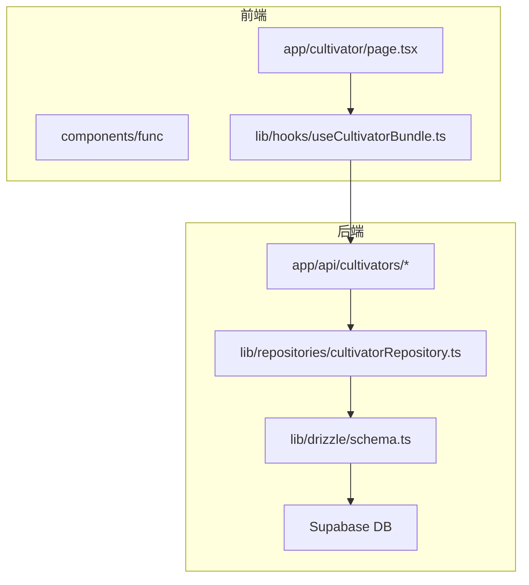
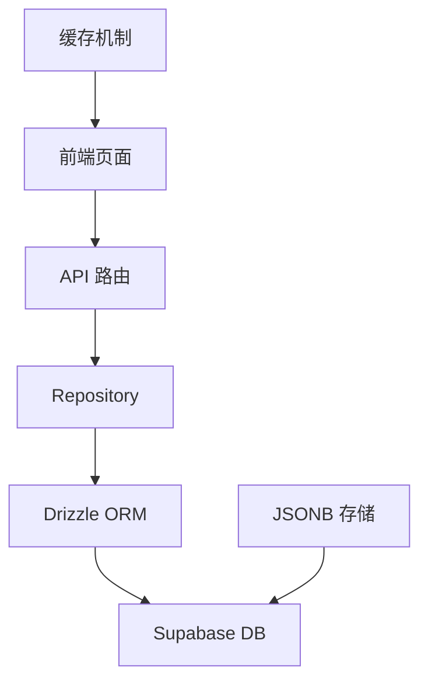
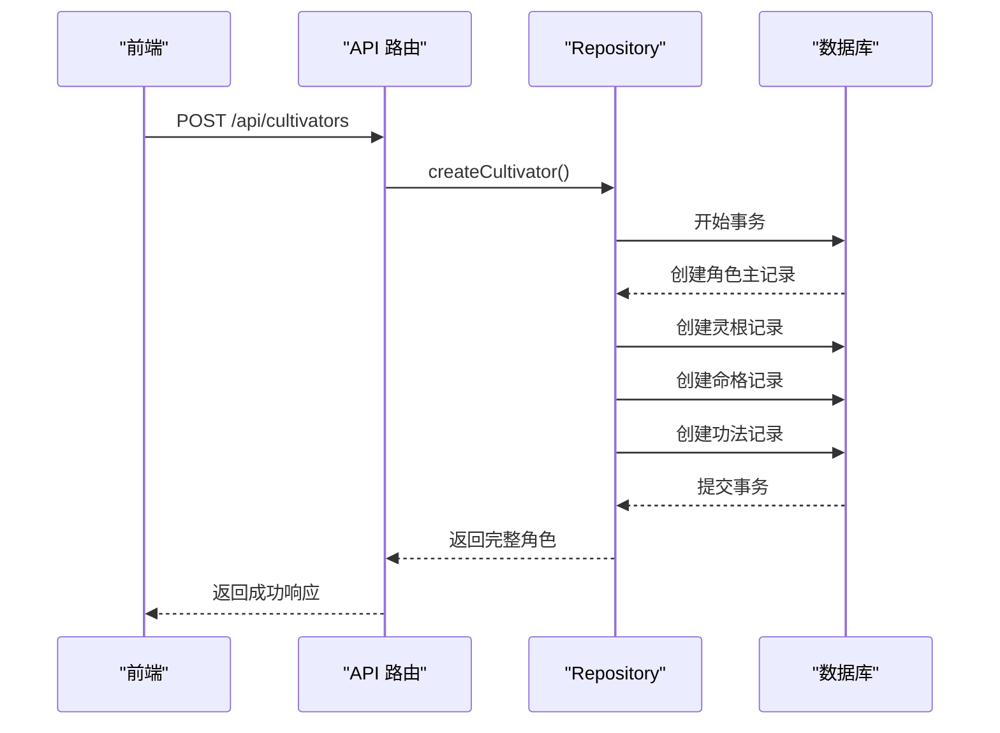
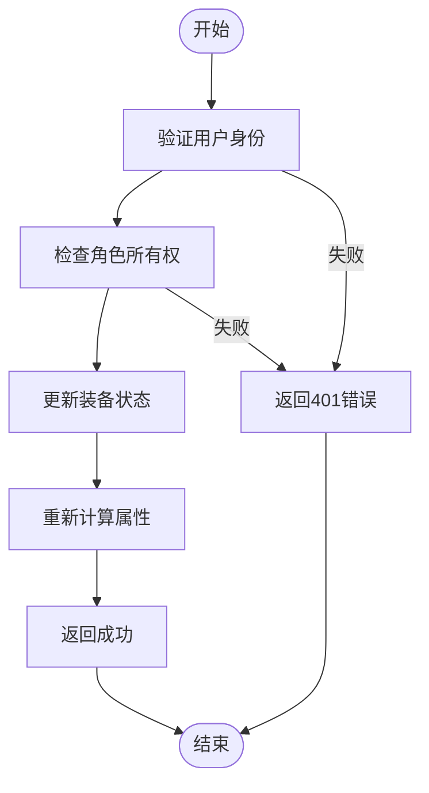
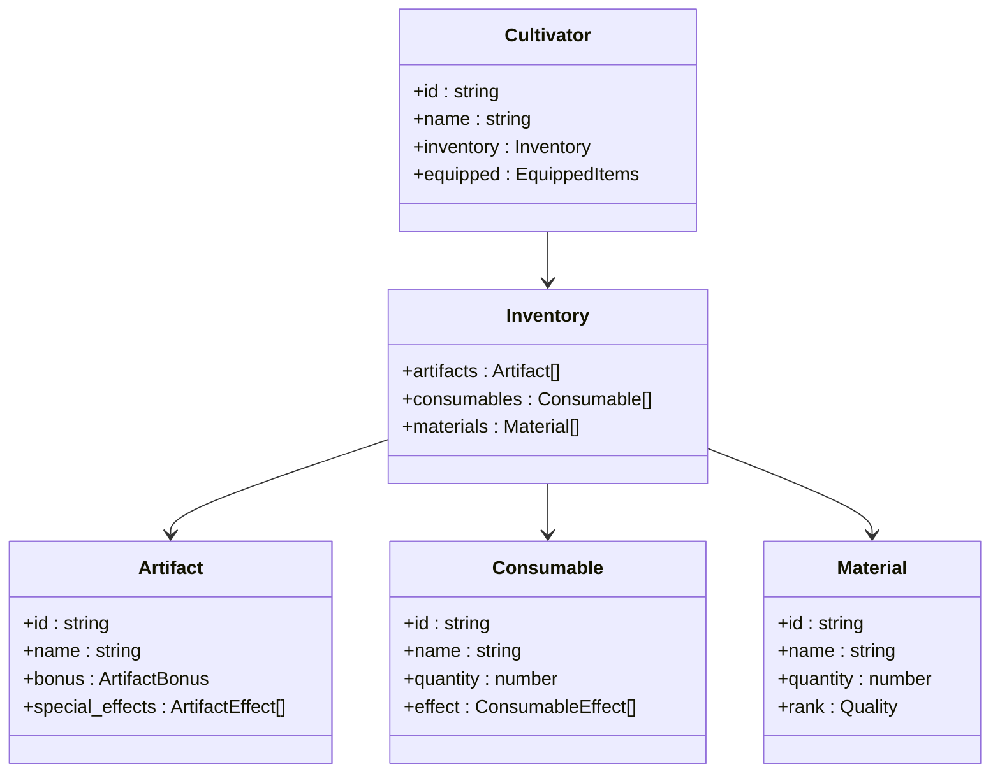
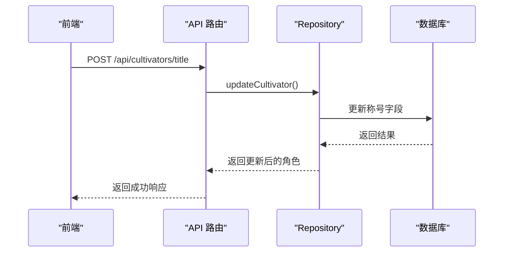
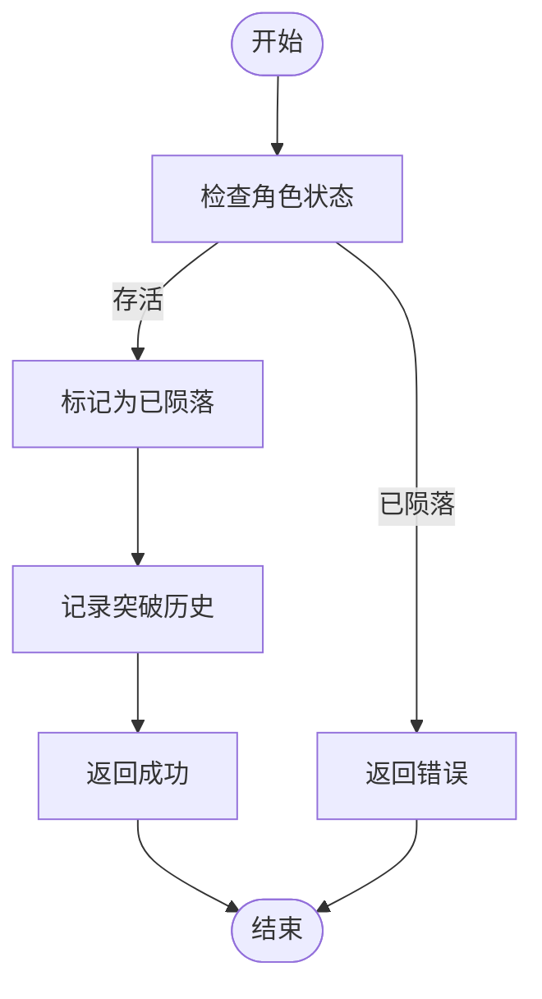
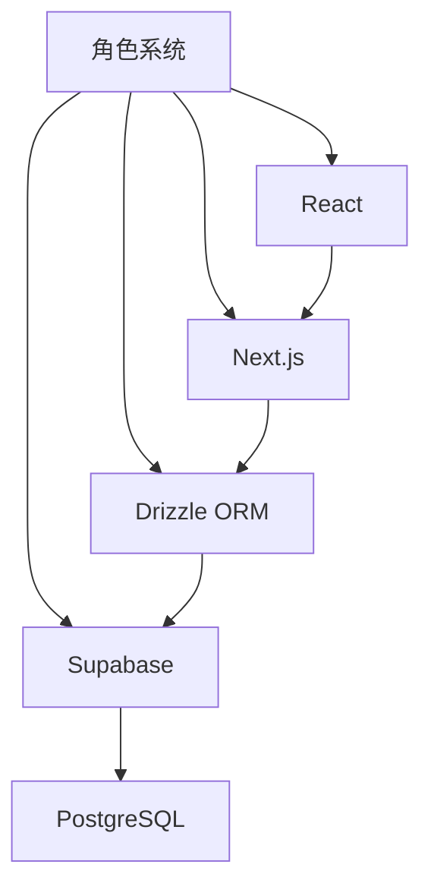

# 角色系统

<cite>
**本文档引用文件**  
- [page.tsx](file://app/cultivator/page.tsx)
- [useCultivatorBundle.ts](file://lib/hooks/useCultivatorBundle.ts)
- [cultivatorRepository.ts](file://lib/repositories/cultivatorRepository.ts)
- [cultivator.ts](file://types/cultivator.ts)
- [schema.ts](file://lib/drizzle/schema.ts)
- [route.ts](file://app/api/cultivators/route.ts)
- [active-reincarnate/route.ts](file://app/api/cultivators/active-reincarnate/route.ts)
- [reincarnate-context/route.ts](file://app/api/cultivators/reincarnate-context/route.ts)
- [title/route.ts](file://app/api/cultivators/title/route.ts)
- [skills/forget/route.ts](file://app/api/cultivators/skills/forget/route.ts)
- [yield/route.ts](file://app/api/cultivators/yield/route.ts)
- [useSkillsViewModel.tsx](file://app/(main)/skills/hooks/useSkillsViewModel.tsx)
</cite>

## 更新摘要
**已做更改**  
- 更新了“技能遗忘与称号修改”章节，新增对 `useSkillsViewModel` 的分析
- 新增“技能系统重构”章节，详细说明 ViewModel 模式的设计与优势
- 更新“架构概述”以反映技能系统的状态与 UI 分离
- 更新“详细组件分析”中的技能遗忘流程图
- 更新文档引用文件列表，加入 `useSkillsViewModel.tsx`

## 目录
1. [简介](#简介)
2. [项目结构](#项目结构)
3. [核心组件](#核心组件)
4. [架构概述](#架构概述)
5. [详细组件分析](#详细组件分析)
6. [依赖分析](#依赖分析)
7. [性能考虑](#性能考虑)
8. [故障排除指南](#故障排除指南)
9. [结论](#结论)

## 简介
本文档详细阐述了修仙游戏中的角色系统，涵盖角色创建、属性管理、装备操作、资源消耗、历史回溯、储物袋管理、技能遗忘、称号修改、产出收益、轮回转世等核心功能。通过分析 `/app/cultivator/page.tsx` 页面与相关 API 路由，说明前端交互流程与后端处理逻辑。解释 `cultivatorRepository` 如何封装数据访问，`useCultivatorBundle` 如何聚合状态。描述 JSONB 字段在 Supabase 中存储复杂角色数据的设计优势。提供角色状态变更的典型调用链示例，并说明轮回机制中的数据重置策略。针对常见问题如状态不同步、装备失败等提供排查建议。

## 项目结构
项目采用基于功能的组织结构，主要模块包括：
- `app/`：Next.js 应用页面和 API 路由
- `components/`：可复用 UI 组件
- `lib/`：核心逻辑库，包括 hooks、repositories 和 services
- `types/`：TypeScript 类型定义
- `utils/`：工具函数
- `drizzle/`：数据库迁移和 schema 定义

角色系统的核心功能集中在 `app/cultivators` API 路由和 `app/cultivator/page.tsx` 页面中，数据访问通过 `lib/repositories/cultivatorRepository.ts` 封装，状态管理通过 `lib/hooks/useCultivatorBundle.ts` 实现。

**图示来源**
- [page.tsx](file://app/cultivator/page.tsx)
- [useCultivatorBundle.ts](file://lib/hooks/useCultivatorBundle.ts)
- [cultivatorRepository.ts](file://lib/repositories/cultivatorRepository.ts)
- [schema.ts](file://lib/drizzle/schema.ts)

## 核心组件
角色系统的核心组件包括：
- `useCultivatorBundle`：客户端状态聚合 Hook，负责从多个 API 端点获取并缓存角色数据
- `cultivatorRepository`：服务器端数据访问层，封装对数据库的 CRUD 操作
- `/app/cultivator/page.tsx`：角色详情页面，展示角色所有信息并提供操作入口
- 各类 API 路由：处理角色相关的各种操作请求

这些组件共同构成了角色系统的完整功能链，从前端展示到后端数据持久化。

**组件来源**
- [page.tsx](file://app/cultivator/page.tsx)
- [useCultivatorBundle.ts](file://lib/hooks/useCultivatorBundle.ts)
- [cultivatorRepository.ts](file://lib/repositories/cultivatorRepository.ts)

## 架构概述
角色系统采用分层架构设计，分为表现层、业务逻辑层和数据访问层。前端通过 React 组件树展示角色信息，使用自定义 Hook 聚合状态；后端通过 Next.js API 路由接收请求，调用 Repository 层处理业务逻辑，最终通过 Drizzle ORM 操作 Supabase 数据库。

系统利用 JSONB 字段在数据库中存储复杂嵌套数据（如法宝的特殊效果），既保持了关系型数据库的结构化优势，又获得了 NoSQL 的灵活性。这种混合存储策略特别适合修仙游戏中复杂的角色属性和装备系统。

**图示来源**
- [page.tsx](file://app/cultivator/page.tsx)
- [cultivatorRepository.ts](file://lib/repositories/cultivatorRepository.ts)
- [schema.ts](file://lib/drizzle/schema.ts)

## 详细组件分析
### 角色创建与属性管理
角色创建通过 `createCultivator` 函数实现，该函数在事务中创建角色主记录及其关联的灵根、命格、功法等数据。属性管理通过 `updateCultivator` 函数实现，支持更新角色的基本信息和属性值。

**图示来源**
- [cultivatorRepository.ts](file://lib/repositories/cultivatorRepository.ts)
- [schema.ts](file://lib/drizzle/schema.ts)

### 装备操作与资源消耗
装备操作通过 `/api/cultivators/[id]/equip` 路由处理，更新 `equippedItems` 表中的装备状态。资源消耗功能通过 `yield` 路由实现，更新角色的灵石数量和上次产出时间。

**图示来源**
- [cultivatorRepository.ts](file://lib/repositories/cultivatorRepository.ts)
- [schema.ts](file://lib/drizzle/schema.ts)

### 历史回溯与储物袋管理
历史回溯功能通过 `retreatRecords` 和 `breakthroughHistory` 表记录角色的闭关和突破历史。储物袋管理通过 `inventory` 对象的 `artifacts`、`consumables` 和 `materials` 数组实现，分别存储法宝、消耗品和材料。

**图示来源**
- [cultivator.ts](file://types/cultivator.ts)
- [schema.ts](file://lib/drizzle/schema.ts)

### 技能遗忘与称号修改
技能遗忘通过 `/api/cultivators/skills/forget` 路由实现，删除指定技能记录。称号修改通过 `/api/cultivators/title` 路由实现，更新角色的称号字段。

**图示来源**
- [title/route.ts](file://app/api/cultivators/title/route.ts)
- [cultivatorRepository.ts](file://lib/repositories/cultivatorRepository.ts)

### 产出收益与轮回转世
产出收益通过 `/api/cultivators/yield` 路由实现，增加角色的灵石数量并更新产出时间。轮回转世通过 `/api/cultivators/active-reincarnate` 路由实现，将角色状态标记为“已陨落”并记录突破历史。

**图示来源**
- [active-reincarnate/route.ts](file://app/api/cultivators/active-reincarnate/route.ts)
- [cultivatorRepository.ts](file://lib/repositories/cultivatorRepository.ts)

## 依赖分析
角色系统依赖于多个核心模块：
- **Supabase**：作为数据库和身份验证服务
- **Drizzle ORM**：作为数据库访问层
- **Next.js**：作为应用框架和 API 路由
- **React**：作为前端 UI 框架

这些依赖通过清晰的接口隔离，确保了系统的可维护性和可扩展性。特别是 Repository 模式的设计，使得数据库访问逻辑与业务逻辑分离，便于未来可能的数据库迁移。

**图示来源**
- [cultivatorRepository.ts](file://lib/repositories/cultivatorRepository.ts)
- [schema.ts](file://lib/drizzle/schema.ts)

## 性能考虑
角色系统的性能优化主要体现在以下几个方面：
1. **数据聚合**：`useCultivatorBundle` Hook 通过并行请求和客户端缓存减少服务器负载
2. **数据库索引**：在关键字段（如 `userId`、`cultivatorId`）上建立索引，提高查询效率
3. **JSONB 存储**：使用 JSONB 字段存储复杂数据，减少表连接操作
4. **事务处理**：在创建和更新操作中使用数据库事务，确保数据一致性

这些优化措施共同保证了角色系统在高并发场景下的稳定性和响应速度。

## 故障排除指南
### 状态不同步问题
当出现前端显示与后端数据不一致时，可按以下步骤排查：
1. 检查 `useCultivatorBundle` 的缓存机制是否正常工作
2. 验证 API 响应数据是否正确
3. 确认数据库更新是否成功
4. 检查网络请求是否存在错误

### 装备失败问题
当装备操作失败时，应检查：
1. 角色是否拥有该装备
2. 装备的境界要求是否满足
3. 数据库更新权限是否正常
4. 事务处理是否存在异常

### 轮回转世异常
当轮回转世功能异常时，需验证：
1. 角色状态是否为“存活”
2. 突破历史记录是否正确创建
3. 角色所有权验证是否通过
4. 数据库事务是否完整提交

## 结论
本文档全面分析了修仙游戏的角色系统，涵盖了从创建到轮回的完整生命周期。系统采用分层架构和 Repository 模式，确保了代码的可维护性和可扩展性。通过 JSONB 字段的巧妙使用，实现了复杂角色数据的高效存储。前端通过自定义 Hook 聚合状态，提供了流畅的用户体验。整体设计充分考虑了性能和可靠性，为修仙游戏的核心玩法提供了坚实的基础。