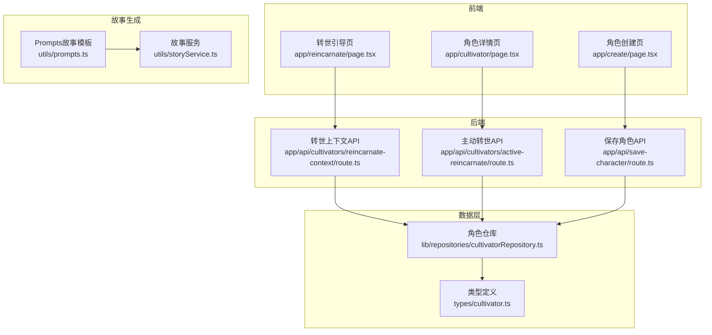
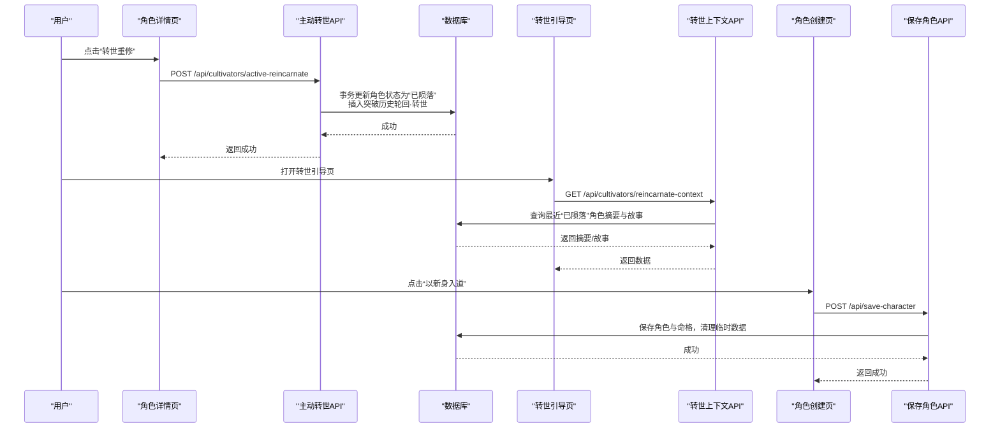
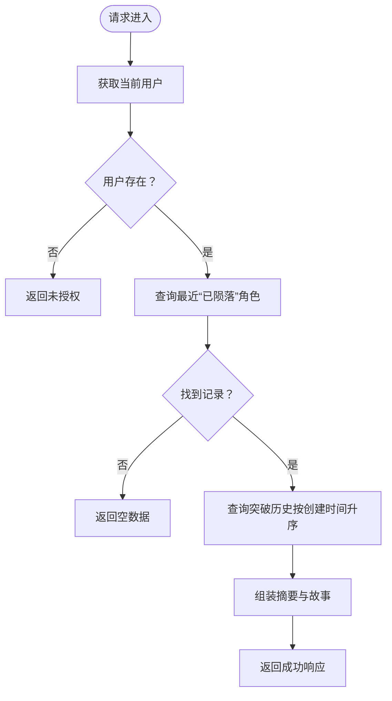
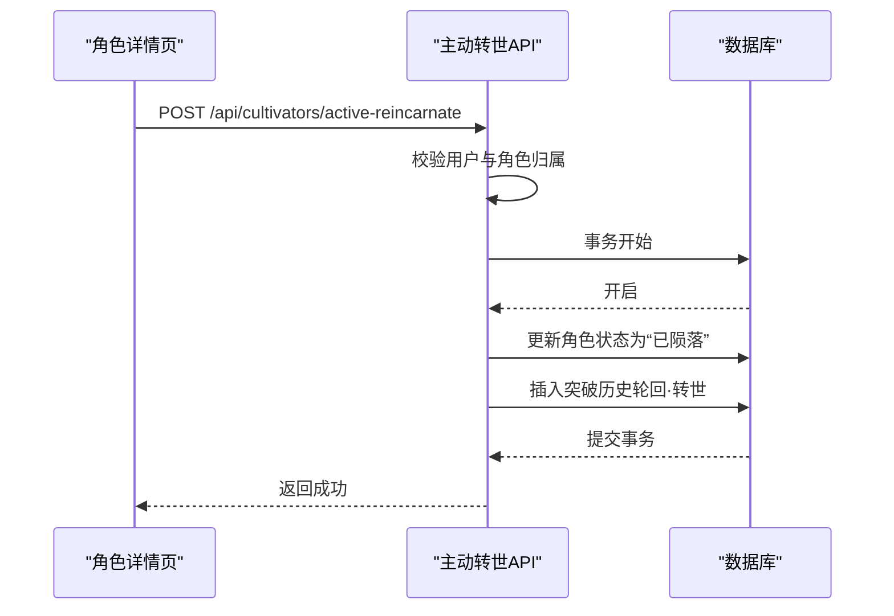
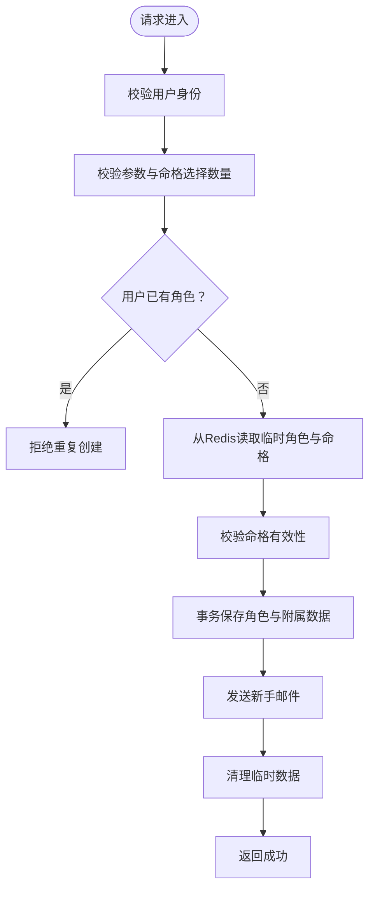
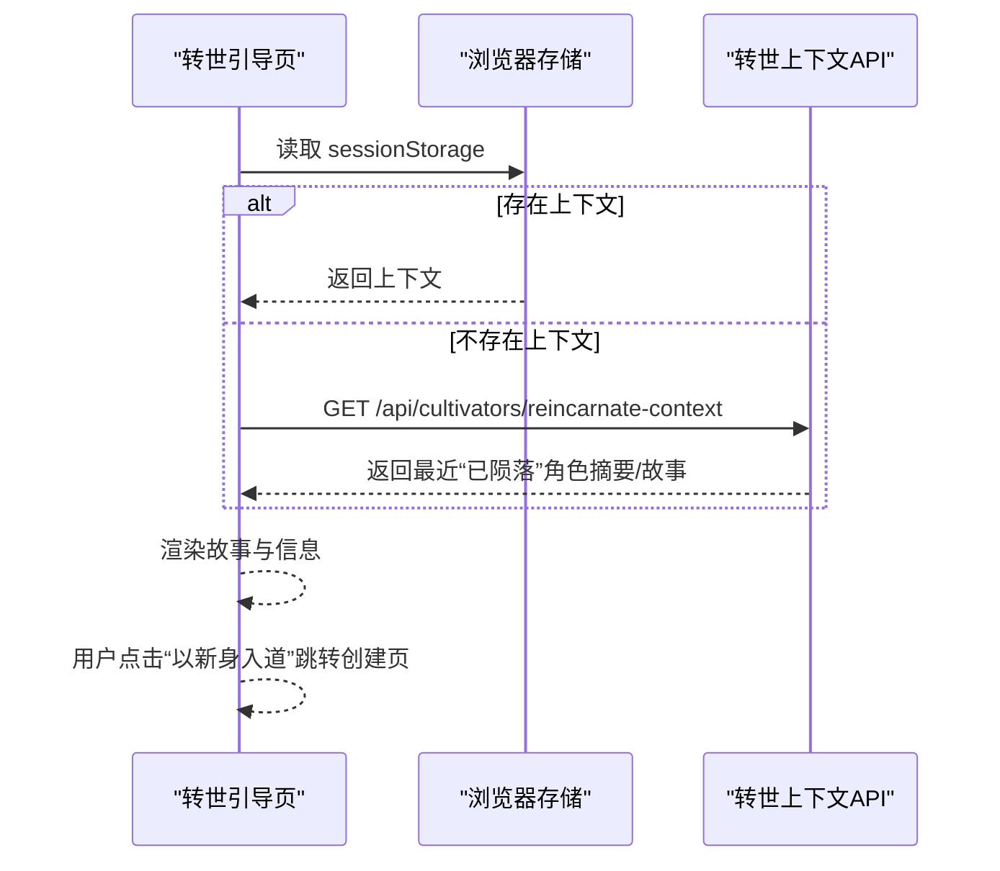
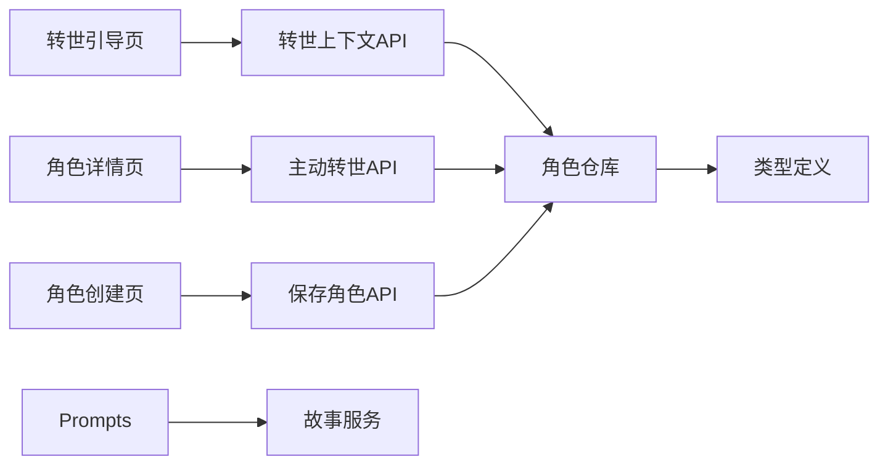

# 轮回转世

<cite>
**本文引用的文件**
- [app/api/cultivators/active-reincarnate/route.ts](file://app/api/cultivators/active-reincarnate/route.ts)
- [app/api/cultivators/reincarnate-context/route.ts](file://app/api/cultivators/reincarnate-context/route.ts)
- [lib/repositories/cultivatorRepository.ts](file://lib/repositories/cultivatorRepository.ts)
- [app/reincarnate/page.tsx](file://app/reincarnate/page.tsx)
- [app/cultivator/page.tsx](file://app/cultivator/page.tsx)
- [app/create/page.tsx](file://app/create/page.tsx)
- [app/api/save-character/route.ts](file://app/api/save-character/route.ts)
- [types/cultivator.ts](file://types/cultivator.ts)
- [utils/prompts.ts](file://utils/prompts.ts)
- [utils/storyService.ts](file://utils/storyService.ts)
- [tupo.md](file://tupo.md)
</cite>

## 目录
1. [简介](#简介)
2. [项目结构](#项目结构)
3. [核心组件](#核心组件)
4. [架构总览](#架构总览)
5. [详细组件分析](#详细组件分析)
6. [依赖关系分析](#依赖关系分析)
7. [性能考量](#性能考量)
8. [故障排查指南](#故障排查指南)
9. [结论](#结论)

## 简介
本文件系统化梳理“轮回转世”功能，围绕角色死亡判定、转世条件、前世记忆继承与数据重置策略展开，结合后端 API 与前端页面，说明转世 API 如何生成新角色并保留关键命格与修为记忆；解释 getLastDeadCultivatorSummary 在 cultivatorRepository 中的实现；阐述转世后属性、技能、灵根的继承规则；并给出转世失败、记忆丢失等异常情况的解决方案。

## 项目结构
轮回转世涉及前后端多处模块协同：
- 前端页面
  - 转世引导页：展示前世故事与跳转入口
  - 角色详情页：提供主动转世入口
  - 角色创建页：保存新角色（含命格）
- 后端 API
  - 转世上下文查询：获取最近一次“坐化”角色的摘要与故事
  - 主动转世：标记角色为“已陨落”，并写入突破历史
  - 角色保存：将临时角色与命格持久化为正式角色

图表来源
- [app/reincarnate/page.tsx](file://app/reincarnate/page.tsx#L1-L96)
- [app/cultivator/page.tsx](file://app/cultivator/page.tsx#L113-L186)
- [app/create/page.tsx](file://app/create/page.tsx#L1-L562)
- [app/api/cultivators/reincarnate-context/route.ts](file://app/api/cultivators/reincarnate-context/route.ts#L1-L44)
- [app/api/cultivators/active-reincarnate/route.ts](file://app/api/cultivators/active-reincarnate/route.ts#L1-L82)
- [app/api/save-character/route.ts](file://app/api/save-character/route.ts#L1-L128)
- [lib/repositories/cultivatorRepository.ts](file://lib/repositories/cultivatorRepository.ts#L540-L578)
- [types/cultivator.ts](file://types/cultivator.ts#L218-L253)
- [utils/prompts.ts](file://utils/prompts.ts#L160-L241)
- [utils/storyService.ts](file://utils/storyService.ts#L1-L21)

章节来源
- [app/reincarnate/page.tsx](file://app/reincarnate/page.tsx#L1-L96)
- [app/cultivator/page.tsx](file://app/cultivator/page.tsx#L113-L186)
- [app/create/page.tsx](file://app/create/page.tsx#L1-L562)
- [app/api/cultivators/reincarnate-context/route.ts](file://app/api/cultivators/reincarnate-context/route.ts#L1-L44)
- [app/api/cultivators/active-reincarnate/route.ts](file://app/api/cultivators/active-reincarnate/route.ts#L1-L82)
- [app/api/save-character/route.ts](file://app/api/save-character/route.ts#L1-L128)
- [lib/repositories/cultivatorRepository.ts](file://lib/repositories/cultivatorRepository.ts#L540-L578)
- [types/cultivator.ts](file://types/cultivator.ts#L218-L253)
- [utils/prompts.ts](file://utils/prompts.ts#L160-L241)
- [utils/storyService.ts](file://utils/storyService.ts#L1-L21)

## 核心组件
- 转世上下文 API：根据当前用户获取最近一次“已陨落”角色的摘要与故事，用于转世引导页展示。
- 主动转世 API：将指定角色标记为“已陨落”，并写入一条特殊的突破历史条目，作为“轮回·转世”的记录。
- 角色保存 API：将临时角色与命格持久化为正式角色，生成新角色。
- 角色仓库：提供 getLastDeadCultivatorSummary 等查询方法，支撑转世上下文与主动转世流程。
- 类型定义：统一角色、命格、功法、技能等数据结构，保证前后端一致。
- 故事生成：基于 Prompts 与 StoryService 生成突破/坐化故事，用于 UI 展示与转世引导。

章节来源
- [app/api/cultivators/reincarnate-context/route.ts](file://app/api/cultivators/reincarnate-context/route.ts#L1-L44)
- [app/api/cultivators/active-reincarnate/route.ts](file://app/api/cultivators/active-reincarnate/route.ts#L1-L82)
- [app/api/save-character/route.ts](file://app/api/save-character/route.ts#L1-L128)
- [lib/repositories/cultivatorRepository.ts](file://lib/repositories/cultivatorRepository.ts#L540-L578)
- [types/cultivator.ts](file://types/cultivator.ts#L218-L253)
- [utils/prompts.ts](file://utils/prompts.ts#L160-L241)
- [utils/storyService.ts](file://utils/storyService.ts#L1-L21)

## 架构总览
轮回转世的端到端流程如下：
- 用户在角色详情页发起“转世重修”，弹窗确认后调用主动转世 API。
- 主动转世 API 将角色状态置为“已陨落”，并向突破历史表插入一条“轮回·转世”的记录。
- 转世引导页通过转世上下文 API 查询最近一次“已陨落”角色的摘要与故事。
- 用户点击“以新身入道”，进入角色创建页，选择命格后调用保存角色 API，生成新角色。
- 保存角色 API 会清理临时数据，确保流程闭环。

图表来源
- [app/cultivator/page.tsx](file://app/cultivator/page.tsx#L113-L186)
- [app/api/cultivators/active-reincarnate/route.ts](file://app/api/cultivators/active-reincarnate/route.ts#L1-L82)
- [app/reincarnate/page.tsx](file://app/reincarnate/page.tsx#L1-L96)
- [app/api/cultivators/reincarnate-context/route.ts](file://app/api/cultivators/reincarnate-context/route.ts#L1-L44)
- [app/create/page.tsx](file://app/create/page.tsx#L1-L562)
- [app/api/save-character/route.ts](file://app/api/save-character/route.ts#L1-L128)

## 详细组件分析

### 转世上下文 API：getLastDeadCultivatorSummary
- 功能目标：为转世引导页提供最近一次“已陨落”角色的摘要与故事。
- 实现要点：
  - 查询最近一次“已陨落”角色（按 updatedAt 升序取最新一条）。
  - 读取该角色对应的突破历史，取最早的一条作为故事来源（用于“轮回·转世”记录）。
  - 返回 id、name、realm、realm_stage 与 story。
- 与前端交互：
  - 转世引导页优先读取 sessionStorage 中的“刚坐化”上下文；若无则调用该 API 获取最近“已陨落”角色信息。

图表来源
- [app/api/cultivators/reincarnate-context/route.ts](file://app/api/cultivators/reincarnate-context/route.ts#L1-L44)
- [lib/repositories/cultivatorRepository.ts](file://lib/repositories/cultivatorRepository.ts#L540-L578)

章节来源
- [app/api/cultivators/reincarnate-context/route.ts](file://app/api/cultivators/reincarnate-context/route.ts#L1-L44)
- [lib/repositories/cultivatorRepository.ts](file://lib/repositories/cultivatorRepository.ts#L540-L578)

### 主动转世 API：标记角色为“已陨落”并写入转世记录
- 功能目标：允许玩家主动发起“兵解”式转世，将角色状态置为“已陨落”，并记录“轮回·转世”的突破历史。
- 实现要点：
  - 校验用户身份与角色归属。
  - 拒绝重复“已陨落”角色。
  - 使用数据库事务：
    - 更新角色状态为“已陨落”，记录死亡时间。
    - 插入一条突破历史，from/to 均为当前状态，to_realm/to_stage 标记为“轮回·转世”，附带故事文案。
- 与前端交互：
  - 角色详情页弹窗确认后调用该 API，成功后引导至转世引导页。

图表来源
- [app/cultivator/page.tsx](file://app/cultivator/page.tsx#L113-L186)
- [app/api/cultivators/active-reincarnate/route.ts](file://app/api/cultivators/active-reincarnate/route.ts#L1-L82)

章节来源
- [app/api/cultivators/active-reincarnate/route.ts](file://app/api/cultivators/active-reincarnate/route.ts#L1-L82)
- [app/cultivator/page.tsx](file://app/cultivator/page.tsx#L113-L186)

### 角色保存 API：生成新角色并保留关键命格
- 功能目标：将临时角色与命格持久化为正式角色，生成新角色。
- 实现要点：
  - 校验用户身份与输入参数。
  - 检查用户是否已有角色，避免重复创建。
  - 从 Redis 获取临时角色与命格，进行合法性校验与选择。
  - 使用事务保存角色主表、灵根、命格、功法、技能、初始装备状态等。
  - 发送新手邮件奖励。
  - 清理临时数据。
- 与前端交互：
  - 角色创建页选择命格后调用该 API，成功后返回首页。

图表来源
- [app/api/save-character/route.ts](file://app/api/save-character/route.ts#L1-L128)
- [app/create/page.tsx](file://app/create/page.tsx#L1-L562)

章节来源
- [app/api/save-character/route.ts](file://app/api/save-character/route.ts#L1-L128)
- [app/create/page.tsx](file://app/create/page.tsx#L1-L562)

### 转世引导页：交互流程与状态跳转
- 功能目标：展示前世故事与角色信息，引导用户进入新角色创建。
- 实现要点：
  - 优先读取 sessionStorage 中的“刚坐化”上下文；若无则调用转世上下文 API。
  - 展示故事与“前世：姓名（境界）”信息。
  - 提供“以新身入道”与“返回主界”两个入口。

图表来源
- [app/reincarnate/page.tsx](file://app/reincarnate/page.tsx#L1-L96)
- [app/api/cultivators/reincarnate-context/route.ts](file://app/api/cultivators/reincarnate-context/route.ts#L1-L44)

章节来源
- [app/reincarnate/page.tsx](file://app/reincarnate/page.tsx#L1-L96)

### 转世后属性、技能、灵根的继承规则
- 命格继承：当前实现中，转世后的新角色不自动继承前世的命格；命格在新角色创建阶段由玩家重新选择。
- 技能与功法：当前实现中，转世后的新角色不自动继承前世的技能与功法；新角色创建阶段由玩家重新生成。
- 灵根：当前实现中，转世后的新角色不自动继承前世的灵根；新角色创建阶段由 AI 重新生成。
- 前世记忆保留：通过“轮回·转世”的突破历史记录与转世上下文 API，保留“故事文案”与“前世姓名/境界”信息，用于 UI 展示与转世引导。

章节来源
- [app/api/cultivators/active-reincarnate/route.ts](file://app/api/cultivators/active-reincarnate/route.ts#L1-L82)
- [app/api/cultivators/reincarnate-context/route.ts](file://app/api/cultivators/reincarnate-context/route.ts#L1-L44)
- [lib/repositories/cultivatorRepository.ts](file://lib/repositories/cultivatorRepository.ts#L540-L578)
- [app/api/save-character/route.ts](file://app/api/save-character/route.ts#L1-L128)
- [app/create/page.tsx](file://app/create/page.tsx#L1-L562)

### 转世失败与记忆丢失的异常处理
- 转世失败（非主动转世）：当闭关导致寿元耗尽且突破失败时，系统生成“坐化故事”，并通过转世引导页展示，引导玩家进入轮回。
- 记忆丢失：
  - 转世上下文 API 依赖“已陨落”角色与突破历史；若数据库中无对应记录，将返回空数据。
  - 临时数据过期：保存角色 API 会校验临时数据是否存在，若缺失则提示重新生成。
- 前端兜底：
  - 转世引导页优先读取 sessionStorage，若解析失败会清理并降级为无上下文。
  - 保存角色 API 在开发环境会返回具体错误信息，生产环境统一提示“请稍后再试”。

章节来源
- [tupo.md](file://tupo.md#L108-L126)
- [utils/prompts.ts](file://utils/prompts.ts#L204-L241)
- [utils/storyService.ts](file://utils/storyService.ts#L1-L21)
- [app/reincarnate/page.tsx](file://app/reincarnate/page.tsx#L1-L96)
- [app/api/save-character/route.ts](file://app/api/save-character/route.ts#L1-L128)
- [app/api/cultivators/reincarnate-context/route.ts](file://app/api/cultivators/reincarnate-context/route.ts#L1-L44)

## 依赖关系分析
- 前端依赖后端 API：
  - 转世引导页依赖转世上下文 API。
  - 角色详情页依赖主动转世 API。
  - 角色创建页依赖保存角色 API。
- 后端依赖数据层：
  - 转世上下文 API 依赖角色仓库的 getLastDeadCultivatorSummary。
  - 主动转世 API 依赖数据库事务与突破历史表。
  - 保存角色 API 依赖角色仓库与 Redis 临时数据。
- 类型与故事：
  - 类型定义统一角色结构。
  - 故事生成依赖 Prompts 与 StoryService。

图表来源
- [app/reincarnate/page.tsx](file://app/reincarnate/page.tsx#L1-L96)
- [app/cultivator/page.tsx](file://app/cultivator/page.tsx#L113-L186)
- [app/create/page.tsx](file://app/create/page.tsx#L1-L562)
- [app/api/cultivators/reincarnate-context/route.ts](file://app/api/cultivators/reincarnate-context/route.ts#L1-L44)
- [app/api/cultivators/active-reincarnate/route.ts](file://app/api/cultivators/active-reincarnate/route.ts#L1-L82)
- [app/api/save-character/route.ts](file://app/api/save-character/route.ts#L1-L128)
- [lib/repositories/cultivatorRepository.ts](file://lib/repositories/cultivatorRepository.ts#L540-L578)
- [types/cultivator.ts](file://types/cultivator.ts#L218-L253)
- [utils/prompts.ts](file://utils/prompts.ts#L160-L241)
- [utils/storyService.ts](file://utils/storyService.ts#L1-L21)

## 性能考量
- 并发与事务：主动转世与保存角色均使用数据库事务，确保一致性与原子性。
- 异步加载：角色仓库在组装角色时采用并行查询多个子表，减少往返次数。
- 前端缓存：转世引导页优先使用 sessionStorage，降低网络请求与 API 压力。
- 临时数据清理：保存角色后及时清理 Redis 临时数据，避免资源浪费。

章节来源
- [app/api/cultivators/active-reincarnate/route.ts](file://app/api/cultivators/active-reincarnate/route.ts#L1-L82)
- [app/api/save-character/route.ts](file://app/api/save-character/route.ts#L1-L128)
- [lib/repositories/cultivatorRepository.ts](file://lib/repositories/cultivatorRepository.ts#L1-L177)
- [app/reincarnate/page.tsx](file://app/reincarnate/page.tsx#L1-L96)

## 故障排查指南
- 未授权访问
  - 现象：API 返回未授权。
  - 排查：确认 Supabase 用户态是否正确；检查路由守卫。
- 角色不存在或无权限
  - 现象：主动转世返回错误。
  - 排查：确认传入的 cultivatorId 是否属于当前用户。
- 已身死道消
  - 现象：主动转世返回“该角色已身死道消”。
  - 排查：确认角色状态不是“已陨落”。
- 临时数据过期
  - 现象：保存角色返回“角色数据已过期，请重新生成”。
  - 排查：确认 Redis 中临时数据是否仍在；必要时重新生成角色。
- 气运数据丢失
  - 现象：保存角色返回“气运数据丢失，请重新生成”。
  - 排查：确认 Redis 中命格数据是否存在；重新生成命格。
- 转世上下文为空
  - 现象：转世引导页无前世故事。
  - 排查：确认数据库中是否存在“已陨落”角色与突破历史；检查 API 返回。

章节来源
- [app/api/cultivators/active-reincarnate/route.ts](file://app/api/cultivators/active-reincarnate/route.ts#L1-L82)
- [app/api/save-character/route.ts](file://app/api/save-character/route.ts#L1-L128)
- [app/api/cultivators/reincarnate-context/route.ts](file://app/api/cultivators/reincarnate-context/route.ts#L1-L44)
- [app/reincarnate/page.tsx](file://app/reincarnate/page.tsx#L1-L96)

## 结论
- 轮回转世通过“主动转世 API + 转世上下文 API + 角色保存 API”形成闭环，既满足玩家主动转世的需求，也支持“寿元耗尽”后的被动转世引导。
- 当前实现保留了“前世故事文案”与“前世姓名/境界”等记忆信息，但未继承命格、技能、功法与灵根；新角色创建阶段由玩家重新生成，确保公平性与可玩性。
- 建议在后续版本中考虑“轻微继承”机制（如初始悟性小幅加成），并在 UI 中体现“前世余荫”，进一步增强叙事与代入感。