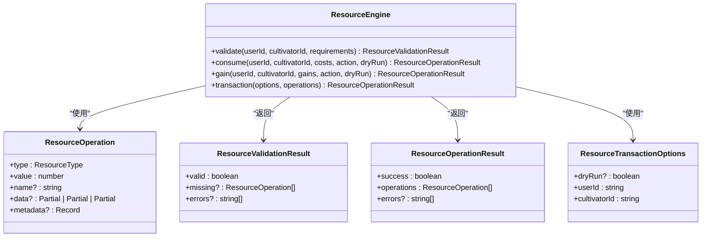
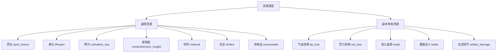
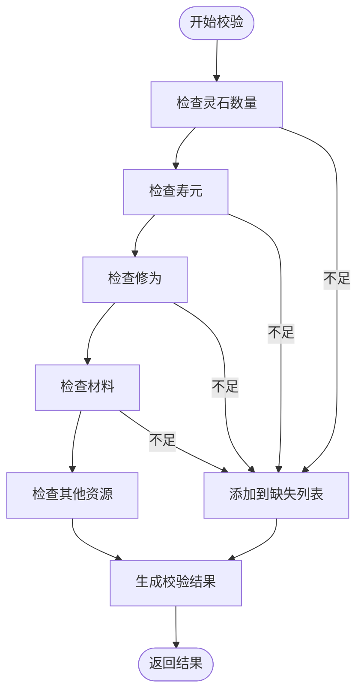
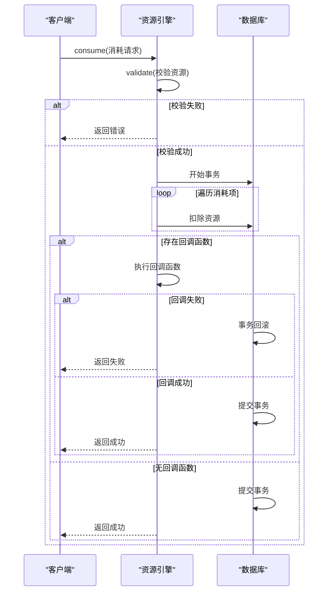
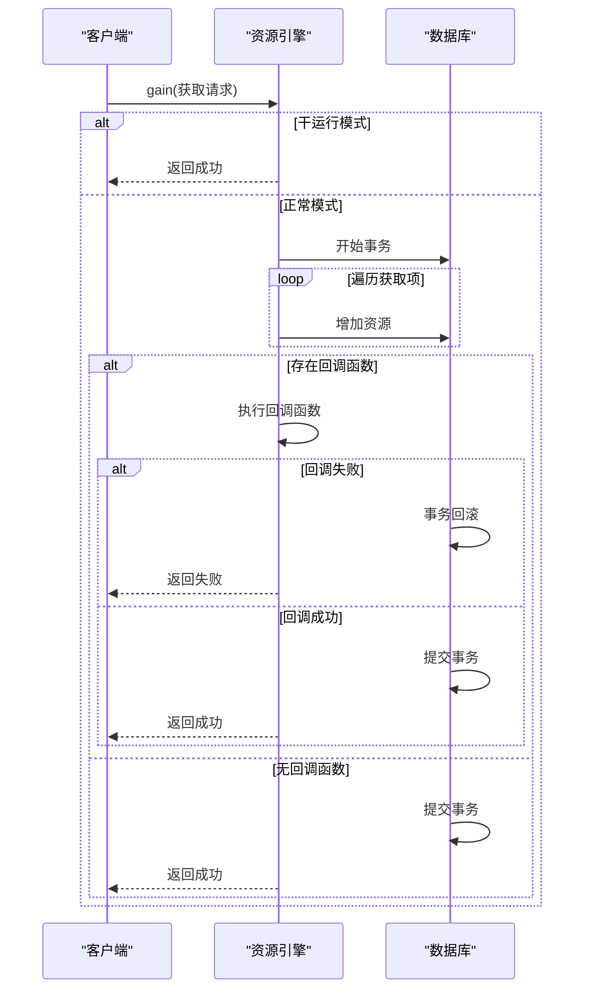
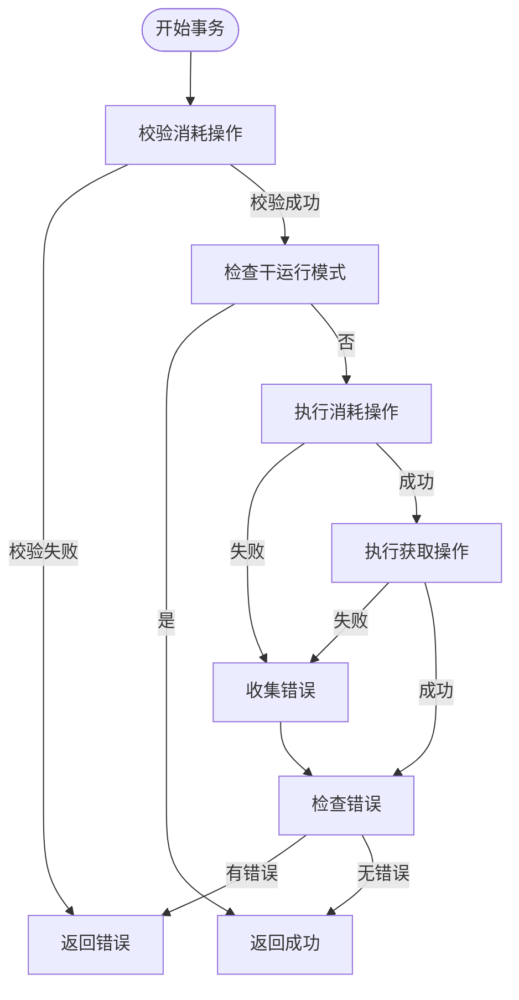
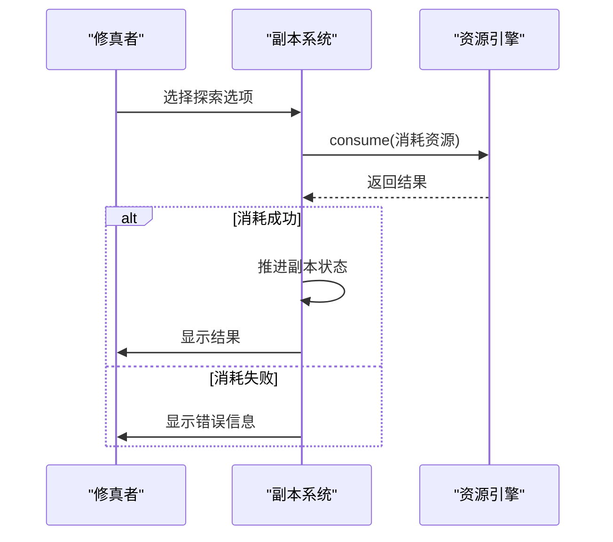
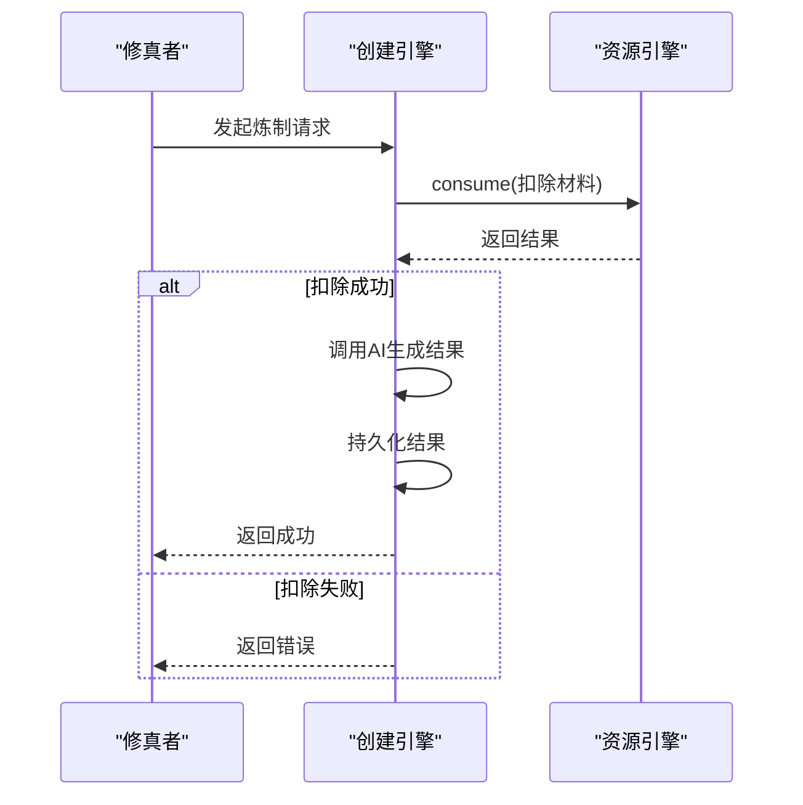
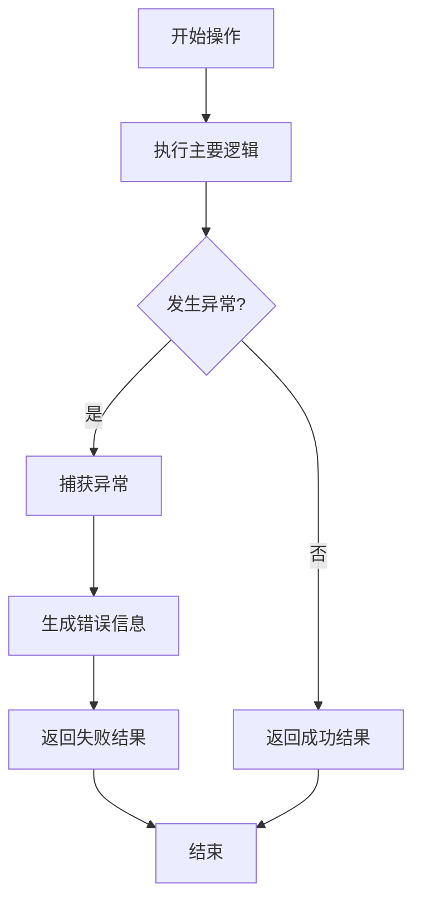
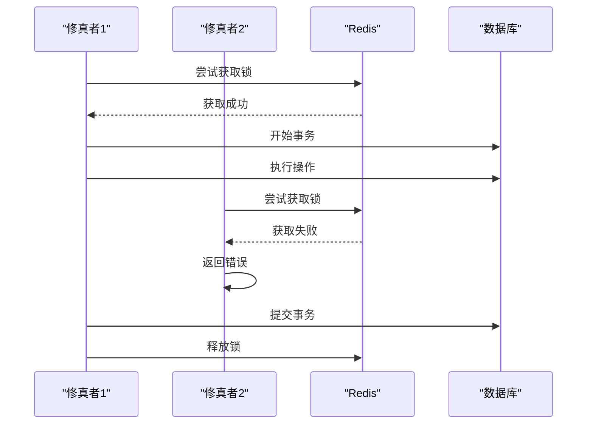

# 资源管理引擎

<cite>
**本文档引用的文件**  
- [ResourceEngine.ts](file://engine/resource/ResourceEngine.ts)
- [types.ts](file://engine/resource/types.ts)
- [cultivatorRepository.ts](file://lib/repositories/cultivatorRepository.ts)
- [service_v2.ts](file://lib/dungeon/service_v2.ts)
- [BattleEngine.v2.ts](file://engine/battle/BattleEngine.v2.ts)
- [CreationEngine.ts](file://engine/creation/CreationEngine.ts)
</cite>

## 目录
1. [简介](#简介)
2. [核心架构](#核心架构)
3. [资源操作类型](#资源操作类型)
4. [核心功能分析](#核心功能分析)
5. [事务处理机制](#事务处理机制)
6. [与其他系统的集成](#与其他系统的集成)
7. [错误处理与验证](#错误处理与验证)
8. [性能与并发控制](#性能与并发控制)
9. [结论](#结论)

## 简介

资源管理引擎是修仙世界中的核心经济系统，负责统一管理修真者的各类资源。该引擎提供了一套完整的资源操作接口，支持资源校验、消耗、获取和事务性批量操作，确保了游戏内经济系统的稳定性和一致性。

**Section sources**
- [ResourceEngine.ts](file://engine/resource/ResourceEngine.ts#L22-L29)

## 核心架构

资源管理引擎采用面向对象的设计模式，通过`ResourceEngine`类封装了所有资源管理功能。引擎与数据库操作、角色数据仓库等底层服务解耦，通过依赖注入的方式进行交互，提高了代码的可测试性和可维护性。

**Diagram sources**
- [ResourceEngine.ts](file://engine/resource/ResourceEngine.ts#L30-L449)
- [types.ts](file://engine/resource/types.ts#L37-L74)

**Section sources**
- [ResourceEngine.ts](file://engine/resource/ResourceEngine.ts#L30-L449)
- [types.ts](file://engine/resource/types.ts#L1-L74)

## 资源操作类型

资源管理引擎支持多种资源类型，分为通用资源和副本特有资源两大类。通用资源由资源引擎直接处理，而副本特有资源则由副本系统内部处理。

**Diagram sources**
- [types.ts](file://engine/resource/types.ts#L22-L35)

**Section sources**
- [types.ts](file://engine/resource/types.ts#L4-L35)

## 核心功能分析

资源管理引擎提供了三大核心功能：资源校验、资源消耗和资源获取。这些功能通过事务性操作确保了数据的一致性和完整性。

### 资源校验功能

资源校验功能用于检查修真者是否拥有足够的资源来执行特定操作。该功能会遍历所有资源需求，逐一检查每种资源的可用性。

**Diagram sources**
- [ResourceEngine.ts](file://engine/resource/ResourceEngine.ts#L34-L130)

**Section sources**
- [ResourceEngine.ts](file://engine/resource/ResourceEngine.ts#L34-L130)

### 资源消耗功能

资源消耗功能在事务中执行资源扣除操作，确保了操作的原子性。该功能支持干运行模式，可以在不实际执行的情况下进行资源校验。

**Diagram sources**
- [ResourceEngine.ts](file://engine/resource/ResourceEngine.ts#L136-L245)

**Section sources**
- [ResourceEngine.ts](file://engine/resource/ResourceEngine.ts#L136-L245)

### 资源获取功能

资源获取功能与资源消耗功能类似，但在事务中执行资源增加操作。该功能同样支持回调函数和干运行模式。

**Diagram sources**
- [ResourceEngine.ts](file://engine/resource/ResourceEngine.ts#L251-L367)

**Section sources**
- [ResourceEngine.ts](file://engine/resource/ResourceEngine.ts#L251-L367)

## 事务处理机制

资源管理引擎提供了事务性批量操作功能，可以同时处理资源消耗和获取操作。该功能确保了复杂操作的原子性，避免了部分成功的情况。

**Diagram sources**
- [ResourceEngine.ts](file://engine/resource/ResourceEngine.ts#L373-L445)

**Section sources**
- [ResourceEngine.ts](file://engine/resource/ResourceEngine.ts#L373-L445)

## 与其他系统的集成

资源管理引擎被多个游戏系统所使用，包括副本系统、炼制系统和战斗系统等。这些系统通过统一的接口与资源管理引擎交互，实现了功能的解耦和复用。

### 副本系统集成

副本系统在探索过程中使用资源管理引擎来处理资源消耗和获取。当修真者选择某个选项时，系统会调用资源引擎的`consume`方法来扣除相应的资源。

**Diagram sources**
- [service_v2.ts](file://lib/dungeon/service_v2.ts#L284-L293)
- [ResourceEngine.ts](file://engine/resource/ResourceEngine.ts#L136-L245)

**Section sources**
- [service_v2.ts](file://lib/dungeon/service_v2.ts#L280-L390)
- [ResourceEngine.ts](file://engine/resource/ResourceEngine.ts#L136-L245)

### 炼制系统集成

炼制系统在处理炼制请求时，使用资源管理引擎来扣除材料和灵石等资源。创建引擎通过调用资源引擎的`consume`方法来确保资源的正确扣除。

**Diagram sources**
- [CreationEngine.ts](file://engine/creation/CreationEngine.ts#L105-L126)
- [ResourceEngine.ts](file://engine/resource/ResourceEngine.ts#L136-L245)

**Section sources**
- [CreationEngine.ts](file://engine/creation/CreationEngine.ts#L35-L134)
- [ResourceEngine.ts](file://engine/resource/ResourceEngine.ts#L136-L245)

## 错误处理与验证

资源管理引擎实现了完善的错误处理机制，确保了在各种异常情况下的系统稳定性。引擎通过try-catch块捕获异常，并返回结构化的错误信息。

**Diagram sources**
- [ResourceEngine.ts](file://engine/resource/ResourceEngine.ts#L122-L129)
- [ResourceEngine.ts](file://engine/resource/ResourceEngine.ts#L236-L244)

**Section sources**
- [ResourceEngine.ts](file://engine/resource/ResourceEngine.ts#L122-L129)
- [ResourceEngine.ts](file://engine/resource/ResourceEngine.ts#L236-L244)

## 性能与并发控制

资源管理引擎通过数据库事务和Redis锁机制来确保操作的原子性和一致性。在高并发场景下，这些机制可以有效防止数据竞争和不一致问题。

**Diagram sources**
- [CreationEngine.ts](file://engine/creation/CreationEngine.ts#L42-L52)
- [market/buy/route.ts](file://app/api/market/buy/route.ts#L36-L47)

**Section sources**
- [CreationEngine.ts](file://engine/creation/CreationEngine.ts#L42-L52)
- [market/buy/route.ts](file://app/api/market/buy/route.ts#L36-L47)

## 结论

资源管理引擎作为游戏的核心经济系统，提供了稳定、可靠的资源管理功能。通过统一的接口设计和事务性操作，引擎确保了游戏内经济系统的完整性和一致性。引擎的模块化设计和良好的错误处理机制，使其易于维护和扩展，为游戏的长期发展奠定了坚实的基础。