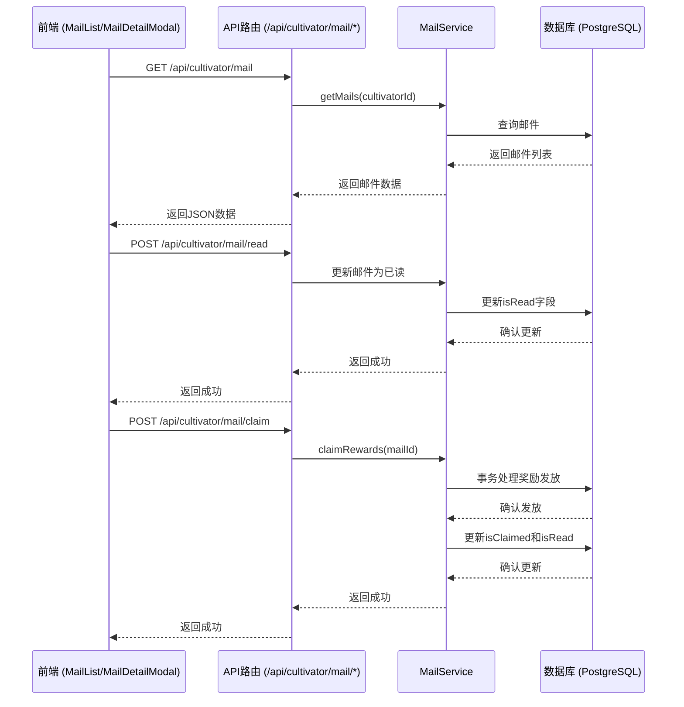
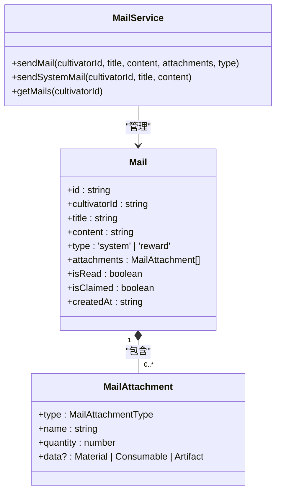
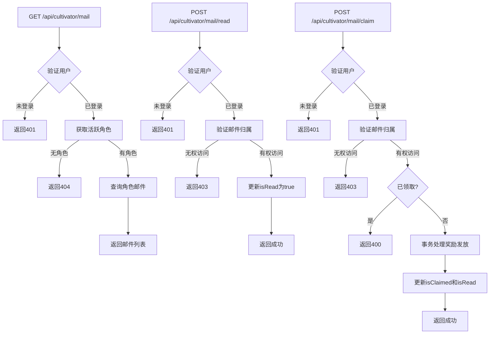
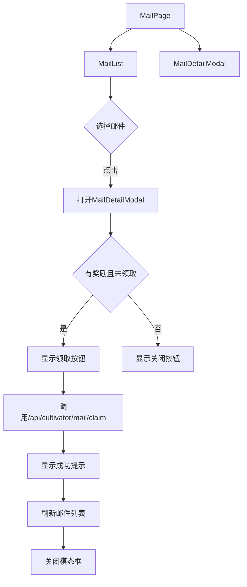
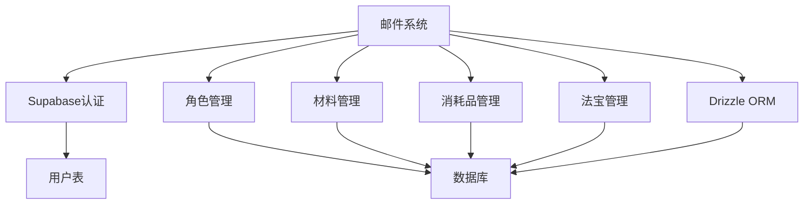

# 邮件系统

<cite>
**本文档引用文件**  
- [MailService.ts](file://lib/services/MailService.ts)
- [route.ts](file://app/api/cultivator/mail/route.ts)
- [read/route.ts](file://app/api/cultivator/mail/read/route.ts)
- [claim/route.ts](file://app/api/cultivator/mail/claim/route.ts)
- [unread-count/route.ts](file://app/api/cultivator/mail/unread-count/route.ts)
- [MailList.tsx](file://components/mail/MailList.tsx)
- [MailDetailModal.tsx](file://components/mail/MailDetailModal.tsx)
- [page.tsx](file://app/(main)/mail/page.tsx)
- [schema.ts](file://lib/drizzle/schema.ts)
- [types/cultivator.ts](file://types/cultivator.ts)
- [MailService.test.ts](file://lib/services/MailService.test.ts)
</cite>

## 更新摘要
**变更内容**  
- 更新所有API路由路径，从 `/api/mail/*` 迁移至 `/api/cultivator/mail/*`
- 修正前端组件中对API端点的调用路径
- 更新架构图与流程图中的API路径说明
- 移除已删除的旧API路径引用
- 同步更新序列图和流程图中的请求地址

## 目录
1. [简介](#简介)
2. [项目结构](#项目结构)
3. [核心组件](#核心组件)
4. [架构概述](#架构概述)
5. [详细组件分析](#详细组件分析)
6. [依赖分析](#依赖分析)
7. [性能考虑](#性能考虑)
8. [故障排除指南](#故障排除指南)
9. [结论](#结论)

## 简介
本系统为修仙游戏《万界道友》中的邮件系统，提供传音玉简功能，用于向修士发送系统通知、战斗奖励等信息。系统支持邮件的创建、状态变更（已读/未读）、奖励领取及未读计数展示。前端通过`MailList`和`MailDetailModal`组件实现邮件列表与详情交互，后端通过`/api/cultivator/mail/*`路由处理REST请求，业务逻辑由`MailService`统一管理。数据存储于PostgreSQL数据库中，使用Drizzle ORM进行操作。

## 项目结构
邮件系统相关文件分布在多个目录中，包括API路由、前端组件、服务逻辑和数据库模型。

```mermaid
graph TB
subgraph "API 路由"
A[/api/cultivator/mail/route.ts]
B[/api/cultivator/mail/read/route.ts]
C[/api/cultivator/mail/claim/route.ts]
D[/api/cultivator/mail/unread-count/route.ts]
end
subgraph "前端组件"
E[MailList.tsx]
F[MailDetailModal.tsx]
G[page.tsx]
end
subgraph "服务与数据"
H[MailService.ts]
I[schema.ts]
J[cultivator.ts]
end
A --> H
B --> H
C --> H
D --> H
E --> F
E --> G
F --> G
H --> I
H --> J
```

**Diagram sources**
- [route.ts](file://app/api/cultivator/mail/route.ts)
- [read/route.ts](file://app/api/cultivator/mail/read/route.ts)
- [claim/route.ts](file://app/api/cultivator/mail/claim/route.ts)
- [unread-count/route.ts](file://app/api/cultivator/mail/unread-count/route.ts)
- [MailList.tsx](file://components/mail/MailList.tsx)
- [MailDetailModal.tsx](file://components/mail/MailDetailModal.tsx)
- [page.tsx](file://app/(main)/mail/page.tsx)
- [MailService.ts](file://lib/services/MailService.ts)
- [schema.ts](file://lib/drizzle/schema.ts)
- [types/cultivator.ts](file://types/cultivator.ts)

**Section sources**
- [app/api/cultivator/mail/](file://app/api/cultivator/mail/)
- [components/mail/](file://components/mail/)
- [app/(main)/mail/page.tsx](file://app/(main)/mail/page.tsx)
- [lib/services/](file://lib/services/)
- [lib/drizzle/schema.ts](file://lib/drizzle/schema.ts)

## 核心组件
邮件系统的核心组件包括`MailService`业务逻辑层、REST API路由、前端展示组件及数据库模型。`MailService`负责邮件的发送与查询，API路由处理HTTP请求，前端组件实现用户交互，数据库模型定义数据结构。

**Section sources**
- [MailService.ts](file://lib/services/MailService.ts)
- [route.ts](file://app/api/cultivator/mail/route.ts)
- [MailList.tsx](file://components/mail/MailList.tsx)
- [MailDetailModal.tsx](file://components/mail/MailDetailModal.tsx)
- [schema.ts](file://lib/drizzle/schema.ts)

## 架构概述
系统采用分层架构，从前端到后端分为展示层、API层、服务层和数据层。用户通过前端页面查看邮件列表，点击邮件查看详情并领取奖励。前端通过API调用后端服务，服务层处理业务逻辑并操作数据库。



**Diagram sources**
- [route.ts](file://app/api/cultivator/mail/route.ts)
- [read/route.ts](file://app/api/cultivator/mail/read/route.ts)
- [claim/route.ts](file://app/api/cultivator/mail/claim/route.ts)
- [MailService.ts](file://lib/services/MailService.ts)
- [schema.ts](file://lib/drizzle/schema.ts)

## 详细组件分析

### 邮件服务分析
`MailService`是邮件系统的核心业务逻辑层，提供发送邮件、获取邮件列表等静态方法。邮件类型分为系统通知和奖励，有附件的邮件自动归类为奖励类型。



**Diagram sources**
- [MailService.ts](file://lib/services/MailService.ts)
- [types/cultivator.ts](file://types/cultivator.ts)
- [schema.ts](file://lib/drizzle/schema.ts)

**Section sources**
- [MailService.ts](file://lib/services/MailService.ts)
- [MailService.test.ts](file://lib/services/MailService.test.ts)

### API路由分析
API路由处理邮件系统的HTTP请求，包括获取邮件列表、标记已读、领取奖励和获取未读计数。所有路由均进行用户身份验证和角色所有权验证。



**Diagram sources**
- [route.ts](file://app/api/cultivator/mail/route.ts)
- [read/route.ts](file://app/api/cultivator/mail/read/route.ts)
- [claim/route.ts](file://app/api/cultivator/mail/claim/route.ts)
- [unread-count/route.ts](file://app/api/cultivator/mail/unread-count/route.ts)

**Section sources**
- [app/api/cultivator/mail/](file://app/api/cultivator/mail/)

### 前端组件分析
前端组件包括`MailList`用于展示邮件列表，`MailDetailModal`用于展示邮件详情和领取奖励，`page.tsx`作为邮件页面的入口。



**Diagram sources**
- [page.tsx](file://app/(main)/mail/page.tsx)
- [MailList.tsx](file://components/mail/MailList.tsx)
- [MailDetailModal.tsx](file://components/mail/MailDetailModal.tsx)

**Section sources**
- [app/(main)/mail/page.tsx](file://app/(main)/mail/page.tsx)
- [components/mail/MailList.tsx](file://components/mail/MailList.tsx)
- [components/mail/MailDetailModal.tsx](file://components/mail/MailDetailModal.tsx)

## 依赖分析
邮件系统依赖于用户认证、角色管理、数据库访问等多个模块。系统通过Supabase进行用户认证，通过Drizzle ORM访问数据库，依赖角色表(cultivators)进行权限验证。



**Diagram sources**
- [supabase/server.ts](file://lib/supabase/server.ts)
- [db.ts](file://lib/drizzle/db.ts)
- [schema.ts](file://lib/drizzle/schema.ts)

**Section sources**
- [lib/supabase/](file://lib/supabase/)
- [lib/drizzle/](file://lib/drizzle/)

## 性能考虑
系统在性能方面考虑了数据库查询优化、事务处理和前端优化。邮件列表按创建时间倒序排列，使用数据库索引提高查询效率。奖励领取使用数据库事务确保数据一致性。前端采用乐观更新策略，提升用户体验。

**Section sources**
- [MailService.ts](file://lib/services/MailService.ts)
- [claim/route.ts](file://app/api/cultivator/mail/claim/route.ts)
- [page.tsx](file://app/(main)/mail/page.tsx)

## 故障排除指南
常见问题包括无法获取邮件、无法领取奖励、未读计数不准确等。检查用户登录状态、角色是否存在、邮件ID是否正确、数据库连接是否正常。查看服务端日志是否有错误信息。

**Section sources**
- [route.ts](file://app/api/cultivator/mail/route.ts)
- [claim/route.ts](file://app/api/cultivator/mail/claim/route.ts)
- [read/route.ts](file://app/api/cultivator/mail/read/route.ts)

## 结论
邮件系统实现了完整的邮件生命周期管理，包括创建、查看、领取和清理。系统设计合理，分层清晰，易于维护和扩展。通过REST API和前端组件的配合，提供了良好的用户体验。未来可增加邮件过期自动清理、批量操作等功能。