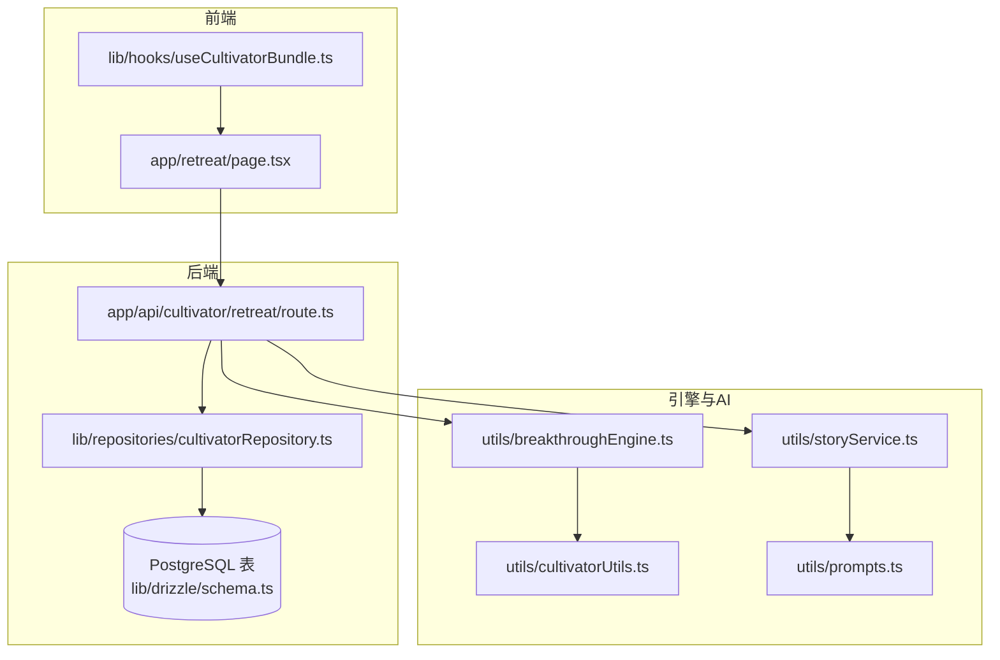
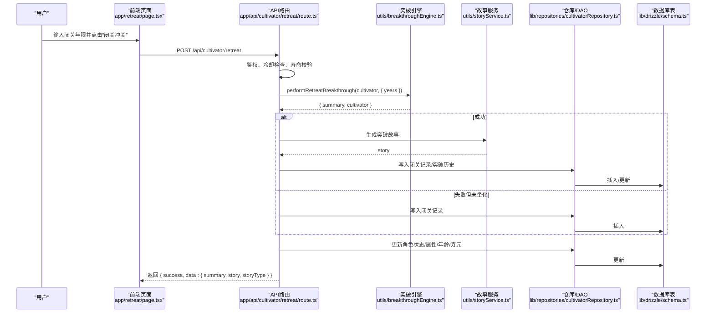
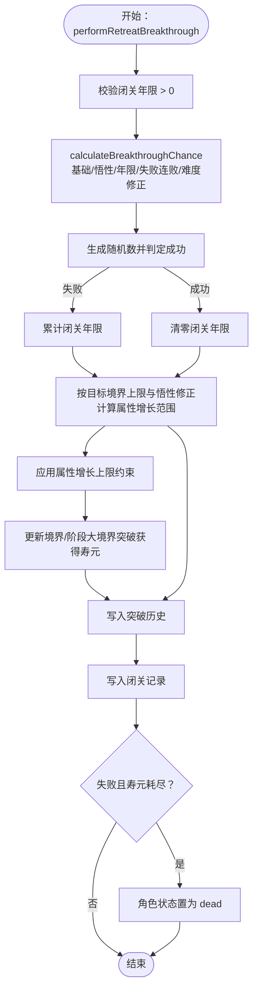
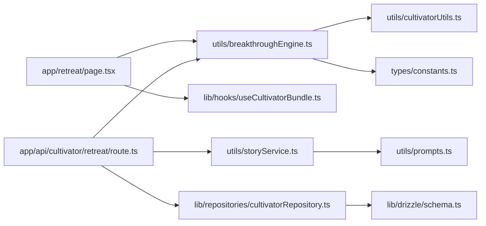

# 闭关系统

<cite>
**本文引用的文件**
- [breakthroughEngine.ts](file://utils/breakthroughEngine.ts)
- [route.ts](file://app/api/cultivator/retreat/route.ts)
- [page.tsx](file://app/retreat/page.tsx)
- [cultivator.ts](file://types/cultivator.ts)
- [constants.ts](file://types/constants.ts)
- [cultivatorUtils.ts](file://utils/cultivatorUtils.ts)
- [prompts.ts](file://utils/prompts.ts)
- [storyService.ts](file://utils/storyService.ts)
- [useCultivatorBundle.ts](file://lib/hooks/useCultivatorBundle.ts)
- [schema.ts](file://lib/drizzle/schema.ts)
- [cultivatorRepository.ts](file://lib/repositories/cultivatorRepository.ts)
</cite>

## 目录
1. [简介](#简介)
2. [项目结构](#项目结构)
3. [核心组件](#核心组件)
4. [架构总览](#架构总览)
5. [详细组件分析](#详细组件分析)
6. [依赖关系分析](#依赖关系分析)
7. [性能考量](#性能考量)
8. [故障排查指南](#故障排查指南)
9. [结论](#结论)
10. [附录](#附录)

## 简介
本文件围绕“闭关突破”玩法，系统梳理从前端交互到后端服务、再到数据库持久化的完整链路，重点说明：
- 突破成功率计算与关键修正因子
- 闭关期间资源消耗与时间消耗模型
- 境界变更与失败惩罚（包括坐化与转世）
- 闭关期间角色状态锁定机制
- AI辅助生成突破/坐化故事的集成方式
- 常见问题排查与优化建议

## 项目结构
闭关系统涉及前后端与数据层的关键文件如下：
- 前端页面：app/retreat/page.tsx
- API路由：app/api/cultivator/retreat/route.ts
- 突破引擎：utils/breakthroughEngine.ts
- 数据模型：types/cultivator.ts、types/constants.ts
- 工具与仓库：utils/cultivatorUtils.ts、lib/repositories/cultivatorRepository.ts、lib/drizzle/schema.ts
- AI故事：utils/prompts.ts、utils/storyService.ts
- 页面数据钩子：lib/hooks/useCultivatorBundle.ts

图表来源
- [page.tsx](file://app/retreat/page.tsx#L1-L218)
- [route.ts](file://app/api/cultivator/retreat/route.ts#L1-L179)
- [breakthroughEngine.ts](file://utils/breakthroughEngine.ts#L1-L342)
- [cultivatorRepository.ts](file://lib/repositories/cultivatorRepository.ts#L674-L710)
- [schema.ts](file://lib/drizzle/schema.ts#L175-L206)
- [prompts.ts](file://utils/prompts.ts#L147-L241)
- [storyService.ts](file://utils/storyService.ts#L1-L22)
- [useCultivatorBundle.ts](file://lib/hooks/useCultivatorBundle.ts#L1-L351)

章节来源
- [page.tsx](file://app/retreat/page.tsx#L1-L218)
- [route.ts](file://app/api/cultivator/retreat/route.ts#L1-L179)
- [breakthroughEngine.ts](file://utils/breakthroughEngine.ts#L1-L342)
- [cultivatorRepository.ts](file://lib/repositories/cultivatorRepository.ts#L674-L710)
- [schema.ts](file://lib/drizzle/schema.ts#L175-L206)
- [prompts.ts](file://utils/prompts.ts#L147-L241)
- [storyService.ts](file://utils/storyService.ts#L1-L22)
- [useCultivatorBundle.ts](file://lib/hooks/useCultivatorBundle.ts#L1-L351)

## 核心组件
- 突破引擎（计算成功率、执行突破、记录结果）
- API路由（鉴权、参数校验、冷却限制、持久化、AI故事）
- 前端页面（预估成功率、提交闭关、展示结果）
- 数据模型与常量（境界、阶段、属性上限、属性结构）
- 工具与仓库（属性计算、DAO、数据库表）

章节来源
- [breakthroughEngine.ts](file://utils/breakthroughEngine.ts#L1-L342)
- [route.ts](file://app/api/cultivator/retreat/route.ts#L1-L179)
- [page.tsx](file://app/retreat/page.tsx#L1-L218)
- [cultivator.ts](file://types/cultivator.ts#L1-L253)
- [constants.ts](file://types/constants.ts#L54-L83)
- [cultivatorUtils.ts](file://utils/cultivatorUtils.ts#L1-L198)
- [cultivatorRepository.ts](file://lib/repositories/cultivatorRepository.ts#L674-L710)

## 架构总览
闭关突破的端到端流程如下：
- 前端页面读取当前角色状态，允许用户输入闭关年限
- 前端调用后端API，携带角色ID与闭关年限
- 后端进行鉴权、冷却检查、寿命校验
- 后端调用突破引擎计算成功率与结果
- 成功时生成AI故事并持久化突破记录与闭关记录
- 更新角色状态（含坐化判定），返回结果给前端

图表来源
- [page.tsx](file://app/retreat/page.tsx#L91-L125)
- [route.ts](file://app/api/cultivator/retreat/route.ts#L18-L178)
- [breakthroughEngine.ts](file://utils/breakthroughEngine.ts#L119-L233)
- [storyService.ts](file://utils/storyService.ts#L1-L22)
- [cultivatorRepository.ts](file://lib/repositories/cultivatorRepository.ts#L674-L710)
- [schema.ts](file://lib/drizzle/schema.ts#L175-L206)

## 详细组件分析

### 突破引擎（utils/breakthroughEngine.ts）
- 成功率计算
  - 基础成功率：随境界难度指数衰减，小境界与大境界不同
  - 悟性修正：基于最终悟性，上限修正
  - 闭关年限修正：按年限比例线性提升，上限控制
  - 失败连败修正：累计闭关年限带来轻微正向修正
  - 突破难度修正：按目标境界难度指数修正
- 突破判定
  - 使用随机数与修正后的概率比较决定成败
- 属性成长
  - 小境界：仅体魄、灵力、速度、神识可增长，悟性不增长
  - 大境界：悟性也可能增长
  - 成长幅度受当前与目标境界上限差值、悟性修正影响
- 境界变更
  - 成功时推进到下一阶段或下一境界（大境界突破）
  - 大境界突破获得寿元加成
- 记录与历史
  - 生成闭关记录与突破历史条目
  - 记录成功率、随机数、修正因子等
- 失败惩罚
  - 失败但寿元耗尽则角色状态置为“坐化”，并生成坐化故事

图表来源
- [breakthroughEngine.ts](file://utils/breakthroughEngine.ts#L119-L233)
- [breakthroughEngine.ts](file://utils/breakthroughEngine.ts#L235-L342)

章节来源
- [breakthroughEngine.ts](file://utils/breakthroughEngine.ts#L82-L233)
- [breakthroughEngine.ts](file://utils/breakthroughEngine.ts#L235-L342)

### API路由（app/api/cultivator/retreat/route.ts）
- 鉴权与参数校验
  - 通过 Supabase 获取当前用户
  - 校验角色ID与闭关年限范围（1~300）
- 寿命与冷却
  - 校验剩余寿元是否足够
  - 闭关冷却时间（默认30分钟），避免频繁闭关
- 执行突破
  - 调用突破引擎得到结果
  - 成功时生成突破故事并写入突破历史
  - 失败但寿元耗尽时生成坐化故事
- 持久化
  - 写入闭关记录
  - 更新角色状态、境界、阶段、年龄、寿元、属性、累计闭关年限
- 错误处理
  - 统一错误响应与开发环境错误透传

章节来源
- [route.ts](file://app/api/cultivator/retreat/route.ts#L18-L178)

### 前端页面（app/retreat/page.tsx）
- 状态与交互
  - 读取当前角色状态与剩余寿元
  - 输入闭关年限，实时预估成功率
  - 发起闭关请求，展示结果与故事
  - 失败且坐化时跳转转世页面
- 数据来源
  - 通过自定义Hook加载角色与历史记录
  - 使用突破引擎预估成功率

章节来源
- [page.tsx](file://app/retreat/page.tsx#L1-L218)
- [useCultivatorBundle.ts](file://lib/hooks/useCultivatorBundle.ts#L1-L351)

### 数据模型与常量（types/cultivator.ts、types/constants.ts）
- 角色数据结构
  - 境界与阶段、年龄、寿元、状态、累计闭关年限
  - 属性结构与上限（按境界阶段）
  - 闭关记录与突破历史结构
- 常量
  - 境界与阶段枚举
  - 各境界阶段属性上限映射
  - 大境界突破寿元加成

章节来源
- [cultivator.ts](file://types/cultivator.ts#L21-L253)
- [constants.ts](file://types/constants.ts#L54-L83)

### 工具与仓库（utils/cultivatorUtils.ts、lib/repositories/cultivatorRepository.ts、lib/drizzle/schema.ts）
- 属性计算
  - 计算最终属性与上限，考虑命格、功法、装备加成
- 仓库与DAO
  - 读取/更新角色，写入闭关记录与突破历史
  - 数据库表结构定义（闭关记录、突破历史、角色主表等）
- 数据库表
  - 闭关记录表与突破历史表字段完整

章节来源
- [cultivatorUtils.ts](file://utils/cultivatorUtils.ts#L1-L198)
- [cultivatorRepository.ts](file://lib/repositories/cultivatorRepository.ts#L674-L710)
- [schema.ts](file://lib/drizzle/schema.ts#L175-L206)

### AI辅助生成突破/坐化故事（utils/prompts.ts、utils/storyService.ts）
- 突破故事
  - 基于角色背景、闭关年限、突破方向、属性增长生成短文
- 坐化故事
  - 基于失败与寿元耗尽生成坐化短文，并引导转世
- 故事服务
  - 调用AI客户端生成文本

章节来源
- [prompts.ts](file://utils/prompts.ts#L147-L241)
- [storyService.ts](file://utils/storyService.ts#L1-L22)

## 依赖关系分析
- 前端依赖
  - 页面依赖突破引擎进行成功率预估
  - 依赖自定义Hook加载角色与历史
- 后端依赖
  - 路由依赖突破引擎与故事服务
  - 依赖仓库/DAO进行持久化
- 引擎与工具
  - 突破引擎依赖常量与属性计算工具
  - 仓库依赖数据库Schema

图表来源
- [page.tsx](file://app/retreat/page.tsx#L1-L218)
- [route.ts](file://app/api/cultivator/retreat/route.ts#L1-L179)
- [breakthroughEngine.ts](file://utils/breakthroughEngine.ts#L1-L342)
- [storyService.ts](file://utils/storyService.ts#L1-L22)
- [cultivatorRepository.ts](file://lib/repositories/cultivatorRepository.ts#L674-L710)
- [schema.ts](file://lib/drizzle/schema.ts#L175-L206)
- [prompts.ts](file://utils/prompts.ts#L147-L241)
- [cultivatorUtils.ts](file://utils/cultivatorUtils.ts#L1-L198)
- [constants.ts](file://types/constants.ts#L54-L83)

## 性能考量
- 前端
  - 成功率预估仅在输入变化时计算，避免频繁重算
  - 闭关请求并发控制，避免重复提交
- 后端
  - 闭关冷却采用内存/数据库时间戳对比，避免频繁查询
  - DAO层使用并行加载角色相关数据，减少往返
- 数据库
  - 闭关记录与突破历史表字段完整，便于后续统计与回放
  - 使用JSONB存储修正因子与故事，利于扩展

[本节为通用建议，无需特定文件来源]

## 故障排查指南
- 突破失败率过高
  - 检查悟性修正是否偏低（悟性过低导致修正不足）
  - 检查失败连败修正是否被低估（累计闭关年限过少）
  - 检查目标境界难度是否过高（高阶境界成功率天然较低）
  - 检查闭关年限修正是否过低（年限不足）
  - 建议：适当延长闭关年限、提升悟性相关加成、减少失败连败
- 状态未更新
  - 确认后端是否正确更新角色状态（坐化时应置为“dead”）
  - 检查DAO更新字段是否包含状态、年龄、寿元、属性、累计闭关年限
  - 检查前端是否调用刷新接口以拉取最新数据
- 寿命不足
  - 闭关前检查剩余寿元是否足够
  - 失败且寿元耗尽会触发坐化故事与状态变更
- 冷却未生效
  - 确认最近一次闭关记录的时间戳与当前时间差是否小于冷却时间
  - 前端显示剩余等待时间，避免重复请求
- AI故事未生成
  - 检查故事服务调用是否抛错
  - 检查提示词构造是否完整（角色、摘要、属性增长等）
- 数据库写入失败
  - 检查闭关记录与突破历史插入是否成功
  - 检查角色更新字段是否齐全

章节来源
- [route.ts](file://app/api/cultivator/retreat/route.ts#L45-L178)
- [cultivatorRepository.ts](file://lib/repositories/cultivatorRepository.ts#L674-L710)
- [useCultivatorBundle.ts](file://lib/hooks/useCultivatorBundle.ts#L330-L342)
- [prompts.ts](file://utils/prompts.ts#L147-L241)
- [storyService.ts](file://utils/storyService.ts#L1-L22)

## 结论
闭关系统通过“前端交互 + 后端路由 + 突破引擎 + AI故事 + 数据持久化”的完整链路，实现了可玩、可观测、可叙事的突破体验。关键在于：
- 成功率计算的合理性与可调性
- 闭关期间的冷却与寿命约束
- 失败惩罚与坐化转世的闭环
- AI故事增强沉浸感与二次创作空间

[本节为总结，无需特定文件来源]

## 附录

### 突破算法伪代码（基于源码提炼）
- 输入：角色、闭关年限
- 输出：突破结果（是否成功、属性增长、境界变更、记录等）
- 步骤：
  1. 计算目标境界/阶段
  2. 计算基础成功率（随境界难度衰减）
  3. 计算修正因子：悟性、年限、失败连败、难度
  4. 计算最终成功率 = 难度 × (基础 + 悟性 + 年限 + 失败连败)
  5. 生成随机数并判定成功
  6. 成功：计算属性增长范围（小/大境界不同），应用增长并更新境界/寿元，写入历史
  7. 失败：累计闭关年限；若寿元耗尽，标记坐化并生成坐化故事
  8. 写入闭关记录，更新角色状态与属性

章节来源
- [breakthroughEngine.ts](file://utils/breakthroughEngine.ts#L82-L233)
- [breakthroughEngine.ts](file://utils/breakthroughEngine.ts#L235-L342)

### 关键参数配置说明
- 境界难度与基础成功率
  - 小境界基础成功率较高，大境界较低
  - 随境界提升，难度指数呈指数下降
- 悟性修正
  - 修正上限控制，避免过度拉高成功率
- 闭关年限修正
  - 年限越高，成功率越高，但存在上限
- 失败连败修正
  - 累计闭关年限越多，略微提升成功率
- 大境界突破寿元加成
  - 按境界映射加成，鼓励大境界突破

章节来源
- [breakthroughEngine.ts](file://utils/breakthroughEngine.ts#L251-L284)
- [constants.ts](file://types/constants.ts#L54-L83)

### 闭关期间角色状态锁定机制
- 冷却时间：每次闭关后需等待固定时间（默认30分钟）才能再次闭关
- 寿命约束：闭关年限不得超过剩余寿元
- 坐化判定：失败且寿元耗尽时，角色状态置为“dead”，前端自动跳转转世

章节来源
- [route.ts](file://app/api/cultivator/retreat/route.ts#L58-L80)
- [route.ts](file://app/api/cultivator/retreat/route.ts#L45-L56)
- [route.ts](file://app/api/cultivator/retreat/route.ts#L141-L149)
- [useCultivatorBundle.ts](file://lib/hooks/useCultivatorBundle.ts#L330-L342)

### AI辅助生成突破描述的集成方式
- 突破故事
  - 构造系统提示词与用户提示词，调用AI文本接口生成
- 坐化故事
  - 在失败且寿元耗尽时生成，引导转世
- 数据落盘
  - 成功时将故事写入突破历史；失败时闭关记录仍落盘

章节来源
- [prompts.ts](file://utils/prompts.ts#L147-L241)
- [storyService.ts](file://utils/storyService.ts#L1-L22)
- [route.ts](file://app/api/cultivator/retreat/route.ts#L82-L115)