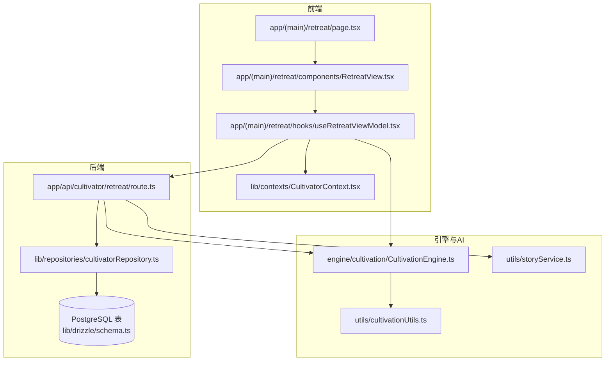
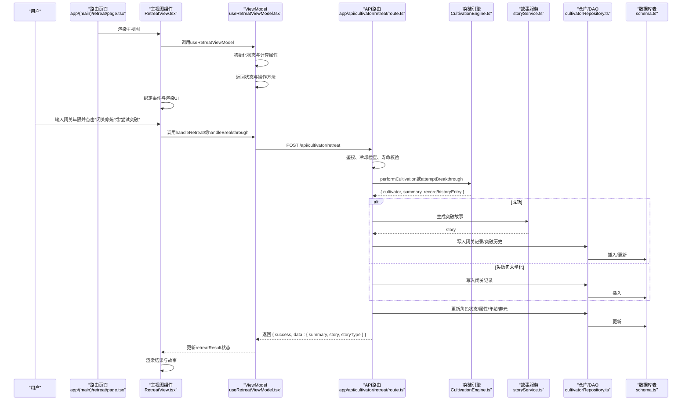
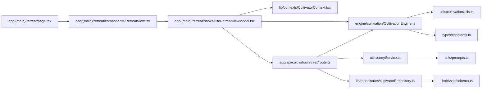

# 闭关系统

<cite>
**本文引用的文件**
- [useRetreatViewModel.tsx](file://app/(main)/retreat/hooks/useRetreatViewModel.tsx)
- [page.tsx](file://app/(main)/retreat/page.tsx)
- [RetreatView.tsx](file://app/(main)/retreat/components/RetreatView.tsx)
- [route.ts](file://app/api/cultivator/retreat/route.ts)
- [CultivationEngine.ts](file://engine/cultivation/CultivationEngine.ts)
- [cultivator.ts](file://types/cultivator.ts)
- [constants.ts](file://types/constants.ts)
- [breakthroughCalculator.ts](file://utils/breakthroughCalculator.ts)
- [cultivationUtils.ts](file://utils/cultivationUtils.ts)
- [storyService.ts](file://utils/storyService.ts)
- [CultivatorContext.tsx](file://lib/contexts/CultivatorContext.tsx)
- [cultivatorRepository.ts](file://lib/repositories/cultivatorRepository.ts)
- [schema.ts](file://lib/drizzle/schema.ts)
</cite>

## 更新摘要
**变更内容**
- 引入 `useRetreatViewModel` 封装闭关页面业务逻辑，实现UI与状态分离
- `page.tsx` 重构为仅保留路由壳子，实际逻辑移至 `RetreatView` 组件
- `RetreatView` 组件通过 `useRetreatViewModel` 获取所有状态与操作方法
- 更新文档以反映新的架构设计与组件职责划分

## 目录
1. [简介](#简介)
2. [项目结构](#项目结构)
3. [核心组件](#核心组件)
4. [架构总览](#架构总览)
5. [详细组件分析](#详细组件分析)
6. [依赖关系分析](#依赖关系分析)
7. [性能考量](#性能考量)
8. [故障排查指南](#故障排查指南)
9. [结论](#结论)
10. [附录](#附录)

## 简介
本文件围绕“闭关突破”玩法，系统梳理从前端交互到后端服务、再到数据库持久化的完整链路，重点说明：
- 突破成功率计算与关键修正因子
- 闭关期间资源消耗与时间消耗模型
- 境界变更与失败惩罚（包括坐化与转世）
- 闭关期间角色状态锁定机制
- AI辅助生成突破/坐化故事的集成方式
- 常见问题排查与优化建议

## 项目结构
闭关系统涉及前后端与数据层的关键文件如下：
- 前端页面：app/(main)/retreat/page.tsx
- 主视图组件：app/(main)/retreat/components/RetreatView.tsx
- ViewModel：app/(main)/retreat/hooks/useRetreatViewModel.tsx
- API路由：app/api/cultivator/retreat/route.ts
- 突破引擎：engine/cultivation/CultivationEngine.ts
- 数据模型：types/cultivator.ts、types/constants.ts
- 工具与仓库：utils/cultivationUtils.ts、lib/repositories/cultivatorRepository.ts、lib/drizzle/schema.ts
- AI故事：utils/storyService.ts
- 上下文：lib/contexts/CultivatorContext.tsx

图表来源
- [page.tsx](file://app/(main)/retreat/page.tsx#L1-L24)
- [RetreatView.tsx](file://app/(main)/retreat/components/RetreatView.tsx#L20-L159)
- [useRetreatViewModel.tsx](file://app/(main)/retreat/hooks/useRetreatViewModel.tsx#L59-L253)
- [route.ts](file://app/api/cultivator/retreat/route.ts#L1-L250)
- [CultivationEngine.ts](file://engine/cultivation/CultivationEngine.ts#L77-L347)
- [cultivatorRepository.ts](file://lib/repositories/cultivatorRepository.ts#L674-L710)
- [schema.ts](file://lib/drizzle/schema.ts#L175-L206)
- [storyService.ts](file://utils/storyService.ts#L1-L22)
- [CultivatorContext.tsx](file://lib/contexts/CultivatorContext.tsx#L1-L351)

章节来源
- [page.tsx](file://app/(main)/retreat/page.tsx#L1-L24)
- [RetreatView.tsx](file://app/(main)/retreat/components/RetreatView.tsx#L20-L159)
- [useRetreatViewModel.tsx](file://app/(main)/retreat/hooks/useRetreatViewModel.tsx#L59-L253)
- [route.ts](file://app/api/cultivator/retreat/route.ts#L1-L250)
- [CultivationEngine.ts](file://engine/cultivation/CultivationEngine.ts#L77-L347)
- [cultivatorRepository.ts](file://lib/repositories/cultivatorRepository.ts#L674-L710)
- [schema.ts](file://lib/drizzle/schema.ts#L175-L206)
- [storyService.ts](file://utils/storyService.ts#L1-L22)
- [CultivatorContext.tsx](file://lib/contexts/CultivatorContext.tsx#L1-L351)

## 核心组件
- ViewModel（封装所有业务逻辑与状态管理）
- 主视图组件（RetreatView，负责UI渲染与事件绑定）
- 路由页面（page.tsx，仅作为路由入口）
- API路由（鉴权、参数校验、冷却限制、持久化、AI故事）
- 突破引擎（计算成功率、执行突破、记录结果）
- 数据模型与常量（境界、阶段、属性上限、属性结构）
- 工具与仓库（属性计算、DAO、数据库表）

章节来源
- [useRetreatViewModel.tsx](file://app/(main)/retreat/hooks/useRetreatViewModel.tsx#L28-L253)
- [RetreatView.tsx](file://app/(main)/retreat/components/RetreatView.tsx#L20-L159)
- [page.tsx](file://app/(main)/retreat/page.tsx#L1-L24)
- [route.ts](file://app/api/cultivator/retreat/route.ts#L1-L250)
- [CultivationEngine.ts](file://engine/cultivation/CultivationEngine.ts#L77-L347)
- [cultivator.ts](file://types/cultivator.ts#L21-L253)
- [constants.ts](file://types/constants.ts#L54-L83)
- [cultivationUtils.ts](file://utils/cultivationUtils.ts#L1-L198)
- [cultivatorRepository.ts](file://lib/repositories/cultivatorRepository.ts#L674-L710)

## 架构总览
闭关突破的端到端流程如下：
- 路由页面加载主视图组件
- 主视图组件调用ViewModel获取状态与操作方法
- 用户交互触发ViewModel中的业务操作
- ViewModel调用API进行后端处理
- 后端进行鉴权、冷却检查、寿命校验
- 后端调用突破引擎计算成功率与结果
- 成功时生成AI故事并持久化突破记录与闭关记录
- 更新角色状态（含坐化判定），返回结果给前端

图表来源
- [page.tsx](file://app/(main)/retreat/page.tsx#L1-L24)
- [RetreatView.tsx](file://app/(main)/retreat/components/RetreatView.tsx#L20-L159)
- [useRetreatViewModel.tsx](file://app/(main)/retreat/hooks/useRetreatViewModel.tsx#L59-L253)
- [route.ts](file://app/api/cultivator/retreat/route.ts#L18-L249)
- [CultivationEngine.ts](file://engine/cultivation/CultivationEngine.ts#L77-L347)
- [storyService.ts](file://utils/storyService.ts#L1-L22)
- [cultivatorRepository.ts](file://lib/repositories/cultivatorRepository.ts#L674-L710)
- [schema.ts](file://lib/drizzle/schema.ts#L175-L206)

## 详细组件分析

### ViewModel（app/(main)/retreat/hooks/useRetreatViewModel.tsx）
- **数据状态**
  - `cultivator`: 当前角色数据
  - `isLoading`: 加载状态
  - `note`: 角色备注
  - `remainingLifespan`: 剩余寿元（通过`useMemo`计算）
  - `cultivationProgress`: 修为进度信息（通过`useMemo`计算）
- **表单状态**
  - `retreatYears`: 闭关年限输入值
  - `setRetreatYears`: 设置闭关年限
  - `handleRetreatYearsChange`: 处理输入变化，仅允许数字
- **操作状态**
  - `retreatLoading`: 闭关/突破操作加载状态
  - `retreatResult`: 闭关/突破结果
  - `showBreakthroughConfirm`: 是否显示突破确认弹窗
- **业务操作**
  - `handleRetreat`: 执行闭关修炼，调用API并更新状态
  - `handleBreakthroughClick`: 显示突破确认弹窗
  - `handleBreakthrough`: 执行突破，调用API并更新状态
  - `closeBreakthroughConfirm`: 关闭确认弹窗
  - `handleGoReincarnate`: 前往转世页面，传递上下文
  - `clearRetreatResult`: 清除结果状态

**更新** 引入`useRetreatViewModel`将业务逻辑从UI组件中分离，提升可维护性

**章节来源**
- [useRetreatViewModel.tsx](file://app/(main)/retreat/hooks/useRetreatViewModel.tsx#L28-L253)

### 主视图组件（app/(main)/retreat/components/RetreatView.tsx）
- **职责**
  - 作为闭关页面的UI渲染组件
  - 通过`useRetreatViewModel`获取所有状态与操作
  - 负责事件绑定与结果展示
- **结构**
  - 当前状态概览（境界、剩余寿元、累计闭关年限）
  - 修为状态卡片（展示修为进度、感悟值等）
  - 闭关年限输入框
  - 操作按钮（闭关修炼、尝试突破）
  - 突破确认弹窗（BreakthroughConfirmModal）
  - 结果展示区域（RetreatResultSection）

**更新** `page.tsx`已重构为仅包含`RetreatView`的路由壳子，所有UI逻辑移至此组件

**章节来源**
- [RetreatView.tsx](file://app/(main)/retreat/components/RetreatView.tsx#L20-L159)

### 路由页面（app/(main)/retreat/page.tsx）
- **新职责**
  - 作为Next.js路由入口
  - 仅包含`Suspense`和`RetreatView`组件
  - 不再包含任何业务逻辑或状态管理
- **优点**
  - 职责单一，仅负责路由
  - 便于测试与维护
  - 符合组件化设计原则

**更新** 页面已重构，逻辑完全移至`RetreatView`和`useRetreatViewModel`

**章节来源**
- [page.tsx](file://app/(main)/retreat/page.tsx#L1-L24)

### API路由（app/api/cultivator/retreat/route.ts）
- **功能**
  - 鉴权与参数校验
  - 寿命与冷却检查
  - 根据action执行`performCultivation`或`attemptBreakthrough`
  - 持久化处理与错误回滚
- **action类型**
  - `cultivate`: 闭关修炼，积累修为
  - `breakthrough`: 尝试突破，挑战境界
- **错误处理**
  - 统一错误响应
  - 开发环境错误透传
  - 资源消耗回滚机制

**章节来源**
- [route.ts](file://app/api/cultivator/retreat/route.ts#L1-L250)

### 突破引擎（engine/cultivation/CultivationEngine.ts）
- **闭关修炼（performCultivation）**
  - 计算修为获取与感悟值增长
  - 处理顿悟机制
  - 检查瓶颈期
  - 更新年龄与累计闭关年限
  - 创建闭关记录
- **尝试突破（attemptBreakthrough）**
  - 检查修为是否足够（≥60%）
  - 计算突破类型（强制/普通/完美）
  - 调用`calculateBreakthroughChance`计算成功率
  - 执行突破判定
  - 成功时更新境界、属性、寿元，重置修为
  - 失败时扣除修为与感悟值，记录失败次数
- **返回结果**
  - `CultivationResult`: 包含修炼摘要与闭关记录
  - `BreakthroughResult`: 包含突破摘要与突破历史条目

**章节来源**
- [CultivationEngine.ts](file://engine/cultivation/CultivationEngine.ts#L77-L347)

### 数据模型与常量（types/cultivator.ts、types/constants.ts）
- **角色数据结构**
  - 境界与阶段、年龄、寿元、状态
  - 修为进度（cultivation_progress）
  - 属性结构与上限
  - 闭关记录与突破历史结构
- **常量**
  - 境界与阶段枚举
  - 各境界阶段属性上限映射
  - 大境界突破寿元加成

**章节来源**
- [cultivator.ts](file://types/cultivator.ts#L21-L253)
- [constants.ts](file://types/constants.ts#L54-L83)

### 工具与仓库（utils/cultivationUtils.ts、lib/repositories/cultivatorRepository.ts、lib/drizzle/schema.ts）
- **工具**
  - `canAttemptBreakthrough`: 检查是否可尝试突破（修为≥60%）
  - `calculateExpProgress`: 计算修为进度百分比
- **仓库与DAO**
  - 读取/更新角色，写入闭关记录与突破历史
  - 数据库表结构定义
- **数据库表**
  - 闭关记录表与突破历史表字段完整

**章节来源**
- [cultivationUtils.ts](file://utils/cultivationUtils.ts#L323-L325)
- [cultivatorRepository.ts](file://lib/repositories/cultivatorRepository.ts#L674-L710)
- [schema.ts](file://lib/drizzle/schema.ts#L175-L206)

### AI辅助生成突破/坐化故事（utils/storyService.ts）
- **突破故事**
  - 基于角色背景、突破方向、属性增长生成短文
- **坐化故事**
  - 基于失败与寿元耗尽生成坐化短文
- **故事服务**
  - 调用AI客户端生成文本

**章节来源**
- [storyService.ts](file://utils/storyService.ts#L1-L22)

## 依赖关系分析
- **前端依赖**
  - `page.tsx` 依赖 `RetreatView`
  - `RetreatView` 依赖 `useRetreatViewModel`
  - `useRetreatViewModel` 依赖 `CultivatorContext`、`CultivationEngine` 和 API
- **后端依赖**
  - `route.ts` 依赖 `CultivationEngine`、`storyService` 和 `cultivatorRepository`
  - `CultivationEngine` 依赖 `breakthroughCalculator` 和 `cultivationUtils`
- **数据层依赖**
  - `cultivatorRepository` 依赖 `schema.ts` 定义的数据库表结构

图表来源
- [page.tsx](file://app/(main)/retreat/page.tsx#L1-L24)
- [RetreatView.tsx](file://app/(main)/retreat/components/RetreatView.tsx#L20-L159)
- [useRetreatViewModel.tsx](file://app/(main)/retreat/hooks/useRetreatViewModel.tsx#L28-L253)
- [route.ts](file://app/api/cultivator/retreat/route.ts#L1-L250)
- [CultivationEngine.ts](file://engine/cultivation/CultivationEngine.ts#L77-L347)
- [storyService.ts](file://utils/storyService.ts#L1-L22)
- [cultivatorRepository.ts](file://lib/repositories/cultivatorRepository.ts#L674-L710)
- [schema.ts](file://lib/drizzle/schema.ts#L175-L206)
- [cultivationUtils.ts](file://utils/cultivationUtils.ts#L1-L198)
- [constants.ts](file://types/constants.ts#L54-L83)

## 性能考量
- **前端**
  - 使用`useMemo`计算`remainingLifespan`和`cultivationProgress`，避免重复计算
  - 使用`useCallback`缓存事件处理函数，避免不必要的重渲染
  - `Suspense`配合`fallback`提供加载状态
- **后端**
  - 闭关锁机制防止并发操作
  - 事务性操作确保数据一致性
  - 错误时回滚资源消耗
- **用户体验**
  - 操作按钮禁用状态防止重复提交
  - Toast提示提供即时反馈
  - 结果区域动态渲染，避免页面闪烁

[本节为通用建议，无需特定文件来源]

## 故障排查指南
- **突破失败率过高**
  - 检查`calculateBreakthroughChance`返回的修正因子
  - 确认角色修为是否达到60%以上
  - 检查感悟值是否影响突破类型
  - 查看`breakthroughResult.modifiers`分析具体原因
- **状态未更新**
  - 确认`updateCultivator`是否成功
  - 检查`refresh`是否被正确调用
  - 查看`retreatResult`是否包含最新数据
- **寿元不足**
  - 闭关前检查`remainingLifespan`是否足够
  - 失败且寿元耗尽会触发坐化故事与状态变更
- **冷却未生效**
  - 确认`lifespanLimiter`是否正确获取闭关锁
  - 检查Redis中锁的状态
- **AI故事未生成**
  - 检查`createBreakthroughStory`调用是否抛错
  - 确认`story`字段是否被正确赋值
- **数据库写入失败**
  - 检查`addRetreatRecord`和`addBreakthroughHistoryEntry`是否成功
  - 确认角色更新字段是否齐全

**章节来源**
- [route.ts](file://app/api/cultivator/retreat/route.ts#L45-L249)
- [cultivatorRepository.ts](file://lib/repositories/cultivatorRepository.ts#L674-L710)
- [useRetreatViewModel.tsx](file://app/(main)/retreat/hooks/useRetreatViewModel.tsx#L119-L253)
- [storyService.ts](file://utils/storyService.ts#L1-L22)

## 结论
闭关系统通过引入`useRetreatViewModel`实现了UI与业务逻辑的彻底分离，提升了代码的可维护性与可测试性。新的架构设计使得：
- `page.tsx`职责单一，仅作为路由入口
- `RetreatView`专注于UI渲染与事件绑定
- `useRetreatViewModel`集中管理所有状态与业务逻辑
- 整体代码结构更加清晰，符合现代前端开发的最佳实践

[本节为总结，无需特定文件来源]

## 附录

### 突破算法伪代码（基于源码提炼）
- 输入：角色、action（cultivate/breakthrough）、闭关年限（仅cultivate）
- 输出：突破结果（是否成功、属性增长、境界变更、记录等）
- 步骤：
  1. **闭关修炼（cultivate）**
     1.1 计算修为获取与感悟值增长
     1.2 更新修为进度与年龄
     1.3 创建闭关记录
     1.4 返回结果
  2. **尝试突破（breakthrough）**
     2.1 检查修为是否足够（≥60%）
     2.2 计算突破类型（强制/普通/完美）
     2.3 计算基础成功率（随境界难度衰减）
     2.4 计算修正因子：悟性、年限、失败连败、难度
     2.5 计算最终成功率 = 难度 × (基础 + 悟性 + 年限 + 失败连败)
     2.6 生成随机数并判定成功
     2.7 成功：计算属性增长范围，应用增长并更新境界/寿元，重置修为，创建突破历史
     2.8 失败：扣除修为与感悟值，增加失败次数；若失败≥3次，触发心魔
     2.9 返回结果

**章节来源**
- [CultivationEngine.ts](file://engine/cultivation/CultivationEngine.ts#L77-L347)
- [route.ts](file://app/api/cultivator/retreat/route.ts#L58-L249)

### 关键参数配置说明
- **境界难度与基础成功率**
  - 小境界基础成功率较高，大境界较低
  - 随境界提升，难度指数呈指数下降
- **悟性修正**
  - 修正上限控制，避免过度拉高成功率
- **闭关年限修正**
  - 年限越高，成功率越高，但存在上限
- **失败连败修正**
  - 累计闭关年限越多，略微提升成功率
- **大境界突破寿元加成**
  - 按境界映射加成，鼓励大境界突破
- **突破类型影响**
  - 完美突破：属性成长+20%，感悟+15
  - 普通突破：属性成长正常，感悟+5
  - 强制突破：属性成长-20%，感悟-10

**章节来源**
- [CultivationEngine.ts](file://engine/cultivation/CultivationEngine.ts#L235-L254)
- [constants.ts](file://types/constants.ts#L54-L83)

### 闭关期间角色状态锁定机制
- **闭关锁**
  - 使用Redis实现闭关锁，防止并发操作
  - 每次闭关开始时获取锁，结束后释放
- **冷却时间**
  - 通过`lifespanLimiter`实现每日寿元消耗限制
  - 避免频繁闭关
- **寿命约束**
  - 闭关年限不得超过剩余寿元
- **坐化判定**
  - 失败且寿元耗尽时，角色状态置为“dead”，前端自动跳转转世

**章节来源**
- [route.ts](file://app/api/cultivator/retreat/route.ts#L44-L51)
- [route.ts](file://app/api/cultivator/retreat/route.ts#L66-L71)
- [route.ts](file://app/api/cultivator/retreat/route.ts#L110-L135)
- [useRetreatViewModel.tsx](file://app/(main)/retreat/hooks/useRetreatViewModel.tsx#L77-L81)

### AI辅助生成突破描述的集成方式
- **突破故事**
  - 在突破成功时，调用`createBreakthroughStory`生成故事
  - 将故事写入`BreakthroughHistoryEntry`
- **坐化故事**
  - 在修炼失败且寿元耗尽时生成，引导转世
- **数据落盘**
  - 成功时将故事写入突破历史；失败时闭关记录仍落盘

**章节来源**
- [storyService.ts](file://utils/storyService.ts#L1-L22)
- [route.ts](file://app/api/cultivator/retreat/route.ts#L156-L180)
- [route.ts](file://app/api/cultivator/retreat/route.ts#L110-L135)