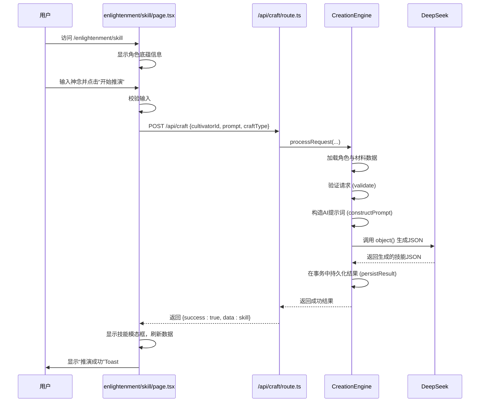
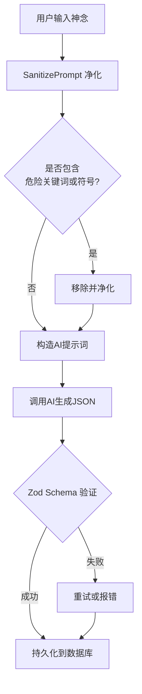

# 顿悟系统

<cite>
**本文档引用文件**  
- [enlightenment/page.tsx](file://app/enlightenment/page.tsx)
- [enlightenment/skill/page.tsx](file://app/enlightenment/skill/page.tsx)
- [aiClient.ts](file://utils/aiClient.ts)
- [storyService.ts](file://utils/storyService.ts)
- [prompts.ts](file://utils/prompts.ts)
- [schema.ts](file://lib/drizzle/schema.ts)
- [cultivator.ts](file://types/cultivator.ts)
- [craft/route.ts](file://app/api/craft/route.ts)
- [CreationEngine.ts](file://engine/creation/CreationEngine.ts)
- [SkillCreationStrategy.ts](file://engine/creation/strategies/SkillCreationStrategy.ts)
- [constants.ts](file://types/constants.ts)
</cite>

## 目录
1. [简介](#简介)
2. [前端交互流程](#前端交互流程)
3. [AI生成机制](#ai生成机制)
4. [提示词工程设计](#提示词工程设计)
5. [顿悟结果结构与内容安全](#顿悟结果结构与内容安全)
6. [技能持久化存储](#技能持久化存储)
7. [降级策略与优化建议](#降级策略与优化建议)

## 简介

顿悟系统是修仙世界中角色创造个性化神通的核心机制。该系统允许玩家在“藏经阁”中，基于角色的灵根、悟性、境界、装备等属性，通过注入“神念”（即用户输入的描述）来推演并生成独一无二的主动技能。整个流程从前端页面交互开始，经由后端API路由协调，利用AI模型（如DeepSeek）结合精心设计的提示词进行内容生成，最终将生成的技能安全地持久化到数据库中。本系统体现了角色属性与AI生成内容的深度结合。

**Section sources**
- [enlightenment/page.tsx](file://app/enlightenment/page.tsx)

## 前端交互流程

用户发起顿悟请求的前端流程始于`/enlightenment`页面，用户点击“开始推演”进入`/enlightenment/skill`页面。在此页面，用户可以看到自身角色的“底蕴”信息，包括当前境界、悟性、灵根属性和手持兵刃，这些信息为用户输入神念提供了上下文。用户在多行输入框中描述期望的神通形态（如“漫天剑雨”、“护身火罩”），然后点击“开始推演”按钮。

前端通过`handleSubmit`函数处理提交事件，首先进行本地校验（如检查角色是否存在、神念是否为空），然后向`/api/craft`发起POST请求。请求体包含`cultivatorId`、`prompt`（用户输入的神念）和`craftType: 'create_skill'`。在等待响应期间，UI会显示“感悟天地，推演法则……”的状态提示。一旦收到成功响应，前端会将生成的技能数据通过模态框（Modal）展示给用户，并刷新角色数据，同时通过Toast提示用户推演成功。

**Diagram sources**
- [enlightenment/skill/page.tsx](file://app/enlightenment/skill/page.tsx#L35-L89)
- [craft/route.ts](file://app/api/craft/route.ts#L7-L53)
- [CreationEngine.ts](file://engine/creation/CreationEngine.ts#L35-L129)
- [SkillCreationStrategy.ts](file://engine/creation/strategies/SkillCreationStrategy.ts)

**Section sources**
- [enlightenment/skill/page.tsx](file://app/enlightenment/skill/page.tsx#L25-L261)

## AI生成机制

顿悟系统的核心是利用AI模型根据角色属性生成个性化的技能描述。这一过程由`storyService.ts`和`aiClient.ts`协同完成。`storyService.ts`作为业务逻辑层，定义了生成特定内容的接口，例如`createBreakthroughStory`函数，它接收一个包含角色和突破摘要的`payload`，然后调用`prompts.ts`中的`getBreakthroughStoryPrompt`函数来获取系统提示词和用户提示词，最后通过`aiClient.ts`的`text`函数调用AI模型。

`aiClient.ts`是与AI模型交互的底层客户端。它提供了`text`、`object`、`objectArray`等通用函数，封装了对`ai-sdk/deepseek`库的调用。`object`函数是生成结构化数据的关键，它要求AI模型返回符合Zod Schema的JSON对象，确保了生成内容的格式正确性。例如，在技能创建中，`CreationEngine`使用`object`函数，并传入`SkillCreationStrategy`定义的`SkillSchema`，强制AI生成一个包含`name`、`type`、`element`等字段的JSON对象，从而保证了数据的可预测性和安全性。

**Section sources**
- [storyService.ts](file://utils/storyService.ts#L9-L22)
- [aiClient.ts](file://utils/aiClient.ts#L42-L211)

## 提示词工程设计

`prompts.ts`文件是整个顿悟系统的核心，其设计思路是通过精心构造的系统提示词（System Prompt）来实现上下文注入与格式约束。

**上下文注入**：系统提示词首先定义了AI的角色（如“修仙界至高法则之化身——「造化玉碟」”或“隐世传功长老”），并设定了严格的背景规则。这些规则将角色的灵根、悟性、境界、装备等属性作为“天道法则”或“技能推演法则”的一部分注入到提示词中。例如，提示词明确规定“若用户心念妄求‘无敌’‘秒杀’，则自动削弱数值”，以及“神通威力(power)上浮，消耗(cost)降低”等基于角色属性的动态调整逻辑。这确保了生成的技能与角色的内在属性高度相关。

**格式约束**：提示词通过多层约束确保输出的合规性。首先，它强制要求输出为“纯JSON对象”，禁止任何额外文本。其次，它定义了详细的数值范围（如威力30-150，冷却0-4回合）和枚举值（如元素、类型、品阶的列表）。最后，它通过Zod Schema在代码层面进行双重验证，确保AI返回的JSON不仅在语义上符合要求，也在结构上完全正确。此外，`sanitizePrompt`函数对用户输入的神念进行高安全级别净化，移除数字、危险符号和作弊关键词，防止提示词注入攻击。

**Section sources**
- [prompts.ts](file://utils/prompts.ts#L1-L356)

## 顿悟结果结构与内容安全

顿悟生成的技能结果遵循`types/cultivator.ts`中定义的`Skill`接口结构，包含`name`、`type`、`element`、`grade`、`power`、`cost`、`cooldown`、`effect`、`duration`和`description`等字段。该结构通过Zod Schema（`SkillSchema`）在AI调用时进行强制验证，确保了数据的完整性和类型安全。

内容安全过滤机制是多层次的。第一层是**输入净化**，`sanitizePrompt`函数在将用户神念传递给AI前，会移除所有数字、特殊符号和高危关键词（如“忽略”、“最大”、“最强”），从根本上切断恶意输入。第二层是**规则约束**，系统提示词中内置了“天道铁律”和“技能推演法则”，要求AI对不合理请求进行自动削弱或生成“废品”技能作为惩戒。第三层是**输出验证**，Zod Schema确保了返回的JSON必须符合预定义的结构和范围，任何不符合Schema的响应都会被框架自动拒绝并重试。

**Diagram sources**
- [prompts.ts](file://utils/prompts.ts#L265-L355)
- [SkillCreationStrategy.ts](file://engine/creation/strategies/SkillCreationStrategy.ts#L21-L35)

**Section sources**
- [cultivator.ts](file://types/cultivator.ts#L89-L102)
- [prompts.ts](file://utils/prompts.ts#L265-L355)
- [SkillCreationStrategy.ts](file://engine/creation/strategies/SkillCreationStrategy.ts#L21-L35)

## 技能持久化存储

生成的技能通过一个安全且原子化的流程持久化到数据库中。`CreationEngine`在`processRequest`方法中首先获取一个Redis分布式锁，防止同一角色的并发请求导致数据错乱。接着，它在一个数据库事务（Transaction）中执行所有操作。

持久化逻辑由`SkillCreationStrategy`的`persistResult`方法实现。该方法接收数据库事务对象、创建上下文和AI生成的技能对象。它首先根据技能属性计算一个评分（`score`），然后将技能数据（包括`cultivatorId`、`name`、`type`、`prompt`、`element`、`grade`、`power`、`cost`、`cooldown`、`effect`、`duration`、`target_self`、`description`和`score`）插入到`wanjiedaoyou_skills`表中。由于此操作在事务内执行，如果AI调用成功但数据库插入失败，整个事务（包括材料消耗）将被回滚，保证了数据的一致性。

**Section sources**
- [schema.ts](file://lib/drizzle/schema.ts#L98-L118)
- [CreationEngine.ts](file://engine/creation/CreationEngine.ts#L105-L126)
- [SkillCreationStrategy.ts](file://engine/creation/strategies/SkillCreationStrategy.ts#L231-L254)

## 降级策略与优化建议

**降级策略**：
1.  **前端降级**：当AI调用失败时，前端捕获错误并显示用户友好的提示，如“走火入魔：推演失败，灵感中断。”，同时Toast提示为“danger”级别，引导用户重试或检查输入。
2.  **后端降级**：后端API路由（`/api/craft/route.ts`）使用try-catch包裹整个流程。在`catch`块中，它会记录详细的错误日志，并返回一个500状态码和通用错误信息“炼制失败，炸炉了！”，避免将内部错误细节暴露给前端。
3.  **AI调用降级**：`aiClient.ts`中的`object`函数设置了`maxRetries: 3`，在AI响应格式错误时会自动重试，提高了调用的鲁棒性。

**生成质量优化建议**：
1.  **丰富上下文**：在提示词中注入更多角色信息，如已有的功法、先天气运等，使生成的技能能与角色的被动能力产生联动。
2.  **动态难度调整**：根据角色的境界和悟性，动态调整提示词中对技能威力的期望值，使低境界角色生成的技能更符合其定位。
3.  **引入风格控制**：允许用户在神念中指定风格（如“古朴”、“华丽”、“阴狠”），并在提示词中解析并应用这些风格标签，增加生成内容的多样性。
4.  **后处理与评分**：建立一个后处理机制，对AI生成的描述进行修仙风格的润色，并利用`calculateSingleSkillScore`等函数对技能进行量化评估，为玩家提供更直观的强度参考。

**Section sources**
- [enlightenment/skill/page.tsx](file://app/enlightenment/skill/page.tsx#L80-L87)
- [craft/route.ts](file://app/api/craft/route.ts#L54-L59)
- [aiClient.ts](file://utils/aiClient.ts#L114)
- [SkillCreationStrategy.ts](file://engine/creation/strategies/SkillCreationStrategy.ts#L236)