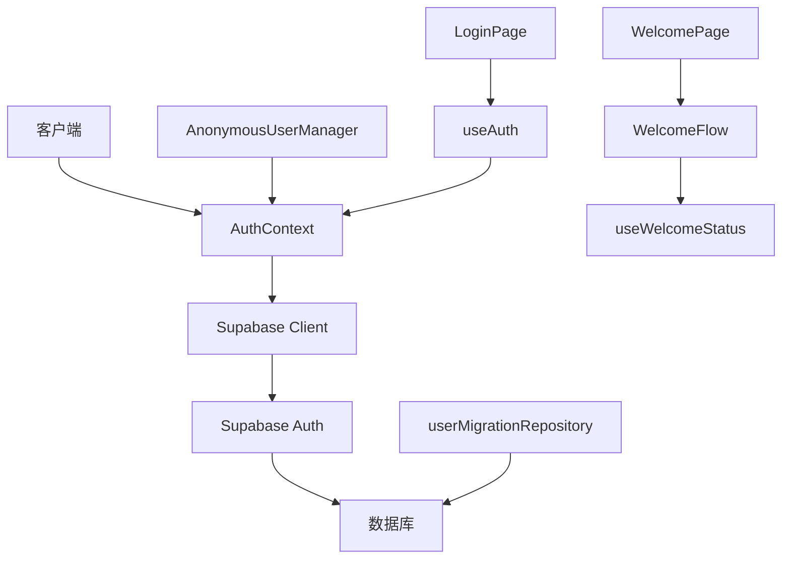
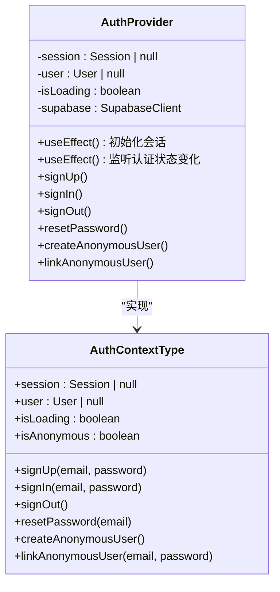
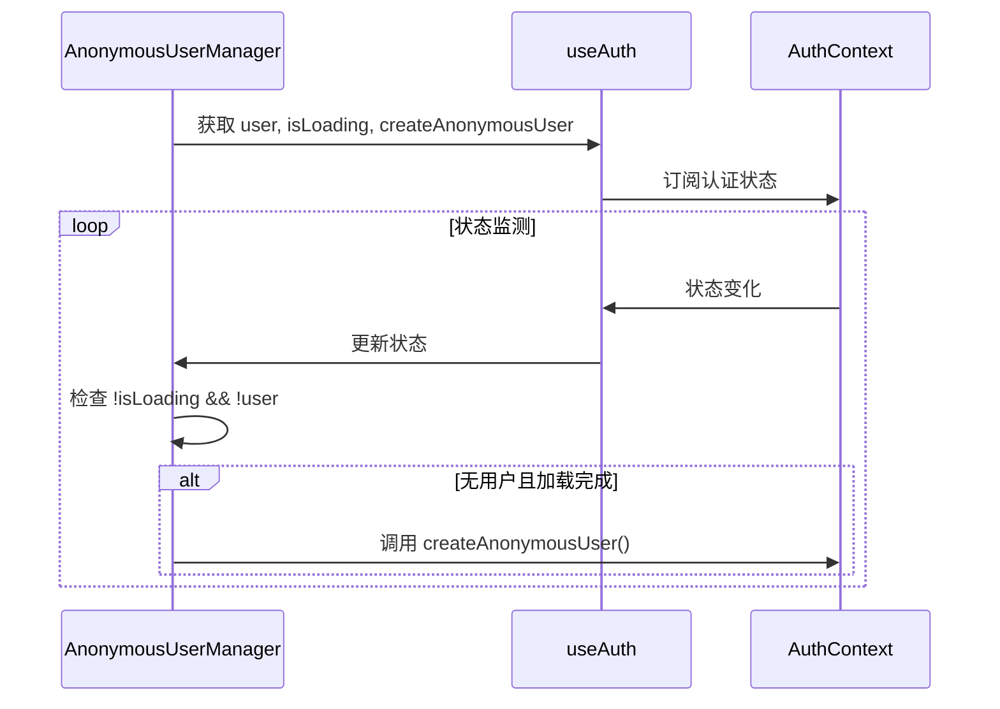
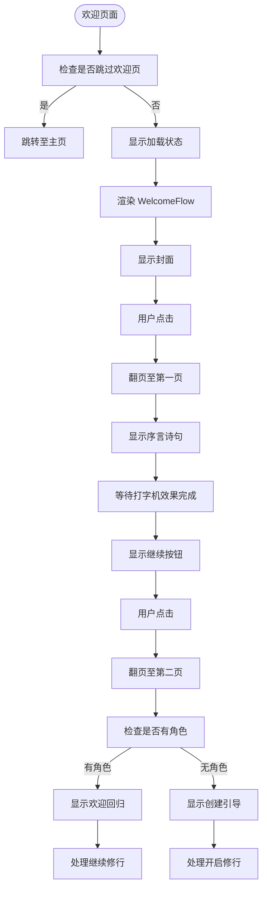
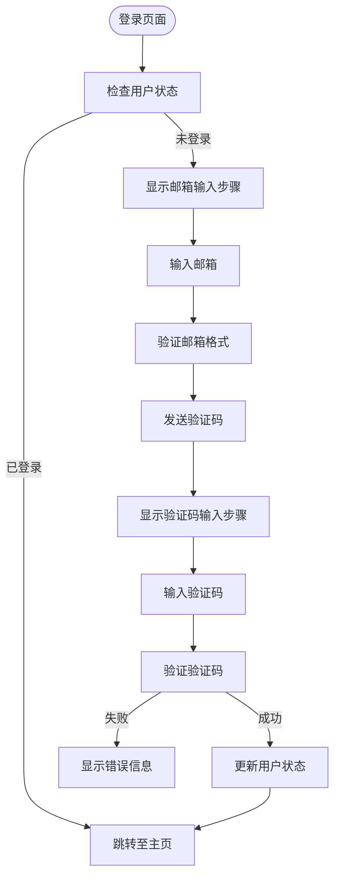
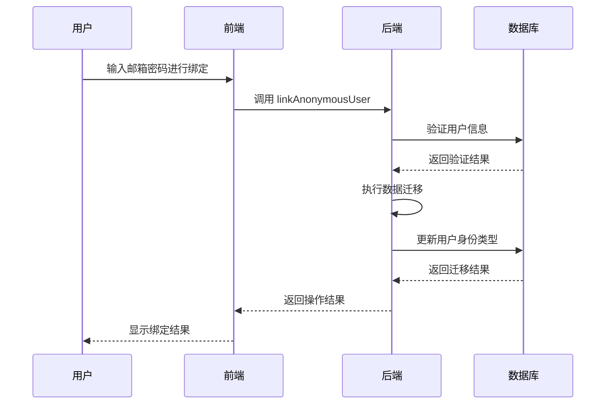

# 游客模式与账户系统

<cite>
**本文档引用文件**  
- [AuthContext.tsx](file://lib/auth/AuthContext.tsx)
- [AnonymousUserManager.tsx](file://components/AnonymousUserManager.tsx)
- [welcome/page.tsx](file://app/welcome/page.tsx)
- [login/page.tsx](file://app/login/page.tsx)
- [useWelcomeStatus.ts](file://lib/hooks/useWelcomeStatus.ts)
- [WelcomeFlow.tsx](file://components/welcome/WelcomeFlow.tsx)
- [client.ts](file://lib/supabase/client.ts)
- [userMigrationRepository.ts](file://lib/repositories/userMigrationRepository.ts)
- [server.ts](file://lib/supabase/server.ts)
- [useCultivatorBundle.ts](file://lib/hooks/useCultivatorBundle.ts)
</cite>

## 目录
1. [引言](#引言)
2. [游客模式与账户系统架构](#游客模式与账户系统架构)
3. [核心组件分析](#核心组件分析)
4. [用户会话管理机制](#用户会话管理机制)
5. [游客用户创建与维护](#游客用户创建与维护)
6. [用户引导流程](#用户引导流程)
7. [匿名数据持久化与迁移机制](#匿名数据持久化与迁移机制)
8. [开发者指南](#开发者指南)
9. [结论](#结论)

## 引言
本系统为《万界道友》游戏提供完整的游客模式与账户体系，支持用户以匿名身份开始修仙之旅，并在适当时机绑定正式账户。系统基于 Supabase 认证服务实现，采用匿名登录、邮箱验证码登录等多种方式，确保用户身份的平滑转换与数据的完整迁移。

## 游客模式与账户系统架构



**图表来源**  
- [AuthContext.tsx](file://lib/auth/AuthContext.tsx#L1-L134)
- [AnonymousUserManager.tsx](file://components/AnonymousUserManager.tsx#L1-L20)
- [welcome/page.tsx](file://app/welcome/page.tsx#L1-L37)
- [login/page.tsx](file://app/login/page.tsx#L1-L239)
- [useWelcomeStatus.ts](file://lib/hooks/useWelcomeStatus.ts#L1-L92)

## 核心组件分析

### AuthContext 组件
`AuthContext.tsx` 是整个认证系统的核心，提供统一的认证接口和状态管理。



**图表来源**  
- [AuthContext.tsx](file://lib/auth/AuthContext.tsx#L13-L125)

**本节来源**  
- [AuthContext.tsx](file://lib/auth/AuthContext.tsx#L1-L134)

### AnonymousUserManager 组件
`AnonymousUserManager.tsx` 负责自动创建和管理游客用户。



**图表来源**  
- [AnonymousUserManager.tsx](file://components/AnonymousUserManager.tsx#L6-L19)

**本节来源**  
- [AnonymousUserManager.tsx](file://components/AnonymousUserManager.tsx#L1-L20)

## 用户会话管理机制
系统通过 `AuthContext` 实现完整的用户会话管理，主要功能包括：

- **会话初始化**：组件挂载时获取初始会话状态
- **状态监听**：通过 `onAuthStateChange` 监听认证状态变化
- **匿名登录**：使用 `signInAnonymously` 创建游客账户
- **身份绑定**：通过 `updateUser` 将匿名账户与邮箱密码绑定

系统使用 Supabase 的匿名认证功能，通过环境变量中的 `NEXT_PUBLIC_SUPABASE_ANON_KEY` 进行初始化。

**本节来源**  
- [AuthContext.tsx](file://lib/auth/AuthContext.tsx#L45-L125)
- [client.ts](file://lib/supabase/client.ts#L3-L8)

## 游客用户创建与维护
游客用户的创建和维护流程如下：

1. 系统检测到用户未登录且加载完成
2. 自动调用 `createAnonymousUser` 创建匿名会话
3. 匿名用户获得唯一的用户ID，可在数据库中持久化数据
4. 用户后续可选择绑定邮箱密码升级为正式账户

该机制确保新用户无需注册即可立即开始游戏体验。

**本节来源**  
- [AnonymousUserManager.tsx](file://components/AnonymousUserManager.tsx#L9-L14)
- [AuthContext.tsx](file://lib/auth/AuthContext.tsx#L97-L100)

## 用户引导流程

### 欢迎页面流程
欢迎页面通过古籍翻页式的动画引导新用户。



**图表来源**  
- [welcome/page.tsx](file://app/welcome/page.tsx#L12-L36)
- [WelcomeFlow.tsx](file://components/welcome/WelcomeFlow.tsx#L19-L284)

**本节来源**  
- [welcome/page.tsx](file://app/welcome/page.tsx#L1-L37)
- [WelcomeFlow.tsx](file://components/welcome/WelcomeFlow.tsx#L1-L285)

### 登录页面流程
登录页面采用验证码方式实现安全登录。



**图表来源**  
- [login/page.tsx](file://app/login/page.tsx#L11-L238)

**本节来源**  
- [login/page.tsx](file://app/login/page.tsx#L1-L239)

## 匿名数据持久化与迁移机制
系统实现了完整的匿名数据持久化与迁移机制：

### 数据持久化
- 匿名用户数据存储在 Supabase 数据库中
- 使用用户ID作为数据关联键
- 支持角色、背包、技能等核心数据的持久化

### 数据迁移
当匿名用户绑定正式账户时，系统执行数据迁移：



**图表来源**  
- [AuthContext.tsx](file://lib/auth/AuthContext.tsx#L103-L109)
- [userMigrationRepository.ts](file://lib/repositories/userMigrationRepository.ts#L4-L28)

**本节来源**  
- [AuthContext.tsx](file://lib/auth/AuthContext.tsx#L102-L109)
- [userMigrationRepository.ts](file://lib/repositories/userMigrationRepository.ts#L1-L28)

## 开发者指南
为开发者提供以下关键指导：

### 使用认证上下文
```typescript
import { useAuth } from '@/lib/auth/AuthContext';

const MyComponent = () => {
  const { user, isAnonymous, createAnonymousUser, linkAnonymousUser } = useAuth();
  
  // 检查用户状态
  if (!user) {
    // 创建匿名用户
    createAnonymousUser();
  }
  
  // 绑定正式账户
  const bindAccount = async (email: string, password: string) => {
    const { error } = await linkAnonymousUser(email, password);
    if (error) {
      // 处理错误
    }
  };
};
```

### 处理用户身份转换
1. 检测用户是否为匿名状态
2. 提供清晰的绑定引导
3. 执行绑定操作
4. 处理成功或失败情况
5. 更新UI状态

### 最佳实践
- 在应用启动时确保 `AnonymousUserManager` 被渲染
- 使用 `useAuth` Hook 订阅认证状态变化
- 对敏感操作进行错误处理
- 提供友好的用户提示

**本节来源**  
- [AuthContext.tsx](file://lib/auth/AuthContext.tsx#L127-L133)
- [AnonymousUserManager.tsx](file://components/AnonymousUserManager.tsx#L6-L19)

## 结论
本系统成功实现了完整的游客模式与账户体系，为用户提供无缝的修仙体验。通过 Supabase 认证服务，系统支持匿名登录、邮箱验证、身份绑定等多种功能，确保用户数据的安全与完整。开发者可基于此系统快速构建类似的身份管理体系。