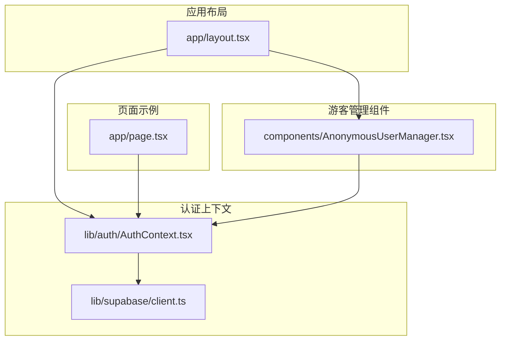
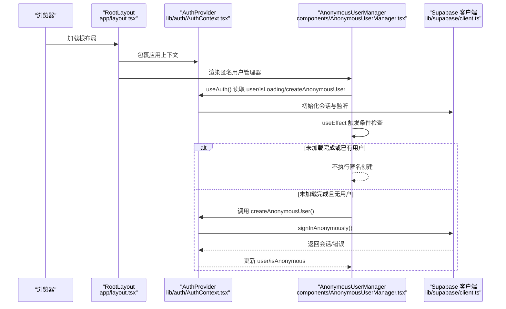
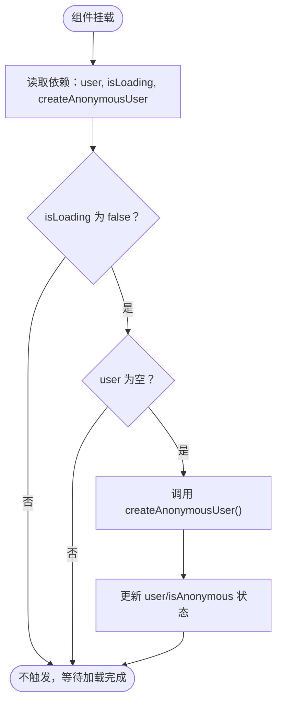
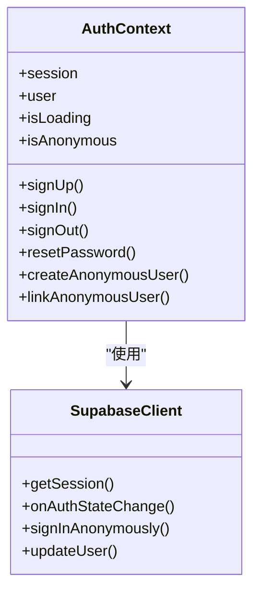
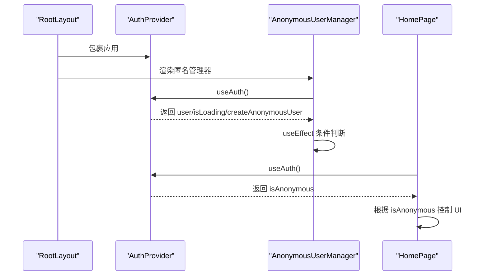
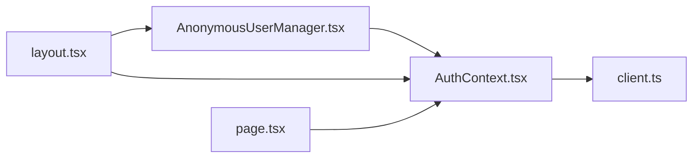

# 游客用户管理

<cite>
**本文引用的文件**
- [AnonymousUserManager.tsx](file://components/AnonymousUserManager.tsx)
- [AuthContext.tsx](file://lib/auth/AuthContext.tsx)
- [layout.tsx](file://app/layout.tsx)
- [page.tsx](file://app/page.tsx)
- [client.ts](file://lib/supabase/client.ts)
</cite>

## 目录
1. [简介](#简介)
2. [项目结构](#项目结构)
3. [核心组件](#核心组件)
4. [架构总览](#架构总览)
5. [详细组件分析](#详细组件分析)
6. [依赖关系分析](#依赖关系分析)
7. [性能考量](#性能考量)
8. [故障排查指南](#故障排查指南)
9. [结论](#结论)
10. [附录](#附录)

## 简介
本文件深入解析“游客用户（匿名用户）”的自动创建与生命周期管理机制。重点围绕以下目标展开：
- AnonymousUserManager 组件如何利用 useEffect 钩子，在页面加载且未检测到用户时自动调用 createAnonymousUser() 创建匿名会话。
- 其依赖项 [user, isLoading] 如何确保仅在适当时机触发创建，避免重复请求。
- 该组件作为“无渲染组件”（return null）的设计意图：专注于逻辑处理而非 UI 展示。
- 结合 AuthContext 中的 isAnonymous 状态，解释系统如何识别并维持游客身份。
- 在新页面中集成此行为的最佳实践，以及潜在问题（如频繁刷新导致的会话重置）及其缓解策略。

## 项目结构
AnonymousUserManager 位于组件层，作为应用根布局的一部分被注入，从而在每个页面加载时执行匿名用户初始化逻辑；AuthContext 提供认证上下文与匿名用户创建能力；Supabase 客户端负责与后端认证服务交互。

图表来源
- [layout.tsx](file://app/layout.tsx#L1-L33)
- [AuthContext.tsx](file://lib/auth/AuthContext.tsx#L1-L134)
- [AnonymousUserManager.tsx](file://components/AnonymousUserManager.tsx#L1-L20)
- [client.ts](file://lib/supabase/client.ts#L1-L9)
- [page.tsx](file://app/page.tsx#L1-L317)

章节来源
- [layout.tsx](file://app/layout.tsx#L1-L33)
- [AuthContext.tsx](file://lib/auth/AuthContext.tsx#L1-L134)
- [AnonymousUserManager.tsx](file://components/AnonymousUserManager.tsx#L1-L20)
- [client.ts](file://lib/supabase/client.ts#L1-L9)
- [page.tsx](file://app/page.tsx#L1-L317)

## 核心组件
- AnonymousUserManager：无渲染组件，负责在首次加载且未检测到用户时，自动调用 createAnonymousUser() 创建匿名会话。其依赖项 [user, isLoading, createAnonymousUser] 确保仅在必要时触发，避免重复请求。
- AuthContext：提供认证上下文，包含 user、isLoading、isAnonymous、createAnonymousUser 等能力；内部通过 Supabase 客户端实现匿名登录。
- 应用布局：在根布局中注入 AuthProvider 与 AnonymousUserManager，使匿名初始化逻辑贯穿所有页面。
- 页面示例：app/page.tsx 展示如何读取 isAnonymous 并据此控制界面行为（例如“仅游客可见”的入口）。

章节来源
- [AnonymousUserManager.tsx](file://components/AnonymousUserManager.tsx#L1-L20)
- [AuthContext.tsx](file://lib/auth/AuthContext.tsx#L1-L134)
- [layout.tsx](file://app/layout.tsx#L1-L33)
- [page.tsx](file://app/page.tsx#L1-L317)

## 架构总览
下图展示了从页面加载到匿名会话建立的关键流程，以及各模块之间的依赖关系。

图表来源
- [layout.tsx](file://app/layout.tsx#L1-L33)
- [AuthContext.tsx](file://lib/auth/AuthContext.tsx#L1-L134)
- [AnonymousUserManager.tsx](file://components/AnonymousUserManager.tsx#L1-L20)
- [client.ts](file://lib/supabase/client.ts#L1-L9)

## 详细组件分析

### AnonymousUserManager 组件分析
- 设计意图：作为“无渲染组件”，仅承担副作用逻辑，不产生任何 UI 输出，确保逻辑与展示分离。
- 关键逻辑：
  - 依赖 useAuth 获取 user、isLoading、createAnonymousUser。
  - 使用 useEffect 在挂载时根据 [user, isLoading, createAnonymousUser] 执行条件判断。
  - 条件：当 !isLoading 且 !user 时，调用 createAnonymousUser()。
  - 依赖数组确保：
    - user 变化时不会重复触发（因为一旦创建匿名用户，user 将存在）。
    - isLoading 变化时重新评估时机。
    - createAnonymousUser 作为稳定函数引用，避免不必要的重渲染。
- 为什么 return null：组件职责单一，仅负责初始化匿名会话，无需渲染任何内容。

图表来源
- [AnonymousUserManager.tsx](file://components/AnonymousUserManager.tsx#L1-L20)
- [AuthContext.tsx](file://lib/auth/AuthContext.tsx#L1-L134)

章节来源
- [AnonymousUserManager.tsx](file://components/AnonymousUserManager.tsx#L1-L20)

### AuthContext 与匿名会话创建
- 认证上下文提供：
  - user：当前用户对象（含 is_anonymous 字段）。
  - isLoading：初始会话加载状态。
  - isAnonymous：基于 user.is_anonymous 的布尔值。
  - createAnonymousUser：封装匿名登录逻辑。
- 匿名登录实现：
  - 通过 Supabase 客户端调用 signInAnonymously()，建立匿名会话。
  - AuthContext 内部监听 AuthStateChange，实时更新 session 与 user。
- 会话持久化：
  - 初始会话通过 getSession() 获取，随后通过 onAuthStateChange 订阅变更，保证用户状态随会话变化而同步。

图表来源
- [AuthContext.tsx](file://lib/auth/AuthContext.tsx#L1-L134)
- [client.ts](file://lib/supabase/client.ts#L1-L9)

章节来源
- [AuthContext.tsx](file://lib/auth/AuthContext.tsx#L1-L134)
- [client.ts](file://lib/supabase/client.ts#L1-L9)

### 应用布局与页面集成
- 根布局：
  - 在 <html> 根节点包裹 AuthProvider，确保全局可用认证上下文。
  - 渲染 AnonymousUserManager，使其在每个页面加载时执行匿名初始化。
- 页面示例：
  - app/page.tsx 通过 useAuth 读取 isAnonymous，用于控制界面元素（例如“仅游客可见”的入口）。
  - 该模式可推广到其他页面，统一识别游客身份并提供相应 UI/功能。

图表来源
- [layout.tsx](file://app/layout.tsx#L1-L33)
- [AnonymousUserManager.tsx](file://components/AnonymousUserManager.tsx#L1-L20)
- [page.tsx](file://app/page.tsx#L1-L317)

章节来源
- [layout.tsx](file://app/layout.tsx#L1-L33)
- [page.tsx](file://app/page.tsx#L1-L317)

## 依赖关系分析
- 组件耦合：
  - AnonymousUserManager 仅依赖 useAuth，耦合度低，职责清晰。
  - AuthContext 对 Supabase 客户端有直接依赖，但对上层组件透明。
- 外部依赖：
  - Supabase 客户端负责与后端认证服务通信，提供 getSession、onAuthStateChange、signInAnonymously 等能力。
- 潜在循环依赖：
  - 无直接循环依赖；AnonymousUserManager 仅消费 AuthContext，不反向依赖页面或其他组件。

图表来源
- [AnonymousUserManager.tsx](file://components/AnonymousUserManager.tsx#L1-L20)
- [AuthContext.tsx](file://lib/auth/AuthContext.tsx#L1-L134)
- [client.ts](file://lib/supabase/client.ts#L1-L9)
- [layout.tsx](file://app/layout.tsx#L1-L33)
- [page.tsx](file://app/page.tsx#L1-L317)

章节来源
- [AnonymousUserManager.tsx](file://components/AnonymousUserManager.tsx#L1-L20)
- [AuthContext.tsx](file://lib/auth/AuthContext.tsx#L1-L134)
- [client.ts](file://lib/supabase/client.ts#L1-L9)
- [layout.tsx](file://app/layout.tsx#L1-L33)
- [page.tsx](file://app/page.tsx#L1-L317)

## 性能考量
- 避免重复请求：
  - 依赖数组 [user, isLoading, createAnonymousUser] 确保仅在必要时触发匿名创建；一旦 user 存在，后续变更不会再次触发。
- 初次加载优化：
  - AuthContext 在挂载时先获取初始会话并设置 isLoading=false，AnonymousUserManager 在 isLoading=false 且 user 为空时才创建匿名用户，减少无效调用。
- UI 渲染开销：
  - AnonymousUserManager return null，不产生额外 DOM，降低渲染成本。
- 状态同步：
  - 通过 onAuthStateChange 实时更新 user/isAnonymous，避免手动轮询带来的性能损耗。

[本节为通用性能建议，不直接分析具体代码文件]

## 故障排查指南
- 症状：页面加载后未创建匿名会话
  - 排查点：
    - 是否正确包裹 AuthProvider 于根布局。
    - AnonymousUserManager 是否在根布局中渲染。
    - 浏览器网络面板是否显示匿名登录请求成功。
- 症状：频繁刷新导致会话丢失
  - 排查点：
    - Supabase 会话存储策略（浏览器本地存储/Cookie）是否正常。
    - 页面是否在刷新后重新初始化 AuthContext。
  - 缓解策略：
    - 确保 Supabase 客户端配置正确，避免跨域或安全策略影响会话持久化。
    - 在页面层增加防抖或幂等性检查，避免短时间内重复创建匿名会话。
- 症状：isAnonymous 状态异常
  - 排查点：
    - user 是否包含 is_anonymous 字段。
    - AuthContext 是否正确从 user 推导 isAnonymous。
  - 缓解策略：
    - 在关键页面打印 user 与 isAnonymous，确认状态一致性。

章节来源
- [layout.tsx](file://app/layout.tsx#L1-L33)
- [AuthContext.tsx](file://lib/auth/AuthContext.tsx#L1-L134)
- [AnonymousUserManager.tsx](file://components/AnonymousUserManager.tsx#L1-L20)
- [page.tsx](file://app/page.tsx#L1-L317)

## 结论
AnonymousUserManager 通过最小化的副作用与稳定的依赖管理，实现了“首次加载即创建匿名会话”的可靠机制。配合 AuthContext 的 isAnonymous 状态与 Supabase 的会话管理，系统能够在不引入复杂 UI 的前提下，为游客用户提供一致的身份标识与功能入口。在新页面集成时，遵循根布局注入与 useAuth 使用规范即可快速落地；同时应关注会话持久化与重复创建等问题，确保用户体验稳定。

[本节为总结性内容，不直接分析具体代码文件]

## 附录

### 最佳实践清单
- 在根布局中同时注入 AuthProvider 与 AnonymousUserManager，确保全局生效。
- 在需要区分游客与注册用户的功能中，优先使用 isAnonymous 与 user 字段进行判断。
- 避免在依赖数组中添加不稳定引用（如每次渲染生成的新函数），保持 createAnonymousUser 的稳定性。
- 对于频繁刷新场景，可在页面层增加幂等检查，避免重复创建匿名会话。

[本节为通用指导，不直接分析具体代码文件]