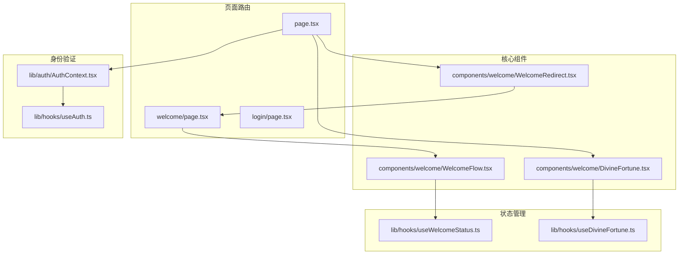
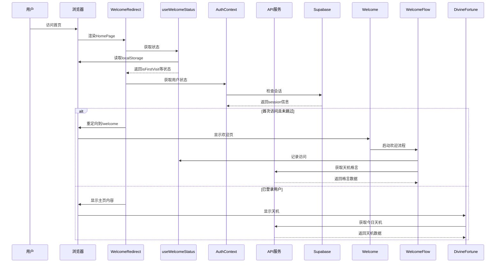
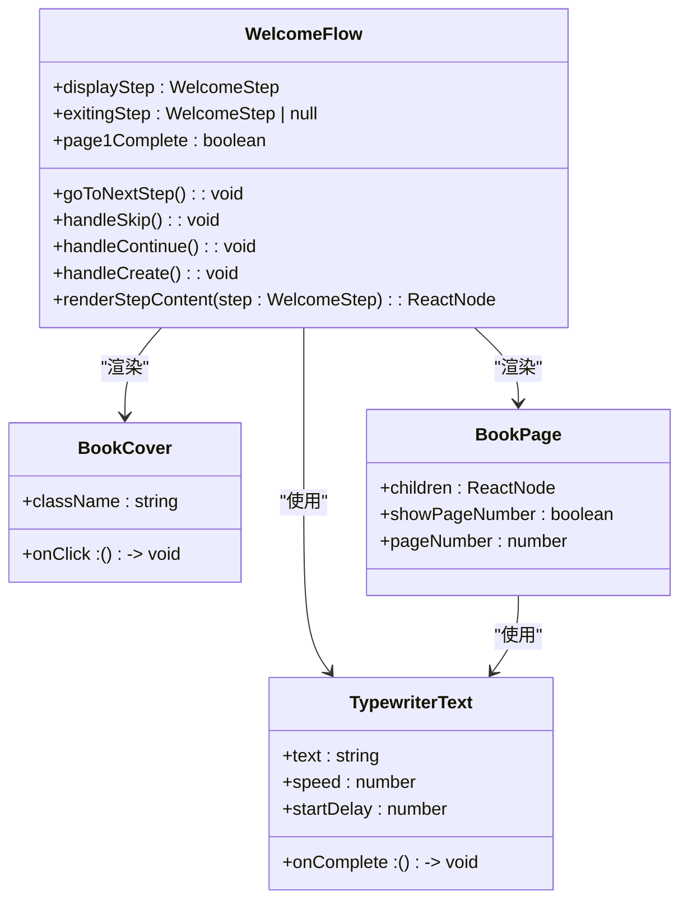
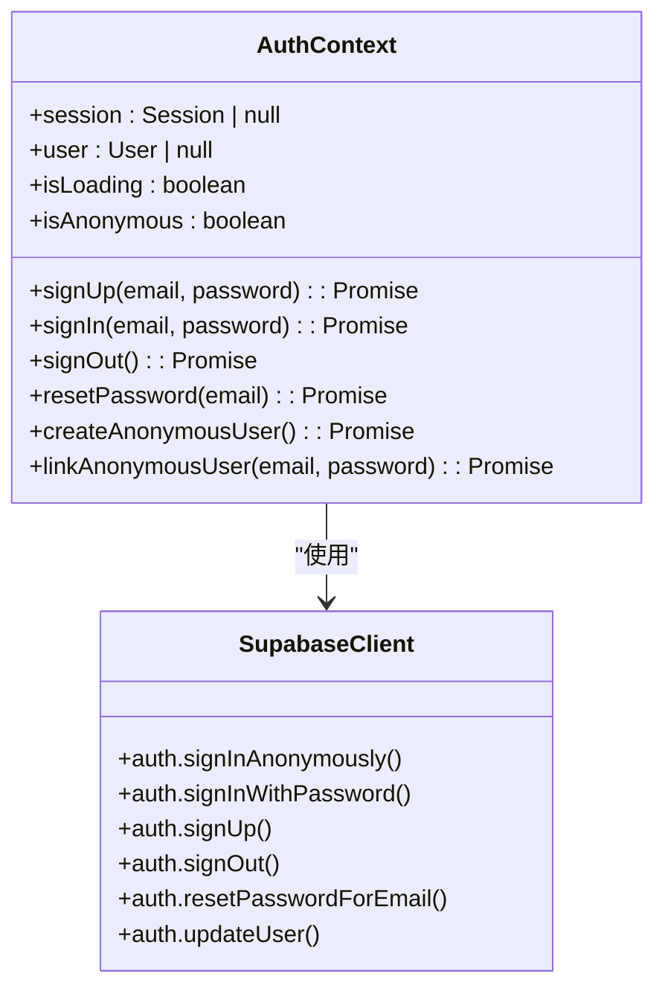

# 用户引导流程

<cite>
**本文档引用的文件**  
- [app/page.tsx](file://app/page.tsx)
- [app/welcome/page.tsx](file://app/welcome/page.tsx)
- [app/login/page.tsx](file://app/login/page.tsx)
- [lib/auth/AuthContext.tsx](file://lib/auth/AuthContext.tsx)
- [components/welcome/WelcomeRedirect.tsx](file://components/welcome/WelcomeRedirect.tsx)
- [lib/hooks/useWelcomeStatus.ts](file://lib/hooks/useWelcomeStatus.ts)
- [components/welcome/WelcomeFlow.tsx](file://components/welcome/WelcomeFlow.tsx)
- [components/AnonymousUserManager.tsx](file://components/AnonymousUserManager.tsx)
- [lib/supabase/client.ts](file://lib/supabase/client.ts)
- [components/welcome/DivineFortune.tsx](file://components/welcome/DivineFortune.tsx)
- [lib/hooks/useDivineFortune.ts](file://lib/hooks/useDivineFortune.ts)
- [components/welcome/BookCover.tsx](file://components/welcome/BookCover.tsx)
- [components/welcome/BookPage.tsx](file://components/welcome/BookPage.tsx)
- [lib/repositories/userMigrationRepository.ts](file://lib/repositories/userMigrationRepository.ts)
</cite>

## 目录
1. [简介](#简介)
2. [项目结构](#项目结构)
3. [核心组件](#核心组件)
4. [架构概览](#架构概览)
5. [详细组件分析](#详细组件分析)
6. [依赖分析](#依赖分析)
7. [性能考虑](#性能考虑)
8. [故障排除指南](#故障排除指南)
9. [结论](#结论)

## 简介
本文档全面记录了从访问首页到完成身份选择的用户引导流程。重点说明了欢迎页面作为入口如何通过身份验证钩子检测用户状态，并根据用户类型进行相应跳转：匿名用户自动进入角色界面开始游戏，已登录用户重定向至主界面，无会话用户则展示欢迎动效与神签抽取功能以提升转化率。同时描述了登录页面提供的注册、登录、密码重置表单交互逻辑及其与身份上下文方法的集成方式。

## 项目结构
本项目采用Next.js App Router架构，用户引导相关功能主要分布在`app`目录下的特定路由页面和`components/welcome`目录中的UI组件中。身份验证逻辑集中于`lib/auth`目录，而用户状态管理则通过自定义Hooks实现。



**图示来源**
- [app/page.tsx](file://app/page.tsx#L1-L317)
- [app/welcome/page.tsx](file://app/welcome/page.tsx#L1-L37)
- [components/welcome/WelcomeRedirect.tsx](file://components/welcome/WelcomeRedirect.tsx#L1-L34)
- [components/welcome/WelcomeFlow.tsx](file://components/welcome/WelcomeFlow.tsx#L1-L285)
- [lib/auth/AuthContext.tsx](file://lib/auth/AuthContext.tsx#L1-L134)
- [lib/hooks/useWelcomeStatus.ts](file://lib/hooks/useWelcomeStatus.ts#L1-L92)
- [components/welcome/DivineFortune.tsx](file://components/welcome/DivineFortune.tsx#L1-L77)
- [lib/hooks/useDivineFortune.ts](file://lib/hooks/useDivineFortune.ts#L1-L45)

## 核心组件
系统的核心引导流程由多个关键组件协同工作：`WelcomeRedirect`负责首页访问时的重定向决策，`WelcomeFlow`实现古籍翻页式欢迎动画，`useWelcomeStatus`管理用户对欢迎页的偏好状态，`AuthContext`提供统一的身份验证接口，而`DivineFortune`则展示每日天机格言以增强用户体验。

**本节来源**
- [app/page.tsx](file://app/page.tsx#L1-L317)
- [app/welcome/page.tsx](file://app/welcome/page.tsx#L1-L37)
- [components/welcome/WelcomeRedirect.tsx](file://components/welcome/WelcomeRedirect.tsx#L1-L34)
- [components/welcome/WelcomeFlow.tsx](file://components/welcome/WelcomeFlow.tsx#L1-L285)
- [lib/hooks/useWelcomeStatus.ts](file://lib/hooks/useWelcomeStatus.ts#L1-L92)

## 架构概览
整个用户引导系统基于React组件树和自定义Hooks构建，采用客户端路由控制和状态管理机制。系统通过Supabase进行身份验证，利用localStorage存储用户偏好，并通过API路由获取动态内容。



**图示来源**
- [app/page.tsx](file://app/page.tsx#L1-L317)
- [app/welcome/page.tsx](file://app/welcome/page.tsx#L1-L37)
- [components/welcome/WelcomeRedirect.tsx](file://components/welcome/WelcomeRedirect.tsx#L1-L34)
- [lib/hooks/useWelcomeStatus.ts](file://lib/hooks/useWelcomeStatus.ts#L1-L92)
- [lib/auth/AuthContext.tsx](file://lib/auth/AuthContext.tsx#L1-L134)
- [components/welcome/DivineFortune.tsx](file://components/welcome/DivineFortune.tsx#L1-L77)
- [lib/hooks/useDivineFortune.ts](file://lib/hooks/useDivineFortune.ts#L1-L45)

## 详细组件分析
### 欢迎流程组件分析
`WelcomeFlow`组件实现了精美的古籍翻页动画效果，通过CSS动画和React状态管理实现平滑的页面过渡。该组件包含封面、第一页和第二页三个主要步骤，每一步都精心设计了视觉效果和交互体验。



**图示来源**
- [components/welcome/WelcomeFlow.tsx](file://components/welcome/WelcomeFlow.tsx#L1-L285)
- [components/welcome/BookCover.tsx](file://components/welcome/BookCover.tsx#L1-L59)
- [components/welcome/BookPage.tsx](file://components/welcome/BookPage.tsx#L1-L47)
- [components/welcome/TypewriterText.tsx](file://components/welcome/TypewriterText.tsx)

**本节来源**
- [components/welcome/WelcomeFlow.tsx](file://components/welcome/WelcomeFlow.tsx#L1-L285)

### 身份验证上下文分析
`AuthContext`提供了统一的身份验证接口，封装了Supabase的认证功能，为整个应用提供用户状态管理和认证方法。



**图示来源**
- [lib/auth/AuthContext.tsx](file://lib/auth/AuthContext.tsx#L1-L134)
- [lib/supabase/client.ts](file://lib/supabase/client.ts#L1-L9)

**本节来源**
- [lib/auth/AuthContext.tsx](file://lib/auth/AuthContext.tsx#L1-L134)

## 依赖分析
系统依赖关系清晰，各组件职责分明。前端组件依赖于身份验证上下文和自定义Hooks，而这些Hooks又依赖于Supabase客户端和服务端API。

```mermaid
graph TD
A[HomePage] --> B[WelcomeRedirect]
A --> C[DivineFortune]
B --> D[useWelcomeStatus]
B --> E[useAuth]
C --> F[useDivineFortune]
D --> G[localStorage]
E --> H[SupabaseClient]
F --> I[/api/divine-fortune]
H --> J[SupabaseAuth]
I --> K[AI生成服务]
```

**图示来源**
- [app/page.tsx](file://app/page.tsx#L1-L317)
- [components/welcome/WelcomeRedirect.tsx](file://components/welcome/WelcomeRedirect.tsx#L1-L34)
- [lib/hooks/useWelcomeStatus.ts](file://lib/hooks/useWelcomeStatus.ts#L1-L92)
- [lib/auth/AuthContext.tsx](file://lib/auth/AuthContext.tsx#L1-L134)
- [components/welcome/DivineFortune.tsx](file://components/welcome/DivineFortune.tsx#L1-L77)
- [lib/hooks/useDivineFortune.ts](file://lib/hooks/useDivineFortune.ts#L1-L45)
- [lib/supabase/client.ts](file://lib/supabase/client.ts#L1-L9)

**本节来源**
- [app/page.tsx](file://app/page.tsx#L1-L317)
- [components/welcome/WelcomeRedirect.tsx](file://components/welcome/WelcomeRedirect.tsx#L1-L34)
- [lib/hooks/useWelcomeStatus.ts](file://lib/hooks/useWelcomeStatus.ts#L1-L92)
- [lib/auth/AuthContext.tsx](file://lib/auth/AuthContext.tsx#L1-L134)

## 性能考虑
系统在性能方面做了多项优化：使用Suspense进行代码分割，通过localStorage缓存用户偏好减少网络请求，采用懒加载技术提升初始加载速度，并利用React的useEffect优化状态更新。

## 故障排除指南
当用户引导流程出现问题时，可检查以下常见情况：localStorage是否被禁用导致欢迎状态无法保存，Supabase配置是否正确，网络连接是否正常，以及浏览器兼容性问题。对于匿名用户无法创建的情况，需检查Supabase的匿名登录配置。

**本节来源**
- [components/AnonymousUserManager.tsx](file://components/AnonymousUserManager.tsx#L1-L20)
- [lib/auth/AuthContext.tsx](file://lib/auth/AuthContext.tsx#L1-L134)
- [lib/supabase/client.ts](file://lib/supabase/client.ts#L1-L9)

## 结论
本系统实现了完整的用户引导流程，通过精心设计的欢迎动画、智能的用户状态检测和流畅的身份验证机制，为用户提供了优质的入门体验。系统架构清晰，组件职责分明，便于维护和扩展。建议未来可以增加更多个性化选项和社交登录功能以进一步提升用户体验。