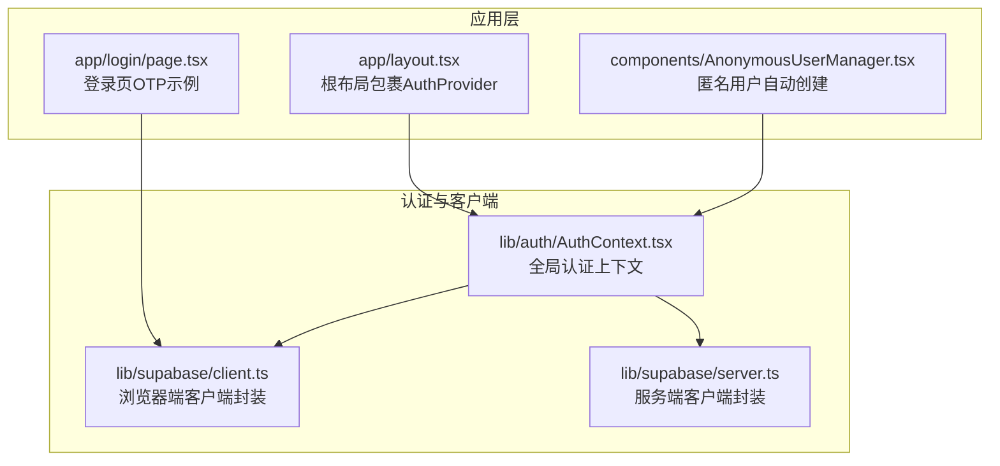
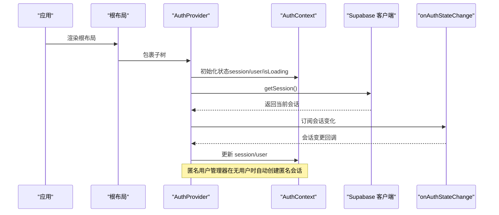
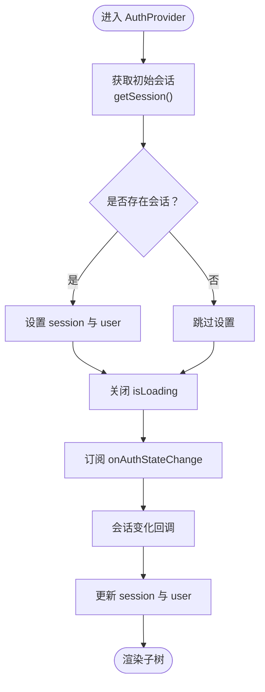
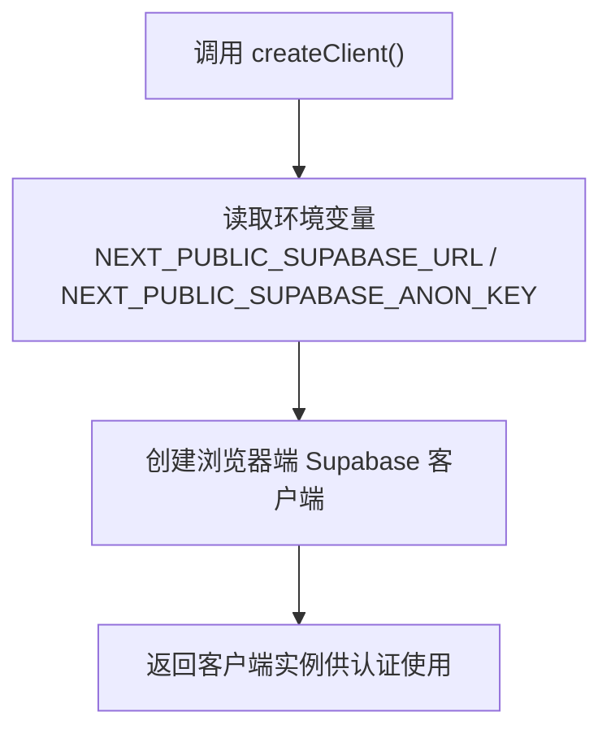
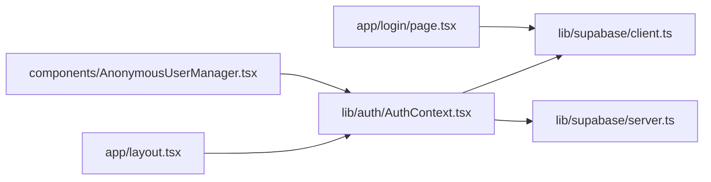

# 认证机制

<cite>
**本文引用的文件**
- [lib/auth/AuthContext.tsx](file://lib/auth/AuthContext.tsx)
- [lib/supabase/client.ts](file://lib/supabase/client.ts)
- [lib/supabase/server.ts](file://lib/supabase/server.ts)
- [app/layout.tsx](file://app/layout.tsx)
- [components/AnonymousUserManager.tsx](file://components/AnonymousUserManager.tsx)
- [app/login/page.tsx](file://app/login/page.tsx)
- [package.json](file://package.json)
- [ENV_SETUP.md](file://ENV_SETUP.md)
</cite>

## 目录
1. [简介](#简介)
2. [项目结构](#项目结构)
3. [核心组件](#核心组件)
4. [架构总览](#架构总览)
5. [详细组件分析](#详细组件分析)
6. [依赖关系分析](#依赖关系分析)
7. [性能考量](#性能考量)
8. [故障排查指南](#故障排查指南)
9. [结论](#结论)
10. [附录](#附录)

## 简介
本文件系统性记录并解释本项目基于 Supabase 的认证机制实现，重点覆盖：
- AuthContext.tsx 如何通过 React Context 提供全局用户会话管理，支持匿名登录与邮箱密码注册/登录。
- createClient 封装的 Supabase 客户端如何使用环境变量进行安全连接。
- onAuthStateChange 监听器对会话变化的实时响应机制。
- session、user、isLoading 等状态的初始化流程与边界条件处理。
- isAnonymous 判断逻辑的技术细节与扩展建议。
- 错误处理模式（AuthError）与安全最佳实践。

## 项目结构
围绕认证的关键文件组织如下：
- 应用层入口与全局 Provider 包裹：app/layout.tsx
- 匿名用户自动创建：components/AnonymousUserManager.tsx
- 认证上下文与业务方法：lib/auth/AuthContext.tsx
- 前端 Supabase 客户端封装：lib/supabase/client.ts
- 服务端 Supabase 客户端封装：lib/supabase/server.ts
- 登录页面示例（展示 OTP 登录流程与错误处理）：app/login/page.tsx
- 依赖与版本信息：package.json
- 环境变量配置说明：ENV_SETUP.md

图表来源
- [app/layout.tsx](file://app/layout.tsx#L16-L31)
- [components/AnonymousUserManager.tsx](file://components/AnonymousUserManager.tsx#L1-L19)
- [lib/auth/AuthContext.tsx](file://lib/auth/AuthContext.tsx#L37-L125)
- [lib/supabase/client.ts](file://lib/supabase/client.ts#L1-L9)
- [lib/supabase/server.ts](file://lib/supabase/server.ts#L1-L28)
- [app/login/page.tsx](file://app/login/page.tsx#L1-L239)

章节来源
- [app/layout.tsx](file://app/layout.tsx#L16-L31)
- [lib/auth/AuthContext.tsx](file://lib/auth/AuthContext.tsx#L37-L125)
- [lib/supabase/client.ts](file://lib/supabase/client.ts#L1-L9)
- [lib/supabase/server.ts](file://lib/supabase/server.ts#L1-L28)
- [components/AnonymousUserManager.tsx](file://components/AnonymousUserManager.tsx#L1-L19)
- [app/login/page.tsx](file://app/login/page.tsx#L1-L239)

## 核心组件
- 全局认证上下文（AuthProvider）：负责初始化会话、订阅 onAuthStateChange、暴露注册/登录/登出/匿名登录/链接匿名用户等方法，并提供 isAnonymous 状态。
- 浏览器端 Supabase 客户端封装：从环境变量读取 Supabase URL 与匿名密钥，创建浏览器端客户端。
- 服务端 Supabase 客户端封装：在服务端组件中通过 cookies 传递会话 Cookie，创建服务端客户端。
- 匿名用户管理器：在无用户且加载完成后自动触发匿名登录，保证访客也能拥有会话。
- 登录页示例：演示 OTP 登录流程与错误处理策略。

章节来源
- [lib/auth/AuthContext.tsx](file://lib/auth/AuthContext.tsx#L37-L125)
- [lib/supabase/client.ts](file://lib/supabase/client.ts#L1-L9)
- [lib/supabase/server.ts](file://lib/supabase/server.ts#L1-L28)
- [components/AnonymousUserManager.tsx](file://components/AnonymousUserManager.tsx#L1-L19)
- [app/login/page.tsx](file://app/login/page.tsx#L1-L239)

## 架构总览
认证体系采用“前端 Context + Supabase 客户端 + 会话监听”的组合：
- 前端通过 AuthProvider 初始化 session/user/isLoading，并订阅 onAuthStateChange 实时更新。
- 匿名用户管理器在首次加载时自动创建匿名会话，提升用户体验。
- 登录页示例展示了邮箱 OTP 登录流程，体现 Supabase Auth 的多因子登录能力。
- 服务端通过 server.ts 封装 Supabase 客户端，结合 cookies 实现 SSR 场景下的会话持久化。

图表来源
- [app/layout.tsx](file://app/layout.tsx#L16-L31)
- [lib/auth/AuthContext.tsx](file://lib/auth/AuthContext.tsx#L45-L67)
- [components/AnonymousUserManager.tsx](file://components/AnonymousUserManager.tsx#L1-L19)

## 详细组件分析

### AuthContext.tsx：全局认证上下文
- 状态管理
  - session：当前会话对象或空
  - user：当前用户对象或空
  - isLoading：初始会话加载状态
  - isAnonymous：根据 user.is_anonymous 或默认 false 计算
- 初始化流程
  - 组件挂载时调用 getSession() 获取初始会话；若存在则设置 session 与 user；最后关闭加载状态。
  - 订阅 onAuthStateChange，当会话发生变化时同步更新 session 与 user，并返回清理函数取消订阅。
- 认证动作
  - 注册：调用 Supabase Auth 的 signUp(email, password)
  - 登录（邮箱密码）：调用 signInWithPassword(email, password)
  - 登出：调用 signOut()
  - 重置密码：调用 resetPasswordForEmail(email)
  - 匿名登录：调用 signInAnonymously()
  - 链接匿名用户到注册用户：调用 updateUser({ email, password })
- 边界条件
  - 初始加载期间 isLoading 为 true，避免 UI 在会话未就绪前出现闪烁。
  - onAuthStateChange 回调中，若 session 为 null 则 user 设为 null，保持一致性。
  - isAnonymous 采用空值合并表达式 user?.is_anonymous ?? false，确保非用户场景下为 false。

图表来源
- [lib/auth/AuthContext.tsx](file://lib/auth/AuthContext.tsx#L45-L67)

章节来源
- [lib/auth/AuthContext.tsx](file://lib/auth/AuthContext.tsx#L37-L125)

### createClient（浏览器端）：安全连接 Supabase
- 作用：封装 createBrowserClient，从环境变量读取 Supabase URL 与匿名密钥，创建浏览器端客户端。
- 安全要点：
  - 使用 NEXT_PUBLIC_ 前缀的环境变量，仅在客户端可见，避免泄露服务端密钥。
  - 该封装在 AuthProvider 内部被调用，确保所有认证操作均通过受控客户端实例执行。

图表来源
- [lib/supabase/client.ts](file://lib/supabase/client.ts#L1-L9)
- [lib/auth/AuthContext.tsx](file://lib/auth/AuthContext.tsx#L43-L43)

章节来源
- [lib/supabase/client.ts](file://lib/supabase/client.ts#L1-L9)
- [lib/auth/AuthContext.tsx](file://lib/auth/AuthContext.tsx#L43-L43)

### createClient（服务端）：SSR 会话持久化
- 作用：在服务端组件中通过 cookies 传递会话 Cookie，创建服务端客户端。
- 关键点：
  - 通过 cookies 接口 getAll/setAll 与 Next.js 的 cookieStore 交互，实现会话在 SSR 场景下的读写。
  - setAll 调用可能在某些 Server Component 上被忽略，注释中给出原因与建议（如中间件刷新会话）。

章节来源
- [lib/supabase/server.ts](file://lib/supabase/server.ts#L1-L28)

### 匿名用户管理器：自动匿名登录
- 作用：在应用启动时，若尚未加载完成且无用户，则自动触发匿名登录，确保访客具备会话。
- 行为：
  - 依赖 useAuth 的 isLoading 与 user 状态，避免重复创建。
  - 通过 createAnonymousUser 触发 Supabase Auth 的匿名登录。

章节来源
- [components/AnonymousUserManager.tsx](file://components/AnonymousUserManager.tsx#L1-L19)
- [lib/auth/AuthContext.tsx](file://lib/auth/AuthContext.tsx#L96-L100)

### 登录页示例：邮箱 OTP 登录与错误处理
- 功能概述：
  - 支持邮箱 OTP 登录，包含发送 OTP、校验 OTP、重发 OTP 等步骤。
  - 对常见错误进行分类提示（如频率限制、用户不存在、验证码错误等）。
- 错误处理模式：
  - 对 Supabase 返回的 error.message 进行字符串匹配，区分不同错误场景并给出用户可理解的提示。
  - 使用 toast 通知反馈结果，保证 UX 一致。

章节来源
- [app/login/page.tsx](file://app/login/page.tsx#L1-L239)

### isAnonymous 判断逻辑
- 技术细节：
  - isAnonymous 由 user?.is_anonymous ?? false 计算得出，确保在 user 为空时默认为 false。
  - 该布尔值可用于控制 UI 行为（如隐藏/显示特定功能），并作为业务分支依据。
- 扩展建议：
  - 在需要区分匿名与已注册用户时，优先使用 isAnonymous 作为判定条件。
  - 结合 linkAnonymousUser 方法，允许匿名用户后续绑定邮箱/密码，实现“匿名体验 + 后续实名”的平滑过渡。

章节来源
- [lib/auth/AuthContext.tsx](file://lib/auth/AuthContext.tsx#L111-L116)
- [lib/auth/AuthContext.tsx](file://lib/auth/AuthContext.tsx#L102-L109)

## 依赖关系分析
- 认证上下文依赖 Supabase 客户端封装（浏览器端与服务端）。
- 根布局通过 AuthProvider 将认证上下文注入整个应用树。
- 匿名用户管理器依赖 useAuth，间接依赖 AuthProvider。
- 登录页示例可直接使用浏览器端客户端封装，也可复用 AuthContext 的方法。

图表来源
- [app/layout.tsx](file://app/layout.tsx#L16-L31)
- [lib/auth/AuthContext.tsx](file://lib/auth/AuthContext.tsx#L37-L125)
- [lib/supabase/client.ts](file://lib/supabase/client.ts#L1-L9)
- [lib/supabase/server.ts](file://lib/supabase/server.ts#L1-L28)
- [components/AnonymousUserManager.tsx](file://components/AnonymousUserManager.tsx#L1-L19)
- [app/login/page.tsx](file://app/login/page.tsx#L1-L239)

章节来源
- [app/layout.tsx](file://app/layout.tsx#L16-L31)
- [lib/auth/AuthContext.tsx](file://lib/auth/AuthContext.tsx#L37-L125)
- [lib/supabase/client.ts](file://lib/supabase/client.ts#L1-L9)
- [lib/supabase/server.ts](file://lib/supabase/server.ts#L1-L28)
- [components/AnonymousUserManager.tsx](file://components/AnonymousUserManager.tsx#L1-L19)
- [app/login/page.tsx](file://app/login/page.tsx#L1-L239)

## 性能考量
- 初始会话获取：getSession() 在组件挂载时仅执行一次，避免重复网络请求。
- 事件监听：onAuthStateChange 仅在挂载时订阅，卸载时取消订阅，防止内存泄漏。
- 匿名登录：在无用户且加载完成时触发，减少不必要的登录请求。
- 服务端客户端：通过 cookies 传递会话，避免额外的认证往返，提高 SSR 场景下的响应速度。

## 故障排查指南
- 环境变量未配置
  - 症状：createClient 抛出异常或无法连接 Supabase。
  - 处理：确认 NEXT_PUBLIC_SUPABASE_URL 与 NEXT_PUBLIC_SUPABASE_ANON_KEY 已正确设置于客户端可见的环境变量中。
- 会话未更新
  - 症状：切换账号后 UI 未反映最新会话。
  - 处理：检查 onAuthStateChange 是否正常订阅与取消订阅；确认回调中正确更新 session 与 user。
- 匿名用户无法创建
  - 症状：AnonymousUserManager 未触发匿名登录。
  - 处理：确认 isLoading 与 user 状态逻辑；检查 createAnonymousUser 是否被调用。
- 登录页错误提示
  - 症状：OTP 登录失败但提示不明确。
  - 处理：参考登录页对 error.message 的字符串匹配策略，补充更详细的错误映射与用户提示。

章节来源
- [lib/supabase/client.ts](file://lib/supabase/client.ts#L1-L9)
- [lib/auth/AuthContext.tsx](file://lib/auth/AuthContext.tsx#L45-L67)
- [components/AnonymousUserManager.tsx](file://components/AnonymousUserManager.tsx#L1-L19)
- [app/login/page.tsx](file://app/login/page.tsx#L1-L239)

## 结论
本项目通过 AuthContext.tsx 提供统一的全局认证上下文，结合 createClient 的安全封装与 onAuthStateChange 的实时监听，实现了稳定的会话管理。匿名用户自动创建提升了用户体验，登录页示例展示了 OTP 登录与错误处理的最佳实践。isAnonymous 判断逻辑清晰可靠，便于扩展“匿名体验 + 后续实名”的业务流程。建议在生产环境中配合中间件与严格的权限控制，进一步完善安全策略。

## 附录
- 环境变量配置说明：参见 ENV_SETUP.md，确保 NEXT_PUBLIC_ 前缀的变量在客户端可见。
- 依赖版本：参见 package.json，确认 @supabase/supabase-js、@supabase/ssr、@supabase/auth-helpers-nextjs 版本满足需求。

章节来源
- [ENV_SETUP.md](file://ENV_SETUP.md#L1-L39)
- [package.json](file://package.json#L1-L54)