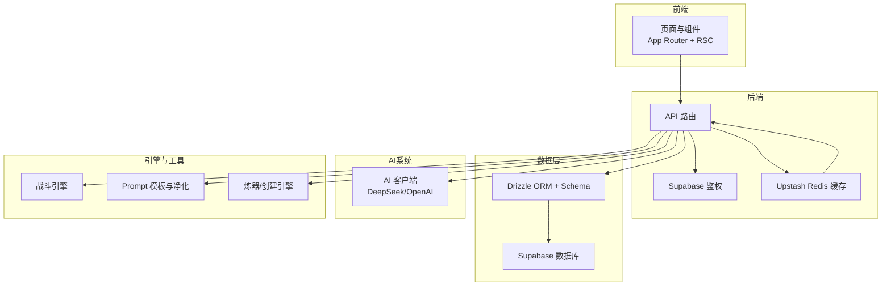
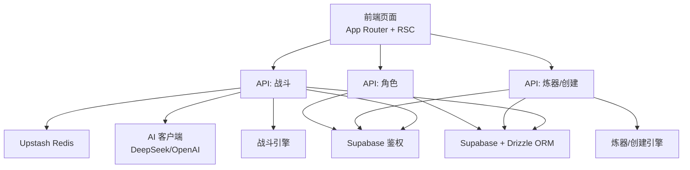
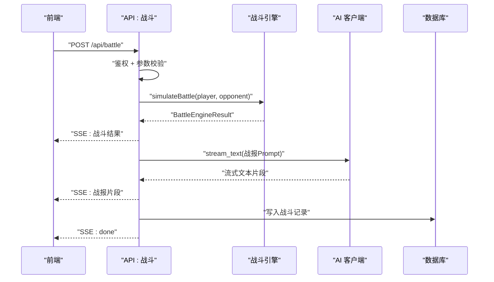
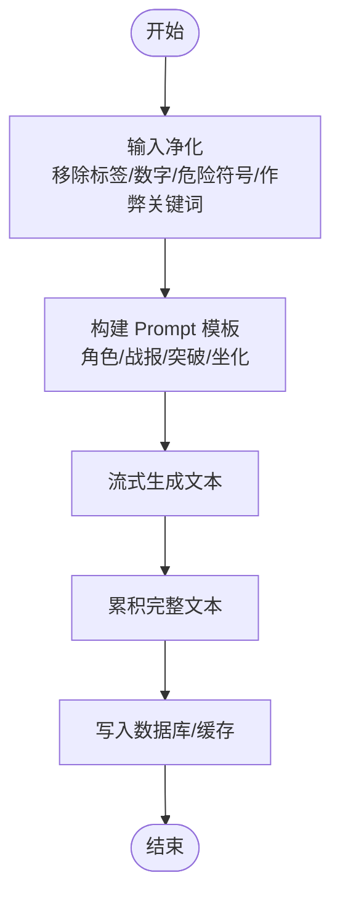
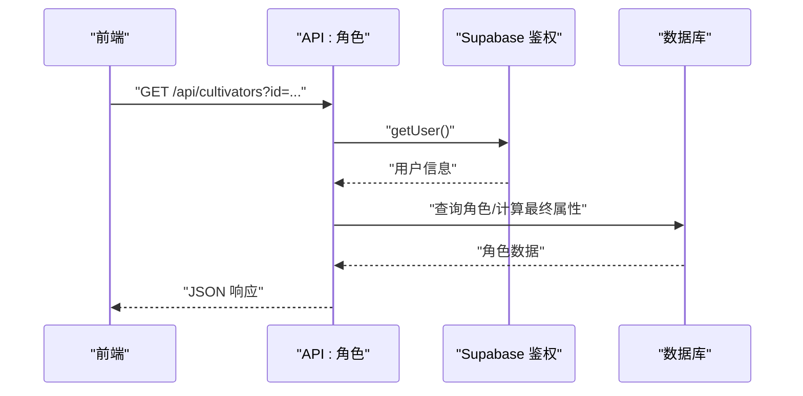
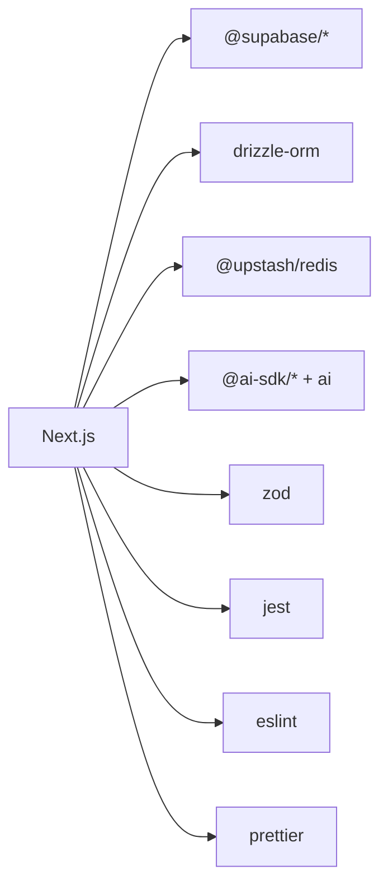

# 系统概述

<cite>
**本文引用的文件**
- [README.md](file://README.md)
- [roadmap.md](file://roadmap.md)
- [package.json](file://package.json)
- [next.config.ts](file://next.config.ts)
- [lib/drizzle/schema.ts](file://lib/drizzle/schema.ts)
- [lib/supabase/client.ts](file://lib/supabase/client.ts)
- [lib/redis/index.ts](file://lib/redis/index.ts)
- [engine/battleEngine.ts](file://engine/battleEngine.ts)
- [types/cultivator.ts](file://types/cultivator.ts)
- [types/constants.ts](file://types/constants.ts)
- [utils/prompts.ts](file://utils/prompts.ts)
- [app/api/battle/route.ts](file://app/api/battle/route.ts)
- [app/api/craft/route.ts](file://app/api/craft/route.ts)
- [app/api/cultivators/route.ts](file://app/api/cultivators/route.ts)
</cite>

## 目录
1. [简介](#简介)
2. [项目结构](#项目结构)
3. [核心组件](#核心组件)
4. [架构总览](#架构总览)
5. [详细组件分析](#详细组件分析)
6. [依赖关系分析](#依赖关系分析)
7. [性能考量](#性能考量)
8. [故障排查指南](#故障排查指南)
9. [结论](#结论)
10. [附录](#附录)

## 简介
《万界道友》是一款以“AIGC 驱动、高自由度文字体验、修仙世界观”为核心的开源文字修仙游戏。项目旨在打造一套“修仙宇宙的开源骨架”，既可直接游玩，也可作为底层架构，供创作者在此基础上快速搭建门派流派、玩法与表现层。系统强调“高自由度输入 + AIGC 反馈”，同时通过严格的数值与战斗模型保证稳定性与可组合性；表现层坚持“文字即界面，水墨意境，移动端优先”。

- 项目愿景与定位：成为“修仙宇宙的开源骨架”，兼顾玩法自由度与系统稳定性。
- 目标用户：喜欢文字修仙、策略回合制、AIGC 互动与二次创作的玩家与开发者。
- 关键特性：AIGC 驱动的角色背景/战报/奇遇生成；完备的修仙数据与战斗框架；纯文字+水墨风 UI；对开发者友好（易扩展、易二次创作）。

**章节来源**
- file://README.md#L29-L64

## 项目结构
项目采用 Next.js App Router + React Server Components 的全栈架构，前后端职责清晰：
- 前端（App Router + RSC）：页面路由、UI 组件、交互逻辑。
- 后端（API 路由）：业务接口、鉴权、数据聚合与持久化。
- 数据层：Supabase + Drizzle ORM；Upstash Redis 缓存；数据库迁移与快照。
- AI 集成：DeepSeek/OpenAI，通过统一的 AI 客户端封装，支持流式生成与提示词工程。
- 引擎与工具：战斗引擎、角色与属性工具、炼器/创建引擎、Prompt 模板与安全净化。

**图表来源**
- [package.json](file://package.json#L1-L54)
- [lib/supabase/client.ts](file://lib/supabase/client.ts#L1-L9)
- [lib/redis/index.ts](file://lib/redis/index.ts#L1-L6)
- [lib/drizzle/schema.ts](file://lib/drizzle/schema.ts#L1-L292)
- [engine/battleEngine.ts](file://engine/battleEngine.ts#L1-L120)
- [utils/prompts.ts](file://utils/prompts.ts#L1-L120)

**章节来源**
- file://README.md#L156-L187

## 核心组件
- 游戏数据模型与常量
  - 数据模型：角色、属性、灵根、功法、技能、法宝、消耗品、材料、命格、突破与闭关记录、战斗记录、邮件、副本历史等。
  - 常量：元素、技能类型、状态效果、装备槽位、境界与阶段、品阶、性别、效果类型等。
- 战斗引擎
  - 回合制战斗、状态系统（增益/控制/异常）、伤害与闪避计算、冷却与MP消耗、法宝主动技能与特殊效果联动。
- AIGC 集成
  - Prompt 模板：角色生成、战报生成、突破/坐化故事等；安全净化函数保障输入合规。
- API 路由
  - 战斗接口（SSE 流式输出）、炼器/创建接口、角色查询与删除接口。
- 数据库 Schema
  - 基于 Drizzle 的 PostgreSQL Schema，涵盖角色、技能、法宝、消耗品、战斗记录、邮件、副本历史等。
- 缓存与鉴权
  - Upstash Redis 用于排行榜等高频读取场景；Supabase 提供匿名用户与鉴权能力。

**章节来源**
- file://types/cultivator.ts#L1-L253
- file://types/constants.ts#L1-L191
- file://engine/battleEngine.ts#L1-L200
- file://utils/prompts.ts#L1-L120
- file://app/api/battle/route.ts#L1-L172
- file://lib/drizzle/schema.ts#L1-L292
- file://lib/redis/index.ts#L1-L6
- file://lib/supabase/client.ts#L1-L9

## 架构总览
系统采用“前端页面 + API 路由 + 数据库 + 缓存 + AI”的分层架构：
- 前端负责渲染与交互，API 路由负责业务编排与数据持久化。
- Supabase 提供用户鉴权与数据库访问；Drizzle 作为 ORM，管理 Schema 与迁移。
- Upstash Redis 用于热点数据缓存（如排行榜）。
- AI 客户端封装 DeepSeek/OpenAI，统一流式生成与提示词工程。
- 战斗引擎与炼器/创建引擎作为纯 TS 引擎，被 API 路由调用。

**图表来源**
- [app/api/battle/route.ts](file://app/api/battle/route.ts#L1-L172)
- [app/api/craft/route.ts](file://app/api/craft/route.ts#L1-L62)
- [app/api/cultivators/route.ts](file://app/api/cultivators/route.ts#L1-L147)
- [lib/supabase/client.ts](file://lib/supabase/client.ts#L1-L9)
- [lib/drizzle/schema.ts](file://lib/drizzle/schema.ts#L1-L292)
- [lib/redis/index.ts](file://lib/redis/index.ts#L1-L6)
- [engine/battleEngine.ts](file://engine/battleEngine.ts#L1-L120)
- [utils/prompts.ts](file://utils/prompts.ts#L1-L120)

## 详细组件分析

### 战斗系统（引擎与 API）
- 引擎职责
  - 回合制战斗、状态结算、伤害计算、闪避判定、MP/冷却管理、法宝主动技能与特殊效果联动。
  - 通过统一的属性计算函数整合基础属性、功法、命格、装备与状态加成。
- API 路由
  - 提供 SSE 流式输出，先返回战斗结果，再流式生成战报文本，并将完整结果写入数据库。
  - 严格鉴权与输入校验，错误安全处理。
- 数据模型
  - 战斗记录表包含对战双方、挑战类型、结果快照与战报文本。

**图表来源**
- [app/api/battle/route.ts](file://app/api/battle/route.ts#L1-L172)
- [engine/battleEngine.ts](file://engine/battleEngine.ts#L674-L830)
- [utils/prompts.ts](file://utils/prompts.ts#L120-L146)
- [lib/drizzle/schema.ts](file://lib/drizzle/schema.ts#L240-L265)

**章节来源**
- file://engine/battleEngine.ts#L1-L200
- file://engine/battleEngine.ts#L674-L830
- file://app/api/battle/route.ts#L1-L172
- file://lib/drizzle/schema.ts#L240-L265

### 角色与数据模型
- 数据模型
  - 角色包含基础属性、灵根、功法、技能、命格、突破与闭关记录、库存与装备等。
  - 常量定义元素、技能类型、状态效果、装备槽位、境界与阶段、品阶等。
- 属性计算
  - 通过统一的属性计算函数，将基础属性、功法、命格、装备与状态加成整合，得到最终属性与上限。
- 数据库 Schema
  - 角色主表、灵根、命格、功法、技能、材料、法宝、消耗品、临时角色、战斗记录、邮件、副本历史等。

```mermaid
erDiagram
WANJIEDAOLIAO_CULTIVATORS {
uuid id PK
uuid user_id
string name
string title
string gender
string origin
text personality
text background
text prompt
string realm
string realm_stage
int age
int lifespan
int closed_door_years_total
string status
timestamp died_at
int vitality
int spirit
int wisdom
int speed
int willpower
int spirit_stones
timestamp last_yield_at
int max_skills
text balance_notes
timestamp created_at
timestamp updated_at
}
WANJIEDAOLIAO_SPIRITUAL_ROOTS {
uuid id PK
uuid cultivator_id FK
string element
int strength
string grade
timestamp created_at
}
WANJIEDAOLIAO_PRE_HEAVEN_FATES {
uuid id PK
uuid cultivator_id FK
string name
string type
string quality
jsonb attribute_mod
text description
timestamp created_at
}
WANJIEDAOLIAO_CULTIVATION_TECHNIQUES {
uuid id PK
uuid cultivator_id FK
string name
string grade
jsonb bonus
string required_realm
timestamp created_at
}
WANJIEDAOLIAO_SKILLS {
uuid id PK
uuid cultivator_id FK
string name
text prompt
string type
string element
string grade
int power
int cost
int cooldown
string effect
int duration
int target_self
text description
int score
timestamp created_at
}
WANJIEDAOLIAO_MATERIALS {
uuid id PK
uuid cultivator_id FK
string name
string type
string rank
string element
text description
jsonb details
int quantity
timestamp created_at
}
WANJIEDAOLIAO_ARTIFACTS {
uuid id PK
uuid cultivator_id FK
string name
string prompt
string quality
string required_realm
string slot
string element
jsonb bonus
jsonb special_effects
jsonb curses
text description
int score
timestamp created_at
}
WANJIEDAOLIAO_CONSUMABLES {
uuid id PK
uuid cultivator_id FK
string name
string type
string prompt
string quality
jsonb effect
int quantity
text description
int score
timestamp created_at
}
WANJIEDAOLIAO_RETREAT_RECORDS {
uuid id PK
uuid cultivator_id FK
string realm
string realm_stage
int years
boolean success
double precision chance
double precision roll
timestamp timestamp
jsonb modifiers
}
WANJIEDAOLIAO_BREAKTHROUGH_HISTORY {
uuid id PK
uuid cultivator_id FK
string from_realm
string from_stage
string to_realm
string to_stage
int age
int years_spent
text story
timestamp created_at
}
WANJIEDAOLIAO_EQUIPPED_ITEMS {
uuid id PK
uuid cultivator_id FK
uuid weapon_id
uuid armor_id
uuid accessory_id
timestamp created_at
timestamp updated_at
}
WANJIEDAOLIAO_TEMP_CULTIVATORS {
uuid id PK
uuid user_id
jsonb cultivator_data
jsonb available_fates
timestamp created_at
timestamp expires_at
}
WANJIEDAOLIAO_BATTLE_RECORDS {
uuid id PK
uuid user_id
uuid cultivator_id FK
string challenge_type
uuid opponent_cultivator_id
jsonb battle_result
text battle_report
timestamp created_at
}
WANJIEDAOLIAO_MAILS {
uuid id PK
uuid cultivator_id FK
string title
text content
string type
jsonb attachments
boolean is_read
boolean is_claimed
timestamp created_at
}
WANJIEDAOLIAO_DUNGEON_HISTORIES {
uuid id PK
uuid cultivator_id FK
string theme
jsonb result
text log
timestamp created_at
}
WANJIEDAOLIAO_CULTIVATORS ||--o{ WANJIEDAOLIAO_SPIRITUAL_ROOTS : "拥有"
WANJIEDAOLIAO_CULTIVATORS ||--o{ WANJIEDAOLIAO_PRE_HEAVEN_FATES : "拥有"
WANJIEDAOLIAO_CULTIVATORS ||--o{ WANJIEDAOLIAO_CULTIVATION_TECHNIQUES : "修习"
WANJIEDAOLIAO_CULTIVATORS ||--o{ WANJIEDAOLIAO_SKILLS : "掌握"
WANJIEDAOLIAO_CULTIVATORS ||--o{ WANJIEDAOLIAO_MATERIALS : "持有"
WANJIEDAOLIAO_CULTIVATORS ||--o{ WANJIEDAOLIAO_ARTIFACTS : "持有"
WANJIEDAOLIAO_CULTIVATORS ||--o{ WANJIEDAOLIAO_CONSUMABLES : "持有"
WANJIEDAOLIAO_CULTIVATORS ||--o{ WANJIEDAOLIAO_RETREAT_RECORDS : "记录"
WANJIEDAOLIAO_CULTIVATORS ||--o{ WANJIEDAOLIAO_BREAKTHROUGH_HISTORY : "记录"
WANJIEDAOLIAO_CULTIVATORS ||--|| WANJIEDAOLIAO_EQUIPPED_ITEMS : "装备"
WANJIEDAOLIAO_CULTIVATORS ||--o{ WANJIEDAOLIAO_BATTLE_RECORDS : "参战"
WANJIEDAOLIAO_CULTIVATORS ||--o{ WANJIEDAOLIAO_MAILS : "接收"
WANJIEDAOLIAO_CULTIVATORS ||--o{ WANJIEDAOLIAO_DUNGEON_HISTORIES : "探索"
```

**图表来源**
- [lib/drizzle/schema.ts](file://lib/drizzle/schema.ts#L1-L292)
- [types/cultivator.ts](file://types/cultivator.ts#L1-L253)
- [types/constants.ts](file://types/constants.ts#L1-L191)

**章节来源**
- file://types/cultivator.ts#L1-L253
- file://types/constants.ts#L1-L191
- file://lib/drizzle/schema.ts#L1-L292

### AIGC 集成与 Prompt 工程
- Prompt 模板
  - 角色生成：约束属性上限、灵根数量与强度、神通/功法品阶分布、状态效果与冷却/消耗等。
  - 战报生成：基于战斗日志与双方设定，生成回合制战斗描写，带 HTML 标记。
  - 突破/坐化故事：根据闭关年份、境界、灵根、功法与气运生成短篇故事。
- 安全净化
  - 移除标签、数字、危险符号与作弊关键词，压缩连续非文字字符，保障输入合规。
- AI 客户端
  - 统一封装 DeepSeek/OpenAI，支持流式生成与文本拼接。

**图表来源**
- [utils/prompts.ts](file://utils/prompts.ts#L1-L356)

**章节来源**
- file://utils/prompts.ts#L1-L356

### API 路由与鉴权
- 战斗接口
  - SSE 流式输出战斗结果与战报；鉴权失败返回 401；参数校验失败返回 400；内部错误返回 500。
- 炼器/创建接口
  - 根据 craftType 分支处理；对神通创建进行长度校验；错误统一捕获并返回。
- 角色接口
  - 查询用户所有角色或单个角色；计算最终属性；删除角色并返回状态码。

**图表来源**
- [app/api/cultivators/route.ts](file://app/api/cultivators/route.ts#L1-L147)

**章节来源**
- file://app/api/battle/route.ts#L1-L172
- file://app/api/craft/route.ts#L1-L62
- file://app/api/cultivators/route.ts#L1-L147

## 依赖关系分析
- 技术栈与依赖
  - 前端：Next.js 16、React 19、TailwindCSS。
  - 后端：Next.js API 路由、Supabase、Drizzle ORM、Upstash Redis。
  - AI：@ai-sdk/deepseek、@ai-sdk/openai、ai。
  - 工具：zod、jest、eslint、prettier。
- 外部集成
  - Supabase：用户鉴权与数据库访问。
  - Upstash Redis：缓存与排行榜等高频读取。
  - AI 服务：DeepSeek/OpenAI，统一通过 AI 客户端封装。
- 内部耦合
  - API 路由依赖鉴权、数据库、AI 客户端与引擎；引擎依赖类型与常量；Prompts 依赖引擎结果。

**图表来源**
- [package.json](file://package.json#L1-L54)

**章节来源**
- file://package.json#L1-L54

## 性能考量
- 前端性能
  - App Router + RSC 有助于减少传输与首屏渲染负担；组件按需加载与 TailwindCSS 有助于体积控制。
- 后端性能
  - 战斗接口采用 SSE 流式输出，降低前端等待时间；AI 生成采用流式拼接，避免一次性大文本。
  - 数据库查询尽量使用索引与关联查询；缓存热点数据（如排行榜）。
- 数据层性能
  - Drizzle ORM 提供类型安全与 SQL 生成；Schema 设计合理，避免冗余字段。
- AI 生成性能
  - Prompt 模板与净化函数减少无效生成；流式输出避免内存峰值过高。

[本节为通用指导，无需特定文件来源]

## 故障排查指南
- 常见问题
  - 未授权访问：检查 Supabase 鉴权是否成功，确认用户登录状态。
  - 参数校验失败：检查请求体字段是否齐全且类型正确。
  - 数据库写入失败：检查 Drizzle 迁移是否执行，表结构是否与 Schema 一致。
  - AI 生成异常：检查环境变量与网络连通性，确认 AI 客户端初始化正常。
- 日志与错误处理
  - API 路由对错误进行统一捕获与安全返回；开发环境下可显示详细错误信息，生产环境返回通用错误提示。
  - 战斗记录写入失败不会中断前端体验，仅记录日志。

**章节来源**
- file://app/api/battle/route.ts#L120-L172
- file://app/api/cultivators/route.ts#L78-L147

## 结论
《万界道友》以“AIGC 驱动 + 修仙世界观 + 高自由度文字体验”为核心，构建了从角色生成、战斗、炼器、副本探索到邮件与排行榜的完整玩法骨架。系统采用 Next.js App Router + RSC 的现代前端架构，配合 Supabase + Drizzle ORM 的后端数据层、Upstash Redis 的缓存与 DeepSeek/OpenAI 的 AIGC 能力，形成稳定、可扩展且富有表现力的技术栈。当前已实现角色生成、战斗引擎、基础装备与技能体系、水墨风 UI 与 AIGC Prompt 工程；路线图规划了闭关顿悟、秘境探索、宗门任务、灵兽培养、炼器炼丹等中远期玩法，以及多人互动与 SDK 化愿景。项目既适合初学者快速上手，也为高级开发者提供了可扩展的底层架构与二次创作空间。

[本节为总结，无需特定文件来源]

## 附录
- 当前功能状态与未来方向
  - 已完成：角色生成、属性与灵根、境界体系、基础神通与功法、法宝装备、水墨风 UI、移动端优先布局、核心战斗引擎、回合制逻辑、状态系统、战报回放、战斗历史、天骄榜、AIGC 角色背景与战报生成。
  - 待完成：完善角色创建流程与引导文案、丰富基础法宝与神通示例、闭关顿悟、秘境探索、宗门任务、灵兽培养、炼器炼丹、打通更多 AIGC 链路、提供模组模板与门派扩展包、多人互动（异步 PVP、共修副本、宗门社交、道友交易）。
- 目标用户与价值
  - 玩家：享受文字修仙、策略回合制与 AIGC 互动。
  - 开发者：基于统一数据模型与引擎快速搭建新玩法与表现层。

**章节来源**
- file://README.md#L250-L282
- file://roadmap.md#L1-L108