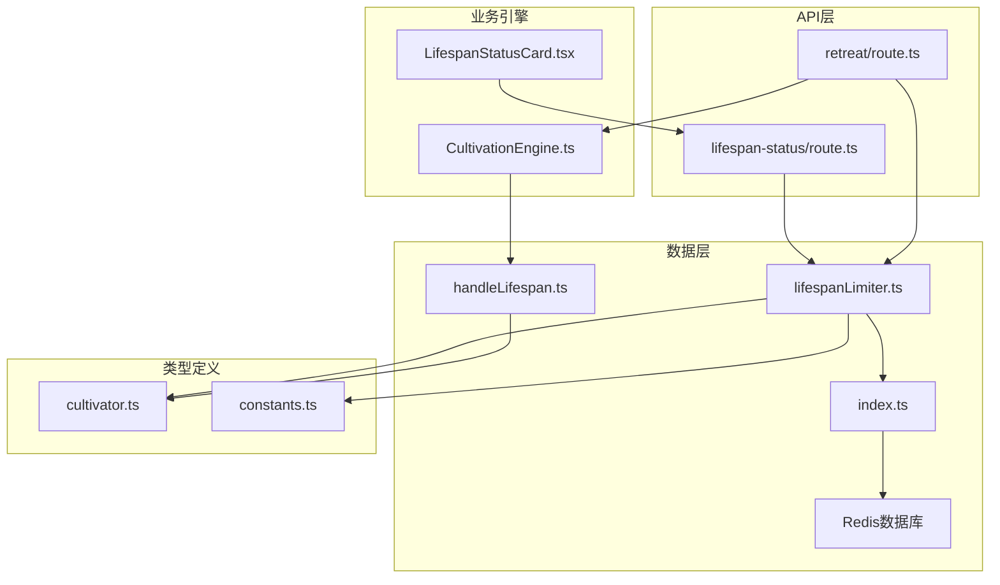
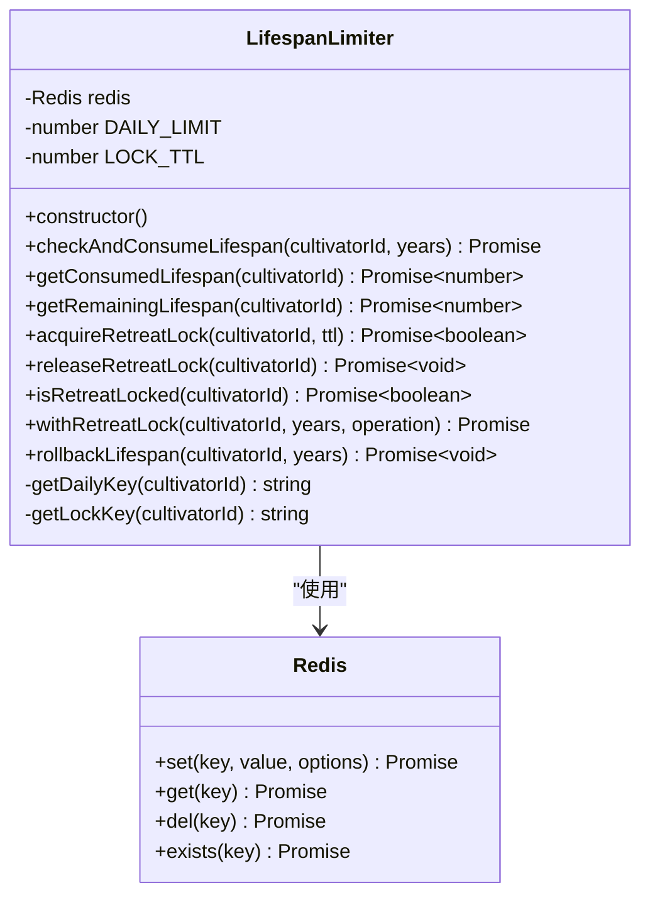
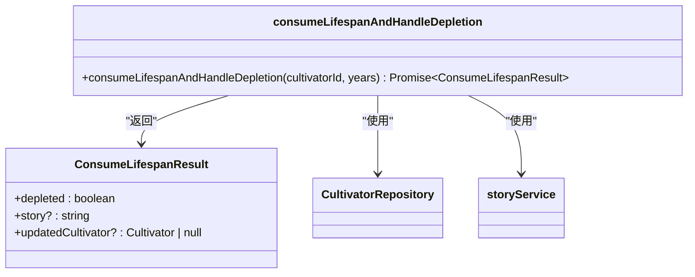
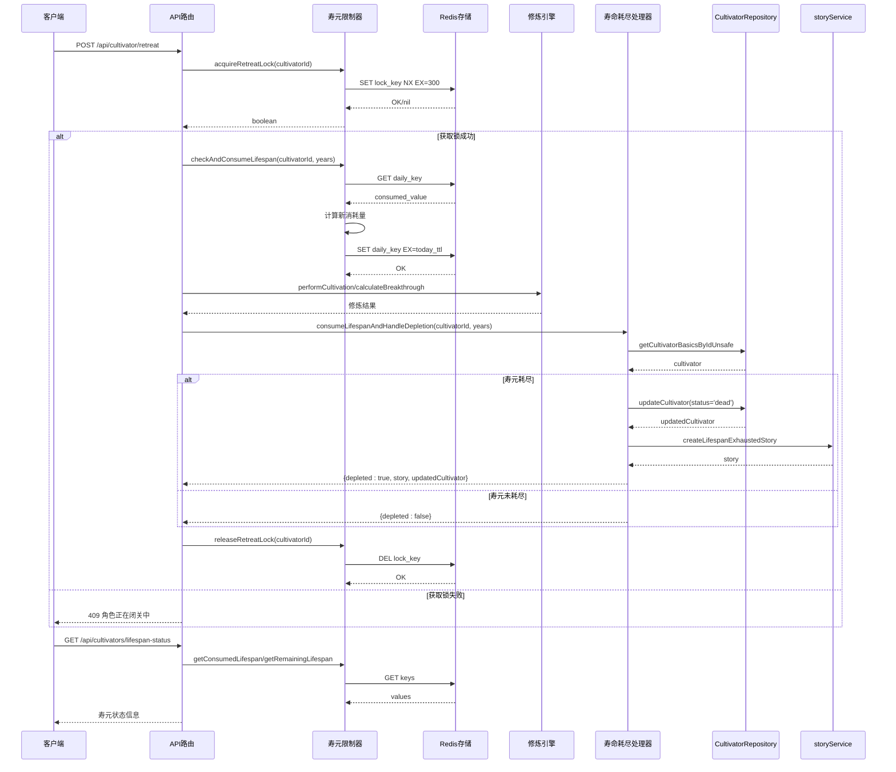
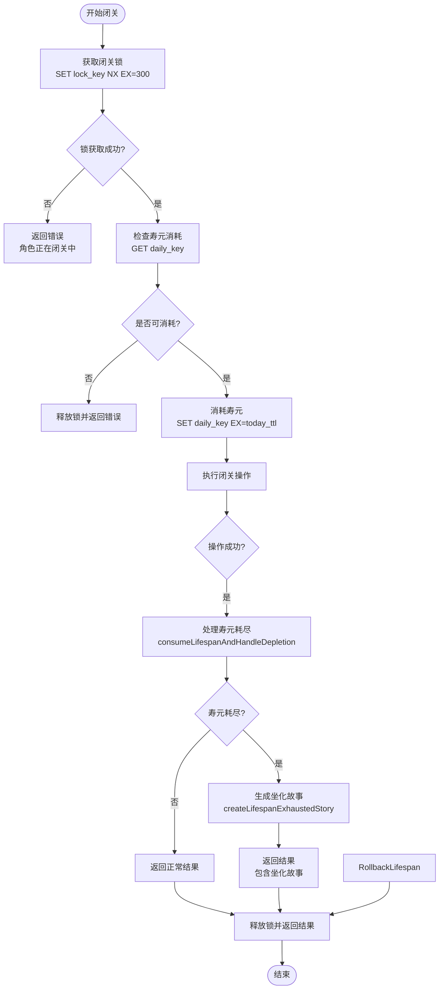
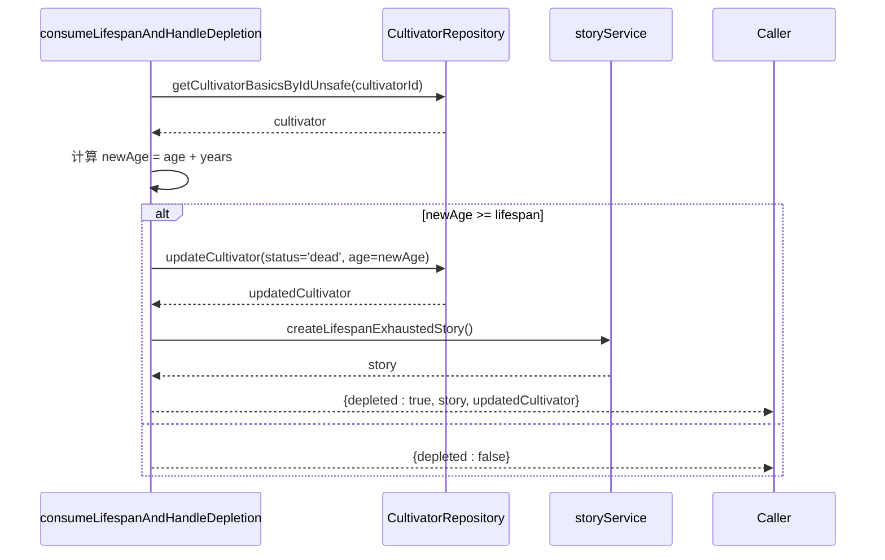
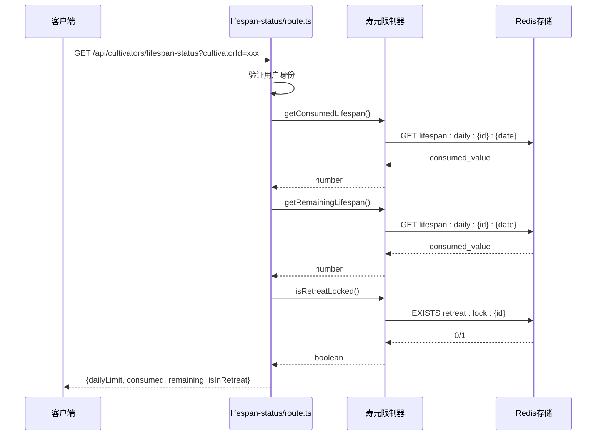
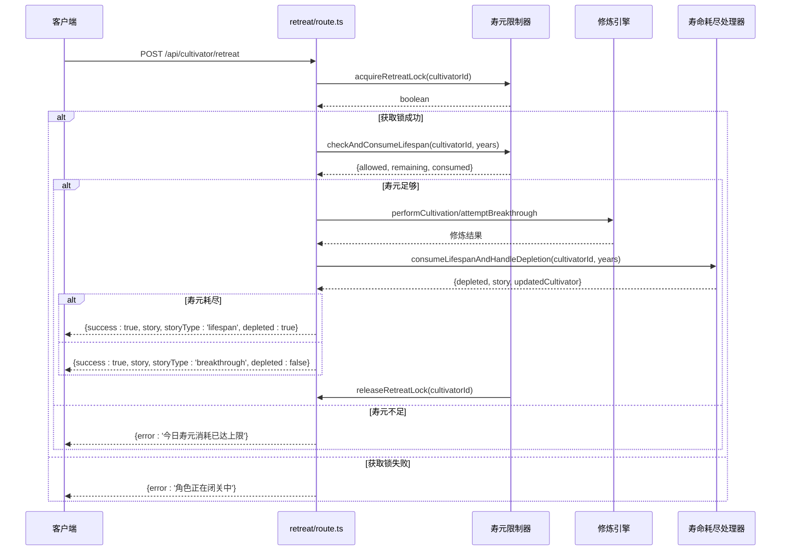
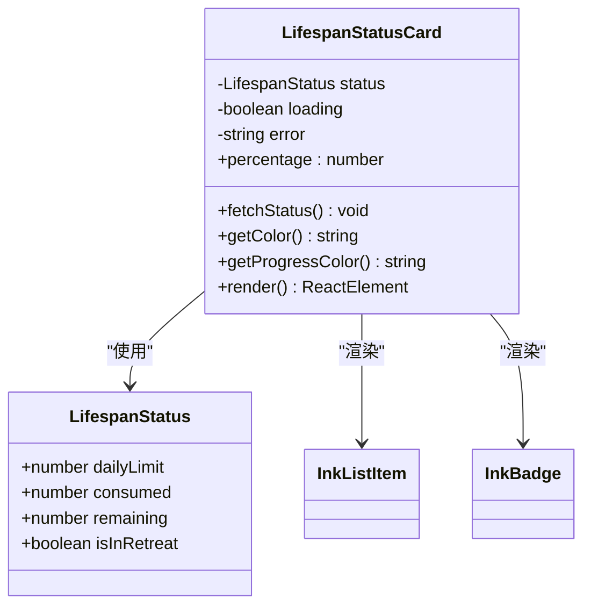

# 寿命消耗限制器

<cite>
**本文档引用的文件**
- [lifespanLimiter.ts](file://lib/redis/lifespanLimiter.ts)
- [lifespan-status/route.ts](file://app/api/cultivators/lifespan-status/route.ts)
- [retreat/route.ts](file://app/api/cultivator/retreat/route.ts)
- [handleLifespan.ts](file://lib/lifespan/handleLifespan.ts)
- [LifespanStatusCard.tsx](file://components/LifespanStatusCard.tsx)
- [index.ts](file://lib/redis/index.ts)
- [cultivator.ts](file://types/cultivator.ts)
- [constants.ts](file://types/constants.ts)
- [LIFESPAN_LIMITER_GUIDE.md](file://LIFESPAN_LIMITER_GUIDE.md)
</cite>

## 更新摘要
**变更内容**
- 更新了核心组件和架构概览部分，增加了新的`consumeLifespanAndHandleDepletion`工具函数的说明
- 在详细组件分析中新增了"寿命耗尽处理工具"章节，详细说明了新工具函数的实现和用途
- 更新了闭关操作API的流程图，反映了新的逻辑处理流程
- 更新了依赖关系分析，增加了新的`handleLifespan.ts`文件

## 目录
1. [简介](#简介)
2. [项目结构](#项目结构)
3. [核心组件](#核心组件)
4. [架构概览](#架构概览)
5. [详细组件分析](#详细组件分析)
6. [依赖关系分析](#依赖关系分析)
7. [性能考虑](#性能考虑)
8. [故障排除指南](#故障排除指南)
9. [结论](#结论)

## 简介

寿命消耗限制器（Lifespan Limiter）是修仙游戏《万界道友》中的核心机制之一，用于控制角色每日寿元消耗上限和闭关并发控制。该系统确保游戏平衡性，防止玩家滥用寿元资源，同时提供流畅的用户体验。

系统采用Redis作为存储后端，实现了以下关键功能：
- **每日寿元限制**：每个角色每天最多消耗200年寿元
- **并发控制**：防止角色同时进行多个寿元消耗操作
- **自动回滚**：操作失败时自动回滚寿元消耗
- **实时状态监控**：提供完整的寿元消耗状态查询
- **集中化处理**：通过新的`consumeLifespanAndHandleDepletion`工具函数集中处理寿元耗尽的副作用，实现了逻辑复用和代码简化

## 项目结构



**图表来源**
- [lifespan-status/route.ts](file://app/api/cultivators/lifespan-status/route.ts#L1-L57)
- [retreat/route.ts](file://app/api/cultivator/retreat/route.ts#L1-L167)
- [lifespanLimiter.ts](file://lib/redis/lifespanLimiter.ts#L1-L199)
- [handleLifespan.ts](file://lib/lifespan/handleLifespan.ts#L1-L81)

**章节来源**
- [lifespanLimiter.ts](file://lib/redis/lifespanLimiter.ts#L1-L199)
- [lifespan-status/route.ts](file://app/api/cultivators/lifespan-status/route.ts#L1-L57)
- [retreat/route.ts](file://app/api/cultivator/retreat/route.ts#L1-L167)
- [handleLifespan.ts](file://lib/lifespan/handleLifespan.ts#L1-L81)

## 核心组件

### 寿元限制器类 (LifespanLimiter)

LifespanLimiter是系统的核心类，负责所有寿元相关的操作：



**图表来源**
- [lifespanLimiter.ts](file://lib/redis/lifespanLimiter.ts#L8-L185)

### 寿命耗尽处理工具 (consumeLifespanAndHandleDepletion)

新增的`consumeLifespanAndHandleDepletion`工具函数集中处理寿元耗尽的副作用：



**图表来源**
- [handleLifespan.ts](file://lib/lifespan/handleLifespan.ts#L20-L79)

### API路由层

系统提供了两个主要的API接口：

1. **寿元状态查询接口** (`/api/cultivators/lifespan-status`)
2. **闭关操作接口** (`/api/cultivator/retreat`)

**章节来源**
- [lifespanLimiter.ts](file://lib/redis/lifespanLimiter.ts#L1-L199)
- [lifespan-status/route.ts](file://app/api/cultivators/lifespan-status/route.ts#L1-L57)
- [retreat/route.ts](file://app/api/cultivator/retreat/route.ts#L1-L167)
- [handleLifespan.ts](file://lib/lifespan/handleLifespan.ts#L1-L81)

## 架构概览



**图表来源**
- [retreat/route.ts](file://app/api/cultivator/retreat/route.ts#L19-L167)
- [lifespanLimiter.ts](file://lib/redis/lifespanLimiter.ts#L98-L166)
- [handleLifespan.ts](file://lib/lifespan/handleLifespan.ts#L20-L79)

## 详细组件分析

### 寿元限制器实现

#### 关键特性

1. **每日限制机制**
   - 使用Redis的EX参数实现自动过期
   - 每日凌晨自动重置（基于明天凌晨的时间差计算）

2. **并发控制**
   - 采用Redis的NX选项确保原子性
   - 锁过期时间为300秒，防止死锁

3. **自动回滚**
   - 提供rollbackLifespan方法处理异常情况
   - 在withRetreatLock中自动释放锁

#### 数据结构设计



**图表来源**
- [lifespanLimiter.ts](file://lib/redis/lifespanLimiter.ts#L98-L166)

**章节来源**
- [lifespanLimiter.ts](file://lib/redis/lifespanLimiter.ts#L38-L184)

### 寿命耗尽处理工具

#### 功能概述

新的`consumeLifespanAndHandleDepletion`工具函数集中处理了寿元耗尽的副作用，实现了逻辑复用和代码简化。该函数在闭关等操作中被调用，统一处理以下逻辑：

1. **检查寿元是否耗尽**：计算新年龄是否达到或超过角色的寿元上限
2. **更新角色状态**：若寿元耗尽，将角色状态更新为"dead"
3. **生成坐化故事**：尝试生成角色坐化的故事，增强游戏体验
4. **返回处理结果**：返回是否耗尽、可能的故事和已更新的角色快照

#### 实现细节



**图表来源**
- [handleLifespan.ts](file://lib/lifespan/handleLifespan.ts#L20-L79)

**章节来源**
- [handleLifespan.ts](file://lib/lifespan/handleLifespan.ts#L1-L81)

### API路由实现

#### 寿元状态查询API

该API提供实时的寿元消耗状态：



**图表来源**
- [lifespan-status/route.ts](file://app/api/cultivators/lifespan-status/route.ts#L8-L41)

#### 闭关操作API

该API处理角色的闭关修炼请求，现在集成了新的`consumeLifespanAndHandleDepletion`工具函数：



**章节来源**
- [lifespan-status/route.ts](file://app/api/cultivators/lifespan-status/route.ts#L1-L57)
- [retreat/route.ts](file://app/api/cultivator/retreat/route.ts#L1-L167)
- [handleLifespan.ts](file://lib/lifespan/handleLifespan.ts#L1-L81)

### 用户界面组件

#### 寿元状态卡片组件

LifespanStatusCard提供了直观的寿元消耗状态展示：



**图表来源**
- [LifespanStatusCard.tsx](file://components/LifespanStatusCard.tsx#L6-L186)

**章节来源**
- [LifespanStatusCard.tsx](file://components/LifespanStatusCard.tsx#L1-L228)

## 依赖关系分析

```mermaid
graph TB
subgraph "外部依赖"
A[@upstash/redis]
B[Next.js]
C[Supabase]
end
subgraph "内部模块"
D[lifespanLimiter.ts]
E[lifespan-status/route.ts]
F[retreat/route.ts]
G[CultivationEngine.ts]
H[LifespanStatusCard.tsx]
I[handleLifespan.ts]
end
subgraph "类型定义"
J[cultivator.ts]
K[constants.ts]
end
A --> D
B --> E
B --> F
C --> E
C --> F
D --> J
D --> K
F --> G
H --> E
I --> J
I --> K
F --> I
```

**图表来源**
- [index.ts](file://lib/redis/index.ts#L1-L7)
- [lifespanLimiter.ts](file://lib/redis/lifespanLimiter.ts#L1-L15)
- [handleLifespan.ts](file://lib/lifespan/handleLifespan.ts#L1-L15)

**章节来源**
- [index.ts](file://lib/redis/index.ts#L1-L7)
- [cultivator.ts](file://types/cultivator.ts#L1-L283)
- [constants.ts](file://types/constants.ts#L1-L212)
- [handleLifespan.ts](file://lib/lifespan/handleLifespan.ts#L1-L81)

## 性能考虑

### Redis优化策略

1. **键命名规范**
   - 使用`:daily:`和`:lock:`前缀区分不同用途
   - 日期格式YYYY-MM-DD便于管理和清理

2. **过期时间管理**
   - 寿元键使用到明天凌晨的精确过期时间
   - 锁键使用固定300秒过期时间

3. **原子操作**
   - 使用Redis的NX选项确保锁获取的原子性
   - 使用单个SET命令完成值设置和过期时间设置

### 缓存策略

1. **客户端缓存**
   - LifespanStatusCard支持自动刷新机制
   - 默认60秒刷新间隔，可根据需要调整

2. **服务端缓存**
   - Redis天然具备缓存优势
   - 支持水平扩展和分布式部署

## 故障排除指南

### 常见问题及解决方案

#### 1. 寿元消耗上限错误
**症状**：用户收到"今日寿元消耗已达上限"的错误信息

**原因分析**：
- 当日已消耗达到200年上限
- Redis连接异常导致读取失败

**解决步骤**：
1. 检查Redis服务状态
2. 验证用户身份认证
3. 等待到下一个自然日

#### 2. 闭关锁获取失败
**症状**：用户收到"角色正在闭关中"的错误

**原因分析**：
- 另一个闭关操作正在进行
- 锁过期时间已到但未正确释放

**解决步骤**：
1. 等待300秒锁自动过期
2. 检查是否有未处理的异常情况
3. 重新尝试闭关操作

#### 3. 数据一致性问题
**症状**：寿元消耗状态与实际不符

**原因分析**：
- 操作过程中发生异常中断
- Redis写入失败

**解决步骤**：
1. 检查rollbackLifespan调用
2. 验证Redis事务完整性
3. 手动同步数据状态

**章节来源**
- [LIFESPAN_LIMITER_GUIDE.md](file://LIFESPAN_LIMITER_GUIDE.md#L1-L172)

## 结论

寿命消耗限制器系统通过精心设计的架构和实现，为《万界道友》提供了可靠的寿元管理机制。系统的主要优势包括：

1. **可靠性**：基于Redis的原子操作确保数据一致性
2. **可扩展性**：支持分布式部署和水平扩展
3. **用户体验**：提供实时的状态监控和直观的界面展示
4. **代码复用**：通过新的`consumeLifespanAndHandleDepletion`工具函数实现了寿元耗尽处理逻辑的集中化和复用，简化了代码结构
5. **安全性**：防止并发操作冲突和资源滥用

该系统为游戏的核心玩法提供了坚实的基础设施支持，确保了游戏平衡性和长期可维护性。通过合理的错误处理和监控机制，系统能够在各种异常情况下保持稳定运行。