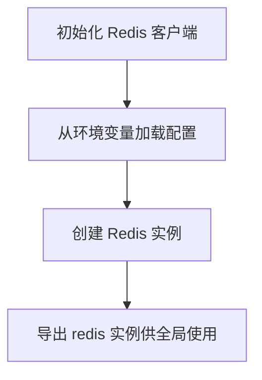
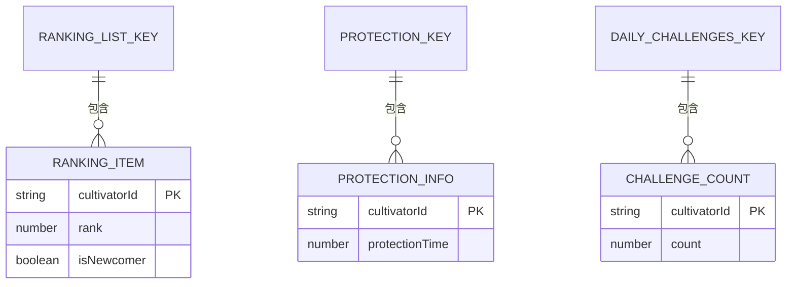
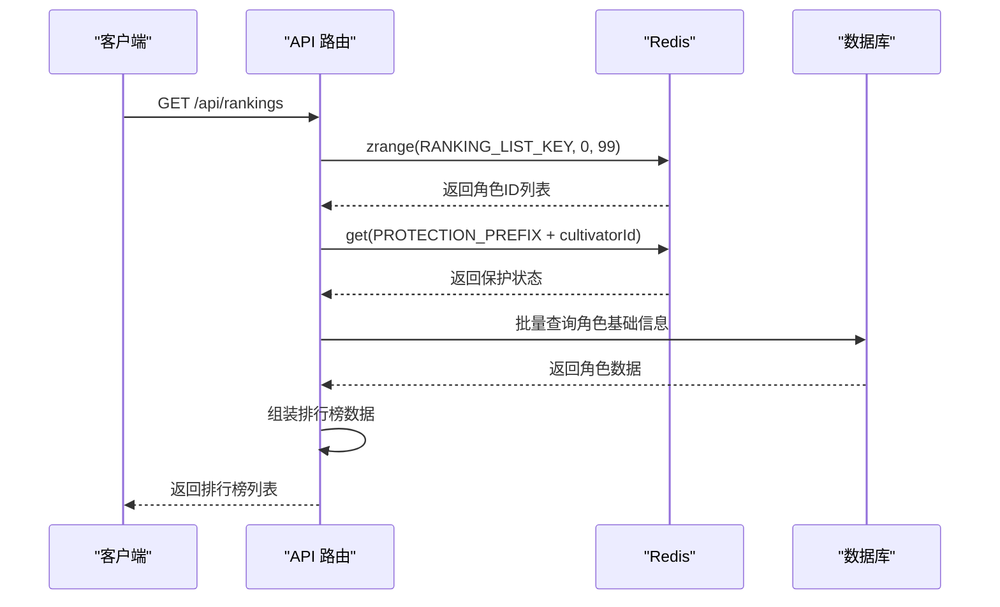
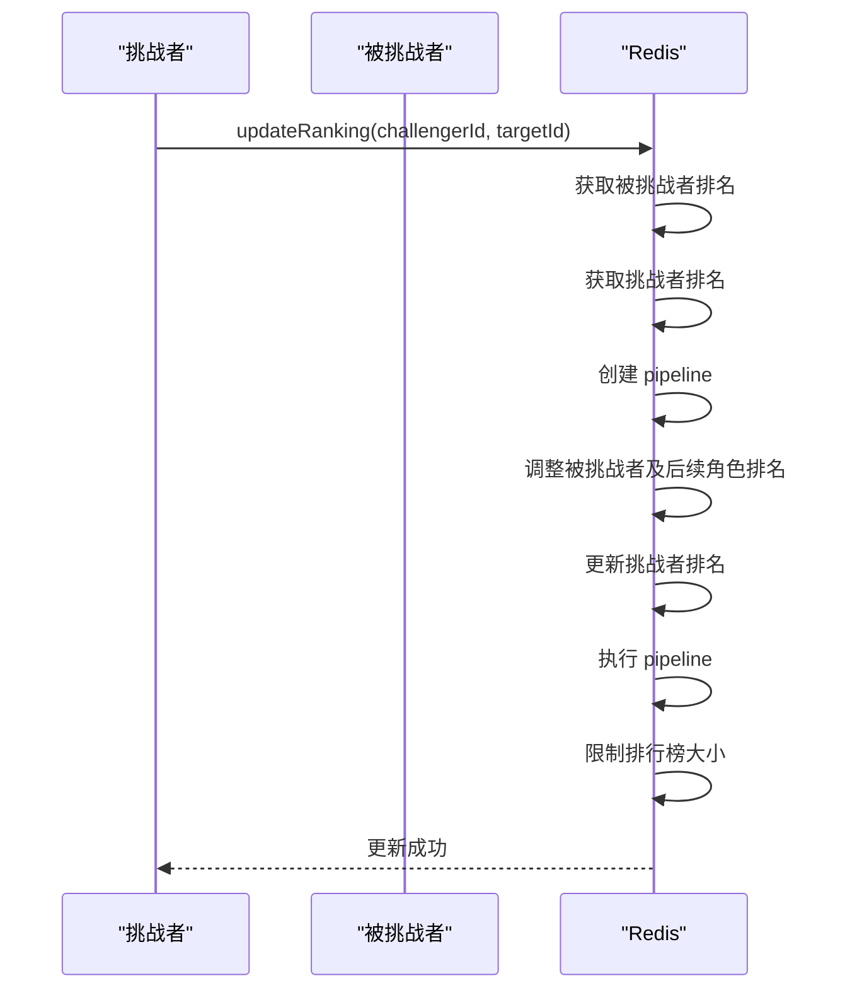
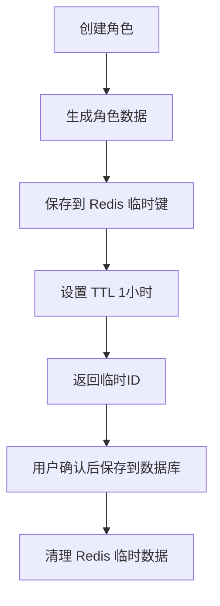
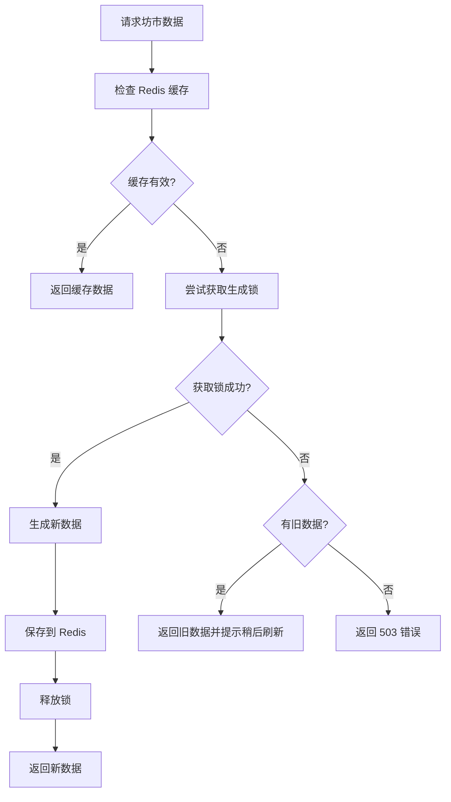
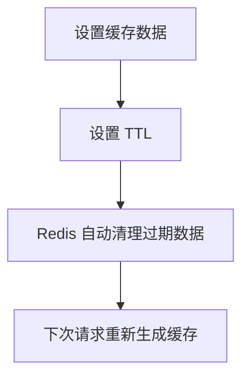
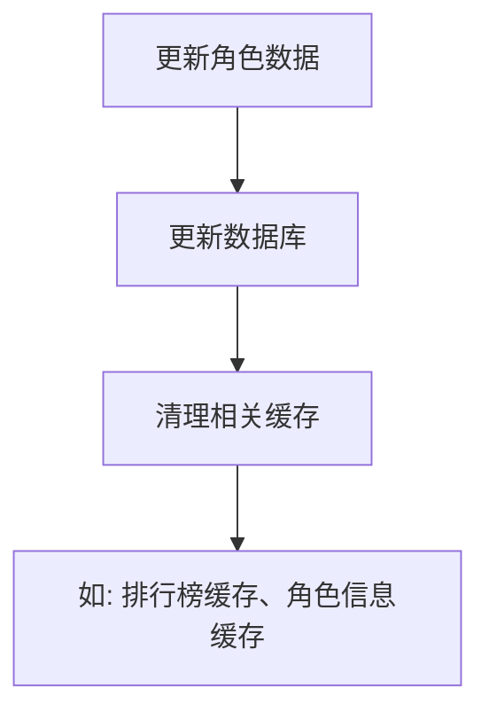
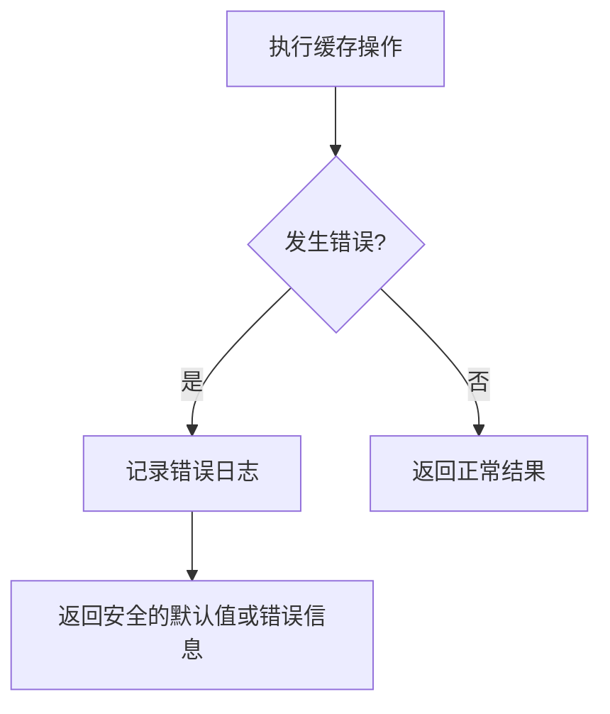

# 缓存与性能优化

<cite>
**本文档引用的文件**  
- [index.ts](file://lib/redis/index.ts)
- [rankings.ts](file://lib/redis/rankings.ts)
- [cultivatorRepository.ts](file://lib/repositories/cultivatorRepository.ts)
- [redisCultivatorRepository.ts](file://lib/repositories/redisCultivatorRepository.ts)
- [route.ts](file://app/api/rankings/route.ts)
- [my-rank/route.ts](file://app/api/rankings/my-rank/route.ts)
- [market/route.ts](file://app/api/market/route.ts)
- [rankingUtils.ts](file://utils/rankingUtils.ts)
- [schema.ts](file://lib/drizzle/schema.ts)
</cite>

## 目录
1. [引言](#引言)
2. [Redis连接与初始化](#redis连接与初始化)
3. [排行榜缓存策略](#排行榜缓存策略)
4. [高频读取场景优化](#高频读取场景优化)
5. [缓存失效与数据一致性](#缓存失效与数据一致性)
6. [性能监控与基准测试](#性能监控与基准测试)
7. [开发者指导](#开发者指导)
8. [结论](#结论)

## 引言
本文档详细阐述了万界道友项目中的缓存与性能优化策略，重点分析Redis在提升系统响应速度中的关键作用。文档聚焦于排行榜功能的实现，涵盖Redis连接建立、数据缓存、更新与查询逻辑，以及如何通过缓存减轻数据库压力。同时，文档还描述了缓存失效策略、数据一致性保证和性能监控方法，为开发者在新增功能时有效利用缓存提供指导。

## Redis连接与初始化
系统通过`@upstash/redis`客户端库与Redis服务建立连接，连接配置从环境变量中读取，确保了配置的安全性和灵活性。

**Diagram sources**
- [index.ts](file://lib/redis/index.ts#L1-L6)

**Section sources**
- [index.ts](file://lib/redis/index.ts#L1-L6)

## 排行榜缓存策略
排行榜功能是系统中高频读取的核心场景之一。通过Redis的有序集合（ZSet）数据结构，实现了高效的排名存储与查询。

### 排行榜数据结构
排行榜使用Redis的ZSet结构，以角色ID为成员（member），排名为分数（score），确保了排名的有序性。

**Diagram sources**
- [rankings.ts](file://lib/redis/rankings.ts#L8-L17)

### 排行榜查询逻辑
查询排行榜时，系统首先从Redis获取排名顺序和保护状态，然后批量查询角色基础信息，最后组装成完整的排行榜数据。

**Diagram sources**
- [rankings.ts](file://lib/redis/rankings.ts#L76-L109)
- [route.ts](file://app/api/rankings/route.ts#L9-L31)

**Section sources**
- [rankings.ts](file://lib/redis/rankings.ts#L76-L109)
- [route.ts](file://app/api/rankings/route.ts#L9-L31)

### 排行榜更新逻辑
当角色排名发生变化时，系统通过原子性操作更新排行榜，确保数据的一致性。

**Diagram sources**
- [rankings.ts](file://lib/redis/rankings.ts#L190-L269)

**Section sources**
- [rankings.ts](file://lib/redis/rankings.ts#L190-L269)

## 高频读取场景优化
除了排行榜，系统中还有多个高频读取场景通过缓存优化性能。

### 角色信息缓存
角色信息在创建和临时存储过程中，使用Redis进行缓存，避免频繁的数据库读写。

**Diagram sources**
- [redisCultivatorRepository.ts](file://lib/repositories/redisCultivatorRepository.ts#L12-L21)
- [redisCultivatorRepository.ts](file://lib/repositories/redisCultivatorRepository.ts#L95-L103)

**Section sources**
- [redisCultivatorRepository.ts](file://lib/repositories/redisCultivatorRepository.ts#L12-L21)
- [redisCultivatorRepository.ts](file://lib/repositories/redisCultivatorRepository.ts#L95-L103)

### 坊市数据缓存
坊市数据采用缓存+锁的策略，避免高并发下的重复生成和数据库压力。

**Diagram sources**
- [market/route.ts](file://app/api/market/route.ts#L13-L99)

**Section sources**
- [market/route.ts](file://app/api/market/route.ts#L13-L99)

## 缓存失效与数据一致性
系统通过多种策略确保缓存数据的及时失效和与数据库的一致性。

### TTL策略
使用Redis的TTL（Time To Live）机制，为缓存数据设置合理的过期时间。

**Diagram sources**
- [rankings.ts](file://lib/redis/rankings.ts#L152-L153)
- [market/route.ts](file://app/api/market/route.ts#L11)

**Section sources**
- [rankings.ts](file://lib/redis/rankings.ts#L152-L153)
- [market/route.ts](file://app/api/market/route.ts#L11)

### 主动清理
在数据更新时，主动清理或更新相关缓存，确保数据一致性。

**Diagram sources**
- [rankings.ts](file://lib/redis/rankings.ts#L385-L389)

**Section sources**
- [rankings.ts](file://lib/redis/rankings.ts#L385-L389)

## 性能监控与基准测试
系统通过日志记录和错误处理机制，监控缓存相关的性能和异常。

### 错误处理
在缓存操作中，系统捕获并记录错误，避免因缓存问题影响核心功能。

**Diagram sources**
- [route.ts](file://app/api/rankings/route.ts#L17-L29)
- [route.ts](file://app/api/market/route.ts#L86-L92)

**Section sources**
- [route.ts](file://app/api/rankings/route.ts#L17-L29)
- [route.ts](file://app/api/market/route.ts#L86-L92)

## 开发者指导
在新增功能时，开发者应遵循以下缓存使用原则：

1. **识别高频读取场景**：对于频繁读取且数据变化不频繁的场景，优先考虑使用缓存。
2. **选择合适的数据结构**：根据数据特点选择Redis的合适数据结构，如ZSet用于排行榜，Hash用于对象存储。
3. **设置合理的TTL**：根据数据的更新频率设置合适的过期时间，避免缓存数据长期不一致。
4. **实现缓存穿透防护**：对于可能不存在的数据，也应进行缓存，避免频繁查询数据库。
5. **使用分布式锁**：在高并发场景下，使用Redis的分布式锁避免重复计算和资源竞争。

## 结论
通过合理使用Redis缓存策略，系统在排行榜、角色信息、坊市等高频读取场景中显著提升了响应速度，有效减轻了数据库压力。结合TTL、主动清理和分布式锁等机制，系统在保证高性能的同时，也维护了数据的一致性和可靠性。开发者在新增功能时，应充分考虑缓存的使用，以提升整体系统性能。