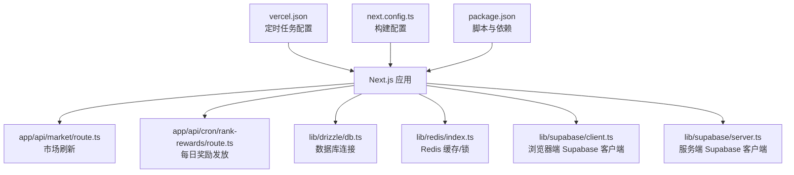
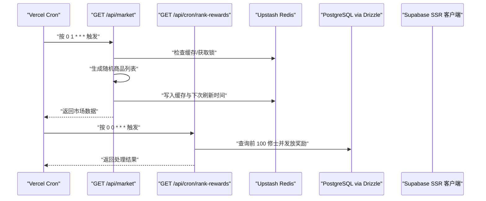
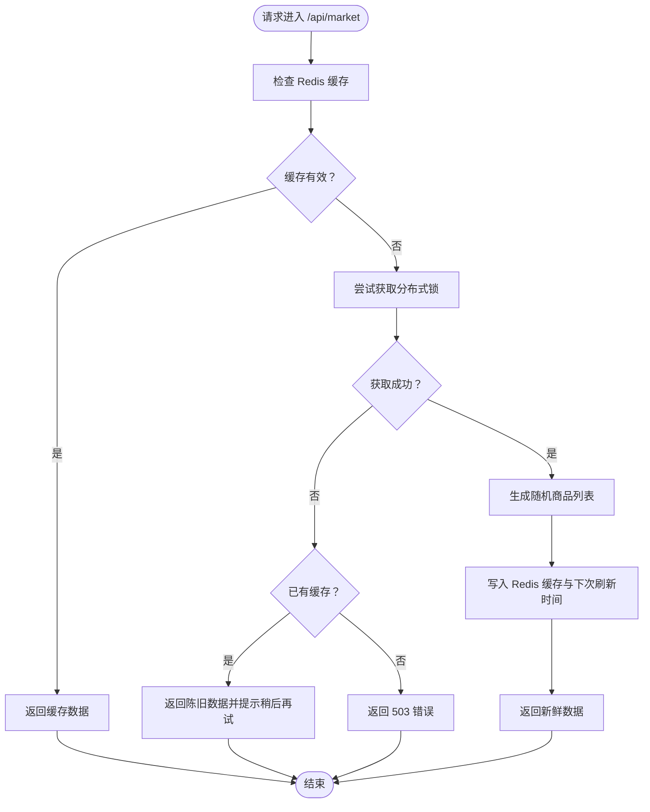
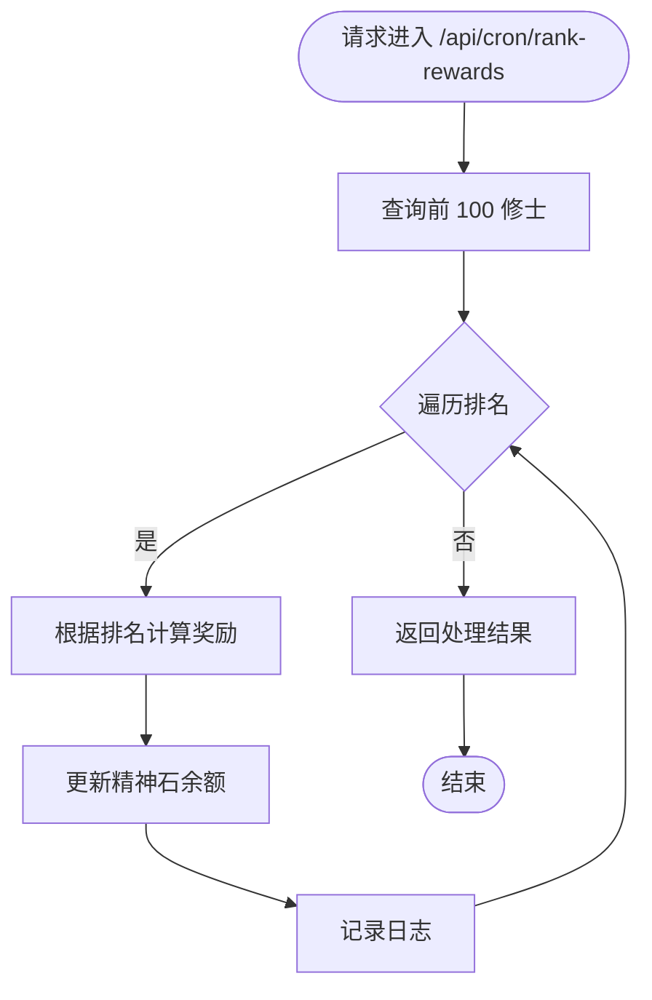
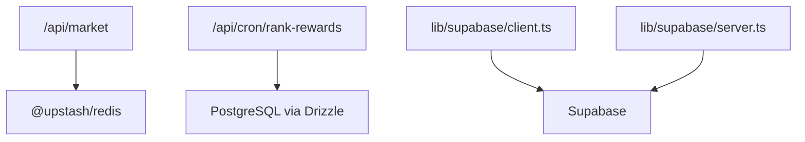

# 平台部署

<cite>
**本文引用的文件**
- [vercel.json](file://vercel.json)
- [next.config.ts](file://next.config.ts)
- [package.json](file://package.json)
- [ENV_SETUP.md](file://ENV_SETUP.md)
- [README.md](file://README.md)
- [app/api/cron/rank-rewards/route.ts](file://app/api/cron/rank-rewards/route.ts)
- [app/api/market/route.ts](file://app/api/market/route.ts)
- [lib/drizzle/db.ts](file://lib/drizzle/db.ts)
- [lib/redis/index.ts](file://lib/redis/index.ts)
- [lib/supabase/client.ts](file://lib/supabase/client.ts)
- [lib/supabase/server.ts](file://lib/supabase/server.ts)
</cite>

## 目录
1. [简介](#简介)
2. [项目结构](#项目结构)
3. [核心组件](#核心组件)
4. [架构总览](#架构总览)
5. [详细组件分析](#详细组件分析)
6. [依赖关系分析](#依赖关系分析)
7. [性能考量](#性能考量)
8. [故障排查指南](#故障排查指南)
9. [结论](#结论)
10. [附录](#附录)

## 简介
本指南面向希望通过 Vercel 部署本项目的团队与个人，围绕以下目标展开：
- 解析 vercel.json 中的定时任务配置，说明每日奖励发放与市场刷新的调度机制。
- 解释 next.config.ts 中的构建配置选项及其对部署的影响。
- 结合 package.json 的脚本命令，提供从本地开发到生产部署的完整流程，包括环境变量注入、构建优化与部署验证步骤。

## 项目结构
本项目采用 Next.js App Router 架构，核心部署相关文件集中在根目录与关键业务 API 路由中：
- 部署配置：vercel.json（定时任务）、next.config.ts（构建配置）、package.json（脚本与依赖）。
- 业务 API：app/api 下的路由处理定时任务与日常功能。
- 数据与缓存：lib/drizzle（数据库连接）、lib/redis（缓存与锁）、lib/supabase（认证与SSR客户端）。
- 环境变量：ENV_SETUP.md（说明）、README.md（本地开发与运行说明）。

图表来源
- [vercel.json](file://vercel.json#L1-L14)
- [next.config.ts](file://next.config.ts#L1-L8)
- [package.json](file://package.json#L1-L54)
- [app/api/market/route.ts](file://app/api/market/route.ts#L1-L100)
- [app/api/cron/rank-rewards/route.ts](file://app/api/cron/rank-rewards/route.ts#L1-L68)
- [lib/drizzle/db.ts](file://lib/drizzle/db.ts#L1-L13)
- [lib/redis/index.ts](file://lib/redis/index.ts#L1-L6)
- [lib/supabase/client.ts](file://lib/supabase/client.ts#L1-L9)
- [lib/supabase/server.ts](file://lib/supabase/server.ts#L1-L28)

章节来源
- [vercel.json](file://vercel.json#L1-L14)
- [next.config.ts](file://next.config.ts#L1-L8)
- [package.json](file://package.json#L1-L54)
- [README.md](file://README.md#L190-L226)

## 核心组件
- 定时任务配置（vercel.json）
  - 定义两个 Cron：每日市场刷新与每日排行榜奖励发放。
  - Cron 的 path 与 schedule 字段分别指向对应的 API 路由与调度周期。
- 构建配置（next.config.ts）
  - 当前配置为空对象，表示使用 Next.js 默认构建行为；如需自定义可在此处扩展。
- 脚本与依赖（package.json）
  - 提供 build、dev、start、test 等常用脚本，支撑本地开发与生产启动。
- 数据与缓存（lib/drizzle、lib/redis）
  - 数据库连接依赖 DATABASE_URL 环境变量。
  - Redis 连接依赖 Upstash Redis 环境变量（通过 fromEnv 自动读取）。
- 认证与SSR（lib/supabase）
  - 浏览器端与服务端均依赖 NEXT_PUBLIC_SUPABASE_URL 与 NEXT_PUBLIC_SUPABASE_ANON_KEY 环境变量。

章节来源
- [vercel.json](file://vercel.json#L1-L14)
- [next.config.ts](file://next.config.ts#L1-L8)
- [package.json](file://package.json#L1-L54)
- [lib/drizzle/db.ts](file://lib/drizzle/db.ts#L1-L13)
- [lib/redis/index.ts](file://lib/redis/index.ts#L1-L6)
- [lib/supabase/client.ts](file://lib/supabase/client.ts#L1-L9)
- [lib/supabase/server.ts](file://lib/supabase/server.ts#L1-L28)

## 架构总览
下图展示了 Vercel 定时任务触发到业务 API 的调用链路，以及与数据库、缓存、认证系统的交互。

图表来源
- [vercel.json](file://vercel.json#L1-L14)
- [app/api/market/route.ts](file://app/api/market/route.ts#L1-L100)
- [app/api/cron/rank-rewards/route.ts](file://app/api/cron/rank-rewards/route.ts#L1-L68)
- [lib/drizzle/db.ts](file://lib/drizzle/db.ts#L1-L13)
- [lib/redis/index.ts](file://lib/redis/index.ts#L1-L6)
- [lib/supabase/server.ts](file://lib/supabase/server.ts#L1-L28)

## 详细组件分析

### Vercel 定时任务配置（vercel.json）
- 定时任务
  - 市场刷新：路径为 /api/market，调度为每晚 1 点执行。
  - 每日奖励：路径为 /api/cron/rank-rewards，调度为每晚 12 点执行。
- 配置说明
  - path 指向 Next.js API 路由，Vercel 会通过 HTTP GET 请求触发对应函数。
  - schedule 使用标准 Cron 表达式，UTC 时间。
- 影响范围
  - 市场刷新：负责生成与缓存市场商品列表，避免重复生成与并发竞争。
  - 每日奖励：负责给排行榜前若干名修士发放奖励，保证奖励发放的一致性与幂等。

章节来源
- [vercel.json](file://vercel.json#L1-L14)

### 市场刷新 API（/api/market）
- 功能概述
  - 从 Redis 读取缓存，若未过期则直接返回。
  - 若缓存缺失或过期，则尝试获取分布式锁，防止并发重复生成。
  - 生成随机商品列表，写入 Redis 并返回。
- 关键点
  - 缓存键与 TTL：使用固定键与较长 TTL，允许返回陈旧数据以提升可用性。
  - 分布式锁：使用 Redis SET NX EX 防止并发重复生成。
  - 错误处理：捕获异常并返回统一错误格式，必要时返回 503。

图表来源
- [app/api/market/route.ts](file://app/api/market/route.ts#L1-L100)

章节来源
- [app/api/market/route.ts](file://app/api/market/route.ts#L1-L100)

### 每日奖励发放 API（/api/cron/rank-rewards）
- 功能概述
  - 查询前 100 名修士，按排名区间发放不同数量的奖励。
  - 使用数据库事务更新精神石余额，保证一致性。
- 关键点
  - 排名与奖励：奖励金额依据排名区间配置。
  - 错误处理：捕获异常并返回统一错误格式，便于监控与告警。

图表来源
- [app/api/cron/rank-rewards/route.ts](file://app/api/cron/rank-rewards/route.ts#L1-L68)

章节来源
- [app/api/cron/rank-rewards/route.ts](file://app/api/cron/rank-rewards/route.ts#L1-L68)

### 构建配置（next.config.ts）
- 当前状态
  - 配置对象为空，表示使用 Next.js 默认构建行为。
- 对部署的影响
  - 默认行为通常满足大多数场景，若需自定义输出目录、实验性功能或特定插件，可在该文件中扩展。
- 建议
  - 生产部署时可考虑开启静态导出（如适用）、实验性功能开关或自定义插件，但需评估兼容性与性能。

章节来源
- [next.config.ts](file://next.config.ts#L1-L8)

### 环境变量与依赖（package.json、ENV_SETUP.md）
- package.json 脚本
  - build：执行 next build，生成生产构建产物。
  - dev：启动开发服务器。
  - start：启动生产服务器。
  - test：运行测试。
- 环境变量
  - 数据库：DATABASE_URL（Drizzle 连接 PostgreSQL）。
  - Redis：Upstash Redis 环境变量（通过 fromEnv 自动读取）。
  - Supabase：NEXT_PUBLIC_SUPABASE_URL、NEXT_PUBLIC_SUPABASE_ANON_KEY（浏览器端与服务端均使用）。
  - OpenAI：OPENAI_API_KEY（可选 OPENAI_BASE_URL、OPENAI_MODEL）。

章节来源
- [package.json](file://package.json#L1-L54)
- [ENV_SETUP.md](file://ENV_SETUP.md#L1-L39)
- [lib/drizzle/db.ts](file://lib/drizzle/db.ts#L1-L13)
- [lib/redis/index.ts](file://lib/redis/index.ts#L1-L6)
- [lib/supabase/client.ts](file://lib/supabase/client.ts#L1-L9)
- [lib/supabase/server.ts](file://lib/supabase/server.ts#L1-L28)

## 依赖关系分析
- 组件耦合
  - 市场刷新 API 依赖 Redis 缓存与锁，避免并发与重复生成。
  - 每日奖励 API 依赖数据库，进行批量更新。
  - Supabase 客户端在服务端与浏览器端分别使用不同环境变量。
- 外部依赖
  - 数据库：PostgreSQL（通过 Drizzle ORM）。
  - 缓存：Upstash Redis。
  - 认证：Supabase。
  - AI 服务：OpenAI（可选）。

图表来源
- [app/api/market/route.ts](file://app/api/market/route.ts#L1-L100)
- [app/api/cron/rank-rewards/route.ts](file://app/api/cron/rank-rewards/route.ts#L1-L68)
- [lib/drizzle/db.ts](file://lib/drizzle/db.ts#L1-L13)
- [lib/redis/index.ts](file://lib/redis/index.ts#L1-L6)
- [lib/supabase/client.ts](file://lib/supabase/client.ts#L1-L9)
- [lib/supabase/server.ts](file://lib/supabase/server.ts#L1-L28)

章节来源
- [lib/drizzle/db.ts](file://lib/drizzle/db.ts#L1-L13)
- [lib/redis/index.ts](file://lib/redis/index.ts#L1-L6)
- [lib/supabase/client.ts](file://lib/supabase/client.ts#L1-L9)
- [lib/supabase/server.ts](file://lib/supabase/server.ts#L1-L28)

## 性能考量
- 市场刷新
  - 使用 Redis 缓存与 TTL，减少数据库与生成成本。
  - 通过分布式锁避免并发重复生成，降低抖动风险。
  - 返回陈旧数据策略提升可用性，同时提示客户端稍后再试。
- 每日奖励
  - 批量更新前 100 名修士，注意数据库写入压力与索引覆盖。
  - 建议在数据库侧为排名与筛选字段建立合适索引，避免全表扫描。
- 构建优化
  - 默认构建已满足多数场景；如需进一步优化可启用实验性功能或自定义插件（需谨慎评估兼容性）。

## 故障排查指南
- 市场刷新 503
  - 现象：首次冷启动或并发生成期间返回 503。
  - 处理：等待片刻后重试，或手动触发刷新接口（如存在）。
  - 检查：确认 Redis 连接正常、缓存键与 TTL 设置合理。
- 每日奖励失败
  - 现象：返回错误或未到账。
  - 处理：检查数据库连接字符串、权限与网络连通性。
  - 检查：确认奖励区间配置与数据库字段一致。
- 环境变量缺失
  - 现象：数据库、Redis、Supabase 或 AI 服务无法连接。
  - 处理：在 Vercel 项目设置中注入相应环境变量。
  - 检查：核对变量名与值，确保与本地 .env.local 一致。

章节来源
- [app/api/market/route.ts](file://app/api/market/route.ts#L1-L100)
- [app/api/cron/rank-rewards/route.ts](file://app/api/cron/rank-rewards/route.ts#L1-L68)
- [ENV_SETUP.md](file://ENV_SETUP.md#L1-L39)
- [lib/drizzle/db.ts](file://lib/drizzle/db.ts#L1-L13)
- [lib/redis/index.ts](file://lib/redis/index.ts#L1-L6)
- [lib/supabase/client.ts](file://lib/supabase/client.ts#L1-L9)
- [lib/supabase/server.ts](file://lib/supabase/server.ts#L1-L28)

## 结论
通过 vercel.json 的定时任务配置，本项目实现了稳定的每日奖励发放与市场刷新机制。配合 Redis 缓存与数据库更新，系统在可用性与一致性之间取得平衡。结合 package.json 的脚本与 ENV_SETUP.md 的环境变量说明，可顺利完成从本地开发到生产部署的全流程。

## 附录

### 从本地开发到生产部署的完整流程
- 本地开发
  - 准备环境：安装 Node.js 与包管理器，克隆仓库并安装依赖。
  - 配置环境变量：参考 ENV_SETUP.md，创建 .env.local 并填写数据库、Redis、Supabase 与 AI 相关变量。
  - 初始化数据库：按需运行迁移脚本（参考 README 的本地运行说明）。
  - 启动开发服务器：执行开发脚本，访问本地地址进行调试。
- 生产部署
  - 在 Vercel 创建项目并关联仓库。
  - 注入环境变量：在 Vercel 项目设置中添加 DATABASE_URL、NEXT_PUBLIC_SUPABASE_URL、NEXT_PUBLIC_SUPABASE_ANON_KEY、Upstash Redis 环境变量与 AI 相关变量。
  - 触发构建：Vercel 将自动执行 npm run build，生成生产构建。
  - 验证部署：访问线上域名，检查市场刷新与每日奖励是否按预期工作。
- 构建优化与验证
  - 构建配置：当前 next.config.ts 为空，默认行为已满足多数场景；如需自定义可在此扩展。
  - 验证步骤：访问 /api/market 与 /api/cron/rank-rewards，观察返回数据与日志；检查数据库与 Redis 是否正确更新。

章节来源
- [README.md](file://README.md#L190-L226)
- [ENV_SETUP.md](file://ENV_SETUP.md#L1-L39)
- [package.json](file://package.json#L1-L54)
- [next.config.ts](file://next.config.ts#L1-L8)