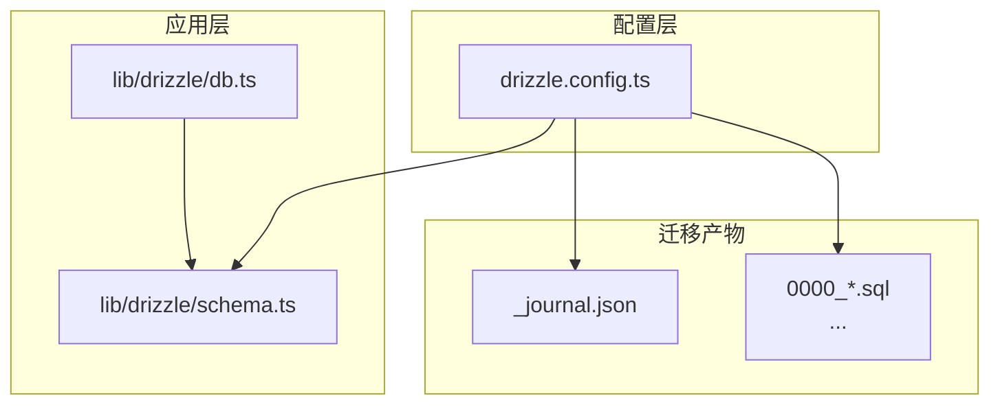
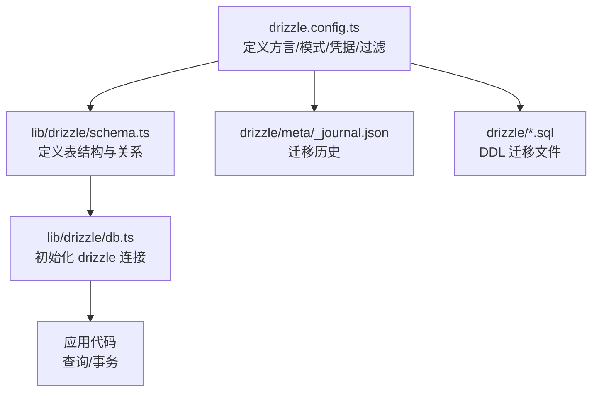
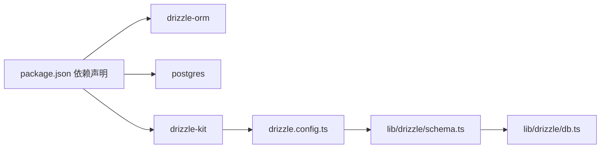

# 数据库迁移

<cite>
**本文引用的文件列表**
- [drizzle.config.ts](file://drizzle.config.ts)
- [lib/drizzle/db.ts](file://lib/drizzle/db.ts)
- [lib/drizzle/schema.ts](file://lib/drizzle/schema.ts)
- [drizzle/meta/_journal.json](file://drizzle/meta/_journal.json)
- [drizzle/0000_equal_the_fury.sql](file://drizzle/0000_equal_the_fury.sql)
- [package.json](file://package.json)
- [ENV_SETUP.md](file://ENV_SETUP.md)
</cite>

## 目录
1. [简介](#简介)
2. [项目结构](#项目结构)
3. [核心组件](#核心组件)
4. [架构总览](#架构总览)
5. [详细组件分析](#详细组件分析)
6. [依赖关系分析](#依赖关系分析)
7. [性能考量](#性能考量)
8. [故障排查指南](#故障排查指南)
9. [结论](#结论)
10. [附录](#附录)

## 简介
本指南面向使用 Drizzle ORM 的开发者，系统讲解如何基于仓库中的配置与脚本进行数据库模式管理与迁移。内容涵盖：
- 解释 drizzle.config.ts 中各配置项的含义与作用（如 dialect、schema、tablesFilter、dbCredentials 等）
- 如何生成迁移文件、执行迁移（push）、查看迁移历史
- 使用 Drizzle Studio 进行可视化管理
- 结合现有 SQL 迁移文件示例，说明版本控制策略与团队协作最佳实践

## 项目结构
该仓库采用“按功能分层 + 层内模块化”的组织方式：
- 配置层：drizzle.config.ts 定义迁移工具的方言、模式入口、过滤规则与数据库凭据
- 应用层：lib/drizzle/schema.ts 定义数据库表结构；lib/drizzle/db.ts 提供运行时连接与事务封装
- 迁移产物：drizzle 目录下的 SQL 文件与元数据快照，记录每次变更的历史与当前状态

图表来源
- [drizzle.config.ts](file://drizzle.config.ts#L1-L11)
- [lib/drizzle/schema.ts](file://lib/drizzle/schema.ts#L1-L292)
- [lib/drizzle/db.ts](file://lib/drizzle/db.ts#L1-L13)
- [drizzle/meta/_journal.json](file://drizzle/meta/_journal.json#L1-L132)
- [drizzle/0000_equal_the_fury.sql](file://drizzle/0000_equal_the_fury.sql#L1-L115)

章节来源
- [drizzle.config.ts](file://drizzle.config.ts#L1-L11)
- [lib/drizzle/schema.ts](file://lib/drizzle/schema.ts#L1-L292)
- [lib/drizzle/db.ts](file://lib/drizzle/db.ts#L1-L13)
- [drizzle/meta/_journal.json](file://drizzle/meta/_journal.json#L1-L132)
- [drizzle/0000_equal_the_fury.sql](file://drizzle/0000_equal_the_fury.sql#L1-L115)

## 核心组件
- Drizzle 配置（drizzle.config.ts）
  - dialect：指定数据库方言为 PostgreSQL
  - schema：指向模式定义文件路径
  - tablesFilter：仅对匹配前缀的表进行迁移扫描
  - dbCredentials.url：从环境变量读取数据库连接字符串
- 模式定义（lib/drizzle/schema.ts）
  - 定义了多个业务表（如角色、功法、技能、法宝、消耗品、邮件、副本等），并建立外键关系
- 运行时连接（lib/drizzle/db.ts）
  - 使用 postgres 客户端连接数据库，并通过 drizzle 初始化 ORM 实例
  - 禁用预取以适配事务池模式
- 迁移历史（drizzle/meta/_journal.json）
  - 记录已应用的迁移条目、时间戳与标签
- 迁移 SQL（drizzle/0000_*.sql）
  - 每个迁移文件对应一次模式变更，包含建表、索引、约束与外键等 DDL

章节来源
- [drizzle.config.ts](file://drizzle.config.ts#L1-L11)
- [lib/drizzle/schema.ts](file://lib/drizzle/schema.ts#L1-L292)
- [lib/drizzle/db.ts](file://lib/drizzle/db.ts#L1-L13)
- [drizzle/meta/_journal.json](file://drizzle/meta/_journal.json#L1-L132)
- [drizzle/0000_equal_the_fury.sql](file://drizzle/0000_equal_the_fury.sql#L1-L115)

## 架构总览
下图展示了从配置到运行时连接、再到迁移产物的整体关系。

图表来源
- [drizzle.config.ts](file://drizzle.config.ts#L1-L11)
- [lib/drizzle/schema.ts](file://lib/drizzle/schema.ts#L1-L292)
- [lib/drizzle/db.ts](file://lib/drizzle/db.ts#L1-L13)
- [drizzle/meta/_journal.json](file://drizzle/meta/_journal.json#L1-L132)
- [drizzle/0000_equal_the_fury.sql](file://drizzle/0000_equal_the_fury.sql#L1-L115)

## 详细组件分析

### 组件一：Drizzle 配置（drizzle.config.ts）
- 配置项说明
  - dialect：PostgreSQL 方言，确保迁移工具生成与目标数据库兼容的 SQL
  - schema：指向模式定义文件，迁移工具据此推断差异并生成 SQL
  - tablesFilter：仅扫描以特定前缀命名的表，便于多租户或命名空间隔离
  - dbCredentials.url：从环境变量 DATABASE_URL 读取连接字符串，避免硬编码
- 最佳实践
  - 在本地与 CI 中保持 DATABASE_URL 一致
  - 若存在多个数据库或命名空间，建议统一前缀并维护一致的 tablesFilter
  - 保持 schema 路径稳定，避免频繁重命名导致迁移工具无法识别

章节来源
- [drizzle.config.ts](file://drizzle.config.ts#L1-L11)

### 组件二：模式定义（lib/drizzle/schema.ts）
- 设计要点
  - 表名统一使用前缀，便于与 tablesFilter 匹配
  - 外键关系明确，删除策略覆盖级联删除与设置空值等场景
  - 时间戳字段统一使用默认值与更新钩子，便于审计与排序
- 使用建议
  - 新增表时遵循统一命名规范与字段风格
  - 复杂 JSON 字段建议配合应用层校验与文档说明
  - 外键约束应与业务逻辑保持一致，避免循环依赖

章节来源
- [lib/drizzle/schema.ts](file://lib/drizzle/schema.ts#L1-L292)

### 组件三：运行时连接（lib/drizzle/db.ts）
- 连接特性
  - 通过 postgres 客户端建立连接，并禁用预取以适配事务池模式
  - 使用 drizzle 初始化 ORM 实例，注入 schema
  - 导出 DbTransaction 类型，便于在事务回调中获得一致的上下文
- 使用建议
  - 在应用启动时初始化 db 实例，避免重复创建连接
  - 在长事务中注意连接池与超时配置

章节来源
- [lib/drizzle/db.ts](file://lib/drizzle/db.ts#L1-L13)

### 组件四：迁移历史与 SQL 文件（drizzle/meta/_journal.json 与 0000_*.sql）
- 历史记录
  - _journal.json 记录每个迁移的索引、版本、时间戳与标签，用于追踪已应用的变更
- SQL 文件
  - 每个迁移文件包含一组 DDL 语句，如建表、添加列、外键约束等
  - 文件名以递增序号开头，确保迁移顺序稳定
- 使用建议
  - 优先使用 Drizzle Kit 生成迁移，再手动微调 SQL
  - 严禁直接修改已应用的 SQL 文件，避免破坏历史一致性

章节来源
- [drizzle/meta/_journal.json](file://drizzle/meta/_journal.json#L1-L132)
- [drizzle/0000_equal_the_fury.sql](file://drizzle/0000_equal_the_fury.sql#L1-L115)

### 组件五：Drizzle Studio 可视化管理
- 启动方式
  - 使用 Drizzle Kit 提供的 studio 命令启动可视化界面
- 功能概述
  - 查看数据库结构、浏览数据、执行查询与调试迁移
- 使用建议
  - 仅在本地或受控环境中使用，避免暴露生产凭据
  - 与迁移工具协同工作，先在 Studio 验证变更，再生成迁移

章节来源
- [package.json](file://package.json#L1-L54)

## 依赖关系分析
- drizzle-orm 与 postgres 作为运行时 ORM 与客户端
- drizzle-kit 作为迁移与可视化工具
- schema.ts 与 db.ts 作为运行时与迁移工具的共同输入

图表来源
- [package.json](file://package.json#L1-L54)
- [drizzle.config.ts](file://drizzle.config.ts#L1-L11)
- [lib/drizzle/schema.ts](file://lib/drizzle/schema.ts#L1-L292)
- [lib/drizzle/db.ts](file://lib/drizzle/db.ts#L1-L13)

章节来源
- [package.json](file://package.json#L1-L54)
- [drizzle.config.ts](file://drizzle.config.ts#L1-L11)
- [lib/drizzle/schema.ts](file://lib/drizzle/schema.ts#L1-L292)
- [lib/drizzle/db.ts](file://lib/drizzle/db.ts#L1-L13)

## 性能考量
- 连接与预取
  - 已禁用预取以适配事务池模式，减少不必要的网络往返
- 迁移生成
  - 通过 schema 与 _journal.json 的对比生成最小化变更集，降低迁移体积
- 查询与事务
  - 使用统一的 db 实例与类型化事务接口，有助于复用连接与减少开销

章节来源
- [lib/drizzle/db.ts](file://lib/drizzle/db.ts#L1-L13)

## 故障排查指南
- 环境变量未配置
  - 症状：迁移或连接失败
  - 处理：确保 DATABASE_URL 已正确设置，参考环境变量配置说明
- 迁移历史不一致
  - 症状：提示未应用的迁移或重复应用
  - 处理：检查 _journal.json 与 SQL 文件是否匹配；必要时回滚或重置
- 迁移生成失败
  - 症状：迁移工具无法识别差异
  - 处理：确认 schema.ts 是否与数据库当前状态一致；核对 tablesFilter 与表名前缀

章节来源
- [ENV_SETUP.md](file://ENV_SETUP.md#L1-L39)
- [drizzle/meta/_journal.json](file://drizzle/meta/_journal.json#L1-L132)
- [drizzle.config.ts](file://drizzle.config.ts#L1-L11)

## 结论
本仓库已具备完整的 Drizzle ORM 迁移基础设施：清晰的配置、稳定的模式定义、可靠的运行时连接与完善的迁移历史记录。建议团队在日常开发中严格遵循迁移流程与版本控制策略，确保数据库演进的可追溯性与安全性。

## 附录

### A. 迁移操作步骤（基于仓库现状）
- 生成迁移
  - 修改 lib/drizzle/schema.ts 后，使用迁移工具生成 SQL 文件
- 执行迁移（push）
  - 将生成的 SQL 文件应用到目标数据库
- 查看迁移历史
  - 通过 _journal.json 与 SQL 文件名确认已应用的变更
- 可视化管理（Drizzle Studio）
  - 启动 studio 并连接数据库，验证结构与数据

章节来源
- [drizzle.config.ts](file://drizzle.config.ts#L1-L11)
- [lib/drizzle/schema.ts](file://lib/drizzle/schema.ts#L1-L292)
- [drizzle/meta/_journal.json](file://drizzle/meta/_journal.json#L1-L132)
- [drizzle/0000_equal_the_fury.sql](file://drizzle/0000_equal_the_fury.sql#L1-L115)
- [package.json](file://package.json#L1-L54)

### B. 版本控制与团队协作最佳实践
- 迁移文件命名
  - 使用递增序号前缀，保证顺序稳定
- 迁移生成
  - 在本地完成变更与验证后再提交；避免直接修改已应用的 SQL 文件
- 历史同步
  - 保持 _journal.json 与 SQL 文件同步，避免历史错乱
- 环境隔离
  - 不同环境（开发/测试/生产）使用独立的 DATABASE_URL
- 团队协作
  - 合并前确保迁移顺序与历史一致；冲突时优先通过 schema 对齐而非手动改写 SQL

章节来源
- [drizzle/meta/_journal.json](file://drizzle/meta/_journal.json#L1-L132)
- [drizzle/0000_equal_the_fury.sql](file://drizzle/0000_equal_the_fury.sql#L1-L115)
- [ENV_SETUP.md](file://ENV_SETUP.md#L1-L39)