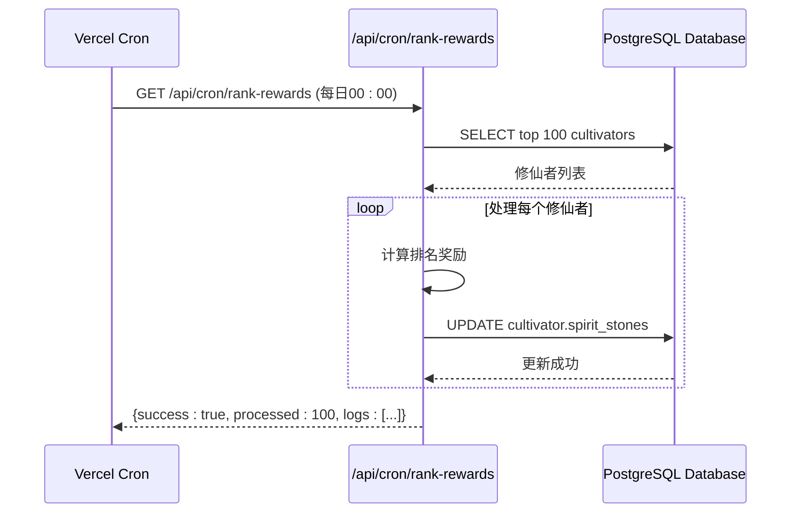
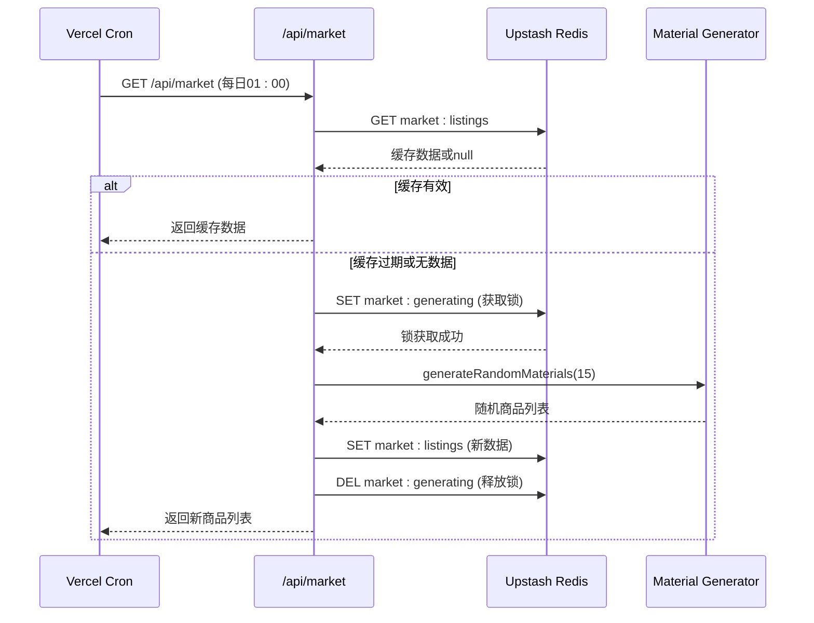

# 监控与故障排查

<cite>
**本文档引用的文件**  
- [rank-rewards/route.ts](file://app/api/cron/rank-rewards/route.ts)
- [market/route.ts](file://app/api/market/route.ts)
- [db.ts](file://lib/drizzle/db.ts)
- [index.ts](file://lib/redis/index.ts)
- [cultivatorRepository.ts](file://lib/repositories/cultivatorRepository.ts)
- [aiClient.ts](file://utils/aiClient.ts)
- [MailService.ts](file://lib/services/MailService.ts)
- [constants.ts](file://types/constants.ts)
- [ENV_SETUP.md](file://ENV_SETUP.md)
- [vercel.json](file://vercel.json)
</cite>

## 目录
1. [系统监控概览](#系统监控概览)
2. [定时任务监控与日志查看](#定时任务监控与日志查看)
3. [API端点健康检查](#api端点健康检查)
4. [常见故障诊断与解决方案](#常见故障诊断与解决方案)
5. [健康检查机制建议](#健康检查机制建议)

## 系统监控概览

本系统采用Next.js框架构建，部署在Vercel平台，通过定时任务（Cron Jobs）执行关键业务逻辑，如排名奖励发放和市场刷新。系统依赖PostgreSQL数据库存储持久化数据，使用Upstash Redis作为缓存层，同时集成AI服务用于生成内容。监控体系主要围绕定时任务执行、API端点可用性、数据库连接和AI服务调用四个方面展开。

系统通过Vercel的Cron Jobs功能配置定时任务，相关配置位于`vercel.json`文件中。所有API端点均采用RESTful设计，返回JSON格式响应，错误信息包含明确的状态码和错误描述。日志记录通过`console.error`和`console.warn`实现，可在Vercel的部署日志中查看。

**Section sources**
- [vercel.json](file://vercel.json#L1-L13)
- [ENV_SETUP.md](file://ENV_SETUP.md#L1-L39)

## 定时任务监控与日志查看

### 排名奖励定时任务

排名奖励定时任务每日凌晨执行，为排行榜前100名的修仙者发放灵石奖励。该任务的API端点为`/api/cron/rank-rewards`，其执行逻辑如下：

1. 从数据库查询前100名修仙者（根据境界和属性排序）
2. 根据排名确定奖励数量（第一名30000灵石，第二名20000灵石，以此类推）
3. 更新修仙者的灵石数量
4. 记录处理日志并返回结果

**查看执行日志：**
- 登录Vercel控制台，进入项目部署页面
- 查看`/api/cron/rank-rewards`端点的调用日志
- 检查返回的JSON响应，成功时`success`字段为`true`，包含`processed`（处理数量）和`logs`（详细日志）字段
- 若执行失败，检查`console.error('Rank rewards error:', error)`输出的错误信息



**Diagram sources**
- [rank-rewards/route.ts](file://app/api/cron/rank-rewards/route.ts#L7-L67)
- [constants.ts](file://types/constants.ts#L181-L190)

### 市场刷新定时任务

市场刷新定时任务每日凌晨1点执行，刷新坊市商品列表。该任务的API端点为`/api/market`，其执行逻辑如下：

1. 检查Redis缓存中是否存在有效的商品列表
2. 若缓存过期或不存在，获取锁以防止并发生成
3. 调用`generateRandomMaterials`函数生成15个随机商品
4. 将商品列表存入Redis缓存
5. 释放锁并返回商品列表

**查看执行日志：**
- 登录Vercel控制台，查看`/api/market`端点的调用日志
- 检查返回的JSON响应，成功时包含`listings`（商品列表）和`nextRefresh`（下次刷新时间）字段
- 若执行失败，检查`console.error('Market API Error:', error)`输出的错误信息
- 特别注意`MARKET_LOCK_KEY`的使用，避免因锁未释放导致后续刷新失败



**Diagram sources**
- [market/route.ts](file://app/api/market/route.ts#L13-L100)
- [index.ts](file://lib/redis/index.ts#L1-L6)

## API端点健康检查

### 健康检查方法

验证API端点是否正常工作的标准方法是发送HTTP请求并检查响应状态码和内容：

1. **使用curl命令行工具：**
   ```bash
   curl -i https://your-app.vercel.app/api/rankings
   curl -i https://your-app.vercel.app/api/market
   curl -i https://your-app.vercel.app/api/cron/rank-rewards
   ```

2. **使用浏览器或Postman：**
   - 直接访问API端点URL
   - 检查返回的JSON数据是否符合预期结构

3. **自动化健康检查脚本：**
   ```javascript
   // health-check.js
   const endpoints = [
     '/api/rankings',
     '/api/market',
     '/api/cron/rank-rewards'
   ];
   
   async function checkEndpoint(url) {
     try {
       const response = await fetch(url);
       const data = await response.json();
       return {
         url,
         status: response.status,
         success: data.success !== false,
         data: data
       };
     } catch (error) {
       return {
         url,
         status: 'ERROR',
         success: false,
         error: error.message
       };
     }
   }
   ```

### 关键API端点状态码说明

| 端点 | 正常响应 (200) | 错误响应 (500) | 特殊响应 (503) |
|------|----------------|----------------|----------------|
| `/api/rankings` | 返回排行榜数据 | 数据库查询失败 | Redis连接失败 |
| `/api/market` | 返回商品列表 | 商品生成失败 | 正在刷新中（锁竞争） |
| `/api/cron/rank-rewards` | 返回奖励发放日志 | 奖励发放失败 | 未授权访问 |

**Section sources**
- [rankings/route.ts](file://app/api/rankings/route.ts#L1-L31)
- [market/route.ts](file://app/api/market/route.ts#L13-L100)
- [rank-rewards/route.ts](file://app/api/cron/rank-rewards/route.ts#L7-L67)

## 常见故障诊断与解决方案

### 定时任务未触发

**症状：** 排名奖励未发放，市场商品未刷新。

**排查步骤：**
1. 检查`vercel.json`文件中的Cron配置是否正确：
   ```json
   "crons": [
     {
       "path": "/api/market",
       "schedule": "0 1 * * *"  // 每日凌晨1点
     },
     {
       "path": "/api/cron/rank-rewards",
       "schedule": "0 0 * * *"  // 每日凌晨0点
     }
   ]
   ```
2. 登录Vercel控制台，确认项目已正确部署且Cron Jobs功能已启用
3. 检查Vercel账户的订阅计划，确保支持Cron Jobs功能
4. 手动访问API端点测试功能是否正常：`GET /api/cron/rank-rewards`

**解决方案：**
- 确认`vercel.json`配置正确无误
- 升级Vercel订阅计划以支持Cron Jobs
- 在Vercel控制台手动触发部署，重新激活Cron Jobs

**Section sources**
- [vercel.json](file://vercel.json#L1-L13)

### 数据库连接失败

**症状：** 所有涉及数据库操作的API返回500错误，日志显示数据库连接异常。

**排查步骤：**
1. 检查环境变量`DATABASE_URL`是否正确配置：
   - 在Vercel项目设置中确认`DATABASE_URL`值
   - 确认数据库服务（如Supabase、Neon等）是否正常运行
2. 检查数据库连接代码：
   ```typescript
   // lib/drizzle/db.ts
   const connectionString = process.env.DATABASE_URL;
   const client = postgres(connectionString!, { prepare: false });
   export const db = drizzle(client, { schema });
   ```
3. 测试数据库连接：
   ```bash
   # 使用psql或其他数据库客户端测试连接
   psql $DATABASE_URL
   ```

**解决方案：**
- 在Vercel控制台重新配置`DATABASE_URL`环境变量
- 检查数据库服务的防火墙和访问控制设置
- 确认数据库连接池配置是否合理

**Section sources**
- [db.ts](file://lib/drizzle/db.ts#L1-L13)

### AI服务调用超时

**症状：** 天机推演、角色生成等功能响应缓慢或失败，日志显示AI服务调用超时。

**排查步骤：**
1. 检查AI服务相关环境变量：
   - `OPENAI_API_KEY`：API密钥是否有效
   - `OPENAI_BASE_URL`：API地址是否正确
   - `OPENAI_MODEL`：模型名称是否支持
2. 检查AI客户端代码：
   ```typescript
   // utils/aiClient.ts
   function getDeepSeekProvider() {
     if (process.env.PROVIDER_CHOOSE === 'ark') {
       return createDeepSeek({
         baseURL: process.env.ARK_BASE_URL,
         apiKey: process.env.ARK_API_KEY,
       });
     }
     return createDeepSeek({
       apiKey: process.env.OPENAI_API_KEY,
       baseURL: process.env.OPENAI_BASE_URL,
     });
   }
   ```
3. 测试AI服务连通性：
   ```bash
   curl https://api.openai.com/v1/models \
     -H "Authorization: Bearer $OPENAI_API_KEY"
   ```

**解决方案：**
- 更新失效的API密钥
- 切换到备用AI服务提供商（通过`PROVIDER_CHOOSE`环境变量）
- 优化AI调用逻辑，增加超时重试机制

**Section sources**
- [aiClient.ts](file://utils/aiClient.ts#L1-L211)
- [ENV_SETUP.md](file://ENV_SETUP.md#L1-L39)

## 健康检查机制建议

为确保系统稳定运行，建议实施以下健康检查机制：

### 基础健康检查端点

创建一个专门的健康检查API端点`/api/health`，检查所有关键依赖：

```typescript
// app/api/health/route.ts
import { db } from '@/lib/drizzle/db';
import { redis } from '@/lib/redis';
import { text } from '@/utils/aiClient';

export async function GET() {
  const checks = {
    database: false,
    redis: false,
    aiService: false,
    overall: false
  };

  try {
    // 检查数据库
    await db.execute('SELECT 1');
    checks.database = true;
  } catch (error) {
    console.error('Database health check failed:', error);
  }

  try {
    // 检查Redis
    await redis.ping();
    checks.redis = true;
  } catch (error) {
    console.error('Redis health check failed:', error);
  }

  try {
    // 检查AI服务
    await text('Test', 'Hello', true);
    checks.aiService = true;
  } catch (error) {
    console.error('AI service health check failed:', error);
  }

  checks.overall = checks.database && checks.redis && checks.aiService;

  return Response.json(checks, { status: checks.overall ? 200 : 503 });
}
```

### 监控告警配置

1. **设置外部监控服务：**
   - 使用UptimeRobot、Healthchecks.io等服务定期访问`/api/health`
   - 配置告警通知（邮件、短信、Slack）

2. **配置Vercel内置监控：**
   - 在Vercel Analytics中监控API响应时间和错误率
   - 设置自定义指标告警

3. **日志监控：**
   - 定期检查Vercel部署日志中的`console.error`输出
   - 设置关键词告警（如"error", "failed", "timeout"）

### 定时任务监控

为定时任务添加执行记录和告警：

```typescript
// 在定时任务中添加执行记录
export async function GET() {
  const startTime = Date.now();
  try {
    // 任务逻辑...
    
    // 记录成功执行
    await db.insert(logs).values({
      task: 'rank-rewards',
      status: 'success',
      duration: Date.now() - startTime,
      details: JSON.stringify({ processed: topCultivators.length })
    });
    
    return NextResponse.json({ success: true });
  } catch (error) {
    // 记录失败执行
    await db.insert(logs).values({
      task: 'rank-rewards',
      status: 'failed',
      duration: Date.now() - startTime,
      details: error instanceof Error ? error.message : 'Unknown error'
    });
    
    // 可选：发送告警邮件
    await MailService.sendSystemMail(
      ADMIN_CULTIVATOR_ID,
      '定时任务执行失败',
      `排名奖励发放任务执行失败：${error instanceof Error ? error.message : '未知错误'}`
    );
    
    return NextResponse.json({ success: false, error: 'Failed' }, { status: 500 });
  }
}
```

**Section sources**
- [db.ts](file://lib/drizzle/db.ts#L1-L13)
- [index.ts](file://lib/redis/index.ts#L1-L6)
- [aiClient.ts](file://utils/aiClient.ts#L1-L211)
- [MailService.ts](file://lib/services/MailService.ts#L1-L65)