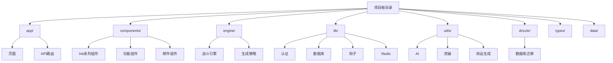
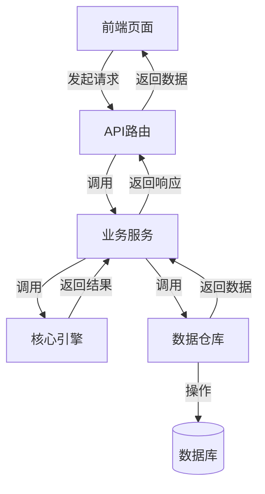
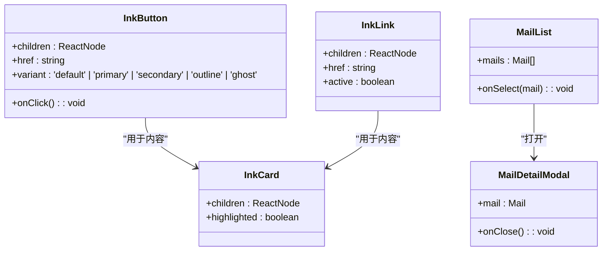
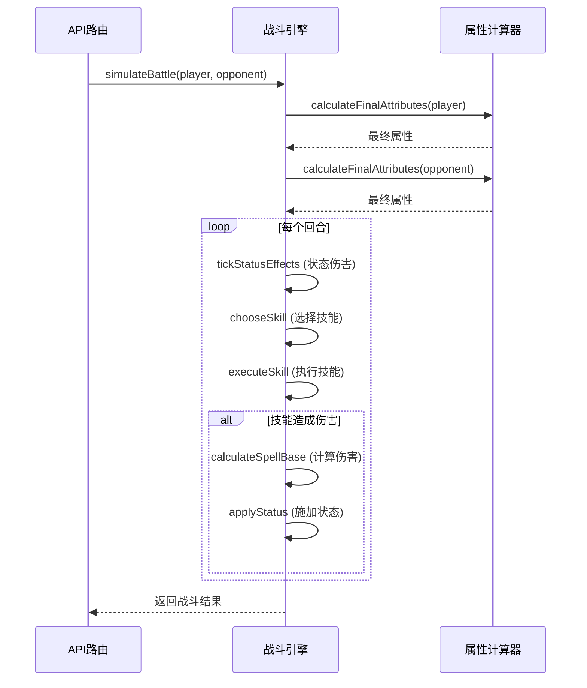
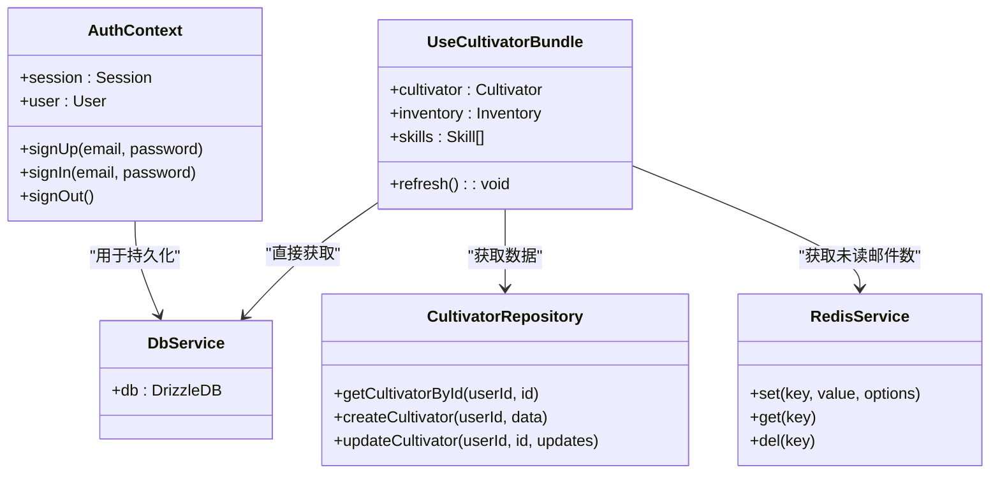
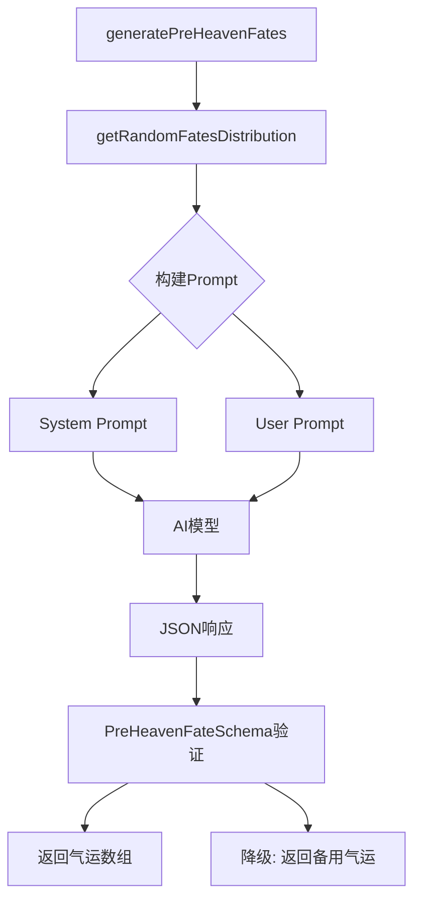
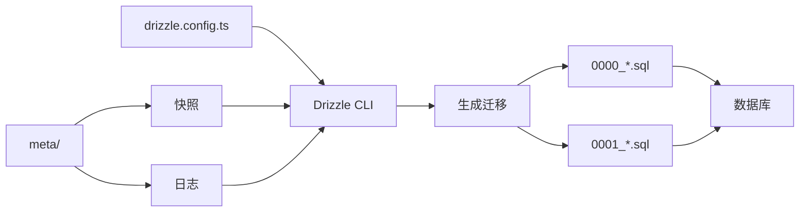

# 项目目录结构详解

<cite>
**本文档引用的文件**
- [layout.tsx](file://app/layout.tsx)
- [useCultivatorBundle.ts](file://lib/hooks/useCultivatorBundle.ts)
- [battleEngine.ts](file://engine/battleEngine.ts)
- [db.ts](file://lib/drizzle/db.ts)
- [drizzle.config.ts](file://drizzle.config.ts)
- [InkComponents.tsx](file://components/InkComponents.tsx)
- [MailService.ts](file://lib/services/MailService.ts)
- [fateGenerator.ts](file://utils/fateGenerator.ts)
- [CreationEngine.ts](file://engine/creation/CreationEngine.ts)
- [cultivatorRepository.ts](file://lib/repositories/cultivatorRepository.ts)
- [route.ts](file://app/api/cultivators/route.ts)
- [route.ts](file://app/api/battle/route.ts)
- [route.ts](file://app/api/divine-fortune/route.ts)
- [AuthContext.tsx](file://lib/auth/AuthContext.tsx)
- [useDivineFortune.ts](file://lib/hooks/useDivineFortune.ts)
</cite>

## 目录

1. [项目结构概览](#项目结构概览)
2. [核心目录职责分析](#核心目录职责分析)
3. [app/ 目录：页面与路由](#app-目录页面与路由)
4. [components/ 目录：UI 组件](#components-目录ui-组件)
5. [engine/ 目录：核心游戏逻辑](#engine-目录核心游戏逻辑)
6. [lib/ 目录：分层服务](#lib-目录分层服务)
7. [utils/ 目录：工具函数](#utils-目录工具函数)
8. [drizzle/ 目录：数据库迁移](#drizzle-目录数据库迁移)
9. [代码组织原则与示例](#代码组织原则与示例)

## 项目结构概览

本项目采用基于 Next.js App Router 的模块化架构，代码组织清晰，职责分明。项目根目录下的主要目录包括 `app/`、`components/`、`engine/`、`lib/`、`utils/` 和 `drizzle/`，分别负责页面路由、UI 组件、核心游戏逻辑、业务服务、工具函数和数据库管理。这种分层设计使得开发者能够快速定位功能代码，理解模块间的依赖关系。

**Diagram sources**
- [app/layout.tsx](file://app/layout.tsx)
- [lib/hooks/useCultivatorBundle.ts](file://lib/hooks/useCultivatorBundle.ts)
- [engine/battleEngine.ts](file://engine/battleEngine.ts)
- [lib/drizzle/db.ts](file://lib/drizzle/db.ts)
- [drizzle.config.ts](file://drizzle.config.ts)

## 核心目录职责分析

项目的目录结构遵循高内聚、低耦合的设计原则。`app/` 目录作为应用入口，集中管理所有页面和 API 路由。`components/` 目录存放可复用的 UI 组件，按功能和类型进行分类。`engine/` 目录封装了游戏的核心逻辑，如战斗计算和生成策略，与 UI 层解耦。`lib/` 目录提供了分层的服务，包括数据库操作、认证和 Redis 缓存，是业务逻辑与数据存储的桥梁。`utils/` 目录包含各种工具函数，支持 AIGC 功能。`drizzle/` 目录则专门管理数据库的迁移脚本，确保数据结构的版本化控制。

## app/ 目录：页面与路由

`app/` 目录是整个应用的入口，其结构直接映射到应用的 URL 路由。该目录下的每个子目录或文件都对应一个页面或 API 端点。

- **页面路由**：`app/` 下的子目录（如 `battle/`, `craft/`, `mail/`）对应应用的各个功能页面。例如，`app/battle/page.tsx` 对应 `/battle` 页面，`app/mail/page.tsx` 对应 `/mail` 页面。这种约定优于配置的方式使得页面与 URL 的对应关系一目了然。
- **API 路由**：`app/api/` 目录下的文件是 Next.js 的 API 路由处理函数。每个 `route.ts` 文件导出 `GET`、`POST`、`PUT`、`DELETE` 等方法，处理相应的 HTTP 请求。例如，`app/api/cultivators/route.ts` 处理与角色相关的所有 API 请求，而 `app/api/battle/route.ts` 则处理战斗逻辑。

页面与 API 路由的对应关系体现了前后端分离的设计思想。前端页面通过 `fetch` 调用 API 路由来获取数据或执行操作，API 路由则作为后端服务的入口，调用 `lib/` 和 `engine/` 目录中的服务和逻辑来完成具体任务。

**Diagram sources**
- [app/api/cultivators/route.ts](file://app/api/cultivators/route.ts)
- [app/api/battle/route.ts](file://app/api/battle/route.ts)
- [lib/repositories/cultivatorRepository.ts](file://lib/repositories/cultivatorRepository.ts)
- [engine/battleEngine.ts](file://engine/battleEngine.ts)

## components/ 目录：UI 组件

`components/` 目录存放了项目中所有可复用的 UI 组件，并根据功能和用途进行了清晰的分类。

- **Ink 系列组件**：位于 `components/InkComponents.tsx` 和 `components/InkLayout.tsx` 等文件中。这些组件实现了项目独特的“文字化”UI 风格，如 `InkButton`、`InkLink`、`InkCard` 等。它们通过 CSS 类名和特定的渲染逻辑（如使用方括号 `[]` 作为按钮边框）来统一视觉语言，确保整个应用的界面风格一致。
- **功能组件**：位于 `components/func/` 目录下，如 `GongFa.tsx`（功法）、`LingGen.tsx`（灵根）、`ShenTong.tsx`（神通）等。这些组件用于展示和管理角色的具体属性和能力，是游戏核心玩法的 UI 体现。
- **邮件组件**：位于 `components/mail/` 目录下，如 `MailDetailModal.tsx` 和 `MailList.tsx`。这些组件专门用于处理邮件系统的 UI 交互，如邮件列表展示和详情模态框。

这种分类方式使得 UI 组件易于维护和复用。开发者可以根据功能快速找到对应的组件文件。

**Diagram sources**
- [components/InkComponents.tsx](file://components/InkComponents.tsx)
- [components/mail/MailDetailModal.tsx](file://components/mail/MailDetailModal.tsx)
- [components/mail/MailList.tsx](file://components/mail/MailList.tsx)

## engine/ 目录：核心游戏逻辑

`engine/` 目录是游戏业务逻辑的核心，包含了与游戏规则和计算相关的代码，与 UI 完全解耦。

- **战斗引擎**：`engine/battleEngine.ts` 文件实现了完整的战斗计算逻辑。`simulateBattle` 函数是核心，它接收两个 `Cultivator` 对象，模拟战斗过程，返回战斗结果（胜者、败者、日志、回合数等）。该引擎考虑了属性计算、技能效果、状态持续伤害（DoT）、闪避、暴击、元素克制等多种因素，确保了战斗的公平性和策略性。
- **生成策略**：`engine/creation/` 目录下的 `CreationEngine.ts` 和 `strategies/` 子目录实现了物品和技能的生成逻辑。`CreationEngine` 是一个策略模式的实现，它根据不同的 `craftType`（如炼丹、炼器、悟道）选择对应的 `CreationStrategy` 来执行具体的生成逻辑。这保证了生成逻辑的可扩展性和灵活性。

这些核心逻辑被设计为纯函数或无状态类，不依赖于任何特定的框架或 UI 库，可以在任何环境中被调用和测试。

**Diagram sources**
- [engine/battleEngine.ts](file://engine/battleEngine.ts)
- [utils/cultivatorUtils.ts](file://utils/cultivatorUtils.ts)

## lib/ 目录：分层服务

`lib/` 目录提供了应用所需的各项服务，是连接 API 路由与核心引擎、数据存储的中间层。

- **认证服务**：`lib/auth/AuthContext.tsx` 使用 React Context 和 Supabase 提供了用户认证状态的管理。`useAuth` Hook 可以在任何组件中使用，方便地获取用户信息和执行登录、登出等操作。
- **数据库服务**：`lib/drizzle/` 目录下的 `db.ts` 创建了 Drizzle ORM 的数据库实例，`schema.ts` 定义了所有数据库表的结构。`lib/repositories/` 目录下的仓库（如 `cultivatorRepository.ts`）封装了对数据库的 CRUD 操作，提供了类型安全的数据访问接口。
- **钩子 (Hooks)**：`lib/hooks/` 目录下的自定义 Hook（如 `useCultivatorBundle.ts`）封装了复杂的业务逻辑和状态管理。`useCultivatorBundle` 是一个典型例子，它聚合了角色、背包、技能、未读邮件等所有相关数据，并提供缓存机制，极大地简化了页面组件的开发。
- **Redis 操作**：`lib/redis/` 目录提供了对 Redis 的封装，用于缓存（如天机推演结果）和分布式锁（如炼器时的并发控制），提升了应用性能和可靠性。

这种分层服务的设计使得代码职责清晰，易于测试和维护。

**Diagram sources**
- [lib/auth/AuthContext.tsx](file://lib/auth/AuthContext.tsx)
- [lib/drizzle/db.ts](file://lib/drizzle/db.ts)
- [lib/repositories/cultivatorRepository.ts](file://lib/repositories/cultivatorRepository.ts)
- [lib/redis/index.ts](file://lib/redis/index.ts)
- [lib/hooks/useCultivatorBundle.ts](file://lib/hooks/useCultivatorBundle.ts)

## utils/ 目录：工具函数

`utils/` 目录存放了各种通用的工具函数，特别是与 AIGC（人工智能生成内容）相关的功能。

- **AI 客户端**：`utils/aiClient.ts` 封装了与 AI 模型（如 OpenAI）的交互，提供了 `object` 和 `stream_text` 等函数，用于结构化输出和流式响应。
- **突破引擎**：`utils/breakthroughEngine.ts` 实现了角色突破（境界提升）的逻辑。
- **命运生成**：`utils/fateGenerator.ts` 是一个典型的 AIGC 工具。它利用 `aiClient` 向 AI 模型发送精心设计的 Prompt，生成符合修仙世界观的“先天气运”。该函数首先在代码中随机生成品质分布，然后将其作为约束条件传递给 AI，确保生成结果的多样性和可控性。

这些工具函数是支撑游戏 AIGC 特性的基石。

**Diagram sources**
- [utils/fateGenerator.ts](file://utils/fateGenerator.ts)
- [utils/aiClient.ts](file://utils/aiClient.ts)

## drizzle/ 目录：数据库迁移

`drizzle/` 目录专门用于管理数据库的迁移（Migration）。

- **迁移脚本**：`drizzle/` 目录下的 `.sql` 文件（如 `0000_equal_the_fury.sql`）是 Drizzle ORM 生成的 SQL 迁移脚本。每个文件按数字顺序命名，定义了数据库结构的变更（如创建表、添加列）。
- **配置文件**：`drizzle.config.ts` 是 Drizzle CLI 的配置文件，指定了数据库方言（PostgreSQL）、Schema 文件路径和数据库连接凭证。
- **快照与日志**：`drizzle/meta/` 目录包含迁移的元数据，如 `0000_snapshot.json` 记录了数据库的当前状态，`_journal.json` 记录了已应用的迁移，确保了迁移过程的可追溯性和一致性。

这种基于文件的迁移管理方式使得数据库结构的变更可以被版本控制，便于团队协作和部署。

**Diagram sources**
- [drizzle.config.ts](file://drizzle.config.ts)
- [lib/drizzle/schema.ts](file://lib/drizzle/schema.ts)

## 代码组织原则与示例

项目的代码组织遵循了清晰的模块化和分层原则。以下通过具体示例说明：

- **`layout.tsx` 的布局封装**：`app/layout.tsx` 文件通过 `AuthProvider` 和 `InkUIProvider` 为整个应用提供了认证和 UI 主题的上下文，实现了布局的全局封装和依赖注入。
- **`useCultivatorBundle.ts` 的数据聚合**：`lib/hooks/useCultivatorBundle.ts` Hook 将分散在多个 API 端点（`/api/cultivators`, `/api/cultivators/[id]/inventory`）的数据聚合到一个单一的状态中，并实现了模块级缓存，避免了重复请求，体现了高效的数据管理原则。
- **`battleEngine.ts` 的战斗计算**：`engine/battleEngine.ts` 将复杂的战斗逻辑封装在一个独立的模块中，对外只暴露 `simulateBattle` 这一个清晰的接口。其内部通过 `BattleState` 接口管理战斗状态，通过 `executeSkill` 和 `tickStatusEffects` 等函数实现具体逻辑，代码结构清晰，易于理解和扩展。

这些示例共同展示了项目“高内聚、低耦合、职责分明”的优秀代码组织原则。

**Section sources**
- [app/layout.tsx](file://app/layout.tsx)
- [lib/hooks/useCultivatorBundle.ts](file://lib/hooks/useCultivatorBundle.ts)
- [engine/battleEngine.ts](file://engine/battleEngine.ts)