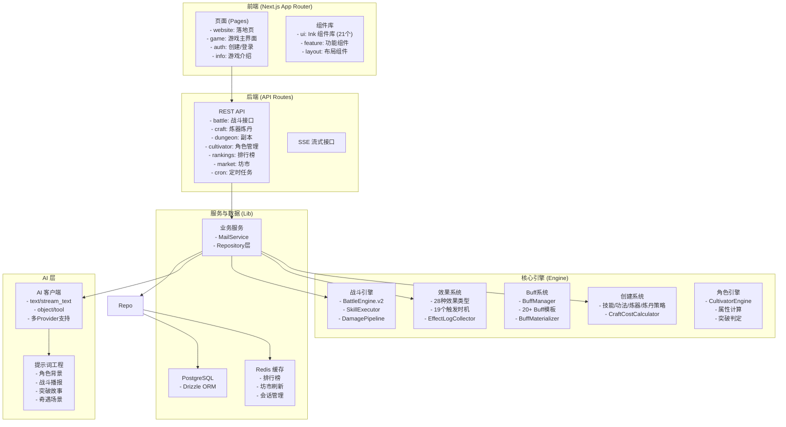

# 万界道友 (daoyou.org)

<p align="center">
  
</p>

<p align="center">
  <strong>一款 AIGC 驱动、高自由度文字体验、修仙世界观的开源游戏项目。</strong>
</p>

<p align="center">
  <a href="LICENSE"></a>
  <a href="#项目愿景">项目愿景</a> •
  <a href="#核心特色">核心特色</a> •
  <a href="#已实现功能">功能状态</a> •
  <a href="#技术栈">技术栈</a> •
  <a href="#快速开始">快速开始</a> •
  <a href="#文档导航">文档导航</a> •
  <a href="#贡献指南">贡献指南</a>
</p>

---

## 项目愿景

**《万界道友》** 旨在打造一套"修仙宇宙的开源骨架"。它不仅是一个可以直接游玩的文字修仙游戏，更是一套高度结构化、AIGC 友好的底层架构。我们希望通过**高自由度的输入 + AIGC 反馈**，结合**严格的数值与战斗模型**，让创作者能够在此基础上快速搭建属于自己的修仙世界。

- **玩法层面**：鼓励玩家通过文字描述塑造角色，AI 实时生成反馈，带来"千人千面"的体验。
- **系统层面**：保持系统的稳定、正交与可组合性，确保数值平衡与逻辑自洽。
- **表现层面**：坚持"文字即界面"，采用水墨意境 UI，适配移动端体验。

## 核心特色

- 🤖 **AIGC 深度集成**：角色背景、战斗播报、奇遇故事、物品描述全流程 AI 生成，每一次体验都独一无二。支持 DeepSeek、火山引擎 ARK、Kimi 三种 AI Provider。
- ⚔️ **深度战斗引擎**：基于时间轴的回合制战斗，支持神通、法宝、状态效果（Buff/Debuff）、五行克制、伤害管道等复杂机制。
- ☯️ **严谨修仙体系**：完整的境界（炼气至渡劫）、灵根（金木水火土风雷冰）、功法、命格、炼丹炼器系统。
- 📱 **水墨风 UI**：基于 `Ink` 组件库（21 个组件）打造的纯文字 UI，简洁优雅，沉浸感强。
- 🛠️ **开发者友好**：清晰的分层架构（Engine/Service/API），TypeScript 全栈开发，易于扩展与二创。

## 项目状态

**当前版本**: v0.1.0 (开发中)

**核心系统完成度**:

- 战斗引擎: ✅ 完成
- 效果系统: ✅ 完成 (28 种效果类型)
- Buff 系统: ✅ 完成 (20+ 模板)
- 创建系统: ✅ 完成 (技能/功法/炼器/炼丹)
- 角色系统: ✅ 基础完成
- AI 集成: ✅ 完成 (多 Provider 支持)
- UI 组件库: ✅ 完成 (21 个组件)

**待实现功能**:

- 轮回转世系统
- 宗门系统
- 更多奇遇类型
- 移动端适配优化

## 已实现功能

### 🧘 角色系统

- ✅ **AI 塑形**：通过一句话描述生成完整的角色设定（性格、出身、初始属性）
- ✅ **属性管理**：体魄、灵力、悟性、速度、神识五维属性，结合灵根与命格决定成长上限
- ✅ **灵根系统**：8 种元素（金木水火土风雷冰），支持变异灵根
- ✅ **境界系统**：9 个境界（炼气至渡劫），每境界 4 个阶段（初期/中期/后期/圆满）
- 🔄 **轮回转世**：规划中

### ⚔️ 战斗系统

- ✅ **战斗引擎**：基于时间轴的回合制战斗（`BattleEngine.v2.ts`）
- ✅ **技能执行**：完整的技能执行器（`SkillExecutor`）
- ✅ **伤害管道**：多阶段伤害计算与修正
- ✅ **SSE 流式输出**：实时推送战斗过程
- ✅ **AI 战报**：将战斗日志转化为修仙小说片段
- ✅ **PVE 战斗**：副本挑战、妖兽战斗
- ✅ **PVP 战斗**：天骄榜挑战

### 💫 效果系统

- ✅ **19 个触发时机**：属性计算、战斗流程、命中相关、伤害相关、系统事件
- ✅ **28 种效果类型**：包括伤害、治疗、护盾、吸血、反伤、元素加成、斩杀、真实伤害等
- ✅ **4 个属性修正阶段**：BASE → FIXED → PERCENT → FINAL
- ✅ **效果日志收集器**：统一收集执行日志用于战报生成

### 🎭 Buff 系统

- ✅ **BuffManager**：Buff 管理器，处理添加/移除/触发
- ✅ **BuffMaterializer**：Buff 实体化器，将模板转为可执行的 Buff
- ✅ **20+ Buff 模板**：属性加成、状态效果、特殊机制（带 emoji 图标）
- ✅ **24 种状态效果**：战斗状态、持久状态、环境状态

### 🔮 创建系统

- ✅ **CreationEngine**：创建引擎主控（策略模式）
- ✅ **EffectMaterializer**：效果实体化器
- ✅ **技能创建策略**（`SkillCreationStrategy`）
- ✅ **功法创建策略**（`GongFaCreationStrategy`）
- ✅ **炼器策略**（`RefiningStrategy`）
- ✅ **炼丹策略**（`AlchemyStrategy`）
- ✅ **资源消耗计算器**（`CraftCostCalculator`）：灵石/道心感悟

### 🎒 物品与装备

- ✅ **储物袋**：分类管理法宝、丹药、材料、符箓
- ✅ **炼器/炼丹**：AI 与规则双重校验，炼制独一无二的法宝与丹药
- ✅ **装备系统**：武器、防具、饰品三槽位
- ✅ **消耗品系统**：丹药、符箓（符箓类型已定义）

### 🗺️ 探索与副本

- ✅ **大地图**：基于拓扑结构的世界地图
- ✅ **副本机制**：五轮制探索，AI 动态生成场景与选项
- ✅ **奇遇系统**：随机触发的神签、机缘

### 🏆 社交与排行

- ✅ **天骄榜**：实时更新的战力排行
- ✅ **传音玉简**：邮件系统
- ✅ **坊市**：随机刷新的交易市场
- ✅ **排行榜奖励**：每日结算奖励

### 🧘 修炼系统

- ✅ **闭关修炼**：获得修为与道心感悟
- ✅ **突破系统**：境界突破判定与成功率计算
- ✅ **突破故事**：AI 生成突破剧情
- ✅ **命格重塑**：先天命格重塑功能

### 🎨 UI 组件库（Ink）

- ✅ **21 个基础组件**：InkButton, InkCard, InkDialog, InkInput, InkList, InkNav, InkNotice, InkStatRow, InkStatusBar, InkTabs, InkTag, InkToast 等
- ✅ **特效组件**：EffectCard, EffectDetailModal
- ✅ **水墨风格**：Tailwind CSS 4 定制样式

### 🛠️ 开发者工具

- ✅ **10+ 测试文件**：覆盖战斗、效果、创建系统
- ✅ **类型安全**：全 TypeScript 类型定义
- ✅ **代码规范**：ESLint + Prettier 配置

## 技术栈

本项目采用现代化的全栈技术架构：

- **前端框架**: [Next.js 16.1.4](https://nextjs.org/) (App Router)
- **UI 框架**: [React 19.2.3](https://react.dev/)
- **语言**: [TypeScript 5](https://www.typescriptlang.org/)
- **样式**: [Tailwind CSS 4](https://tailwindcss.com/) + PostCSS
- **数据库**: [Supabase](https://supabase.com/) (PostgreSQL)
- **ORM**: [Drizzle ORM 0.45.1](https://orm.drizzle.team/)
- **缓存/队列**: [Upstash Redis](https://upstash.com/)
- **AI 服务**: [Vercel AI SDK 6.0.44](https://sdk.vercel.ai/) + DeepSeek / 火山引擎 ARK / Kimi
- **部署**: Vercel
- **包管理器**: npm

## 架构概览



## 快速开始

### 1. 环境准备

- Node.js v18+
- npm 10+（推荐）或 npm/yarn
- Git

### 2. 克隆项目

```bash
git clone https://github.com/your-username/wanjiedaoyou.git
cd wanjiedaoyou
```

### 3. 安装依赖

```bash
npm install
```

### 4. 环境变量配置

创建 `.env.local` 文件并填入配置：

```bash
# AI Provider 选择 (ark|deepseek|kimi)
PROVIDER_CHOOSE=deepseek

# DeepSeek 配置
OPENAI_API_KEY=sk-xxxx
OPENAI_BASE_URL=https://api.deepseek.com/v1
OPENAI_MODEL=deepseek-chat

# 或使用火山引擎 ARK
ARK_API_KEY=xxxx
ARK_BASE_URL=https://ark.cn-beijing.volces.com/api/v3
ARK_MODEL_USE=xxxx
ARK_MODEL_FAST_USE=xxxx

# Supabase 配置
NEXT_PUBLIC_SUPABASE_URL=your-project-url
NEXT_PUBLIC_SUPABASE_ANON_KEY=your-anon-key
DATABASE_URL=postgres://...

# Redis 配置 (Upstash)
UPSTASH_REDIS_REST_URL=...
UPSTASH_REDIS_REST_TOKEN=...

# Cron 任务密钥
CRON_SECRET=your-secret-key
```

### 5. 数据库初始化

```bash
# 推送 Schema 到数据库
npx drizzle-kit push
```

### 6. 启动开发服务器

```bash
npm run dev
```

访问 `http://localhost:3000` 开始修仙之旅。

### 核心概念

**效果系统**

- 19 个触发时机：从属性计算到系统事件的全生命周期覆盖
- 28 种效果类型：从基础伤害/治疗到高级斩杀/真实伤害
- 4 个属性修正阶段：确保属性计算的顺序正确性

**Buff 系统**

- BuffManager：统一管理 Buff 的生命周期
- BuffMaterializer：将配置模板转换为可执行实体
- 20+ Buff 模板：覆盖属性加成、状态效果、特殊机制

**创建系统**

- 策略模式：技能/功法/炼器/炼丹各有独立的创建策略
- AI 辅助：结合 AI 生成与规则校验
- 资源消耗：灵石与道心感悟的双重消耗模型

## 贡献指南

欢迎道友们共建这个修仙世界！

1. Fork 本仓库。
2. 创建特性分支 (`git checkout -b feature/NewFeature`)。
3. 提交更改 (`git commit -m 'Add some NewFeature'`)。
4. 推送到分支 (`git push origin feature/NewFeature`)。
5. 提交 Pull Request。

- **架构原则**：
  - 引擎层（`engine/`）完全独立于 UI 和框架
  - 业务逻辑放在 Service 层
  - 数据访问使用 Repository 模式

## 开源协议

本项目采用 [GNU General Public License v3.0](LICENSE) 协议开源。

这意味着你可以自由地：

- 共享：在任何媒介或格式下复制和分发材料
- 改编：混合、转换和构建材料

但必须遵守以下条款：

- **署名**：必须提供适当的归属。
- **相同方式共享**：如果你混合、转换或基于该材料进行构建，你必须在相同的协议下分发你的贡献。

详情请查阅 [LICENSE](LICENSE) 文件。

---

<p align="center">
  愿你在万界中得一二知己，共证长生。
</p>
