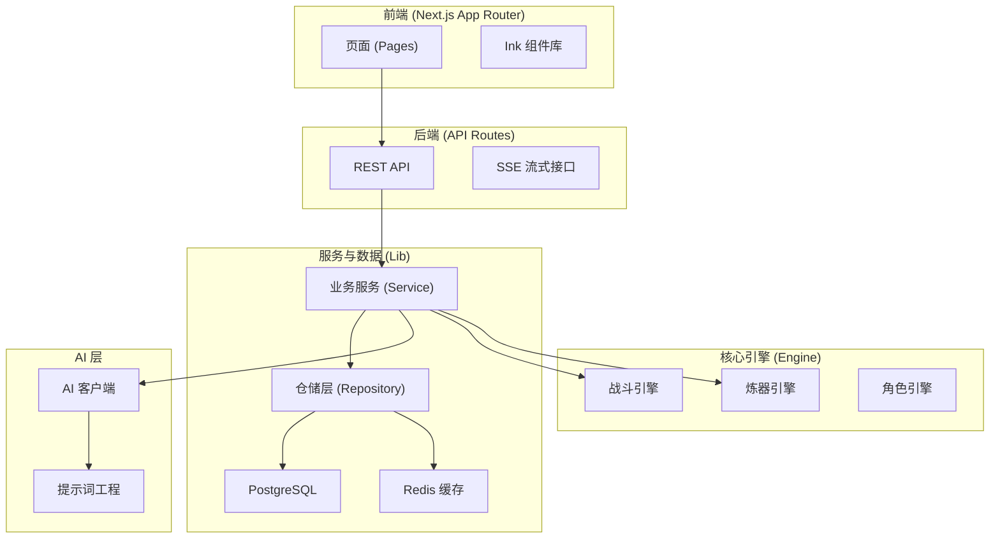

# 万界道友 (daoyou.org)

<p align="center">
  
</p>

<p align="center">
  <strong>一款 AIGC 驱动、高自由度文字体验、修仙世界观的开源游戏项目。</strong>
</p>

<p align="center">
  <a href="LICENSE"></a>
  <a href="#项目愿景">项目愿景</a> •
  <a href="#核心特色">核心特色</a> •
  <a href="#核心功能模块">核心功能</a> •
  <a href="#技术栈">技术栈</a> •
  <a href="#快速开始">快速开始</a> •
  <a href="#文档导航">文档导航</a> •
  <a href="#贡献指南">贡献指南</a>
</p>

---

## 项目愿景

**《万界道友》** 旨在打造一套“修仙宇宙的开源骨架”。
它不仅是一个可以直接游玩的文字修仙游戏，更是一套高度结构化、AIGC 友好的底层架构。我们希望通过**高自由度的输入 + AIGC 反馈**，结合**严格的数值与战斗模型**，让创作者能够在此基础上快速搭建属于自己的修仙世界。

- **玩法层面**：鼓励玩家通过文字描述塑造角色，AI 实时生成反馈，带来“千人千面”的体验。
- **系统层面**：保持系统的稳定、正交与可组合性，确保数值平衡与逻辑自洽。
- **表现层面**：坚持“文字即界面”，采用水墨意境 UI，适配移动端体验。

## 核心特色

- 🤖 **AIGC 深度集成**：角色背景、战斗播报、奇遇故事、物品描述全流程 AI 生成，每一次体验都独一无二。
- ⚔️ **深度战斗引擎**：基于时间轴的回合制战斗，支持神通、法宝、状态效果（Buff/Debuff）、五行克制等复杂机制。
- ☯️ **严谨修仙体系**：完整的境界（炼气至渡劫）、灵根（五行+变异）、功法、命格、炼丹炼器系统。
- 📱 **水墨风 UI**：基于 `Ink` 组件库打造的纯文字 UI，简洁优雅，沉浸感强。
- 🛠️ **开发者友好**：清晰的分层架构（Engine/Service/API），TypeScript 全栈开发，易于扩展与二创。

## 核心功能模块

### 🧘 角色系统
- **AI 塑形**：通过一句话描述生成完整的角色设定（性格、出身、初始属性）。
- **属性管理**：体魄、灵力、悟性、速度、神识五维属性，结合灵根与命格，决定成长上限。
- **轮回转世**：支持寿元耗尽后的转世重修，继承部分记忆与故事。

### ⚔️ 战斗系统
- **实时演算**：后端战斗引擎实时模拟，支持 SSE 流式输出战斗过程。
- **AI 战报**：将枯燥的战斗日志转化为生动热血的修仙小说片段。
- **多模式**：支持 PVE（副本/妖兽）与 PVP（天骄榜挑战）。

### 🎒 物品与装备
- **储物袋**：分类管理法宝、丹药、材料。
- **炼器/炼丹**：收集材料，注入神念，通过 AI 与规则双重校验，炼制独一无二的法宝与丹药。
- **装备系统**：武器、防具、饰品三槽位，法宝自带特技与诅咒。

### 🗺️ 探索与副本
- **大地图**：基于拓扑结构的世界地图，包含主城与卫星节点。
- **副本机制**：五轮制探索，AI 动态生成场景与选项，遵循“风险与回报对等”原则。
- **奇遇系统**：随机触发的神签、机缘，丰富探索体验。

### 🏆 社交与排行
- **天骄榜**：实时更新的战力排行，支持挑战与神识查探。
- **传音玉简**：邮件系统，用于系统通知与奖励发放。
- **坊市**：随机刷新的交易市场，获取稀缺资源。

## 技术栈

本项目采用现代化的全栈技术架构：

- **前端框架**: [Next.js 16 (App Router)](https://nextjs.org/)
- **语言**: TypeScript
- **样式**: Tailwind CSS + PostCSS
- **数据库**: [Supabase](https://supabase.com/) (PostgreSQL)
- **ORM**: [Drizzle ORM](https://orm.drizzle.team/)
- **缓存/队列**: [Upstash Redis](https://upstash.com/)
- **AI 服务**: OpenAI / DeepSeek (通过 `@ai-sdk/deepseek`)
- **部署**: Vercel

## 架构概览



## 快速开始

### 1. 环境准备
- Node.js v18+
- 包管理器 (npm/pnpm/yarn)
- Git

### 2. 克隆项目
```bash
git clone https://github.com/your-username/wanjiedaoyou.git
cd wanjiedaoyou
```

### 3. 安装依赖
```bash
npm install
```

### 4. 环境变量配置
复制 `.env.example` (需自行创建参考 `ENV_SETUP.md`) 到 `.env.local` 并填入配置：

```bash
# OpenAI / DeepSeek 配置
OPENAI_API_KEY=sk-xxxx
OPENAI_BASE_URL=https://api.openai.com/v1

# Supabase 配置
NEXT_PUBLIC_SUPABASE_URL=your-project-url
NEXT_PUBLIC_SUPABASE_ANON_KEY=your-anon-key
DATABASE_URL=postgres://...

# Redis 配置
UPSTASH_REDIS_REST_URL=...
UPSTASH_REDIS_REST_TOKEN=...
```

*详细配置请参考 `ENV_SETUP.md`。*

### 5. 数据库初始化
```bash
# 推送 Schema 到数据库
npx drizzle-kit push
```

### 6. 启动开发服务器
```bash
npm run dev
```
访问 `http://localhost:3000` 开始修仙之旅。

## 文档导航

项目包含详尽的内部文档（位于 `.qoder/repowiki`），涵盖了从架构设计到具体实现的方方面面：

- **核心功能**：[战斗系统]、[角色系统]、[炼器系统]、[探索系统]
- **数据模型**：[数据库表结构详解]、[JSONB 数据模式]
- **前端架构**：[组件体系]、[状态管理]、[样式规范]
- **后端架构**：[API 路由设计]、[服务层架构]、[数据访问层]
- **AI 集成**：[提示词工程设计]、[AI 客户端封装]

## 贡献指南

欢迎道友们共建这个修仙世界！

1. Fork 本仓库。
2. 创建特性分支 (`git checkout -b feature/NewFeature`)。
3. 提交更改 (`git commit -m 'Add some NewFeature'`)。
4. 推送到分支 (`git push origin feature/NewFeature`)。
5. 提交 Pull Request。

请确保遵循项目的代码风格（Prettier/ESLint）并添加必要的测试。

## 开源协议

本项目采用 [GNU General Public License v3.0](LICENSE) 协议开源。

这意味着你可以自由地：
- 共享：在任何媒介或格式下复制和分发材料
- 改编：混合、转换和构建材料

但必须遵守以下条款：
- **署名**：必须提供适当的归属。
- **相同方式共享**：如果你混合、转换或基于该材料进行构建，你必须在相同的协议下分发你的贡献。

详情请查阅 [LICENSE](LICENSE) 文件。

---
<p align="center">
  愿你在万界中得一二知己，共证长生。
</p>