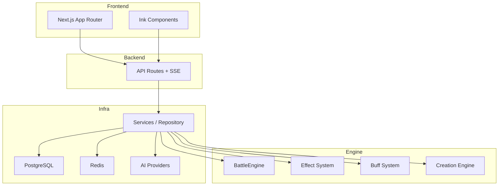

# 万界道友 (daoyou.org)

<p align="center">
  
</p>

<p align="center">
  <strong>一款 AIGC 驱动、高自由度文字体验、修仙世界观的开源游戏项目。</strong>
</p>

<p align="center">
  <a href="LICENSE"></a>
  
  
  
  
</p>

<p align="center">
  <a href="#-项目亮点">项目亮点</a> •
  <a href="#-快速开始">快速开始</a> •
  <a href="#-部署指南">部署指南</a> •
  <a href="#-功能矩阵">功能矩阵</a> •
  <a href="#-架构总览">架构总览</a> •
  <a href="#-roadmap">Roadmap</a> •
  <a href="#-贡献指南">贡献指南</a>
</p>

---

## 项目愿景

**《万界道友》** 旨在打造一套"修仙宇宙的开源骨架"。它不仅是一个可以直接游玩的文字修仙游戏，更是一套高度结构化、AIGC 友好的底层架构。我们希望通过**高自由度的输入 + AIGC 反馈**，结合**严格的数值与战斗模型**，让创作者能够在此基础上快速搭建属于自己的修仙世界。

- **玩法层面**：鼓励玩家通过文字描述塑造角色，AI 实时生成反馈，带来"千人千面"的体验。
- **系统层面**：保持系统的稳定、正交与可组合性，确保数值平衡与逻辑自洽。
- **表现层面**：坚持"文字即界面"，采用水墨意境 UI，适配移动端体验。

## 核心特色

- 🤖 **AIGC 深度集成**：角色背景、战斗播报、奇遇故事、物品描述全流程 AI 生成，每一次体验都独一无二。支持 DeepSeek、火山引擎 ARK、Kimi 三种 AI Provider。
- ⚔️ **深度战斗引擎**：基于时间轴的回合制战斗，支持神通、法宝、状态效果（Buff/Debuff）、五行克制、伤害管道等复杂机制。
- ☯️ **严谨修仙体系**：完整的境界（炼气至渡劫）、灵根（金木水火土风雷冰）、功法、命格、炼丹炼器系统。
- 📱 **水墨风 UI**：基于 `Ink` 组件库（21 个组件）打造的纯文字 UI，简洁优雅，沉浸感强。
- 🛠️ **开发者友好**：清晰的分层架构（Engine/Service/API），TypeScript 全栈开发，易于扩展与二创。

## 🖼 游戏画面

<p align="center">
  
  
  
</p>

<p align="center">
  
  
  
</p>

## 🚀 快速开始

### 1. 环境要求

- Node.js 18+
- npm 10+
- PostgreSQL（推荐 Supabase）
- Redis（推荐 Upstash）

### 2. 克隆与安装

```bash
git clone https://github.com/ChurchTao/Daoyou.git
cd Daoyou
npm install
```

### 3. 配置环境变量

```bash
cp .env.example .env.local
```

最低必填（本地可运行）示例：

```bash
PROVIDER_CHOOSE=ark
OPENAI_API_KEY=

NEXT_PUBLIC_SUPABASE_URL=
NEXT_PUBLIC_SUPABASE_ANON_KEY=
DATABASE_URL=
DB_RUNTIME=node

UPSTASH_REDIS_REST_URL=
UPSTASH_REDIS_REST_TOKEN=

CRON_SECRET=
```

### 4. 初始化数据库并启动

```bash
npx drizzle-kit push
npm run dev
```

访问：`http://localhost:3000`

## 📦 部署指南

### 方案对比

| 方案 | 适用场景 | 构建命令 | 部署命令 |
| --- | --- | --- | --- |
| Vercel | 常规 Next.js 托管 | `npm run build` | Vercel 平台自动部署 |
| Cloudflare Workers | 全球边缘节点 / OpenNext | `npm run build:cf` | `npm run deploy:cf` |

### Vercel 部署

1. 将仓库导入 Vercel。
2. Build Command: `npm run build`。
3. 在项目设置中填入 `.env.example` 对应变量。
   - 建议显式设置 `DB_RUNTIME=node`（默认 Node 侧池化配置）。
4. 确认定时任务路径（`vercel.json`）：`/api/cron/auction-expire`。

本地验证：

```bash
npm run build
npm run start
```

### Cloudflare Workers 部署（OpenNext）

仓库已集成 `@opennextjs/cloudflare`，可直接使用：

- `npm run build:cf`
- `npm run deploy:cf`
- `npm run deploy`（构建 + 部署）
- `npm run preview`

部署步骤：

1. 登录 Cloudflare

```bash
npx wrangler login
```

2. 根据 `wrangler.jsonc` 准备资源

- Worker 名：`daoyou`
- R2 Bucket：`daoyou`（绑定 `NEXT_INC_CACHE_R2_BUCKET`）
- 绑定：`ASSETS`、`IMAGES`、`WORKER_SELF_REFERENCE`

3. 配置 Secrets（示例）

```bash
npx wrangler secret put OPENAI_API_KEY
npx wrangler secret put DATABASE_URL
npx wrangler secret put UPSTASH_REDIS_REST_TOKEN
npx wrangler secret put CRON_SECRET
```

并在 `wrangler.jsonc` 或 Cloudflare 环境变量中设置：

```jsonc
"vars": {
  "DB_RUNTIME": "worker"
}
```

可选回滚开关（默认批量组装开启）：

```bash
DB_BATCH_ASSEMBLY=1
```

4. 构建与部署

```bash
npm run build:cf
npm run deploy:cf
```

## 🧩 功能矩阵

| 模块      | 状态 | 说明                                     |
| --------- | ---- | ---------------------------------------- |
| 战斗引擎  | ✅   | 时间轴回合制、技能执行、伤害管道         |
| 效果系统  | ✅   | 19 触发时机、28 效果类型、多阶段属性修正 |
| Buff 系统 | ✅   | BuffManager、模板实体化、状态编排        |
| 创建系统  | ✅   | 技能 / 功法 / 炼器 / 炼丹策略模式        |
| AI 集成   | ✅   | DeepSeek / ARK / Kimi 多 Provider        |
| UI 组件库 | ✅   | Ink 风格组件体系                         |
| 轮回转世  | 🚧   | 规划中                                   |
| 宗门系统  | 🚧   | 规划中                                   |

## 🧱 技术栈

| 层级     | 技术                                            |
| -------- | ----------------------------------------------- |
| 应用框架 | Next.js 16 (App Router), React 19, TypeScript 5 |
| 样式系统 | Tailwind CSS 4                                  |
| 数据层   | Supabase PostgreSQL, Drizzle ORM                |
| 缓存层   | Upstash Redis                                   |
| AI 能力  | Vercel AI SDK + 多 Provider                     |
| 部署平台 | Vercel / Cloudflare Workers (OpenNext)          |

## 🏗 架构总览



## 🛠 常用命令

```bash
npm run dev       # 本地开发
npm run lint      # 代码检查
npm test          # 单元测试
npm run build     # Next.js 生产构建
npm run build:cf  # OpenNext Cloudflare 构建
npm run deploy:cf # Cloudflare 部署
npm run preview   # Cloudflare 本地预览
```

## 🗺 Roadmap

- [ ] 轮回转世系统
- [ ] 宗门系统
- [ ] 更多奇遇模板与事件编排
- [ ] 移动端交互体验优化
- [ ] 更完整的 PVE / PVP 赛季机制

## 贡献指南

欢迎道友们共建这个修仙世界！

1. Fork 本仓库。
2. 创建特性分支 (`git checkout -b feature/NewFeature`)。
3. 提交更改 (`git commit -m 'Add some NewFeature'`)。
4. 推送到分支 (`git push origin feature/NewFeature`)。
5. 提交 Pull Request。

- **架构原则**：
  - 引擎层（`engine/`）完全独立于 UI 和框架
  - 业务逻辑放在 Service 层
  - 数据访问使用 Repository 模式

## 开源协议

本项目采用 [GNU General Public License v3.0](LICENSE) 协议开源。

这意味着你可以自由地：

- 共享：在任何媒介或格式下复制和分发材料
- 改编：混合、转换和构建材料

但必须遵守以下条款：

- **署名**：必须提供适当的归属。
- **相同方式共享**：如果你混合、转换或基于该材料进行构建，你必须在相同的协议下分发你的贡献。

详情请查阅 [LICENSE](LICENSE) 文件。

---

<p align="center">
  愿你在万界中得一二知己，共证长生。
</p>
