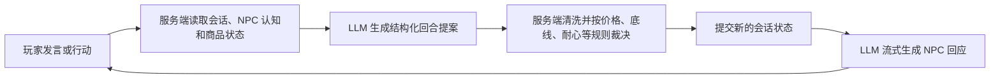

# 《万界道友》Agentic / LLM 使用位置总览

> 依据 2026-08-20 当前代码整理。这里的“Agentic”指模型会读取当前状态、提出下一步行为，并参与连续多轮流程；单纯生成名称、描述或一次性结构数据，只归为 LLM 生成功能，不算完整智能体。

## 一、结论

游戏目前没有一个能够自行调用工具、任意修改数据库、长期自主运行的通用 Agent，也没有把服务端工具直接开放给模型。

现有 AI 能力可以分成四层：

| 层级 | 当前功能 | 判断 |
| --- | --- | --- |
| 强 Agentic-like | 黑市交涉 | 模型持续读取会话、NPC 认知和玩家话术，提出下一回合意图与谈判变化；服务端负责最终裁决 |
| 中 Agentic-like | 秘境探索 | 模型根据秘境状态和历史生成下一幕、选项及结算建议；玩家选择后由服务端推进状态 |
| 受约束 AI 工作流 | 炼丹、功法/法宝/技能创造、角色生成、身份重塑 | 一到两次结构化生成，模型影响方向或语义，但没有自主循环 |
| AI 内容生成 | 突破/坐化/历练故事、每日运势、敌人与材料文案 | 主要负责表现层内容，不掌握关键资源和战斗结果 |

因此，若严格使用“Agentic”这个词，当前主要是黑市和秘境；其余大多是“规则系统调用 LLM 作为受约束生成器”。

## 二、统一调用与安全边界

所有服务端模型请求统一经过 [`aiClient.ts`](../src/server/utils/aiClient.ts)，提供以下四种调用形态：

- 生成文本：`generateAiText`
- 流式输出文本：`streamAiText`
- 生成符合 Schema 的对象：`generateAiObject`
- 生成符合 Schema 的数组：`generateAiArray`

模型路由支持 DeepSeek、阿里云百炼/Qwen、服务端路由表和玩家 BYOK。默认模型配置位于 [`llm.ts`](../src/shared/config/llm.ts)，提示词注册位于 [`registry.ts`](../src/server/lib/prompts/registry.ts)。

统一原则是：

1. 模型输出一律视为不可信输入。
2. 结构数据必须经过 Zod Schema、枚举白名单、长度和数值范围校验。
3. 灵石、物品、战斗结果、资源消耗等状态变化由服务端规则和事务执行。
4. 模型只负责提出内容或建议，不能直接读写数据库。
5. 结构生成失败时允许一次修正重试；仍失败则使用回退内容或终止本次生成。

一次“逻辑调用”可能因结构修正产生第二次实际模型请求，所以调用次数和供应商请求次数不一定完全相同。

## 三、真正接近 Agentic 的玩法

### 3.1 黑市交涉：当前最接近 Agent 的系统

主要代码：

- [`BlackMarketObservationService.ts`](../src/server/lib/services/black-market/BlackMarketObservationService.ts)
- [`BlackMarketPerceptionService.ts`](../src/server/lib/services/black-market/BlackMarketPerceptionService.ts)
- [`BlackMarketConversationService.ts`](../src/server/lib/services/black-market/BlackMarketConversationService.ts)
- [`BlackMarketService.ts`](../src/server/lib/services/black-market/BlackMarketService.ts)
- [`black-market.router.ts`](../src/server/routes/api/black-market.router.ts)

它包含一个受服务端监管的连续会话循环：

模型参与的内容包括：

- 商品外观观察和鉴别线索。
- NPC 对玩家的感知、信任、怀疑及开场态度。
- 对玩家话术的意图判断、证据理解、记忆更新和议价提案。
- 根据已经裁决的结果生成 NPC 回复。

但服务端仍掌握以下硬限制：

- 一次会话最多 6 回合，检查商品最多 3 次。
- 实际售价、最低价、NPC 耐心和可接受范围由规则控制。
- 灵石扣除、商品转移和库存变化由服务端事务执行。
- 模型不能通过回复文字直接成交，也不能自行增减玩家资源。

一次玩家交涉通常包含 1 次结构化回合生成和 1 次回复生成。首次进入还可能生成商品观察与 NPC 感知；商品观察会缓存，避免每次进入都重新请求。

### 3.2 秘境探索：状态驱动的多回合叙事

主要代码：

- [`service_v2.ts`](../src/server/lib/dungeon/service_v2.ts)
- [`llmContext.ts`](../src/server/lib/dungeon/llmContext.ts)
- [`dungeon-round.md`](../src/server/prompts/dungeon-round.md)
- [`dungeon-settlement.md`](../src/server/prompts/dungeon-settlement.md)

每个秘境回合会把当前地图、人物状态、资源、最近经历等压缩后交给模型。模型返回：

- 当前场景和逐步展示的叙事。
- 有界的行动选项及可能代价。
- 危险提示和奖励蓝图。
- 最终结算时的结局叙事、表现标签和奖励建议。

玩家作出选择以后，服务端才会验证资源、触发战斗、推进回合并保存结果。奖励蓝图还要经过奖励工厂、境界上限、难度公式和槽位限制，不能原样写入背包。

秘境具有“状态 → 生成下一步 → 玩家选择 → 状态变化 → 再生成”的连续循环，所以属于 Agentic-like；但模型没有自主替玩家选择，也不能决定真实战斗胜负。

## 四、受约束的 AI 工作流

### 4.1 功法、法宝和技能创造

入口位于 [`creationServiceV2.ts`](../src/server/lib/services/creationServiceV2.ts)。一次创造通常包含：

1. `material-semantic-enrichment`：批量理解投入材料的语义、元素和用途标签。
2. 确定性创造引擎计算总能量、共享语义、品质门槛、词缀预算和最终属性。
3. `product-naming`：为已经算好的产物生成名称与介绍。

材料语义会影响相性加成和词缀候选，因此模型能间接影响流派方向；但材料能量、品质、词缀成本和战斗投影都由规则计算。语义或命名失败时存在确定性回退，不会让物品凭空消失。

功法机制的详细数值见 [`gongfa-enlightenment-mechanics.md`](./gongfa-enlightenment-mechanics.md)。

### 4.2 即兴炼丹

相关代码：

- [`AlchemyRecipePlanner.ts`](../src/server/lib/services/AlchemyRecipePlanner.ts)
- [`AlchemyNarrativeEnricher.ts`](../src/server/lib/services/AlchemyNarrativeEnricher.ts)

`alchemy-recipe-plan` 根据材料和玩家意图给出受限的药性向量、主效果方向和元素倾向；确定性炼丹引擎再计算丹药类型、具体效果、品质、丹毒、稳定性、产量和消耗；最后由 `alchemy-improvised-copy` 生成名称与描述。

通常为 2 次逻辑模型调用。模型能影响配方方向，但不能自行决定“恢复 1400%”之类的最终数值。

### 4.3 丹方炼丹

[`AlchemyFormulaAnalyzer.ts`](../src/server/lib/services/AlchemyFormulaAnalyzer.ts) 使用 `alchemy-formula-analysis` 分析材料是否匹配丹方及药性方向。服务端会先核对材料 ID 和数量，再计算匹配度并生成带有效期的分析凭证；正式炼制只能按该凭证和服务端规则提交。

分析阶段通常为 1 次逻辑模型调用，正式提交不再让模型重新决定配方。

### 4.4 角色生成

[`CharacterGenerator.ts`](../src/shared/engine/cultivator/creation/CharacterGenerator.ts) 的 `character-generation` 会生成姓名、性别、出身、性格、背景、元素偏好和资质倾向。

模型的元素偏好和资质分数会间接参与灵根生成，但六项基础属性、灵根强度/品级范围、初始功法与技能仍由代码在限定范围内生成。模型不能任意填写玩家数值。角色生成还受每日次数限制。

### 4.5 改天换地 / 身份重塑

[`IdentityReshapeService.ts`](../src/server/lib/services/IdentityReshapeService.ts) 根据玩家问答生成候选姓名、出身、性格和背景，必须由玩家确认后才保存。

性别、种族、年龄、境界、阶段及战斗数值不会由该流程改写，所以它属于身份文案重塑，不是角色重练。

## 五、以叙事和内容为主的 LLM 功能

| 功能 | 模型场景 | 模型负责什么 | 不由模型负责什么 |
| --- | --- | --- | --- |
| 突破 | `breakthrough-story` | 成功突破后的流式故事 | 成功率、资源消耗、境界变化 |
| 寿元耗尽 | `lifespan-exhausted` | 坐化/结局故事 | 寿元计算和人物状态 |
| 历练收益 | `yield-story` | 已结算结果的历练故事 | 奖励数量、领取与入库 |
| 每日运势 | `divine-fortune` | 当日签文与解释 | 人物属性和资源；结果会全局缓存 24 小时 |
| 敌人包装 | `enemy-narrative` | 敌人姓名、称号、背景、技能/物品描述 | 境界、数值、装备效果、战斗 AI 和胜负 |
| 材料生成 | `material-generation` | 批量补充材料名称、描述和允许范围内的元素 | 品质、类型、数量、价格骨架 |

补充说明：

- 敌人文案用于秘境敌人、部分任务/突破挑战和试炼塔敌人集。数值构筑先由规则完成，模型只包装缺失文案；失败时使用确定性文案。
- 试炼塔敌人集可由后台提前生成并持久化，战斗发生时不会临时让模型决定敌人强度。
- 材料库可以由后台批量生成，但拍卖行定时刷新和历练奖励是从已经持久化的材料库抽取，不会在每次刷新或领取时实时请求模型。
- 当前命格由 [`FateEngine.ts`](../src/server/lib/services/FateEngine.ts) 的规则表生成。虽然存在 `fate-naming` 提示词，但目前没有实际调用入口，不能算作已启用的 LLM 功能。

## 六、哪些系统没有使用 LLM

以下核心玩法目前是确定性规则、概率规则或普通程序机器人，不属于 Agentic/LLM：

- battle-v5 的回合、目标选择、伤害、护盾、状态和胜负结算。
- 境界修炼、突破概率、属性成长和寿元计算。
- 竞技场、排行榜、试炼塔战斗与押注结算。
- 拍卖行定时刷新、系统回收、定价、购买、出售和库存转移。
- 机器人购买、出售和发起挑战；这些是规则机器人，预计 LLM Token 消耗为 0。
- 丹药实际效果、丹毒增减、使用限制和背包变化。
- 炼丹的最终数值合成，以及创造系统的能量、品质和词缀预算。
- 秘境中的真实战斗、资源扣除和奖励入库。
- 灵石、物品、背包和其他数据库事务。

也就是说，“会自动执行”不等于“用了 Agent”。定时任务、规则机器人和随机数系统即使无人操作，也不消耗 LLM Token。

## 七、当前提示词场景清单

当前提示词注册表中共有 20 个场景，其中 19 个有实际调用链，`fate-naming` 暂未启用：

| 类别 | 场景 ID |
| --- | --- |
| 黑市 | `black-market-observations`、`black-market-perception`、`black-market-turn`、`black-market-reply` |
| 秘境 | `dungeon-round`、`dungeon-settlement` |
| 创造 | `material-semantic-enrichment`、`product-naming` |
| 炼丹 | `alchemy-recipe-plan`、`alchemy-improvised-copy`、`alchemy-formula-analysis` |
| 角色 | `character-generation`、`identity-reshape` |
| 叙事 | `breakthrough-story`、`lifespan-exhausted`、`yield-story`、`divine-fortune` |
| 内容库 | `enemy-narrative`、`material-generation` |
| 暂未启用 | `fate-naming` |

## 八、最终判断

这套实现的核心模式不是“让大模型接管游戏”，而是：

> 服务端规则负责事实、数值和交易，LLM 负责理解语义、提出受限方案以及生成有氛围的文本。

目前最值得继续按 Agentic 方向扩展的是黑市 NPC 和秘境，因为它们已经具备连续状态、历史记忆、回合推进和规则裁决。机器人交易、战斗、拍卖行和修炼系统则更适合继续保持确定性，避免 Token 成本、延迟和不可控数值。
