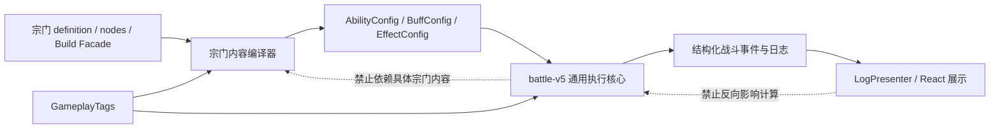

# battle-v5 与宗门机制解耦优化重构方案

> - 状态：已实施并通过最终验证（2026-07-22）
> - 分析基线：2026-07-22 当前工作区
> - 适用范围：`src/shared/engine/battle-v5`、`src/shared/engine/sect`、宗门战斗日志展示与相关测试
> - 重点宗门：幽都、天衍圣地；红尘剑宗与无相宗作为回归样本
> - 实施原则：不重做战斗架构，不修改持久化模型，不改变稳定宗门/流派/节点/能力 ID
> - 实施报告：[battle-v5-sect-decoupling-refactor-report.md](./battle-v5-sect-decoupling-refactor-report.md)

## 1. 背景与结论

当前四个生产宗门按 `src/shared/engine/sect/content/productionRuntime.ts` 的注册顺序为：

1. 红尘剑宗：`lingxiao`
2. 无相宗：`wuxiang`
3. 天衍圣地：`tianyan`
4. 幽都：`youdu`

现状没有在 battle-v5 生产核心中按上述宗门 ID、能力 ID 或“蚀魂、魂火、法印”等内容语义执行 `if/switch`，也没有为幽都新增灵魂生命值、专属伤害系统或多目标战斗分支。总体架构仍然可控。

风险主要来自另一种更隐蔽的耦合：用中性字段名包装只有一个宗门需要的执行阶段、运行时状态或展示参数，并让它们贯穿 `AbilityConfig`、Factory、DamageSystem、日志、心法成长和 UI。此类接口虽然没有出现宗门 ID，仍会扩大 battle-v5 的长期维护面。

本方案作出以下核心决策：

- 删除幽都驱动的冗余执行阶段 `postDamageEffects`，复用现有 `completionEffects`。
- 删除伤害核心中的 `DamageDisplayMetadata/display/tone`，不让战斗事件携带颜色和宗门美术语义。
- 删除仅由幽都终结技使用的 `buffLayerScalar`，在宗门编译期生成四层和五层两个固定 effect plan。
- 删除仅由天衍使用的 `element_history` 与 `BattleRuntimeState.elementHistories`，用宗门内容层隐藏 marker 和通用 runtime counter 表达不同元素历史。
- 删除天衍驱动的 `buff_periodic_settlement` 与 `manualSettlementEffects`，用分层 DOT 和固定反应伤害近似“立即结算剩余持续伤害”。
- 保留具有清晰通用语义的分层状态、逐层驱散、受治疗削弱、伤害行为开关、命中策略、effect plan、能力模式和监听预算。
- 扩大架构守卫覆盖四个生产宗门，并增加依赖方向、移除项和中性测试门禁。

## 2. 目标与非目标

### 2.1 目标

1. battle-v5 只理解伤害、治疗、Buff、层数、资源、命中、行动、事件、条件和监听预算等通用战斗事实。
2. 宗门世界观语义、流派规则、节点开关和复杂效果组合只存在于 `sect/content/<sect-id>`。
3. 玩家关键决策语义保持不变；无法无代价精确复刻时，优先采用可验证的近似效果。
4. 每个重构阶段可独立提交、验证和回滚，不要求一次完成全部工作。
5. 战斗与展示继续读取同一个 `SectCompiledBuild`，不在 UI、Service 或 Adapter 重新解释倍率。
6. 后续新增宗门能够依据本方案的准入门禁判断是否应扩展 battle-v5。

### 2.2 非目标

- 不修改 BattleEngineV5 当前严格 1v1 的单位、目标、回合、胜负和 AI 模型。
- 不新增 `DamageType.SOUL` 或其他宗门专属枚举。
- 不改变 `Cultivator.attributes` 的五维持久化边界。
- 不持久化 `battleProjection`、宗门战斗资源、Buff、运行时 counter 或 marker。
- 不修改宗门、心法、能力、流派、节点和战术稳定 ID。
- 不重做 `EffectRegistry`、`EventBus`、`AbilityFactory` 或整个日志架构。
- 不在本轮统一重写四个宗门的数值平衡。
- 不借机整理无关代码或处理工作区中的其他用户改动。

## 3. 目标分层与依赖方向



### 3.1 battle-v5 核心允许承担的职责

- 通用伤害请求与结算。
- 通用治疗、护盾、资源和属性修改。
- Buff 生命周期、层数、驱散和控制抗性。
- 主动能力命中、费用、冷却和效果顺序。
- 通用监听范围、条件、优先级和触发预算。
- 不含内容句子的结构化日志事实。

### 3.2 宗门内容层允许承担的职责

- 把“魂伤”编译为真实伤害、不可暴击、不可吸血和幽都机制标签。
- 把“蚀魂”编译为一个分层 Debuff 及其监听器。
- 把“法印反应”编译为 effect plan、隐藏 marker、counter 和通用效果链。
- 根据心法等级、流派、节点和战术生成固定的运行时配置。
- 在编译期展开少量枚举分支，例如四层/五层终结技。

### 3.3 展示层允许承担的职责

- 能力名称、机制名称、说明文本、颜色、图标和日志排版。
- 从结构化 `cause`、能力、Buff 和资源事件生成玩家文本。
- 对 debug marker、内部 counter 和稳定 ID 做隐藏处理。

展示层不得向战斗核心增加 `tone`、CSS 色名、Tailwind 类名或宗门主题字段。

## 4. 通用原语保留与退出清单

### 4.1 明确保留

| 原语 | 当前消费者 | 保留理由 | 必须满足的边界 |
| --- | --- | --- | --- |
| `BuffLayerChangedEvent` | 幽都及通用分层状态 | 完整表达 0→N、叠层、减层、驱散和阈值 | 事件字段只包含层数、原因、来源和通用对象 |
| `ApplyBuffParams.layers` | 幽都 | 一次添加多层是 Buff 的自然能力 | 缺省为 1，受 `maxLayers` 限制 |
| `AttributeModifierConfig.valueByLayer` | 幽都 | 非线性层级属性是通用状态能力 | 不写宗门名称；clone、增减层正确重挂 |
| `BuffConfig.dispelMode` | 幽都 | 逐层驱散是通用 Buff 策略 | 缺省 `whole`，旧内容行为不变 |
| `HEAL_RECEIVED_REDUCTION` | 幽都等状态 | 受治疗削弱属于基础属性 | 统一在 `Unit.heal()` 生效，不影响 MP、护盾、免死 |
| `DamageParams.canCrit/canLifesteal` | 幽都 | 伤害包级行为开关可复用 | 缺省 `true`，不能改变其他真实伤害 |
| `AbilityConfig.hitPolicy` | 红尘剑宗、幽都 | 能力自身必然命中具有通用语义 | 不按目标宗门或状态动态改写全局命中 |
| `effectLayers/effectPlans` | 无相、天衍、幽都 | 已有多个独立消费者 | 在施法准备阶段快照；计划只引用固定效果层 |
| `AbilityMode` | 无相 | “接下来 N 次能力使用某模式”足够通用 | battle-v5 不理解佛相、魔相、无相 |
| listener `budget/group` | 四宗门中的多个监听器 | 通用防重和共享预算 | group 只作为运行时 key，不包含执行特判 |
| `refund_paid_cost` | 天衍、幽都 | 已有两个独立消费者 | 只读取本次施法快照中的实际支付值 |
| `mechanic_log` | 天衍 | 当前仅发布结构化日志，不参与计算 | 暂保留但冻结能力，不允许加入内容句子模板或计算副作用 |

### 4.2 必须删除

| 原语 | 当前问题 | 替代方案 |
| --- | --- | --- |
| `AbilityConfig.postDamageEffects` | 与 `completionEffects` 语义重叠，迫使 Factory、能力分析、心法成长和展示理解新阶段 | 合并进有序的 `completionEffects` |
| `DamageDisplayMetadata`、伤害 `display`、`PresentedLogPart.tone` | 将“魂伤”“术伤”和 `violet` 贯穿伤害核心到 React | 使用标准伤害日志；必要时复用已有 `LogCauseRef.displayName`，不传颜色 |
| `DamageParams.buffLayerScalar` | 只有幽都终结技使用，使 DamageEffect 读取任意 Buff 层数 | 宗门编译期生成四层/五层两个固定伤害计划 |
| `ElementHistoryParams`、`element_history`、`elementHistories` | 将天衍的元素历史固化进通用运行时 | 天衍隐藏 marker + 通用 runtime counter |
| `BuffConfig.manualSettlementEffects`、`buff_periodic_settlement` | 外部效果读取 Buff 内部周期配置，增加反向耦合并扩散到心法成长 | 分层 DOT + 固定反应伤害 + 清除 Buff |

### 4.3 暂不扩展

- 不新增任意的 `afterHitEffects`、`afterDamageEffects`、`afterControlEffects` 等更多能力生命周期数组。
- 不新增通用“读取另一个 EffectConfig 并重新执行”的反射型效果。
- 不新增通用元素集合、宗门状态机或专属日志样式注册到 battle-v5。
- 不为单个节点增加新的 DamageSystem 分支、事件字段或伤害类型。

## 5. 行为保真等级

实施时按以下等级标记每一项验收：

| 等级 | 定义 | 适用项 |
| --- | --- | --- |
| E：精确等价 | 输入、结算顺序、事件数量和数值完全一致 | 幽都效果顺序、终结技四/五层伤害、魂火消费、失魂与归窍 |
| S：语义等价 | 玩家决策、反制窗口和强弱关系一致，允许内部表示改变 | 天衍不同元素历史改为 marker/counter |
| A：可接受近似 | 保留用途和战术选择，允许小幅数值或展示变化 | 天衍提前结算 DOT、魂伤日志颜色 |

以下内容不得降级：

- 幽都魂火必须在伤害请求后消费，不能消费本次新获得且未参与增伤的魂火。
- 幽都终结技必须按伤害前的四层或五层计算，随后才清层或保留两层。
- 幽都失魂成功、抵抗、免疫和首次解控必须收束到既定层数并进入归窍。
- 天衍元素反应仍必须由有效的元素组合触发，普通装备、功法和其他宗门不能误触发。
- 所有伤害、控制、治疗、状态和资源仍须通过现有 Factory 与事件管道。

## 6. 阶段 0：冻结基线与建立对照

### 6.1 目的

在删除接口前固化现有行为，避免重构过程中把已有机制 Bug 误当成新设计。

### 6.2 操作

1. 记录当前工作区状态，不覆盖或回滚任何用户未提交改动。
2. 运行当前 battle-v5 与宗门测试，保存命令和结果。
3. 为后续将要改写的机制补足“行为契约测试”，测试应面向结果而不是字段存在性。
4. 对日志允许变化的部分单独记录快照，避免把颜色删除误报为战斗语义变化。

### 6.3 基线测试清单

幽都：

- 《一叹》伤害后增加 1 层蚀魂。
- 《离魂引》按施法前层数选择伤害，伤害后消费魂火并增加 2 层蚀魂。
- 《忘川潮》按“直接伤害→蚀魂→忘川”执行。
- 《夺魄》《镇魂》发布术伤和魂伤两个独立请求，随后加层并施加状态。
- 混合伤害首段致死时，不发布第二次伤害请求，不遗留后续状态。
- “先定其形”只被铺层神通消费，每场一次，终结技和照影不能误消费。
- 《魂兮不归》四层、五层及相关节点组合的伤害值、请求数和完成效果。

天衍：

- 相同元素重复不能计为三种不同元素。
- 三种不同元素触发后历史重置。
- 燎原立即追加一跳但不减少原灼烧剩余跳数。
- 蒸发按剩余灼烧跳数追加伤害并移除灼烧。
- 反应伤害不会再次触发法印、DOT 或同类宗门反应链。

通用引擎：

- 已死亡目标不接受后续 `damage` effect，且该测试不得出现任何宗门 ID。
- `completionEffects` 在所有计划主效果之后、计划层完成效果之前执行。
- listener budget 的共享 group 在 action、source_action、round、battle 和 buff_lifetime 下正确重置。

### 6.4 门禁

```bash
bunx vitest run src/shared/engine/battle-v5/tests
bunx vitest run src/shared/engine/sect/content/youdu
bunx vitest run src/shared/engine/sect/content/tianyan
bunx vitest run src/shared/engine/sect
```

只有基线通过后才进入阶段 1。若基线本身失败，应先记录为独立 Bug，不在重构提交中混修。

## 7. 阶段 1：删除幽都驱动的 `postDamageEffects`

### 7.1 目标

移除新的全局生命周期阶段，同时保持幽都所有能力的伤害、魂火、加层和控制顺序精确等价。

### 7.2 目标执行顺序

`LayeredDataDrivenActiveSkill` 继续只执行：

```text
plan.effects
→ plan.completionEffects
→ consumeModeKey
```

`resolveAbilityEffectPlan()` 当前将完成效果组合为：

```text
base completionEffects
→ selected layer completionEffects
```

幽都可以利用这一既有顺序，让基础加层先发生，再结算《镇魂》的高低层控制完成效果；计划选择仍在施法准备时完成，不会被本次加层改变。

### 7.3 能力迁移表

| 能力 | 当前主效果 | 迁移后的 `completionEffects` 顺序 | 保真等级 |
| --- | --- | --- | --- |
| 一叹 | 条件术伤 | 加 1 层蚀魂→先定其形额外层→清 pending marker | E |
| 离魂引 | 四/五层计划魂伤 | 消费魂火→加 2 层蚀魂→先定其形→清 marker | E |
| 忘川潮 | 直接魂伤 | 加 1 层蚀魂→先定其形→目标存活时施加忘川 | E |
| 夺魄 | 术伤→魂伤→消费魂火 | 加 2 层蚀魂→先定其形→目标存活时施加降攻 | E |
| 镇魂 | 术伤→魂伤→消费魂火 | 加 2 层蚀魂→先定其形→计划层控制/减速 | E |

### 7.4 文件范围

删除字段及透传：

- `src/shared/engine/battle-v5/core/configs.ts`
- `src/shared/engine/battle-v5/abilities/LayeredDataDrivenActiveSkill.ts`
- `src/shared/engine/battle-v5/factories/AbilityFactory.ts`
- `src/shared/engine/battle-v5/factories/AbilityCapabilityAnalyzer.ts`
- `src/shared/engine/sect/core/authoring/SectAbilityFactory.ts`
- `src/shared/engine/sect/core/authoring/StandardSectMethodGrowthPolicy.ts`
- `src/shared/engine/sect/core/presentation/abilityFacts.ts`

迁移内容与测试：

- `src/shared/engine/sect/content/youdu/base/YouduBaseCompiler.ts`
- `src/shared/engine/battle-v5/tests/core/AbilityEffectPlans.test.ts`
- `src/shared/engine/sect/content/youdu/tests/*.test.ts`
- `src/shared/engine/sect/core/tests/methodGrowth.test.ts`

### 7.5 实施约束

- 不新增同义字段替代 `postDamageEffects`。
- 不把顺序逻辑写进 DamageSystem 或宗门 ID 分支。
- `firstShadowPending` 仍只由命中事件创建，并在技能完成阶段清理。
- 目标死亡时，加层、忘川、降攻和控制必须被存活条件阻止；marker 清理仍需执行。
- 能力详情继续展示“命中后”，但这是 `abilityFacts` 对 completion 中具体效果的描述，不代表新增运行时阶段。

### 7.6 验收

```bash
rg -n "postDamageEffects" src
bunx vitest run src/shared/engine/battle-v5/tests/core/AbilityEffectPlans.test.ts
bunx vitest run src/shared/engine/sect/core/tests/methodGrowth.test.ts
bunx vitest run src/shared/engine/sect/content/youdu
```

完成条件：

- `rg` 无结果。
- 幽都伤害请求数、魂火消费、蚀魂层数、状态顺序与基线一致。
- battle-v5 不新增其他生命周期数组。

## 8. 阶段 2：移除伤害核心中的展示元数据

### 8.1 目标

让 DamageEffect、DamageSystem 和伤害事件只传递影响计算或结构化归因的字段，不传递“术伤”“魂伤”和 `violet`。

### 8.2 决策

本轮默认采用标准伤害日志：

- 术伤继续由 `DamageType.MAGICAL` 计算。
- 魂伤继续由 `DamageType.TRUE + soulDamageTag + canCrit=false + canLifesteal=false` 计算。
- 同一技能的两个伤害包仍由现有 action span 聚合。
- 删除紫色染色，视为 A 级允许变化。

如果产品验收明确要求展示“魂伤”文字，只允许复用已有 `LogCauseRef`：

```ts
cause: {
  kind: 'mechanic',
  id: 'sect.youdu.soul-damage',
  displayName: '魂伤',
}
```

`cause` 是已有结构化归因，不得再携带颜色、CSS 类、句子模板或宗门主题对象。若现有 Presenter 不能在不增加核心字段的前提下展示该名称，本轮接受标准日志，不继续扩展。

### 8.3 文件范围

- `src/shared/engine/battle-v5/core/configs.ts`
- `src/shared/engine/battle-v5/core/events.ts`
- `src/shared/engine/battle-v5/effects/DamageEffect.ts`
- `src/shared/engine/battle-v5/systems/DamageSystem.ts`
- `src/shared/engine/battle-v5/systems/log/LogCollector.ts`
- `src/shared/engine/battle-v5/systems/log/LogPresenter.ts`
- `src/shared/engine/battle-v5/systems/log/types.ts`
- `src/react-app/components/feature/battle/v5/CombatActionLog.tsx`
- `src/shared/engine/sect/content/youdu/base/YouduBaseCompiler.ts`
- 对应日志与幽都测试

### 8.4 验收

必须删除：

- `DamageDisplayMetadata`
- `DamageParams.display`
- 三类伤害事件中的 `display`
- `DamageEntryData.display`
- `PresentedLogPart.tone`
- `CombatActionLog` 中的 `part.tone === 'violet'`

验证命令：

```bash
rg -n "DamageDisplayMetadata|tone.*violet|display: \{ label: '(魂伤|术伤)'" src
bunx vitest run src/shared/engine/battle-v5/tests/systems/log
bunx vitest run src/shared/engine/sect/content/youdu
bun run build
```

完成条件：

- 搜索无结果。
- 术伤、魂伤数值和请求数量不变。
- React 不再根据 battle-v5 核心传来的颜色枚举选择 CSS。
- 允许日志颜色和分量前缀与基线不同，但不允许伤害总值和分组错误。

## 9. 阶段 3：用固定 effect plan 替代 `buffLayerScalar`

### 9.1 目标

精确保留《魂兮不归》的单次伤害请求和四/五层公式，同时让 DamageEffect 不读取任意 Buff 层数。

### 9.2 编译方案

在 `compileAbilities()` 中根据最终 `YouduBuildSettings` 计算：

```ts
const coefficientAtFour =
  settings.finishBaseCoefficient + settings.finishPerLayerCoefficient * 4;
const coefficientAtFive =
  settings.finishBaseCoefficient + settings.finishPerLayerCoefficient * 5;
```

生成两个效果层：

```text
finish-four：一次 coefficientAtFour 的魂伤
finish-five：一次 coefficientAtFive 的魂伤
```

生成两个计划，五层计划优先：

```text
priority 20：施法前至少5层 → finish-five
priority 10：施法前至少4层且少于5层 → finish-four
```

保持既有 `castConditions >= 4`。伤害完成后继续执行原有 `finishCompletion`：

1. 清除蚀魂或设置为 2 层。
2. 目标存活时施加不归。
3. 可选施加忘川。
4. 消费魂火。
5. 处理一名一判、名落幽都等节点。

### 9.3 文件范围

- `src/shared/engine/sect/content/youdu/base/YouduBaseCompiler.ts`
- `src/shared/engine/battle-v5/core/configs.ts`
- `src/shared/engine/battle-v5/effects/DamageEffect.ts`
- `src/shared/engine/sect/core/presentation/abilityFacts.ts`
- `src/shared/engine/battle-v5/tests/effects/LayeredStatusAndSoulPrimitives.test.ts`
- `src/shared/engine/sect/content/youdu/tests/*.test.ts`

### 9.4 测试矩阵

至少覆盖：

| 蚀魂层数 | 基础配置 | 司命判词 | 七寸断魂 | 期望 |
| --- | --- | --- | --- | --- |
| 3 | 任意 | 任意 | 任意 | 不可施放 |
| 4 | 默认 | 关 | 关 | `base + perLayer × 4`，一个请求 |
| 5 | 默认 | 关 | 关 | `base + perLayer × 5`，一个请求 |
| 4 | 开 | 开/关 | 开/关 | 使用节点后的编译系数，一个请求 |
| 5 | 开 | 开/关 | 开/关 | 使用节点后的编译系数，一个请求 |
| 4/5 | 不归亦不散 | 任意 | 任意 | 伤害后保留 2 层 |

还需验证《照影》易伤读取终结前层数，本次伤害之后才清层。

### 9.5 验收

```bash
rg -n "buffLayerScalar" src
bunx vitest run src/shared/engine/battle-v5/tests/core/AbilityEffectPlans.test.ts
bunx vitest run src/shared/engine/sect/content/youdu
```

完成条件：

- 搜索无结果。
- 四层和五层最终伤害与基线一致。
- 每次终结仍只有一个 `DamageRequestEvent`。
- DamageEffect 不新增等价的状态层数动态读取字段。

## 10. 阶段 4：将天衍元素历史下沉到内容层

### 10.1 目标

删除 battle-v5 中的元素集合状态，同时精确保留“不同元素累计到三种后触发”的玩家语义。

### 10.2 内容层表示

天衍为每个需要记录的元素创建隐藏 marker Buff：

```text
sect.tianyan.element-history.fire
sect.tianyan.element-history.water
sect.tianyan.element-history.wood
sect.tianyan.element-history.earth
sect.tianyan.element-history.metal
```

marker 约束：

- `logVisibility: debug`
- `statusVisibility: hidden`
- `countsAsStatus: false`
- `dispelPolicy: protected`
- `duration: -1`
- 使用 `GameplayTags.STATUS.SECT.state(...)` 构造具体标签和共同清理标签
- 只存在于战斗运行时，不进入宗门持久状态

每套历史使用一个通用 runtime counter，例如：

```text
sect.tianyan.strategy.element-count
sect.tianyan.hetu.three-talents-count
```

### 10.3 记录流程

对一次合法天衍元素反应：

1. 若施术者尚无当前元素 marker，则执行 `runtime_counter_modify(add 1, max 3)`。
2. 在该 counter effect 的后续效果中施加当前元素 marker。
3. counter 达到 3 时触发对应节点/机制效果。
4. 清除共同标签匹配的全部元素 marker。
5. reset 对应 runtime counter。

相同元素重复时，第一步的 `has_not_tag` 条件失败，不增加 counter。

天衍策略不再调用 `readElementHistory()`，只读取通用 `readRuntimeCounter()` 或当前 marker 标签。策略仍位于 `sect/content/tianyan`，因此可以理解天衍元素 ID。

### 10.4 删除范围

- `ElementHistoryParams`
- `EffectConfig` 中的 `element_history`
- `src/shared/engine/battle-v5/effects/ElementHistoryEffect.ts`
- 对应 effect export/registry 引用
- `BattleRuntimeState.elementHistories`
- `rememberElement/readElementHistory/clearElementHistory`
- BattleStateRecorder 中对元素历史的快照字段或复制逻辑
- 天衍编译器和策略中的 `element_history`/`readElementHistory` 使用

### 10.5 文件范围

- `src/shared/engine/battle-v5/core/configs.ts`
- `src/shared/engine/battle-v5/core/runtimeState.ts`
- `src/shared/engine/battle-v5/effects/ElementHistoryEffect.ts`
- `src/shared/engine/battle-v5/effects/index.ts`
- `src/shared/engine/battle-v5/systems/state/*`
- `src/shared/engine/sect/content/tianyan/base/TianyanBaseCompiler.ts`
- `src/shared/engine/sect/content/tianyan/strategy.ts`
- `src/shared/engine/sect/content/tianyan/tests/*`
- 对应 battle-v5 原语测试

### 10.6 测试矩阵

- 火→火→火：counter 保持 1，不触发。
- 火→水→火：counter 为 2，不触发。
- 火→水→木：第三种触发一次，随后 counter=0、marker 全清。
- 触发后再次火→水→木：可再次触发。
- 两套不同 key 的历史互不影响。
- marker 不显示在玩家状态栏、不计入普通 Buff 数量、不受驱散。
- 战斗状态克隆/录制后不出现旧 `elementHistories` 字段；marker 与 counter 按现有通用规则恢复或复制。
- 其他宗门的元素技能不能写入天衍 marker。

### 10.7 验收

```bash
rg -n "ElementHistory|element_history|elementHistories|readElementHistory|rememberElement|clearElementHistory" src
bunx vitest run src/shared/engine/battle-v5/tests/core/RuntimePrimitives.test.ts
bunx vitest run src/shared/engine/battle-v5/tests/systems/BattleStateRecorder.test.ts
bunx vitest run src/shared/engine/sect/content/tianyan
```

完成条件：搜索无结果；不同元素语义与基线一致；battle-v5 runtime state 不再出现元素领域名词。

## 11. 阶段 5：删除天衍周期 Buff 的反射式手动结算

### 11.1 目标

移除外部效果读取并重新执行 Buff 内部 `manualSettlementEffects` 的能力，保留燎原和蒸发“提前兑现灼烧价值”的战术用途。

### 11.2 允许的语义近似

原设计要求蒸发读取原灼烧来源、剩余完整跳数和原周期效果。精确保留这些内部细节会继续要求通用引擎反射式读取 Buff 配置，不符合本方案边界。

本阶段采用 A 级近似：

- 灼烧剩余层数仍决定蒸发额外伤害强弱。
- 燎原仍额外造成一跳等价伤害且不消耗原灼烧。
- 蒸发仍立即兑现剩余灼烧并清除灼烧。
- 允许立即伤害使用天衍编译器中的标准灼烧系数，而不是运行时反查原 Buff 的完整 EffectConfig。
- 允许日志归因为燎原/蒸发的直接追击，而不是“手动触发原 Buff”。

### 11.3 灼烧表示

仅将天衍灼烧改为层数代表剩余跳数：

- 初始 `layers = 2`
- `maxLayers = 2`
- 每次目标行动前：造成一跳 DOT，然后减少 1 层
- 0 层时移除
- 重新施加时恢复到 2 层并刷新持续时间
- Buff 仍保留正常的周期监听器，普通自然结算不走新引擎分支

熔岩等不参与燎原/蒸发提前结算的 DOT 不必改为同一表示。

### 11.4 反应编译

燎原：

```text
本次主伤害与基础效果
→ 施加/刷新2层灼烧
→ 追加一次标准灼烧系数的 DELAYED/FOLLOW_UP 伤害
→ 不减少灼烧层数
```

蒸发：

```text
若目标灼烧至少2层：追加2倍标准灼烧系数伤害
若目标灼烧恰好1层：追加1倍标准灼烧系数伤害
随后清除灼烧
```

两档使用现有 effect plan 或带层数条件的两个互斥 EffectConfig，不新增“按剩余持续时间读取 Buff 配置”的引擎能力。

### 11.5 删除范围

- `BuffPeriodicSettlementParams`
- `EffectConfig` 中的 `buff_periodic_settlement`
- `src/shared/engine/battle-v5/effects/BuffPeriodicSettlementEffect.ts`
- `BuffConfig.manualSettlementEffects`
- `DataDrivenBuff` 对该字段的暴露用途（若删除后无其他消费者）
- `StandardSectMethodGrowthPolicy` 对 `manualSettlementEffects` 的递归投影
- 相关 affix text 分支与 EffectRegistry 注册

### 11.6 测试矩阵

- 新灼烧为 2 层，第一跳后 1 层，第二跳后移除。
- 重复施加恢复 2 层，不超过 2 层。
- 燎原额外造成一跳，灼烧仍保持 2 层。
- 一层灼烧蒸发追加一档伤害并清除。
- 两层灼烧蒸发追加两档伤害并清除。
- 蒸发不会结算熔岩或其他 DOT。
- 目标死亡后不追加后续伤害、不遗留新法印或 DOT。
- 反应追加伤害不再次触发天衍法印与宗门反应。
- 相关心法成长与节点倍率仍能投影到新的固定反应伤害。

### 11.7 验收

```bash
rg -n "BuffPeriodicSettlement|buff_periodic_settlement|manualSettlementEffects" src
bunx vitest run src/shared/engine/battle-v5/tests/effects/TianyanEngineExtensions.test.ts
bunx vitest run src/shared/engine/sect/content/tianyan
bunx vitest run src/shared/engine/sect/core/tests/methodGrowth.test.ts
```

完成条件：搜索无结果；燎原和蒸发的用途、相对强弱和清除规则保留；不新增等价的反射式 Buff 配置读取接口。

## 12. 阶段 6：加强架构与准入守卫

### 12.1 扩大现有架构守卫

修改 `src/shared/engine/sect/testing/architecture/architectureGuard.test.ts`：

1. 对 battle-v5 非测试核心扫描全部生产宗门 ID 和展示名称，而不是只扫描幽都。
2. `battle-v5/adapters` 作为明确集成边界可以依赖 `sect` 投影；其余 battle-v5 目录禁止导入 `sect/content`。
3. `sect/core` 禁止依赖 `sect/content` 和具体宗门 ID。
4. 通用 React 战斗组件禁止出现宗门 ID；宗门主题展示必须通过数据或已有结构化日志进入。
5. 禁止重新出现本方案删除的字段和 effect type。

建议扫描集合至少包括：

```text
lingxiao / 红尘剑宗 / 凌霄
wuxiang / 无相
tianyan / 天衍
youdu / 幽都
sect.lingxiao / sect.wuxiang / sect.tianyan / sect.youdu
```

测试夹具和宗门内容目录本身不参与禁止扫描。

### 12.2 依赖方向守卫

可先用架构测试实现，不强制本轮改 ESLint 配置：

```text
battle-v5/core|abilities|buffs|effects|factories|systems|units
  不得 import sect/content、react-app

sect/core
  不得 import sect/content

sect/content
  可以 import battle-v5、sect/core、GameplayTags

react-app
  可以 import battle-v5 日志与只读展示类型
  不得向 battle-v5 注入颜色或宗门计算规则
```

### 12.3 新增核心原语准入模板

以后任何宗门要求扩展 battle-v5，都必须在设计稿中回答：

1. 现有 Effect/Listener/Condition 为什么不能组合？
2. 为什么不能在宗门编译期展开成有限个固定 plan？
3. 为什么不能用隐藏 Buff、GameplayTag 或通用 counter 表达？
4. 可接受的近似效果是什么，为什么仍不能满足？
5. 是否已有第二个独立生产消费者？
6. 默认值是否严格保持旧内容行为？
7. 是否有不引用任何宗门 ID 的原子测试？
8. 是否穿透 DamageSystem、Unit、行动流、胜负、持久化或展示层？

准入判断：

- 已有两个独立消费者：可考虑通用原语。
- 修复明确的全局战斗不变量：可考虑通用原语。
- 只有一个宗门且存在近似方案：拒绝扩展，采用内容层组合或近似。
- 涉及单位模型、目标、胜负、持久化或伤害主管道：单独立项，不得随宗门实现夹带。
- “未来可能复用”不能单独作为准入理由。

### 12.4 验收

```bash
bunx vitest run src/shared/engine/sect/testing/architecture/architectureGuard.test.ts
```

应额外用故障注入方式验证守卫有效：临时在本地向 battle-v5 核心加入一个生产宗门 ID 或 `sect/content` import，确认测试失败后撤销该临时改动。故障注入不得提交。

## 13. 阶段 7：文档与作者指南同步

代码验收后更新：

- `docs/sect-authoring-guide.md`
- `docs/youdu-battle-v5-implementation-plan.md`
- `docs/youdu-sect-design.md`
- `docs/tianyan-sacred-land-design.md`
- 必要时更新 `src/shared/engine/sect/README.md`

文档必须反映最终实现，不再把以下接口列为有效能力：

- `postDamageEffects`
- `DamageDisplayMetadata/display/tone`
- `buffLayerScalar`
- `element_history`
- `manualSettlementEffects`
- `buff_periodic_settlement`

宗门接入指南应新增“核心原语准入模板”和“优先编译固定 plan”的规则。

## 14. 分阶段验证矩阵

| 阶段 | 最小测试 | 宗门回归 | 通用回归 | 构建门禁 |
| --- | --- | --- | --- | --- |
| 0 基线 | 现有聚焦测试 | 幽都、天衍 | battle-v5、sect | 无代码改动时可不 build |
| 1 删除 post phase | AbilityEffectPlans、methodGrowth | 幽都全量 | battle-v5 core | `bun run build` |
| 2 删除 display/tone | log tests | 幽都日志/机制 | battle-v5 log | `bun run build` |
| 3 固定终结计划 | AbilityEffectPlans | 幽都全量 | battle-v5 effects | `bun run build` |
| 4 元素历史下沉 | RuntimePrimitives、Recorder | 天衍全量 | battle-v5 state | `bun run build` |
| 5 DOT 结算简化 | TianyanEngineExtensions、methodGrowth | 天衍全量 | battle-v5 effects | `bun run build` |
| 6 架构守卫 | architectureGuard | 四宗门编译 | battle-v5、sect | `bun run lint` |
| 最终 | 所有上述测试 | 四宗门 | creation-v2、全项目 | lint、test、build |

最终命令：

```bash
bunx vitest run src/shared/engine/battle-v5/tests
bunx vitest run src/shared/engine/sect
bunx vitest run src/shared/engine/creation-v2
bun run lint
bun run test
bun run build
```

说明：

- `bun run build` 不会运行测试，不能替代 `bun run test`。
- Vitest 当前使用 node 环境；日志和纯展示逻辑优先使用纯函数测试，不为此次重构新增不必要的 DOM 测试。
- 每阶段先运行最近的聚焦测试，再运行更广测试；不能只依赖最终全量测试。

## 15. 最终验收标准

### 15.1 代码边界

- battle-v5 核心不存在具体生产宗门 ID、名称、技能 ID 和状态 ID。
- 除明确的 Adapter 集成边界外，battle-v5 不依赖 `sect/content`。
- `sect/core` 不依赖具体宗门内容。
- 所有宗门能力继续通过 `SectAbilityFactory` 和 `AbilityFactory`。
- 运行时标签继续来自 `GameplayTags`，不手写运行时标签字符串。
- 没有新持久化字段、数据库迁移或 `battleProjection` 落库。

### 15.2 删除项

以下搜索必须无结果：

```bash
rg -n --glob '!src/shared/engine/sect/testing/architecture/architectureGuard.test.ts' "postDamageEffects|DamageDisplayMetadata|buffLayerScalar" src
rg -n --glob '!src/shared/engine/sect/testing/architecture/architectureGuard.test.ts' "ElementHistory|element_history|elementHistories" src
rg -n --glob '!src/shared/engine/sect/testing/architecture/architectureGuard.test.ts' "BuffPeriodicSettlement|buff_periodic_settlement|manualSettlementEffects" src
rg -n "tone.*violet|display: \{ label: '(魂伤|术伤)'" src
```

架构守卫测试本身保留上述历史符号作为禁止项正则和自检样本，因此搜索生产源时显式排除该测试文件；除此以外实际结果必须为 0。

### 15.3 幽都行为

- 五层蚀魂、非线性削弱、逐层驱散和受治疗削弱保留。
- 失魂与归窍四条收束路径保留。
- 魂火每来源行动一次、三点增伤和伤害后消费顺序保留。
- 混合技能仍是两个伤害包，共享一次命中。
- 《魂兮不归》四层/五层伤害精确等价且只有一个伤害请求。
- 先定其形、名落幽都、一名一判等节点不因执行阶段调整误触发。
- 允许魂伤紫色和分量前缀被删除。

### 15.4 天衍行为

- 不同元素累计和触发重置语义保留。
- 法印、化生、冲克和三数资源不泄漏给其他宗门。
- 燎原仍提供额外一跳价值且不消耗原灼烧。
- 蒸发仍按剩余灼烧强弱兑现并清除灼烧。
- 允许提前结算的内部伤害来源和日志表述变化，但反应用途与相对强弱必须保留。
- 天衍策略不再依赖 battle-v5 的元素专用运行时 API。

### 15.5 其他宗门回归

- 红尘剑宗的蓄势、调息、资源、追击和节点组合测试通过。
- 无相宗的佛相、魔相、无相 effect plan、AbilityMode 和节点矩阵测试通过。
- 四宗门编译、详情投影和战斗投影继续读取同一 `SectCompiledBuild`。

## 16. 提交拆分与回滚策略

建议拆成以下独立提交，不把多个阶段压成一个大提交：

1. `test(battle): freeze sect combat refactor contracts`
2. `refactor(battle): remove redundant post-damage phase`
3. `refactor(battle): keep damage logs presentation-neutral`
4. `refactor(sect): compile youdu finisher by layer plans`
5. `refactor(sect): move tianyan element history into content state`
6. `refactor(sect): simplify tianyan periodic reactions`
7. `test(sect): strengthen battle-content architecture guards`
8. `docs(sect): align authoring guides with engine boundaries`

每个提交要求：

- 只包含本阶段列出的文件和必要测试。
- 聚焦测试通过。
- `git diff --check` 通过。
- 不顺带清理无关导入、格式或旧代码。

回滚策略：

- 各阶段不修改稳定 ID 和持久化数据，因此可以按提交逆序回滚，不需要数据库回滚。
- 如果阶段 4 或阶段 5 的天衍近似效果未通过产品验收，只回滚对应天衍阶段，不回滚已经完成的幽都和架构守卫阶段。
- 不为开发环境旧战斗快照增加兼容代码；battle runtime 和 `battleProjection` 不持久化。

## 17. 风险与处理

| 风险 | 表现 | 处理 |
| --- | --- | --- |
| completion 顺序变化 | 幽都先加层后控制或魂火消费顺序错误 | 用事件序列测试记录 DamageRequest、ResourceChange、BuffLayerChanged、BuffApplied 顺序 |
| effect plan 读取实时层数 | 终结伤害被本次完成效果影响 | 保持 prepareCast 快照，测试施法前四/五层 |
| marker 被玩家看到 | 天衍元素历史污染状态栏 | hidden/debug/countsAsStatus=false，并加状态展示测试 |
| counter 与 marker 不一致 | 重复元素误计数或触发后残留 | 让 counter 修改、marker 施加、触发和清理处于同一有序效果链 |
| 灼烧层数与持续时间错位 | 多跳、少跳或重施不刷新 | 对 2→1→0、重施、自然过期逐行动测试 |
| 日志快照大面积变化 | 把展示差异误认为机制回归 | 单独批准颜色/前缀变化，伤害值和 action span 仍严格断言 |
| 删除类型影响 creation-v2 | 共享 AbilityConfig 类型编译失败 | 最终运行 creation-v2 测试和双端 build |
| 架构守卫误伤 Adapter | 合法宗门投影无法导入 | 明确排除 `battle-v5/adapters`，其余核心保持禁止 |

## 18. 完成定义

本方案仅在以下条件全部满足时视为完成：

1. 阶段 1 至阶段 7 全部完成，或未完成阶段有明确延期记录和原因。
2. 第 15 节所有代码、删除项和行为验收通过。
3. 最终测试、lint 和 build 全部通过。
4. `docs/sect-authoring-guide.md`、幽都和天衍设计稿与最终代码一致。
5. 没有为了恢复精确文案而重新引入同义的核心字段或 Effect。
6. 新增宗门原语准入规则已经由架构测试或作者指南固化。
7. 实施报告列出实际命令、结果、允许的行为差异和所有跳过项。

完成后的目标状态不是“battle-v5 没有任何复杂能力”，而是：每个核心能力都具有独立、稳定、可复用的战斗语义；宗门特色由内容编译组合产生；展示差异不会反向塑造伤害和运行时模型。

## 19. 实施与验证记录

完整结果见 [battle-v5-sect-decoupling-refactor-report.md](./battle-v5-sect-decoupling-refactor-report.md)。后续修改应继续使用本节模板记录验证；如果实现偏离本文，必须记录偏离原因、替代设计和重新评估后的耦合风险。

### 19.1 阶段进度

- [x] 阶段 0：冻结基线并补齐行为契约测试
- [x] 阶段 1：删除 `postDamageEffects`
- [x] 阶段 2：删除伤害展示元数据与 `violet` 透传
- [x] 阶段 3：用固定 effect plan 替代 `buffLayerScalar`
- [x] 阶段 4：将天衍元素历史下沉到内容层
- [x] 阶段 5：删除周期 Buff 反射式手动结算
- [x] 阶段 6：加强架构与准入守卫
- [x] 阶段 7：同步作者指南与宗门设计稿
- [x] 最终全量验证

### 19.2 每阶段实施记录

```md
## 阶段 N：<名称>

- 实施提交：<commit>
- 实际修改文件：
  - `<path>`
- 删除的核心接口：
  - `<symbol>`
- 新增的核心接口：无 / `<symbol + 准入理由>`
- 行为保真等级：E / S / A
- 允许差异：无 / `<差异>`
- 非预期差异：无 / `<差异与处理>`

### 验证

| 命令        | 结果           | 测试数量/错误摘要 |
| ----------- | -------------- | ----------------- |
| `<command>` | 通过/失败/跳过 | `<detail>`        |

### 搜索门禁

| 搜索项             | 期望 | 实际      |
| ------------------ | ---- | --------- |
| `<removed symbol>` | 0    | `<count>` |

### 偏离方案

- 无；或说明偏离原因、替代实现、影响范围和批准结论。
```

### 19.3 最终差异审计

最终验收报告必须回答：

1. 本方案列出的五类删除项是否全部从 `src` 消失？
2. 是否新增了同义但改名的生命周期阶段、动态 Buff 读取或展示字段？
3. battle-v5 核心是否出现任何具体宗门 ID、状态 ID、节点 ID 或中文宗门术语？
4. 是否有只被一个宗门使用的新 `EffectConfig` 类型、runtime state 字段或事件字段？
5. 幽都和天衍的允许差异是否仍限定在本文批准的范围？
6. 红尘剑宗、无相宗、creation-v2 和双端 build 是否完成回归？
7. 是否有命令被跳过；如果跳过，原因和剩余风险是什么？

任一问题无法给出明确答案时，不应将重构标记为完成。
