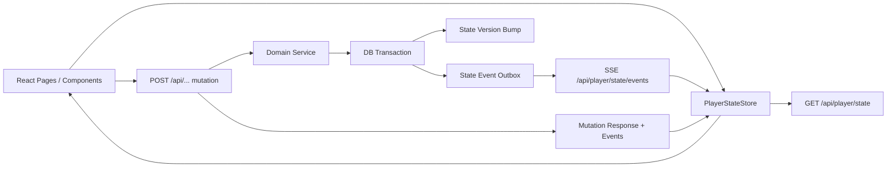

# 玩家状态同步系统完全重构方案

> Cleanup note, 2026-07-03: this document is migration history. The SSE plan
> below is obsolete after the WebSocket realtime migration. Current player-state
> realtime uses `GET /api/realtime` with the `player-state` channel, while
> `GET /api/player/state/events?after=` remains a JSON backfill endpoint for
> reconnect/version-gap recovery, not an SSE stream. See
> `docs/player-state-realtime-cleanup-audit.md`.

## 1. 文档状态

- 状态：方案稿
- 日期：2026-06-08
- 适用范围：玩家活跃角色解析、角色状态读写、背包/技能/修为/HP/MP/灵气/邮件/任务等玩家私有状态同步
- 目标架构：服务端权威、版本化、事件驱动、前端单一状态源
- 非目标：本方案不重做战斗数值、经济规则、丹药规则、灵气消耗表，也不把公共榜单/世界聊天纳入玩家私有状态源

## 2. 当前问题判断

### 2.1 `requireActiveCultivator` 的负担

当前 `requireActiveCultivator()` 在每个需要角色的接口中都会：

1. 解析 Better Auth session。
2. 查询 `wanjiedaoyou_cultivators`，按 `user_id + status = active` 找活跃角色。
3. 把完整 cultivator 行放入 Hono context。

这条查询本身已有 `cultivators_user_status_updated_idx(user_id, status, updated_at)` 支撑，单次查询并不一定慢。真正的问题不是“这一次 DB query 是否太重”，而是：

- 它出现在几乎所有角色接口上，QPS 增长后会变成固定税。
- 它把“身份解析”和“完整角色数据读取”耦合在一起。
- 很多接口只需要 `cultivatorId`，却被迫读取整行 JSONB 字段。
- 前端漏刷新时，开发者倾向于多调 `refreshCultivator()`，进一步放大后端固定税。

结论：`requireActiveCultivator` 应该降级为“轻量活跃角色引用解析”，完整角色快照应由专门的状态查询层负责。

### 2.2 前端数据旧的问题

当前前端存在多套缓存/刷新路径：

- `useCultivatorBundle` 有模块级 `cachedState` 和 inflight dedupe。
- `fetchJsonCached` 有 key + TTL 缓存。
- 具体页面有自己的局部 state 和刷新函数。
- 写操作后靠页面手动调用 `refreshCultivator()`、`refreshInventory()`、`refreshUnreadMailCount()` 或特定 hook 的 `reload()`。

这导致一个典型问题：数据库已经写成功，但前端某个视图仍持有旧快照。根因不是某一个接口没刷新，而是系统缺少统一的“状态变更协议”：

- 写接口没有统一返回“哪些状态变了”。
- 服务端没有统一递增状态版本。
- 前端没有统一判断“我的本地状态是否落后”。
- 多个页面各自决定何时刷新，长期必然遗漏。

结论：要从“调用方记得刷新”改成“服务端写入后产生事件，前端状态源按版本合并或拉取”。

## 3. 总体设计原则

### 3.1 服务端权威

所有会改变玩家状态的操作只在服务端结算。前端可以做 optimistic UI，但只能作为临时展示，最终必须以服务端版本为准。

服务端必须保证：

- 每次状态写入在事务内完成。
- 写入成功后递增对应状态版本。
- 写入成功后产生状态事件。
- API 响应携带状态版本或状态 patch。
- 数值边界由服务端校验，不能依赖前端。

### 3.2 版本化

每个玩家角色维护一个全局状态版本和多个领域版本。

全局版本用于判断“前端是否落后于服务端”。领域版本用于避免为 HP 变化刷新整个背包。

建议首版领域：

| 领域 | 覆盖数据 | 示例 |
|------|----------|------|
| `profile` | 名称、称号、境界、年龄、寿元、基础属性 | title、realm、age |
| `condition` | 当前 HP、MP、丹毒、持久状态 | hp、mp、statuses |
| `progress` | 修为、感悟、突破进度 | cultivation_progress |
| `currency` | 灵石、灵气等数字资源 | spirit_stones、qi |
| `inventory` | 材料、消耗品背包 | materials、consumables |
| `products` | creation-v2 产物与装备状态 | skill、artifact、gongfa、is_equipped |
| `mail` | 邮件列表和未读数 | unreadMailCount |
| `tasks` | 任务进度和可领取状态 | cultivator_tasks |

### 3.3 旧表清理决策

本方案不再考虑旧版 `wanjiedaoyou_artifacts`、`wanjiedaoyou_skills`、`wanjiedaoyou_cultivation_techniques` 和旧装备表 `wanjiedaoyou_equipped_items`。

当前游戏内法宝、神通、功法统一以 `wanjiedaoyou_creation_products` 为持久化来源，通过 `product_type = artifact | skill | gongfa` 区分类型。同步域只保留 `products`，不再设计独立的 `skills`、`cultivations` 或旧 `artifacts` 数据域。

落地要求：

- Drizzle schema 不再声明旧表。
- 新迁移直接 drop 旧表。
- API 不再提供旧表 forget 路由。
- 前端状态源只读取 `products` 或由 `products` 派生的装备、功法、神通视图。

### 3.4 事件驱动

任何写操作完成后都发布 `PlayerStateEvent`。事件有两个用途：

1. 给当前请求的 API response 返回给前端，立即更新 UI。
2. 给在线连接通过 SSE/WebSocket 推送，覆盖多标签页、后台结算、异步任务等场景。

首版建议用 SSE，而不是 WebSocket：

- 玩家状态是服务端到客户端的单向通知，SSE 足够。
- Hono/Bun 实现简单。
- 断线重连和 `Last-Event-ID` 语义适合事件流。
- 后续如果战斗实时化或聊天在线协议升级，再引入 WebSocket。

### 3.4 前端单一状态源

所有玩家私有状态只从一个 `PlayerStateStore` 读取。

页面不再保存自己的角色快照，只保存 UI 状态，例如 tab、筛选项、输入框、弹窗。页面发起写操作后，不再手动猜测该刷新哪个 hook，而是把服务端返回的事件交给 `PlayerStateStore.applyEvents()`。

## 4. 目标架构



核心链路：

1. 前端启动时调用 `GET /api/player/state` 获取权威快照。
2. 前端建立 `GET /api/player/state/events` SSE 连接。
3. 写操作由服务端事务结算。
4. 服务端在同一事务中递增版本并写状态事件。
5. 写接口响应携带事件，当前页面立即合并。
6. SSE 推送同一事件给其他标签页或其他已挂载组件。
7. 前端如果发现事件版本不连续，则调用增量同步或全量快照修复。

## 5. 后端设计

### 5.1 活跃角色解析重构

把现有 `requireActiveCultivator()` 拆成两层。

#### 5.1.1 `requireActiveCultivatorRef`

只解析身份引用，不读取完整角色模型。

```ts
export interface ActiveCultivatorRef {
  userId: string;
  cultivatorId: string;
  status: 'active';
}
```

职责：

- 解析 user session。
- 获取 active cultivator id。
- 写入 Hono context：`user`、`activeCultivatorRef`、`executor`。

实现策略：

1. 优先读 request context，避免同一请求重复解析。
2. 其次读 Redis 或进程内 LRU：`active-cultivator:user:{userId}`。
3. 未命中时查 DB：`user_id + status = active`。
4. 角色创建、转世、死亡、封禁时删除缓存。

缓存值只允许存轻量信息：

```json
{
  "userId": "user-id",
  "cultivatorId": "cultivator-id",
  "status": "active",
  "cachedAt": "2026-06-08T00:00:00.000Z"
}
```

TTL 建议：

- Redis TTL：5-15 分钟。
- 进程内 LRU TTL：30-60 秒。
- 写路径显式 invalidation 是主机制，TTL 只是兜底。

#### 5.1.2 `loadCultivatorForWrite`

只有真正需要当前角色完整数据或需要行锁的写路径才调用。

```ts
async function loadCultivatorForWrite(args: {
  tx: DbTransaction;
  userId: string;
  cultivatorId: string;
  lock?: boolean;
}): Promise<CultivatorRow>
```

写操作原则：

- 扣资源、发奖励、改装备、改 HP/MP 等必须在事务里读取和写入。
- 需要防并发覆盖的场景使用 `SELECT ... FOR UPDATE` 或 Drizzle 对应能力。
- 不允许在事务中重新 `getExecutor()` 打开新 executor。

### 5.2 状态版本表

新增表：`wanjiedaoyou_cultivator_state_versions`。

建议字段：

| 字段 | 类型 | 说明 |
|------|------|------|
| `cultivator_id` | uuid pk | 角色 ID |
| `global_version` | bigint not null default 0 | 全局状态版本 |
| `profile_version` | bigint not null default 0 | profile 领域版本 |
| `condition_version` | bigint not null default 0 | condition 领域版本 |
| `progress_version` | bigint not null default 0 | progress 领域版本 |
| `currency_version` | bigint not null default 0 | currency 领域版本 |
| `inventory_version` | bigint not null default 0 | inventory 领域版本 |
| `products_version` | bigint not null default 0 | products 领域版本 |
| `mail_version` | bigint not null default 0 | mail 领域版本 |
| `tasks_version` | bigint not null default 0 | tasks 领域版本 |
| `updated_at` | timestamp not null | 更新时间 |

为什么不用 `cultivators.updated_at`：

- 背包、邮件、任务、creation_products 很多数据不在 cultivators 主表。
- 单个 `updated_at` 不能表达哪个领域变了。
- 前端无法据此做精确刷新。

版本递增规则：

- 每个写事务至少递增 `global_version`。
- 只递增实际受影响的领域版本。
- 同一事务影响多个领域时一起递增，例如领取邮件奖励可能同时影响 `mail`、`inventory`、`currency`、`progress`。

### 5.3 状态事件表

新增表：`wanjiedaoyou_player_state_events`。

建议字段：

| 字段 | 类型 | 说明 |
|------|------|------|
| `id` | bigserial pk | 单调事件 ID |
| `cultivator_id` | uuid not null | 角色 ID |
| `user_id` | uuid not null | 用户 ID，便于查询与审计 |
| `global_version` | bigint not null | 事件后的全局版本 |
| `domain` | varchar not null | 领域 |
| `event_type` | varchar not null | 事件类型 |
| `patch` | jsonb not null default `{}` | 可合并 patch |
| `invalidates` | jsonb not null default `[]` | 需要重新拉取的领域 |
| `source` | varchar not null | 来源，例如 `retreat`、`dungeon`、`mail_claim` |
| `request_id` | varchar null | 请求追踪 |
| `created_at` | timestamp not null default now | 创建时间 |

保留策略：

- 热数据保留 3-7 天即可。
- 超期事件可由 cron 清理。
- 审计要求更高的经济流水应另走专门日志，不依赖此表长期保存。

事件示例：

```json
{
  "id": 10241,
  "cultivatorId": "c1",
  "globalVersion": 88,
  "domain": "condition",
  "eventType": "condition.changed",
  "patch": {
    "condition": {
      "resources": {
        "hp": { "current": 86 },
        "mp": { "current": 42 }
      }
    }
  },
  "invalidates": [],
  "source": "dungeon_battle"
}
```

### 5.4 状态写入协调器

新增服务：`PlayerStateMutationService`。

职责：

- 在事务中调用具体领域 service。
- 统一 bump 版本。
- 统一生成事件。
- 统一返回 mutation result。

建议接口：

```ts
type PlayerStateDomain =
  | 'profile'
  | 'condition'
  | 'progress'
  | 'currency'
  | 'inventory'
  | 'products'
  | 'mail'
  | 'tasks';

interface StateChangeDescriptor {
  domain: PlayerStateDomain;
  eventType: string;
  patch?: unknown;
  invalidates?: PlayerStateDomain[];
}

async function commitPlayerStateMutation<T>(args: {
  userId: string;
  cultivatorId: string;
  source: string;
  run: (tx: DbTransaction) => Promise<{
    result: T;
    changes: StateChangeDescriptor[];
  }>;
}): Promise<{
  result: T;
  state: {
    globalVersion: number;
    domainVersions: Record<PlayerStateDomain, number>;
    events: PlayerStateEvent[];
  };
}>
```

领域 service 不直接操作事件表，只返回 `changes`。这样可以避免每个业务模块各写一套版本逻辑。

### 5.5 API 响应协议

所有玩家状态相关写接口统一返回：

```ts
interface MutationResponse<T> {
  success: true;
  data: T;
  state: {
    cultivatorId: string;
    globalVersion: number;
    domainVersions: Partial<Record<PlayerStateDomain, number>>;
    events: PlayerStateEvent[];
  };
}
```

失败响应保持现有 `success: false, error`，但建议额外携带当前版本：

```ts
interface MutationFailure {
  success: false;
  error: string;
  state?: {
    cultivatorId: string;
    globalVersion: number;
  };
}
```

### 5.6 状态查询 API

新增统一快照接口：

```http
GET /api/player/state
```

查询参数：

| 参数 | 说明 |
|------|------|
| `domains` | 可选，逗号分隔，指定要返回的领域 |
| `sinceVersion` | 可选，前端当前全局版本 |

响应：

```ts
interface PlayerStateSnapshotResponse {
  success: true;
  data: {
    cultivatorId: string;
    globalVersion: number;
    domainVersions: Record<PlayerStateDomain, number>;
    snapshot: Partial<PlayerStateSnapshot>;
    serverTime: string;
  };
}
```

首版建议直接提供全量快照和按领域快照，不急着实现复杂 diff。事件表用于断线期间补事件；如果版本跨度过大或事件过期，就返回全量快照。

新增事件补偿接口：

```http
GET /api/player/state/events?after=88
```

语义：

- 如果 `after` 之后事件仍在保留期内，返回事件列表。
- 如果事件过期或不连续，返回 `requiresSnapshot: true`。

### 5.7 SSE 推送 API

```http
GET /api/player/state/stream
```

SSE 事件：

```text
event: player-state
id: 10241
data: {"globalVersion":88,"events":[...]}
```

实现建议：

- 每个连接只订阅当前用户的当前 active cultivator。
- Redis Pub/Sub 可作为多实例广播层。
- 单实例开发环境可以先用进程内 EventEmitter。
- 连接建立时前端传 `Last-Event-ID` 或 query `after`，服务端先补事件，再进入实时流。

断线策略：

- 前端自动重连。
- 重连后如果版本连续，继续应用事件。
- 如果不连续，调用 `/api/player/state` 全量修复。

### 5.8 Patch 与 Invalidate 的取舍

不是所有变化都适合传完整 patch。

建议规则：

- 小数字状态用 patch：HP、MP、灵石、灵气、未读邮件数、修为进度。
- 单个条目变化用 patch：新增材料、消耗一个丹药、装备状态切换。
- 大列表、分页列表、复杂排序用 invalidate：背包分页、拍卖列表、邮件列表。
- LLM 生成结果如果结构复杂，可返回业务结果，同时事件只 invalidates 对应领域。

示例：

```json
{
  "domain": "inventory",
  "eventType": "inventory.material.added",
  "patch": {
    "inventoryDelta": {
      "materials": [{ "id": "m1", "quantityDelta": 3 }]
    }
  },
  "invalidates": ["inventory"]
}
```

如果当前页面持有完整第一页背包，可以选择先乐观合并；如果排序/分页受影响，则按 invalidate 拉取最新页。

## 6. 前端设计

### 6.1 `PlayerStateStore`

新增统一状态源，替代 `useCultivatorBundle` 的模块级缓存和页面私有角色状态。

推荐技术选型：

- 保守方案：React Context + `useSyncExternalStore` 自建 store。
- 可选方案：引入 TanStack Query 只管理 server cache，但玩家状态合并仍由自建 store 管。

本项目当前没有全局 store 目录，引入大型状态库会增加迁移成本。建议首版使用 `useSyncExternalStore`。

Store 状态结构：

```ts
interface PlayerStateStoreData {
  cultivatorId: string | null;
  globalVersion: number;
  domainVersions: Record<PlayerStateDomain, number>;
  snapshot: PlayerStateSnapshot;
  loading: boolean;
  staleDomains: Set<PlayerStateDomain>;
  lastSyncAt: number | null;
  error: string | null;
}
```

Store 暴露接口：

```ts
interface PlayerStateActions {
  initialize(): Promise<void>;
  refresh(domains?: PlayerStateDomain[]): Promise<void>;
  applyEvents(events: PlayerStateEvent[]): void;
  markStale(domains: PlayerStateDomain[]): void;
  mutate<T>(request: Promise<MutationResponse<T>>): Promise<T>;
}
```

页面使用方式：

```ts
const hp = usePlayerState((state) => state.snapshot.condition.resources.hp);
const materials = usePlayerState((state) => state.snapshot.inventory.materials);
const mutate = usePlayerStateActions().mutate;
```

### 6.2 Selector 订阅

组件不应订阅整个玩家状态，否则任何状态变化都会导致全局重渲染。

必须提供 selector：

```ts
function usePlayerState<T>(
  selector: (state: PlayerStateStoreData) => T,
  isEqual?: (a: T, b: T) => boolean,
): T
```

常用 selector：

- `useCultivatorProfile()`
- `useCultivatorCondition()`
- `useCultivatorCurrency()`
- `useInventorySlice(type)`
- `useProducts(type)`
- `useUnreadMailCount()`
- `useTaskState()`

### 6.3 Mutation Client

前端统一封装 `playerStateFetch`。

职责：

- 发起请求。
- 解析 response。
- 如果 response 携带 `state.events`，立即 `applyEvents`。
- 如果 response 携带 `invalidates`，标记领域 stale 并按策略刷新。
- 如果 response 没有 state 元信息，在开发环境报警，推动迁移。

示例：

```ts
async function mutatePlayerState<T>(
  input: RequestInfo,
  init?: RequestInit,
): Promise<T> {
  const response = await fetch(input, init);
  const json = await response.json();

  if (!response.ok || !json.success) {
    throw new Error(json.error || `HTTP ${response.status}`);
  }

  if (json.state?.events) {
    playerStateStore.applyEvents(json.state.events);
  }

  return json.data as T;
}
```

### 6.4 废弃旧刷新模式

迁移完成后禁止以下模式：

- 页面直接维护完整 cultivator 副本。
- 页面写操作后手动调用多个 refresh 函数。
- 使用 `fetchJsonCached` 缓存玩家私有高实时状态。
- 页面自己判断背包、修为、HP、MP 是否需要刷新。

允许保留：

- 公共只读列表缓存，例如排行榜、市场公共列表。
- 页面 UI 状态，例如筛选、tab、分页页码。
- 特定分页数据，但必须由 `PlayerStateStore` 的 domain version 驱动失效。

## 7. 数据一致性策略

### 7.1 写操作事务边界

所有玩家状态写操作必须遵循：

```text
begin transaction
  load active cultivator ref / row
  validate resources and ownership
  apply domain mutation
  bump state versions
  insert player state events
commit
publish events after commit
return response with events
```

`publish events after commit` 很重要。事务失败不能推送事件。

### 7.2 并发控制

按风险分级。

必须串行的操作：

- 扣灵石、扣灵气、扣材料、扣消耗品。
- 装备/卸装备。
- HP/MP 战斗回写。
- 邮件领取奖励。
- 任务领奖。

建议使用：

- DB transaction。
- 关键行 `FOR UPDATE`。
- 幂等键 `actionInstanceId`，尤其是 LLM、战斗、副本、支付/补偿类操作。

可并发读的操作：

- 查看角色快照。
- 查看公共榜单。
- 查看历史记录。
- 查看市场公共列表。

### 7.3 事件顺序

前端只接受比当前 `globalVersion` 更新的事件。

规则：

- `event.globalVersion <= local.globalVersion`：丢弃。
- `event.globalVersion === local.globalVersion + 1`：直接应用。
- `event.globalVersion > local.globalVersion + 1`：发生缺口，调用事件补偿接口。
- 补偿失败或过期：全量刷新。

同一个 response 中多个事件可以共享同一个 `globalVersion`，也可以递增多个版本。为了降低复杂度，首版建议同一事务生成一个全局版本，里面包含多个 domain events。

## 8. 与现有系统的映射

### 8.1 替代 `useCultivatorBundle`

当前能力映射：

| 当前能力 | 新能力 |
|----------|--------|
| `cultivator` | `useCultivatorProfile()` + 领域 selector |
| `display` | `useCultivatorDisplay()`，由 snapshot 或前端纯函数派生 |
| `inventory` | `useInventorySlice(type)` |
| `equipped` | `useEquippedProducts()` |
| `refresh` | `playerState.refresh()` |
| `refreshCultivator` | 废弃，由 mutation events 自动驱动 |
| `refreshInventory` | `playerState.refresh(['inventory'])`，仅页面进入或补偿时用 |
| `refreshUnreadMailCount` | 废弃，由 `mail` event patch |

### 8.2 替代 `fetchJsonCached`

玩家私有状态不再使用 TTL cache。

迁移策略：

- `fetchJsonCached` 保留给公共只读请求。
- 新增开发期 guard：如果 key 以 `cultivator:`、`player:` 开头，在 dev console warning。
- 高实时领域全部迁移到 `PlayerStateStore`。

### 8.3 兼容旧 API

重构不要求一次改完所有 API。过渡期可以：

- 新接口返回标准 `state`。
- 旧接口暂时不返回 `state`，但前端 mutation client 在开发环境报警。
- 每迁移一个玩法，就把该玩法的手动 refresh 删除。

## 9. 实施计划

### 阶段 0：基线与观测

目标：先知道问题有多大，避免盲改。

后端：

- 给 `requireActiveCultivator` 增加 request-level timing 日志或 metrics。
- 统计 `/api/player/active`、`/api/cultivator/inventory`、`/api/cultivator/qi` 等高频接口调用量。
- 统计每个页面一次操作后触发的请求数。

前端：

- 开发环境记录玩家状态更新时间、来源、版本。
- 记录 mutation 后是否调用了手动 refresh。

验收：

- 能回答：一次副本结算、一场战斗、一封邮件领取分别触发多少请求。
- 能定位：哪些页面最多手动刷新。

### 阶段 1：轻量活跃角色引用

目标：降低每个角色接口的固定 DB 税。

任务：

- 新增 `ActiveCultivatorRef` 类型。
- 新增 `requireActiveCultivatorRef()` middleware。
- 新增 active cultivator cache repository，优先 Redis，开发环境允许进程内 fallback。
- 角色创建、转世、死亡时 invalidation。
- 把只需要 `cultivatorId` 的读接口迁移到 ref middleware。

优先迁移接口：

- 背包分页读取。
- 邮件未读数。
- 灵气状态读取。
- 任务列表读取。
- 产品列表读取。

暂不迁移：

- 需要完整角色行参与计算的复杂写接口。
- 仍未梳理事务边界的老接口。

验收：

- 高频读接口不再读取完整 cultivator 行。
- 未命中缓存时仍能正确 fallback DB。
- 转世/死亡后不会拿到旧 active id。

### 阶段 2：状态版本表与事件表

目标：建立统一版本事实。

任务：

- 新增 Drizzle schema：`cultivator_state_versions`。
- 新增 Drizzle schema：`player_state_events`。
- 为已有 active cultivator 初始化版本行。
- 新增 repository：
  - `getStateVersion(cultivatorId)`
  - `bumpStateVersions(tx, domains)`
  - `insertStateEvents(tx, events)`
  - `listStateEventsAfter(cultivatorId, version)`
- 新增测试覆盖版本递增和事件顺序。

验收：

- 任意测试事务可以递增一个或多个领域版本。
- 同一事务生成的事件能按 `globalVersion` 查询。
- 事件表可清理，不影响当前快照读取。

### 阶段 3：统一玩家状态快照 API

目标：前端有一个权威入口。

任务：

- 新增 `GET /api/player/state`。
- 定义 `PlayerStateSnapshot` contract。
- 首版 snapshot 聚合：
  - profile from cultivators。
  - condition from cultivators.condition。
  - progress from cultivators.cultivation_progress。
  - currency from cultivators.spirit_stones / qi。
  - inventory from materials / consumables 或分页摘要。
  - products from creation_products，包含 v2 artifact / skill / gongfa 与装备状态。
  - mail unread count。
  - task summary。
- 支持 `domains` 查询参数。
- 返回 `globalVersion` 和所有 domain versions。

验收：

- 新接口能替代 `/api/player/active` 的角色主状态用途。
- 前端刷新一次即可拿到 HUD 所需 HP、MP、修为、感悟、灵石、灵气、未读邮件数。
- 大列表字段不强制全量返回，可返回摘要和分页游标。

### 阶段 4：前端 `PlayerStateStore`

目标：建立单一状态源，但先不改所有页面。

任务：

- 新增 `src/react-app/lib/player-state/`。
- 实现 external store、selector hook、actions。
- 在 `PlayerProvider` 内初始化 `PlayerStateStore`。
- 兼容导出旧 `useCultivator()` 返回值，内部从新 store 读取。
- 接入 `GET /api/player/state` 初始快照。

验收：

- HUD、角色页、背包页至少可以从新 store 读数据。
- 页面切换不再触发重复 `/api/player/active` 风暴。
- 旧页面仍可运行。

### 阶段 5：写接口标准化

目标：让写操作自动驱动前端更新。

优先级按玩家感知强弱排序：

1. HP/MP 相关：副本战斗、塔战斗、灵泉恢复、丹药恢复。
2. 资源相关：灵气、灵石、修为、感悟。
3. 背包相关：领取邮件、市场购买、回收、炼丹、消耗品使用。
4. 产品相关：装备、遗忘、创造功法/神通/法宝。
5. 任务相关：任务进度、领奖。

每个接口迁移步骤：

1. 找到现有 service 写入点。
2. 把写入包进 `commitPlayerStateMutation`。
3. 返回 `state.events`。
4. 前端改用 `mutatePlayerState`。
5. 删除页面手动 refresh。
6. 加测试：断言 response 含正确事件和版本。

验收：

- 完成一个写接口后，前端不手动 refresh 也能更新对应 UI。
- 多标签页打开时，一个标签操作，另一个标签能通过 SSE 更新或在重连后修复。

### 阶段 6：SSE 状态流

目标：解决多标签、后台任务、长流程结算后的状态同步。

任务：

- 新增 `/api/player/state/stream`。
- 单实例先用进程内 broadcaster。
- 如果生产是多实例，接入 Redis Pub/Sub。
- 写事务 commit 后 publish event。
- 前端 store 建立 SSE，处理重连和版本缺口。

验收：

- 同账号两个标签页，一个标签领取邮件，另一个标签未读数和背包自动更新。
- 断开 SSE 后重连，能通过 `after` 补事件。
- 事件缺失时能全量刷新。

### 阶段 7：删除旧机制

目标：降低后续开发成本。

任务：

- 删除 `useCultivatorBundle` 模块级缓存，或缩小为新 store 的兼容 facade。
- 禁止玩家私有状态使用 `fetchJsonCached` TTL。
- 删除页面级手动 refresh 链。
- 给 lint 或开发期 runtime warning 增加规则：
  - 写接口 response 缺少 `state` 时警告。
  - 玩家私有状态请求使用 TTL cache 时警告。

验收：

- 新增玩法只需要声明它影响哪些 domain。
- 前端页面不再需要知道“操作后该刷新哪几个接口”。
- 角色高实时数据没有可见漏刷新。

## 10. 测试计划

### 10.1 后端测试

必须覆盖：

- active cultivator ref cache 命中、未命中、失效。
- state version 单领域递增。
- state version 多领域递增。
- mutation 成功后事件落表。
- mutation 失败后不递增版本、不写事件。
- 并发扣资源不会超扣。
- `GET /api/player/state` 返回版本和 snapshot。
- `GET /api/player/state/events?after=` 连续、缺口、过期三种情况。

### 10.2 前端测试

必须覆盖：

- `PlayerStateStore` 初始化快照。
- 连续事件按版本应用。
- 旧事件被丢弃。
- 版本缺口触发补偿。
- invalidate domain 后触发对应刷新。
- selector 只在选中数据变化时更新。
- mutation response events 能立即更新 store。

### 10.3 集成验收场景

至少覆盖：

| 场景 | 期望 |
|------|------|
| 灵泉恢复 HP/MP | HUD 和角色页立即更新 |
| 服用丹药 | HP/MP、消耗品数量、丹毒立即更新 |
| 领取邮件奖励 | 未读数、邮件状态、背包/灵石立即更新 |
| 副本战斗结束 | HP/MP、奖励、任务进度同步 |
| 炼丹成功 | 材料减少、丹药增加、灵气减少 |
| 装备法宝 | 装备栏、战力展示、产品列表同步 |
| 两个标签页同时在线 | 一个标签操作，另一个标签自动更新 |

## 11. 性能目标

首版可量化目标：

- 页面进入游戏主界面：玩家私有状态首屏请求不超过 2 个。
- 普通读接口：不因 middleware 读取完整 cultivator 行。
- 写操作成功后：前端不再额外触发全量 `/api/player/active`，除非事件缺口。
- HUD 高实时字段更新延迟：
  - 当前标签：随 mutation response，目标小于 100ms。
  - 其他标签：随 SSE，目标小于 1s。
- DB 查询：
  - active cultivator ref 命中缓存时 0 次业务 DB 查询。
  - 状态快照按领域读取，避免每次携带大列表。

## 12. 风险与处理

### 12.1 事件 patch 设计过复杂

处理：首版只对小状态做 patch，大列表统一 invalidate + refetch。

### 12.2 迁移周期中旧页面与新 store 并存

处理：新 store 先兼容旧 `useCultivator()` 形状，再逐页替换。迁移期间不要求一次删除所有旧 hook。

### 12.3 多实例推送一致性

处理：单实例先用进程内 broadcaster，生产多实例必须接 Redis Pub/Sub。事件真实来源仍是 DB event table，Pub/Sub 只负责实时通知。

### 12.4 事件丢失

处理：前端按版本检测缺口，缺口时走事件补偿，补偿失败全量刷新。

### 12.5 事务里事件写入影响性能

处理：事件表只保存轻量 patch 和 invalidates，不保存完整快照。经济审计另走专门流水表。

## 13. 后续开发规范

新增或修改玩家状态写接口时必须回答四个问题：

1. 这个操作改变了哪些 state domain？
2. 是否需要事务和行锁？
3. 能否返回小 patch，还是必须 invalidate？
4. 前端是否只通过 `PlayerStateStore` 消费结果？

推荐代码模板：

```ts
const response = await commitPlayerStateMutation({
  userId: ref.userId,
  cultivatorId: ref.cultivatorId,
  source: 'mail_claim',
  run: async (tx) => {
    const result = await MailService.claimReward({
      tx,
      cultivatorId: ref.cultivatorId,
      mailId,
    });

    return {
      result,
      changes: [
        {
          domain: 'mail',
          eventType: 'mail.claimed',
          patch: { unreadMailCount: result.unreadMailCount },
        },
        {
          domain: 'inventory',
          eventType: 'inventory.changed',
          invalidates: ['inventory'],
        },
      ],
    };
  },
});
```

前端页面模板：

```ts
const unreadMailCount = usePlayerState((s) => s.snapshot.mail.unreadCount);
const mutate = usePlayerStateActions().mutate;

async function claimMail(mailId: string) {
  await mutate(
    fetch('/api/cultivator/mail/claim', {
      method: 'POST',
      body: JSON.stringify({ mailId }),
    }),
  );
}
```

页面不再调用 `refreshInventory()` 或 `refreshUnreadMailCount()`。

## 14. 推荐落地顺序

最稳妥的顺序：

1. 先做 `requireActiveCultivatorRef`，立刻降低读接口固定成本。
2. 再做版本表和事件表，不影响现有 UI。
3. 再做 `/api/player/state`，让前端有权威快照。
4. 再做 `PlayerStateStore`，兼容旧 hook。
5. 先迁移 HP/MP、灵气、邮件、背包这几个玩家最敏感的状态。
6. 最后接 SSE 和多标签页同步。
7. 等主要写接口都返回 `state.events` 后，再删除旧缓存/刷新机制。

不要第一步就把所有页面改成新 store。正确方式是先让后端状态协议稳定，再逐个玩法迁移写路径。
