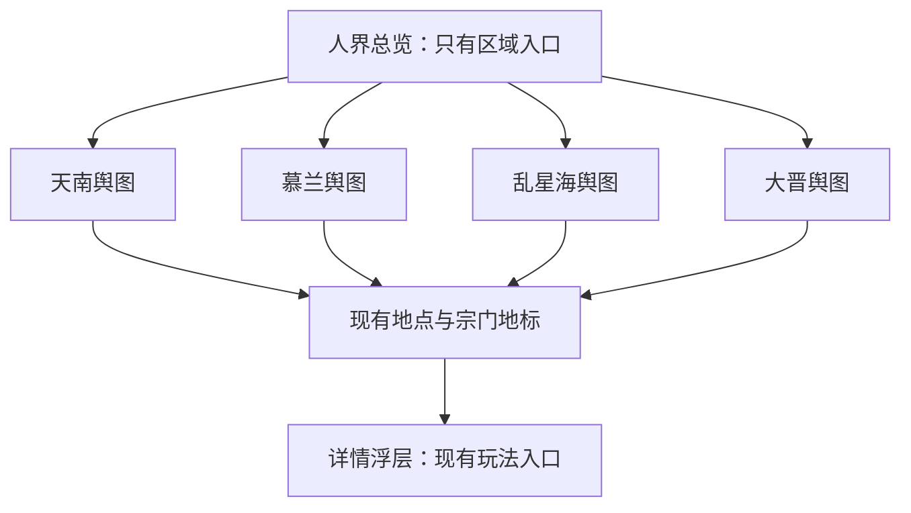

# 双层水墨地图与 Phaser 4 改版方案

日期：2026-09-19。状态：总览与天南的 Phaser 技术样板已接入；完整四区版本仍按后续阶段推进。

素材进度：世界总览与天南区域底画已接入 `/game/map-v2`，见[素材交付清单](game-map-art.md)。天南采用独立区域构图。美术规范统一维护在[国画水墨地图 skill](../.agents/skills/daoyou-map-art/SKILL.md)。

## 1. 目标与假设

保留原 DOM 地图，新增 Phaser 4 地图供玩家主动体验。新地图由人界总览、区域舆图两层组成；总览仅提供区域入口，具体地点放在区域舆图。节点详情是交互浮层，不是第三层地图。

本方案将“节点暂时不变”解释为保留节点 ID、名称、类型、归属关系、玩法配置及原有连接数据，只为新版配置新坐标。首期不新增旅行时间、移动消耗、角色地理位置、道路通行限制或探索解锁规则。浏览区域不产生角色状态变更。

两张参考图提供地理构成和层次表达依据，其中的标签、字幕、水印不构成实施指令。图一用于大陆、海域、草原的相对位置；图二用于区域山川、聚落和势力腹地的组织方式。新素材重新创作，不直接描摹参考图的底画、旗标或纹理。

## 2. 当前代码事实与可行性

- `package.json`、本地 `node_modules/phaser/package.json` 均已有 Phaser 4.2.1；本次查询 npm latest 也为 4.2.1，无需为地图先升级引擎。
- 宗门清扫与采掘已有 Phaser runtime，可参考 React 挂载、回调、销毁及错误反馈的接入方式。地图应独立实现相机与输入，不直接复制小游戏固定画幅、横屏或摇杆方案。
- 现地图位于 `src/react-app/routes/game/map/route.tsx`，使用 `react-zoom-pan-pinch`、DOM 节点和 SVG 连线，地图尺寸 3056×2143，初始视角含固定偏移，边界限制关闭。
- 地图数据来自 `src/shared/data/map.json`，经 `src/shared/lib/game/mapSystem.ts` 读取。共有 20 个主节点、41 个附属节点、5 个宗门地标，共 66 个可定位对象。
- `/game/map` 使用沉浸式 `GameMapLayout`，不属于普通 `GameViewportLayout` 正文；应保留地图沉浸壳，不套入主流程卡片页。
- `nodeId` 支持节点直达，`intent=market|dungeon|sect` 保留不同选址语义。野外、历练、坊市和宗门依赖稳定 ID，需要继续共用现有动作规则。
- 当前地图连接的可见消费者主要是地图连线，不能把示意连线直接升级成服务端旅行规则。部分跨区连接是单向配置，不应自动补反向连接。

技术可行性高，业务迁移风险可控；主要工作量是地理构图、美术生产、手机交互、资源加载和新旧入口衔接。66 个对象本身不足以证明 DOM 就是性能瓶颈。Phaser 有利于统一相机、命中、分层与动效，但是否更流畅、是否更省电必须实测。

## 3. 地图层级与地理设计

按现有数据划分首期区域，附属节点和宗门地标随其主节点归属：

| 二级地图 | 主节点 | 附属节点 | 宗门地标 | 合计 | 构图建议 |
| --- | ---: | ---: | ---: | ---: | --- |
| 天南 | 7 | 15 | 1 | 23 | 东南陆地，山岭、河谷、国境与聚落相间；作为首张样板 |
| 慕兰 | 1 | 3 | 0 | 4 | 天南以北的草原过渡地带；采用更紧凑画幅，不为填满画面新增节点 |
| 乱星海 | 4 | 7 | 0 | 11 | 总览中位于大陆西南侧海域，二级图突出岛链、内外海与航线 |
| 大晋 | 8 | 16 | 4 | 28 | 总览北部的大块陆地，二级图由北地雪山过渡至中部腹地、南疆险境 |
| 总计 | 20 | 41 | 5 | 66 | 全量覆盖现有对象 |

总览保留参考图中“北部大晋、东侧陆带、东南天南、西南岛海”的主要空间关系；海域用留白、淡青灰与少量水纹，帮助辨认陆海而不是铺满装饰。

天沙大陆、天澜等参考图地名暂作为非交互地理背景候选，不新增空白可点击区域。图二的正道、魔道等势力分区可提供视觉参考，但现有地图没有完整势力疆界权威数据，本期不据此新增阵营控制、通行或收益规则。需要显示其名称时，在构图阶段单独确定。

大晋现有高阶裂渊、冥海、天关、雷狱等地点继续归入大晋，可沿偏远山地与边缘险境布局。先通过局部雾气和地貌表达距离感，无需为它们增加第三层地图。

### 两层各自显示什么

- 总览：大陆与海域、山系大势、四个区域名及入口。区域轮廓与题签都可点击；不画具体地点、宗门节点或节点关系网。
- 区域远景：主要山川、主节点、宗门地标；重点保证找得到地方。
- 区域近景：逐步显示附属节点、小路和次级标签。选中节点、直达目标、与当前筛选匹配的目标不因缩放被隐藏。
- 节点选中：轻量朱砂印记，弹出已有详情和动作。道路按需突出相关连接，不把整个图变成线网。
- 跨区域连接：用通往目标区域的边缘题签或航路提示表达，点击仅切换舆图；不新增可存档节点，不暗示消耗或瞬移。

## 4. 交互方案

首次从新版普通入口打开人界总览。返回地图时恢复上次浏览区域与镜头；有 `nodeId` 的显式链接优先定位该节点所属区域。镜头状态不是角色当前位置，不显示虚构的“你在这里”。

- 桌面：拖拽平移，滚轮围绕指针缩放，点击区域进入二级图，点击节点打开详情。
- 手机：单指拖动、双指围绕手势中心缩放；拖动和缩放结束不能误触节点。主要命中区按屏幕像素保持至少约 44px，密集处由标签避让和分级显示解决。
- 层级切换必须由明确点击触发，首期不让滚轮或捏合自动跨层，以免意外返回。
- 提供固定的“人界 / 当前区域”、缩放、回到全图、查找地点与版本切换入口。移动端控件避让安全区，详情打开时屏蔽画布输入。
- 地点查找按原有名称工作，可跨区域定位；同一列表也提供键盘和读屏可操作的入口，避免 Canvas 成为唯一入口。
- 相机在每张图的有效边界内移动；总览适配全图，区域按可用视口构图。详情面板占用空间应计入定位，不能把选中节点移到抽屉下面。
- 层级过渡用约 250–400ms 的轻微拉近、淡入淡出，支持减少动态效果；不以复杂墨液 shader 作为首期依赖。

“返回人界”与“关闭地图”是不同操作：前者只切换层级；后者沿用现有关闭地图语义。浏览器前进、后退需要正确恢复层级和选择，不为每一次拖动写历史记录。

## 5. 新旧并存与技术结构

### 路由和迁移

- 旧版保持 `/game/map`；新增 `/game/map-v2`，区域通过 `region=tiannan|mulan|luanxinghai|dajin` 表达。
- 新版继续接收 `nodeId`、`intent`。`nodeId` 与 `region` 冲突时，以有效节点归属为准；无效参数回到可用地图并给轻量提示，不出现空白。
- 双向版本切换保留当前 `nodeId` 和 `intent`。没有选中节点时，旧版切入新版默认进入总览；区域中心不是旧节点，不编造节点 ID 来传递。
- 第一阶段全局旧入口继续有效，并提供明确“新版地图”入口。后续再按玩家主动选择记忆偏好，逐步将导航和任务入口接入共同的地图目标解析，不强制跳转所有旧链接。
- 明确的新旧版本切换优先于偏好。运行失败时提供“使用旧版地图”，避免新旧路由自动跳转循环。
- 需要检查野外、历练、坊市、宗门进入后再返回地图的链路，保证新版本来源不会因现有硬编码 `/game/map` 丢失。回程只携带可校验的地图版本、区域和节点上下文，不接受任意外部返回地址。
- 新路由必须同步 `router.tsx`、scene registry、`gameShellRegistry.ts`、标题解析及 `resolveSpecialSceneDescriptor`；不能只新增 route 文件。

### React 与 Phaser 分工

React 负责沉浸壳、URL、玩家资源、搜索、详情抽屉与玩法跳转。Phaser 负责地形、节点图形、标签、命中、相机、裁剪与轻量动效。复用现有 `MapNodeDetail`、`SectLandmarkDetail`；将原路由私有的 `mapActions.ts` 移至共享地图 feature 后由两版共用，避免两份动作逻辑逐渐分叉。

一个地图页面生命周期只创建一个 `Phaser.Game`。当前样板使用一个可切换视图的 Scene，共用相机与输入逻辑；总览和区域分别加载独立底画与标记。后续只有生命周期出现实际差异时再拆 Scene。React 只在选区、选点等离散事件更新状态，不逐帧同步相机坐标。

引擎仅在新版路由中按需加载；使用已有 Phaser 版本与熟悉 API，不假设 WebGPU 或套用旧 Phaser 3 自定义 pipeline。退出页面销毁 Game、监听与纹理资源，处理 React 开发模式重复挂载、resize、后台暂停和 WebGL 上下文恢复失败。

### 数据分层

| 数据 | 首期处理 |
| --- | --- |
| `src/shared/data/map.json` | 继续作为节点玩法事实来源，保留旧 x/y，原版外观不受影响 |
| 新的区域展示配置 | 保存 region ID、显示名、总览锚点/轮廓、资源键、区域画幅及默认镜头 |
| 新的节点展示配置 | 以现有地点 ID 为键，保存区域内归一化坐标、标签偏移和显示优先级 |
| 图像与标记资源 | 按世界/区域组织底图；可复用 UI 图标继续走集中图标注册 |
| 浏览状态 | 本地记忆最后区域和镜头；显式 URL 参数优先，不新增角色持久化字段 |

`displayRegionId` 是展示维度，不修改节点原有业务 `region`。附属节点、宗门的区域按 parent_id 推导并校验。美术换尺寸后归一化坐标仍可沿用；实际地貌重新构图时必须重新核对锚点。

首期预计无需数据库迁移、额外地图 API 或新服务端玩法。后端仍通过原入口和原规则执行资格、成本、战斗与资源校验。

Canvas 内可用程序几何绘制简单交互标记；需要复用现有图标时，从集中 registry 增加最小纹理适配入口，不能让业务配置自行解析 `icon:` 或复制路径表。React UI 仍统一使用 `GameIcon`。山川底图属于场景素材，不伪装成 UI 图标。

## 6. 美术生产方案

笔墨、彩墨、地域特色、层级构图与美术验收统一遵循[国画水墨地图 skill](../.agents/skills/daoyou-map-art/SKILL.md)，本文不维护另一套风格规则。已交付素材见[地图素材清单](game-map-art.md)。

后续先以总览和天南完成 Phaser 接入样板，按现有节点事实重新锚定落点，在桌面与窄屏检查标签、命中区、缩放和遮挡。区域图独立构图，不能用总览坐标直接换算内部地点；地理关系与河流连贯性仍需检查。

首期规划为一张世界底画与四张区域底画，额外地标纹理或效果层按实际需要制作。样板通过后再制作其余区域，按各区设定重新构思。文字和交互状态由运行时独立绘制，节点标签保持小字号可读性。

## 7. 加载、性能与风险

- 首次仅加载总览及基础 UI，进入区域再加载对应资源；不一次常驻全部高清区域。
- 初期优先较低分辨率预览与单张区域纹理。在样板测试证明存在纹理上限或内存压力后，再对大图分块；不要先建设通用无限地图/瓦片编辑器。
- 4096×4096 RGBA 纹理单层约 64 MiB，8192×8192 约 256 MiB，尚未计算 mipmap、解码副本、帧缓冲等。WebP 文件压缩率不能代表显存开销。
- 实测设备最大纹理尺寸，限制设备像素比和同时常驻区域数量。使用透明图层时检查边缘、接缝和混合模式；减少全屏滤镜与持续粒子。
- 只在必要时重建标签纹理；实现标签优先级、避让和缩放分级，避免把 DOM 节点拥挤原样搬入 Canvas。
- 字体就绪后生成中文标签，避免异步字体导致字形错位；持续动效在页面隐藏时停止，减少动态模式保持静态。
- 加载失败显示重试和旧版入口；快速切区时旧请求完成不能覆盖新选择。限制缓存并在退出时释放，不能只隐藏旧 Scene。

以下是建议验收目标，尚非已测结果：

| 维度 | 建议目标/方法 |
| --- | --- |
| 正确性 | 66 个对象全覆盖且唯一归属，玩法 ID 和动作与旧版一致 |
| 手机操作 | 360px 竖屏可找到区域和地点；捏合、拖动结束无误选，详情不遮住目标 |
| 帧率 | 在约定中端真机上拖拽目标 55–60 FPS，低性能档至少稳定 30 FPS；同时记录帧时间与长任务 |
| 首次加载 | 普通网络下尽快呈现可交互低清总览；先以冷缓存 Fast 4G、约定设备 3 秒为样板目标，按资源实测校准 |
| 资源 | DevTools 检查切换区域和退出后的资源释放，连续进入/退出十次无持续增长 |
| 恢复 | 刷新、前进后退、切换新旧版、进入玩法再返回，保留正确区域、节点和选址 intent |
| 回退 | 素材或渲染失败可回到同一节点/用途的旧版地图 |

旧版需在同一设备、网络、节点密度下录制基线再比较。浏览器模拟手机视口不能替代 iOS Safari、Android 真机的 GPU、内存与触摸验证。

## 8. 实施阶段与退出条件

下列是单开发者结合美术工具的粗估投入，不是交付承诺；美术返工与真机适配可能延长工期。

| 阶段 | 交付 | 验收后进入下一阶段 | 粗估工作日 |
| --- | --- | --- | ---: |
| P0 地理和交互定稿 | 四区域归属表、世界/天南灰稿、路由与回程约定、旧版基线 | 66 个对象归属完整，世界方位和天南落点可评审 | 1–2 |
| P1 技术样板 | 独立新版路由、总览到天南、平移缩放、节点详情、旧版切换；可用占位地形 | 手机能操作，现有玩法能进入并返回，镜头和生命周期可靠 | 2–3 |
| P2 美术样板 | 正式总览与天南底画、标签层级、命中区与过渡动效 | 在实际页面验收美术及性能，确定其他区域制作规范 | 3–5 |
| P3 全区域接入 | 慕兰、乱星海、大晋底画与全部节点锚点、按区加载、地点查找 | 全部对象和入口一致，跨区直达与返回正确 | 4–6 |
| P4 并存体验版 | 明确新版入口、版本偏好与回程接入、失败回退、桌面/真机验证 | 静态检查通过，旧版无回归，关键设备无阻断问题 | 2–4 |

合计约 12–20 个工作日。P1 验证技术与交互，P2 是首个可评审的完整体验切片；在 P2 验收前不要批量制作剩余区域美术。首次公开体验应在四区覆盖之后，避免玩家切入新版后找不到已有内容。

旧版退出不设为本期必须完成项。后续依据玩家反馈、稳定性和真机表现决定新版默认入口，保留明确旧版入口直到另行确定退役范围。

## 9. 验证安排与原始方案编写范围

实施时，纯共享区域归属、ID 覆盖、坐标范围等确定性逻辑允许在 `src/shared` 添加测试；不在 React、服务端或 scripts 下增加测试框架。需运行 `bun run lint`、相关 `bun run test`、`bun run build`，并遵循 `docs/testing.md` 在本地验证四种 intent、节点直达、版本切换、返回链路、缩放与资源释放。

本次仅新增本方案文档。已执行 `git status --short`、`rg` 定位与代码读取、Python 只读地图统计，以及 npm registry 版本查询；没有安装依赖、修改业务代码、生成正式美术、启动应用或修改数据库。文档检查采用 `git diff --check` 与内容审阅。未运行 lint、单元测试、构建或浏览器性能测试，因为本次没有运行时代码变更；本文不构成性能通过或兼容性通过报告。

## 10. P1 技术样板接入记录（2026-09-19）

已实现：

- `/game/map-v2` 与原版并存，沉浸壳、场景注册、标题上下文与关闭行为已接通。
- 世界总览只显示区域入口；天南使用独立底画并重新锚定现有 23 个地点。慕兰、乱星海、大晋显示明确的旧版入口，保留已有地点和用途。
- 鼠标拖动、滚轮围绕指针缩放、缩放按钮、全图复位、相机边界与视口变化适配。双指缩放已实现，尚待真机验证。
- 节点标签按缩放和优先级显示，命中区与字形保持屏幕尺寸；标签避让，详情打开时阻止画布响应。名称未烘焙进底画。
- React 搜索列表覆盖现有全部地点，支持键盘操作与跨区域定位。详情、玩法动作与旧版共用。
- 两版详情和页面均有版本切换入口，保留当前节点与 intent。坊市切层保存来源；野外、历练重选、访宗可直接返回新版。来源只随当前玩法历史项传递，不是跨整个游戏的永久版本偏好。
- 显式节点归属优先于冲突 region；无效参数显示可用地图和提示。新版“关闭地图”固定回洞府，避免把内部区域浏览历史当成外部关闭目标。
- 引擎按路由动态加载，背景按访问层级加载，两个纹理最多约 12 MiB 原始 RGBA 数据（不含解码副本、标签和帧缓冲）。退出销毁 Game 与监听，仅保留当前页会话中的两个镜头快照；刷新不保证保留镜头。

验证使用专用本地环境 `127.0.0.1:5174`，复用本地测试账号，未启动战斗、购买物品或调整角色数据。通过代码检查、`bun run lint`、`bun run build`，以及 `bun run test src/shared/lib/game/mapAtlas.test.ts src/shared/lib/game/mapSystem.test.ts`（15 项通过）。构建保留现有大包体及不生效动态导入的提示，无构建错误。

浏览器已核对 1366×900 桌面和 360×800 窄屏、画布区域点击、拖动不误选、节点搜索、四种 intent、冲突/无效参数、新旧版保留节点切换、其他区域回退、坊市/野外/历练/访宗入口与直接回程、前进后退层级恢复。检查时画布在新版为一个、退出旧版后为零，控制台未见地图错误。

未完成的后续验收：真实多点触摸（当前内置浏览器不支持触摸注入）、iOS/Android 真机表现、帧率/显存/冷加载定量对照、连续十次进出内存检测、断网及 WebGL 上下文丢失恢复。代码中已有加载失败重试与旧版入口，但不将其等同于故障恢复已通过验收。此阶段不表示 P4 已完成。

尚未实施：其余区域正式底画与节点锚点、全局默认版本偏好、跨区航路呈现、地域轮廓命中、切图动效及完整性能验收。现阶段优先评审天南样板，再进入下一阶段。
